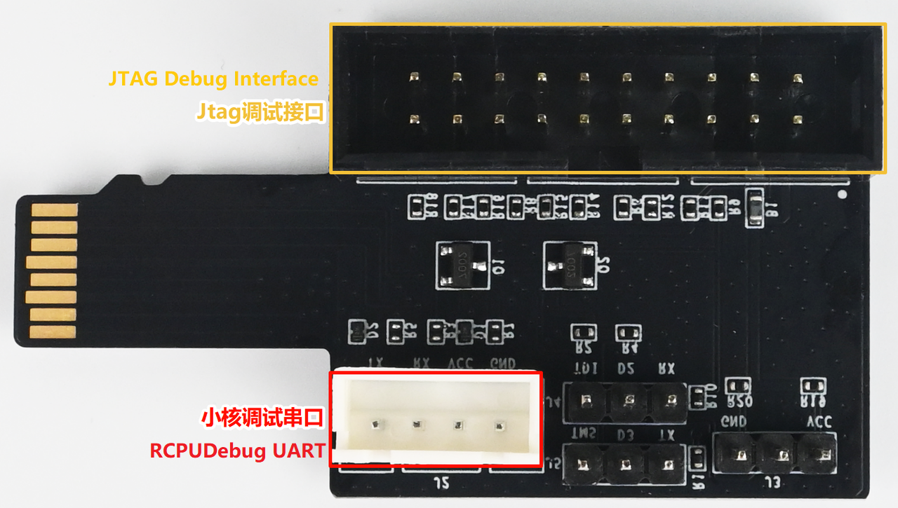
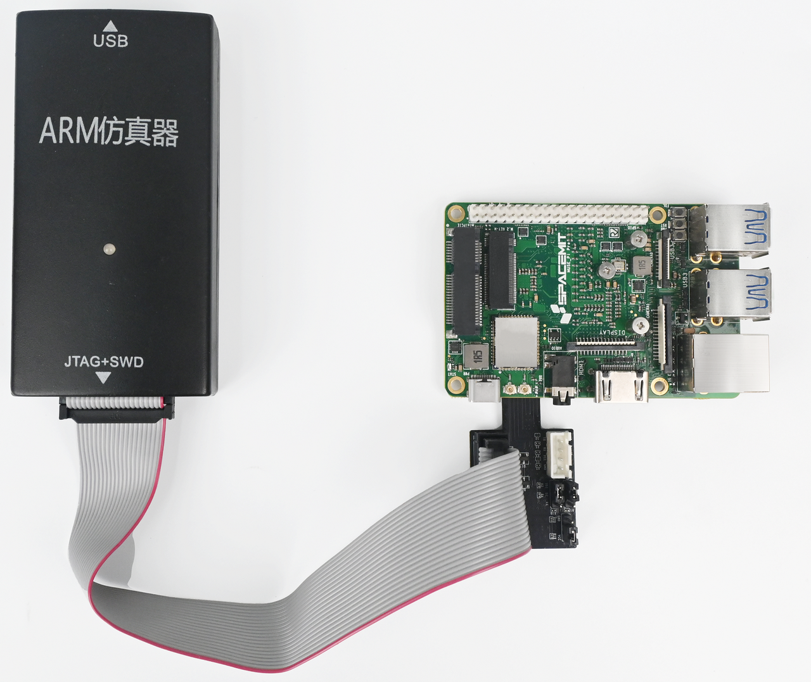
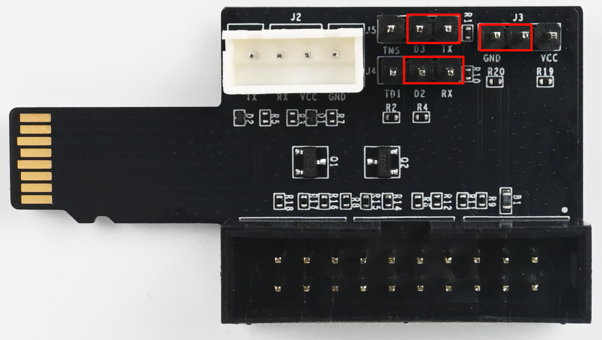
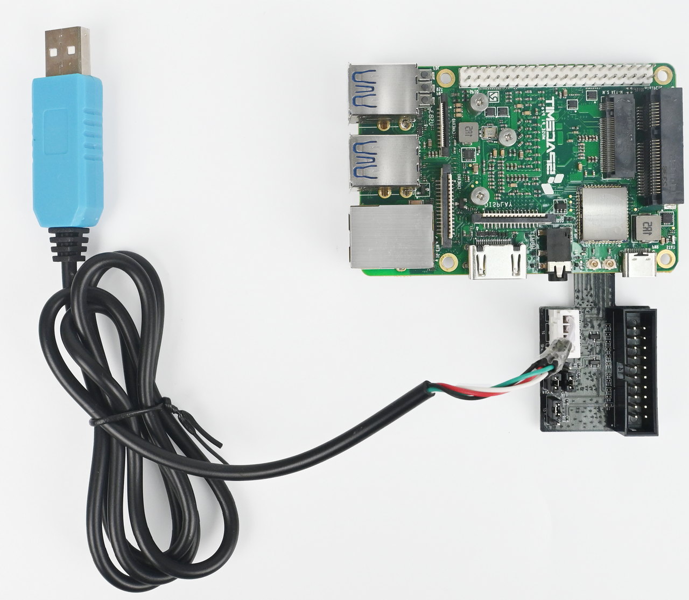
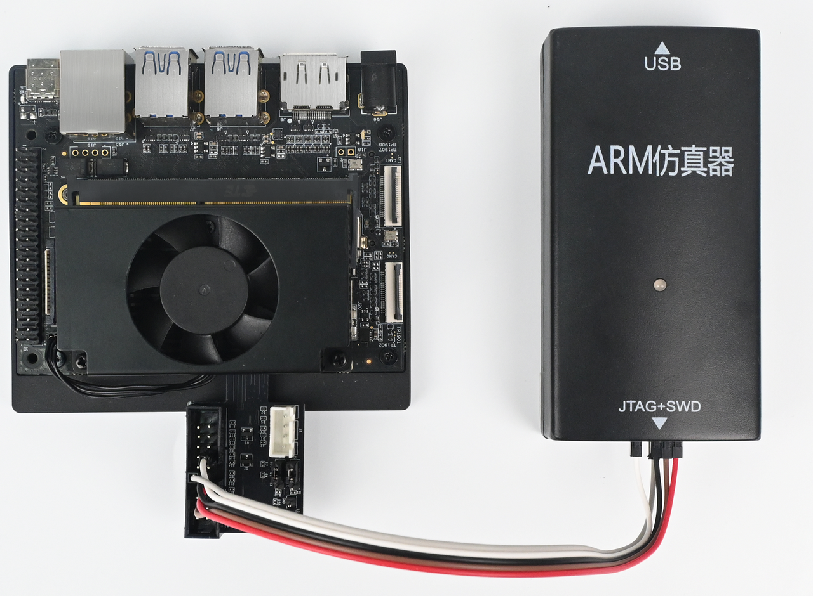

# TF Card Debug Expansion Board User Guide

## Overview

K1/K3 chips multiplex JTAG and RCPU debug UART functions on the MMC signal pins. The TF Card Debug Expansion Board enables users to access JTAG and RCPU debug UART functions on K1/K3 products.

## Hardware Description

As shown below, the expansion board contains a 20-pin box header for connecting a J-Link debugger, an XH2.54-4P connector for connecting a 3.3V UART serial cable, and several pin headers for different usage scenarios.

## Usage Instructions

### K1 Series Products

The box header pin assignment is shown below. The TDI and TMS pin order is reversed compared with K3 products.

| Pin | Signal | Pin | Signal |
| :--- | :--- | :--- | :--- |
| 1 | 3.3V | 2 | 3.3V |
| 3 | TRSTn | 4 | GND |
| 5 | **TDI** | 6 | GND |
| 7 | **TMS** | 8 | GND |
| 9 | TCK | 10 | GND |
| 11 | NA | 12 | GND |
| 13 | NA | 14 | GND |
| 15 | NA | 16 | GND |
| 17 | NA | 18 | GND |
| 19 | NA | 20 | GND |

#### JTAG Connection

To use JTAG, configure the J3, J4, and J5 pin headers as shown below.

Connection to the K1 MUSE Pi Pro:

#### RCPU UART Connection

To use RCPU UART, configure the J3, J4, and J5 pin headers as shown below.

Connection to the K1 MUSE Pi Pro. The debug serial cable must use 3.3V logic levels.

### K3 Series Products

The box header pin assignment is shown below. The TDI and TMS pin order is reversed compared with K1 products.

| Pin | Signal | Pin | Signal |
| :--- | :--- | :--- | :--- |
| 1 | 3.3V | 2 | 3.3V |
| 3 | TRSTn | 4 | GND |
| 5 | **TMS** | 6 | GND |
| 7 | **TDI** | 8 | GND |
| 9 | TCK | 10 | GND |
| 11 | NA | 12 | GND |
| 13 | NA | 14 | GND |
| 15 | NA | 16 | GND |
| 17 | NA | 18 | GND |
| 19 | NA | 20 | GND |

#### JTAG Connection

To use JTAG, configure the J3, J4, and J5 pin headers as shown below.

Because the K3 and K1 products use different pin orders, with TDI and TMS swapped, the board cannot be connected directly to a J-Link. Use Dupont wires according to the J-Link pin assignment shown below.

#### RCPU UART Connection

To use RCPU UART, configure the J3, J4, and J5 pin headers as shown below.

Connection to the K3-CoM260. The debug serial cable must use 3.3V logic levels.

## FAQ

**Q1: Why does JTAG fail to connect after I follow the connection diagram for a K3 product?**

**A:**
- For K3 products, check the TMS/TDI pin order difference and verify the connections.
- Configure the software according to the [SDHC](https://www.spacemit.com/community/document/info?lang=en&nodepath=software/SDK/buildroot/k3_buildroot/device/peripheral_driver/08-SDHC.md) documentation.

**Q2: Does this expansion board support hot-plugging?**

**A:** Yes. The expansion board supports hot-plugging and is plug-and-play.

**Q3: Why does the K3 chip use a different I/O pin order?**

**A:** The I/O definition was finalized during chip specification design and is not compatible with K1. Connecting this expansion board to K3 therefore requires wire jumpers.
