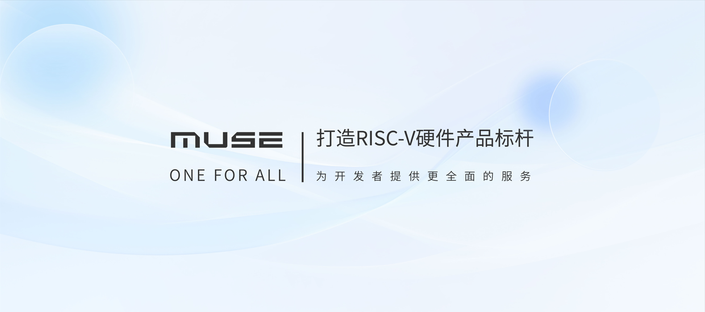

# MUSE

The SpacemiT MUSE series ecosystem products, based on the high-performance M1, aim to provide a more efficient and convenient development platform for RISC-V enthusiasts, innovative developers, researchers, geeks, etc. Our goal is to create a benchmark for industrial hardware products and provide robust tool support for the co-construction of the RISC-V ecosystem.

The SpacemiT MUSE series ecosystem products lineup includes five common hardware offerings as follows:
- SoM (System-on-Module)
- Pi/Pi Pro (development boards in various sizes) 
- Box (mini PC)
- Paper (Pad)
- Book (laptop)
- Shelf (development server)

That allows developers to freely choose products that best fit their development environment. It is provided a range of features and resources tailored to developers’ habits, facilitating efficient creation, deployment and management of their projects. The products feature a simple and intuitive interface, enabling developers to easily get started and quickly begin their work, while also supporting standard compilation tools with optimizations for compilation performance.

Additionally, SpacemiT offers detailed documentation and community support to ensure that any issues developers encounter can be promptly resolved. Whether you are a beginner just starting out or an experienced professional, there are benefits to be gained from this ecosystem. The MUSE series ecosystem products are designed to comprehensively assist individual developers in unleashing their creativity and realizing their technical dreams, while also providing standardized hardware solutions for institutional developers, integrating the supply chain for efficient product launch.

We invite even more people to embrace RISC-V and join us in building a better ecosystem together.

---
## User Guides

[MUSE Pi Pro User Guide](./muse_pi_pro/pi_pro_user_guide.md)
[MUSE Book User Guide](./muse_book/book_user_guide.md)
[MUSE Pi User Guide](./muse_pi/pi_user_guide.md)
[MUSE Paper User Guide](./muse_paper/paper_user_guide.md)
[MUSE Card User Guide](./muse_card/card_user_guide.md)

---
## Purchase

[MUSE Pi Pro](https://item.taobao.com/item.htm?id=904155534891&mi_id=0000wm-qmkXo1nGfMendDxzg558spR0hSBwQBav9fL67zA4&spm=a21xtw.29178619.0.0)
[MUSE Book](https://item.taobao.com/item.htm?id=806285410592&mi_id=00002ma3yKBjzTw1EFHC2Co4RgKitROfdFNvG7GvGLFcULM&spm=a21xtw.29178619.0.0)
[MUSE Box](https://item.taobao.com/item.htm?id=806823266114&mi_id=00007BjxvqV-hnifCbkkko96TIAIUyWC-5doki-nAJ9XtZ8&spm=a21xtw.29178619.0.0)
[MUSE Pi](https://item.taobao.com/item.htm?app=chrome&bxsign=scdNeEv6ItYzxyJYDNYUOPxOvfdn9B1j2FNYpEdcTlRx1kfYs7EC6ax-_-fb3OUbOd3LK2GNTFXJEzNx6lAWFB9yTrPJvo6MFLoL_pBzI4fVAGKpQCSOH00iWgqveLNb5Kb&cpp=1&id=806896757225&price=999-1499&shareUniqueId=27209190983&share_crt_v=1&shareurl=true&short_name=h.g5ftXonDbc8enj3&sourceType=item&sp_tk=TU9VSFdCc2hCeFI%3D&spm=a2159r.13376460.0.0&suid=4fd92bfa-7731-4616-bf5f-b90bf0efe2e0&tbSocialPopKey=shareItem&tk=MOUHWBshBxR&un=70aafd0ae4a48ed788bd3787856a60a9&un_site=0&ut_sk=1.Yv%2BY5e2is1oDAE17c9reXzYo_21646297_1718712226713.Copy.1)
[MUSE Shelf](https://item.taobao.com/item.htm?id=807037514272&mi_id=00009FJH71IxeezGvH1r9j0RNtkkdNC0O7Z2DzSRsVeeB1o&spm=a21xtw.29178619.0.0)

---
## Collaboration Contact Info
Official Wechat: SpacemiT1102
Business Contact: 189–6649–8607
Business Email: [business@spacemit.com](mailto:business@spacemit.com)