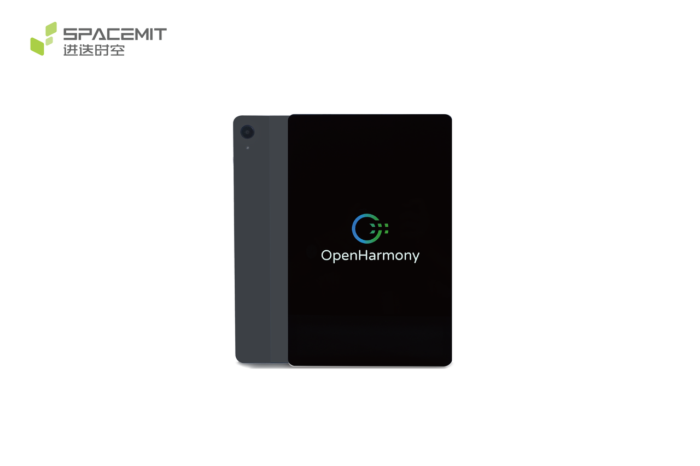
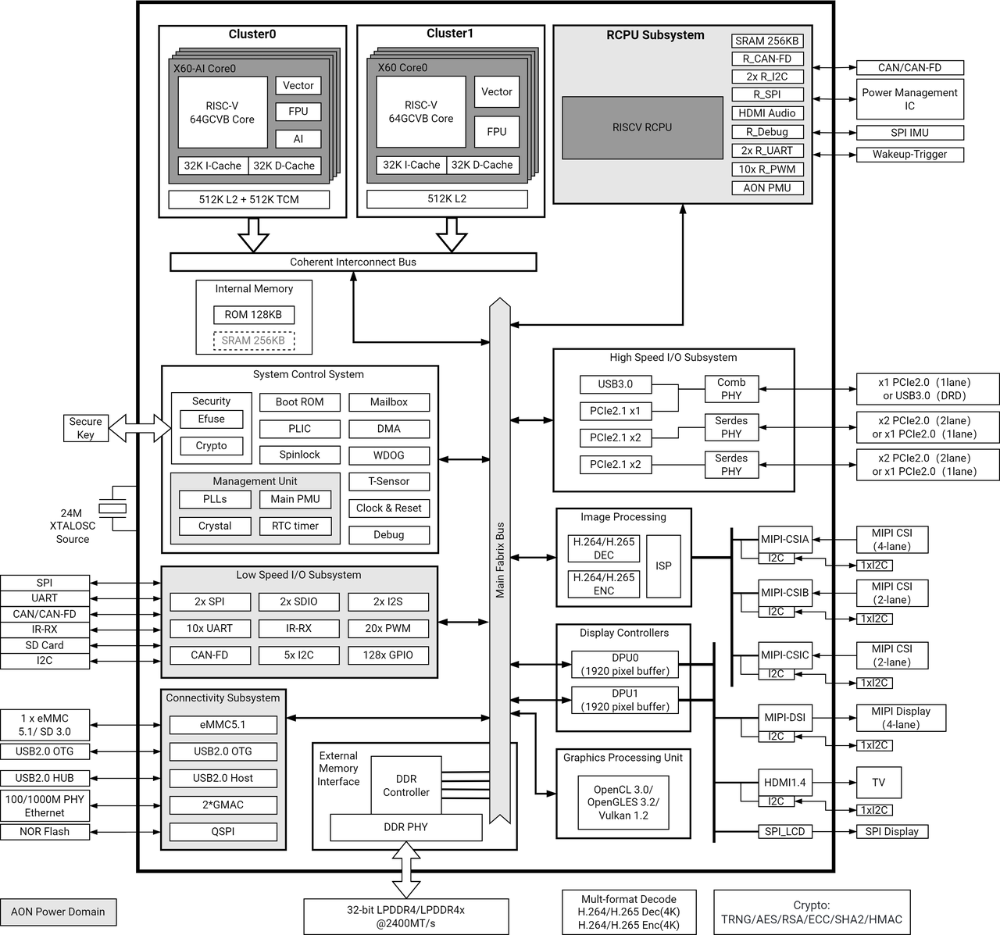
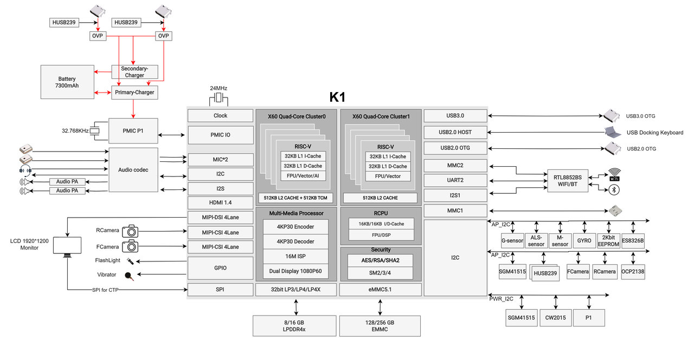
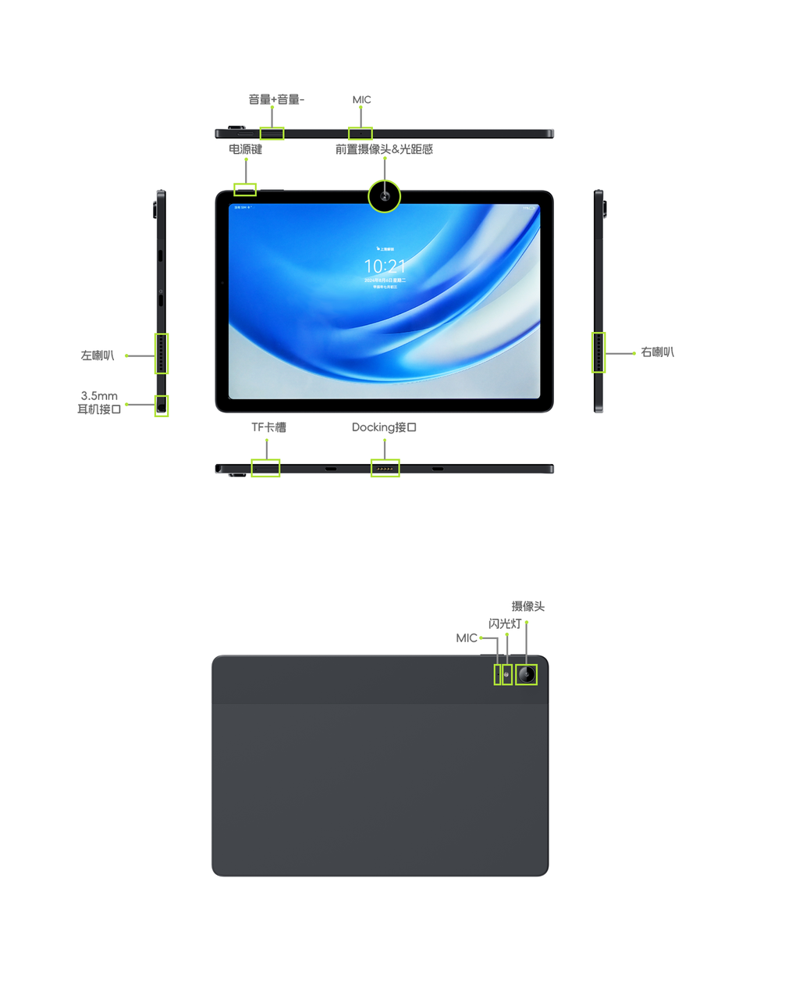

# K1 MUSE Paper User Guide

## Important Notice

K1 MUSE Paper is a tablet designed for developers. Our team is continuously optimizing the OS user experience and hardware features. To enjoy the latest performance and features, we strongly recommend performing an OTA update immediately after first boot.

## Product Overview

K1 MUSE Paper is a tablet based on the RISC-V architecture and the OpenHarmony operating system. It is powered by the SpacemiT K1, the latest-generation RISC-V chip, delivering strong AI general-purpose compute performance and excellent power efficiency. Running OpenHarmony, it provides a smooth multitasking and app-switching experience — what you see is what you get. It handles industrial and vertical customization, daily productivity, and entertainment with equal ease. The open-source RISC-V processor architecture combined with the open-source OpenHarmony OS achieves full-stack openness from hardware to software for mobile terminal devices.

## Preface

This document describes the basic functions, hardware features, multi-function hardware configuration, and software debugging procedures of K1 MUSE Paper. It is intended to help development, debugging, and system testing engineers use MUSE Paper more quickly and accurately, and to familiarize them with K1 chip development application solutions.

## Intended Audience

This document is primarily intended for:
Technical support engineers, board hardware development engineers, embedded software development engineers, and test engineers.

## Abbreviations

Abbreviations used in this document:

| Abbreviation | English Description | Chinese Description |
|---|---|---|
| X60 | self-innovate X60™ RISC-V processor core | 进迭时空自研RISC-V核 |

## Specifications

| Category | Item | Parameter |
|---|---|---|
| SoC | CPU | SpacemiT K1, 8-core RISC-V processor with 2 TOPS AI processing power |
| Appearance | Dimensions | 256.8 × 168.5 × 7.2 mm |
| | Weight | Approx. 453 g |
| | Material | Anodized aluminum alloy + painted plastic |
| Display | Interface | 1920×1200 resolution, 10.95" LCD |
| Memory | Type | LPDDR4x, 2400 MT/s, on-board |
| | Capacity | 8 GB / 16 GB (optional) |
| Storage | eMMC | 128 GB / 256 GB (optional) |
| | TF card | Supported; can also be used as UART / JTAG for debugging |
| Camera | Resolution | Front: 8 MP; Rear: 13 MP |
| | Flash | Supported |
| | Autofocus | Rear camera supported |
| Wireless | Type | On-board Wi-Fi/BT module |
| | Protocol | Wi-Fi 6 & BT 5.2 |
| I/O | Side I/O | USB 3.0 OTG Type-C ×1 (input PD3.0 9V@2A, output 5V@1A) USB 2.0 OTG Type-C ×1 (input PD3.0 9V@2A, output 5V@1A) Docking connector ×1, USB/UART mux, USB 2.0 for keyboard, UART0 for debug port |
| Buttons | Function | Power on/off, volume up/down |
| Sensors | | Ambient light/proximity sensor, magnetometer, accelerometer, gyroscope, Hall switch |
| Multimedia | Audio output | Speakers (8Ω@1W ×2) / Type-C digital headphone / 3.5mm headphone jack |
| | Audio input | Silicon microphone ×2 |
| Software | OS | OpenHarmony 5.0 (pre-installed) |
| Reliability | ESD | Contact ±4 kV, air ±8 kV |
| | Operating temperature | Non-condensing, -10°C to 45°C |
| | Humidity | Relative humidity ≤90% ±2% |
| Power | Battery | 7000 mAh polymer battery |
| | Power input | PD3.0 18W fast charge, Type-C |

## System Overview

### 1. K1 Chip Overview

K1 is a high-performance, ultra-low-power SoC integrating an 8-core RISC-V CPU and SpacemiT AI compute capability. Key features:
- Integrates the SpacemiT X60™ RISC-V processor core, conforming to the RISC-V 64GCVB architecture and RVA22 standard.
- Extends 2 TOPS AI compute through RISC-V custom instructions, enabling CPU-AI fused compute and supporting TensorFlow Lite, TensorFlow, and ONNX Runtime mainstream inference frameworks.
- Achieves ultra-low power through multi-domain power partitioning and multi-level power states.
- Supports a full-featured interface set for innovative applications and products.
- Compatible with mainstream operating systems for a wide range of application scenarios.
- Meets industrial-grade reliability standards.

### 2. K1 Chip Block Diagram

### 3. MUSE Paper Reference Design Block Diagram

#### 3.1 Reference Design Block Diagram

The MUSE Paper system uses the K1 chip with a P1 PMIC + external DCDC power solution. Storage uses LPDDR4x and eMMC 5.1. It supports dual Type-C OTG for USB peripheral expansion and a docking keyboard/debug serial port, as well as TF card storage expansion.

#### 3.2 Feature Overview

MUSE Paper includes the following features:
- Display: 10-point touch, 10.95" LCD, 1920×1200 resolution, typical brightness 450 nit
- Camera: Front 8 MP, rear 13 MP with autofocus
- USB 2.0 OTG Type-C: firmware flashing, PD3.0 9V/2A fast charge, and OTG USB device expansion
- USB 3.0 OTG Type-C: PD3.0 9V/2A fast charge and OTG USB device expansion
- Docking connector: USB/UART combo, USB 2.0 for keyboard, UART0 for debug port
- Audio: External ES8326B codec, stereo dual speakers, headphone output, dual-MIC recording
- TF card slot: high-speed TF card support
- SDIO Wi-Fi: RTL8852BS module, wireless connectivity
- Battery: Typical capacity 7000 mAh
- Other: Ambient light/proximity sensor, magnetometer, accelerometer, gyroscope, Hall switch, vibration motor

#### 3.3 Feature Interfaces

| Feature | Available |
|---|---|
| LPDDR4x (8/16 GB) | YES |
| eMMC (128/256 GB) | YES |
| TYPEC 9V Input | YES |
| Audio (SPK, MIC, Earphone) | YES |
| MIPI DSI/CTP | YES |
| MIPI CSI | YES |
| TF Card | YES |
| SDIO Wi-Fi & BT | YES |
| USB 2.0 OTG Type-C | YES |
| USB 3.0 OTG Type-C | YES |
| System Key (PWR, V+, V-) | YES |

#### 3.4 Key Feature Identification

## User Guide

MUSE Paper is a tablet — you can use it directly without any peripherals. To ensure best performance, keep your tablet up to date via OTA updates. Updates fix known issues and introduce new features. The device notifies you when an update is available; install it promptly. To check manually, go to Settings > System > Software Update.

For a fuller development experience, the following accessories are recommended:

- **Power Adapter**
  MUSE Paper charges via USB PD3.0 Type-C. For the fastest charging speed, use the original MUSE Paper power adapter.

  | Product | Supported PD voltage/current |
  |---|---|
  | Original power adapter | 9V/2A, 5V/2A |
  | MUSE Paper | 18W USB-C |

- **USB Type-C Cable**
  Connect MUSE Paper's USB 2.0 Type-C to a host computer using the `hdc` tool for in-depth debugging.

- **USB Hub**
  Use a USB hub through MUSE Paper's Type-C port to expand USB keyboard/mouse and USB storage devices for development, debugging, and testing.

## Flashing Firmware

### Entering Flash Mode

During power-on or system restart, hold the Volume+ button to enter flash mode. Then connect MUSE Paper's USB 2.0 Type-C (the one with the charging icon) to the host computer via USB. Flash using the SpacemiT official flashing tool [TitanFlasher](https://www.spacemit.com/community/document/info?lang=zh&nodepath=tools/user_guide/flasher_user_guide.md) or the `fastboot` command.

### Firmware Download and Installation

#### OpenHarmony

**About OpenHarmony**:
OpenHarmony is an open-source OS donated by Huawei and operated by the OpenAtom Foundation. It shares the same technology base as Huawei's HarmonyOS and aims to build a unified HarmonyOS ecosystem connecting all things intelligently. MUSE Paper ships with OpenHarmony 5.0 pre-installed.

**OpenHarmony website**: [https://www.spacemit.com/community/document/info?lang=zh&nodepath=software/SDK/openharmony/k1/root_overview.md](https://www.spacemit.com/community/document/info?lang=zh&nodepath=software/SDK/openharmony/k1/root_overview.md)

**OpenHarmony firmware download**: [https://archive.spacemit.com/image/k1/version/openharmony5.0/](https://archive.spacemit.com/image/k1/version/openharmony5.0/)
