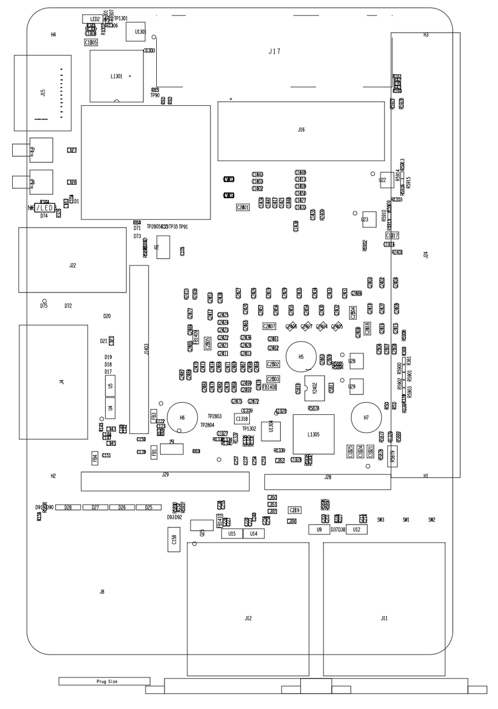
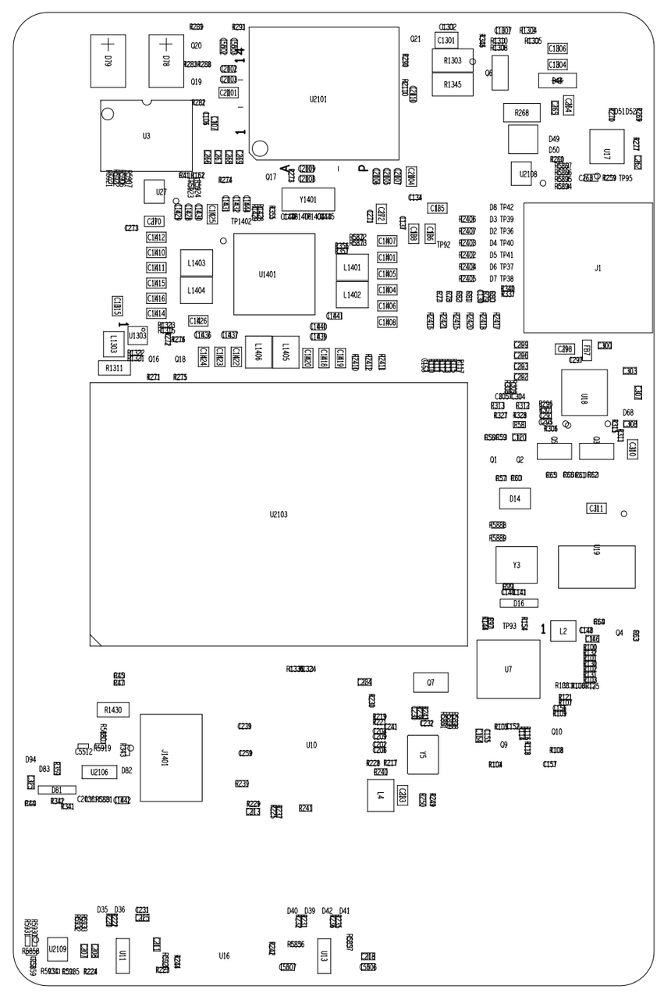

sidebar_position: 3

# K1 MUSE Pi Pro Hardware Design Resources

Please click the following links to collect the related hardware reference documents:

- [MUSEPi Pro_schematic(PDF)-V1.1-20250619](https://cdn-resource.spacemit.com/file/product/K1/MUSEPi%20Pro_schematic-V1.1-20250619.pdf)
- [MUSEPi Pro_BOM(XLS)-V1.1-20250506](https://cdn-resource.spacemit.com/file/product/K1/MUSEPi%20Pro_BOM-V1.1-20250506.xls)
- [MUSEPi Pro_PCB(PDF)-V1.1-20250630](https://cdn-resource.spacemit.com/file/product/K1/MUSEPi%20Pro_PCB-V1.1-20250630.pdf)

- MUSE Pi Pro reference description
   - **TOP view**
   

   - **BOTTOM view**
   
