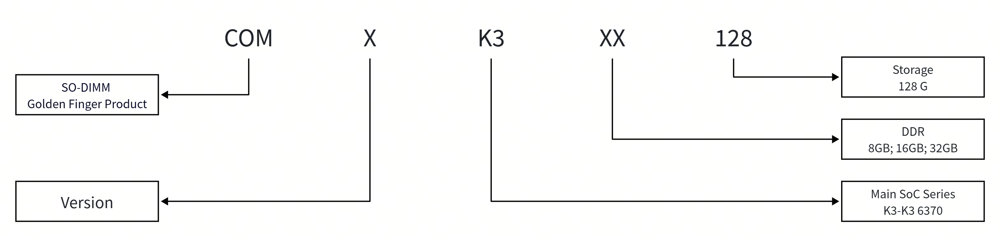
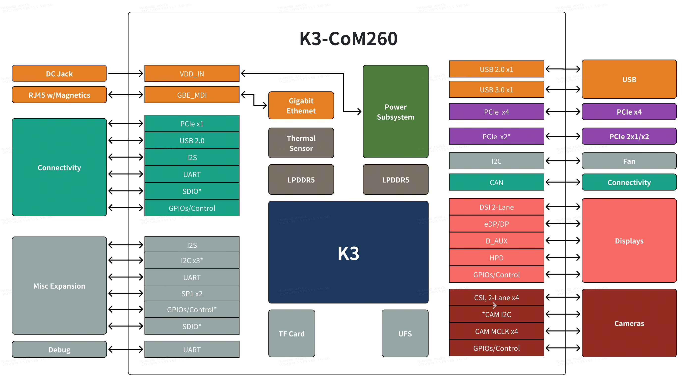
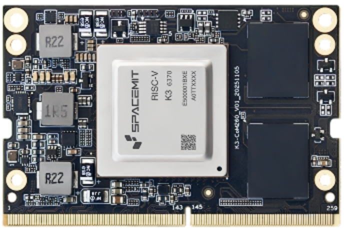

# K3-CoM260 Datasheet

**60 TOPS AI Compute System-on-Module (SoM)**

**[PDF Version](https://cdn-resource.spacemit.com/file/product/K3/k3_com260_ds_en.pdf)**

## Revision History

| Version | Date | Description |
| --- | --- | --- |
| V1.3 | 2026.08.25 | Updated storage capacity in ordering information, power-supply voltage specification, pin definitions, and electrical characteristics |
| V1.2 | 2026.07.10 | Updated power-supply requirements and note |
| V1.1 | 2026.07.09 | Updated wording and formatting |
| V1.0 | 2026.04.30 | Initial release |

## About This Document

This document describes the basic specifications and hardware features of the K3-CoM260. It is intended to help developers quickly understand the module specifications and carry out K3-CoM260 application and product development more accurately and efficiently.

This document is primarily intended for:

- Product managers
- Hardware engineers
- Other related engineering personnel

## 1. Product Overview

### 1.1 Introduction

The K3-CoM260 is the first gold-finger package product launched by SpacemiT. It integrates the K3 RISC-V AI CPU, LPDDR5, GPHY, and other passive components.

The K3-CoM260 supports multiple operating systems and development platforms, including SpacemiT's native Bianbu OS, Ubuntu, Linux, and OpenHarmony. Together with a full-stack AI development toolkit, it can meet a wide range of AI development needs.

The K3-CoM260 provides a rich set of interfaces, including MIPI-DSI, MIPI-CSI, DP 1.2, SDIO 3.0, eSPI, SPI, I2S, I2C, CAN-FD, PWM, UART, USB 2.0, USB 3.0, PCIe 3.0, and GMAC. With its high performance and extensive I/O resources, the K3-CoM260 is a strong choice for RISC-V edge AI applications and product development.

### 1.2 Key Features

- **Outstanding CPU performance**

  8 high-performance X100 compute cores combined with 8 A100 AI cores deliver more than 130 KDMIPS of CPU computing power. The X100 achieves SPECint2006 > 9.0/GHz per core, with a maximum frequency of 2.4 GHz.

- **Heterogeneous integrated AI computing**
  Delivers 60 TOPS of AI computing power. Its ultra-wide parallel AI cores provide powerful general-purpose AI acceleration, enabling rapid integration with mainstream AI ecosystems. Local inference performance for 7B large models exceeds 10 tokens/s.

- **Latest RISC-V architecture with massive parallel computing capability**
  The A100 supports RVV 1.0 parallel computing up to 1024 bits and complies with the latest RVA23 Profile and Vector Crypto standards.

- **Rich I/O expansion interfaces**
  Integrates multiple high-speed expansion interfaces to flexibly support a wide range of expansion needs, including 8 PCIe lanes, 3 USB 3.0 ports, and 1 GMAC interface.

- **Comprehensive hardware virtualization**

  Supports comprehensive hardware virtualization with RV Hypervisor 1.0, RV AIA, and RV IOMMU extensions, covering CPU, memory, interrupts, and I/O.

- **Advanced security protection**
  Supports M/S/U processor privilege levels, hardware protection against attacks such as Spectre and RowHammer, and hardware security technologies compliant with SM2, SM3, and SM4.

- **Industrial-grade compliance**
  The CPU cores, multi-level cache, and SRAM support ECC design, enabling stable and reliable sustained compute performance over an ambient temperature range of $-40^\circ\text{C}$ to $85^\circ\text{C}$ and meeting the stringent requirements of industrial applications.

### 1.3 Applications

- AI edge computing
- Integrated large-model inference systems
- Intelligent robots
- Product block diagrams

### 1.4 Ordering Information

The figure below shows the naming convention for the **ordering part number**, which consists of the following sections.

The table below lists the specific part numbers, main SoC model, and corresponding DDR capacity.

| Part Number | Main SoC | DDR Capacity | Storage Capacity |
| :---------: | :--: | :----: | :----: |
| COM3K308128 | K3 | 8GB | 128GB |
| COM3K316128 | K3 | 16GB | 128GB |
| COM3K332128 | K3 | 32GB | 128GB |

## 2. Block Diagram

The block diagram of the K3-CoM260 is shown below.

Note: For detailed technical parameters of each module, refer to the corresponding [K3 Datasheet](https://spacemit.com/community/document/info?lang=en&nodepath=hardware/key_stone/k3/k3_docs/k3_ds.md).

### 2.1 Interface Definitions

The tables below list the main interfaces of the K3-CoM260 and their related characteristics.

#### MIPI_DSI

| Signal Name | Type | Description |
| --- | --- | --- |
| MIPI_DSI1_LANEx_DP[1:0] | O | DSI1 DATA LANE ± |
| MIPI_DSI1_LANEx_DNx[1:0] | O | DSI1 DATA LANE ± |
| MIPI_DSI1_CLKP | O | DSI1 Clock LANE ± |
| MIPI_DSI1_CLKN | O | DSI1 Clock LANE ± |

#### MIPI_CSI

| Signal Name | Type | Description |
| --- | --- | --- |
| MIPI_CSI0_DPx[1:0] | I | CSI0 DATA LANE ± |
| MIPI_CSI0_DNx[1:0] | I | CSI0 DATA LANE ± |
| MIPI_CSI1_DPx[3:0] | I | CSI1 DATA LANE ± |
| MIPI_CSI1_DNx[3:0] | I | CSI1 DATA LANE ± |
| MIPI_CSI2_DPx[1:0] | I | CSI2 DATA LANE ± |
| MIPI_CSI2_DNx[1:0] | I | CSI2 DATA LANE ± |
| MIPI_CSI3_DxP[1:0] | I | CSI3 DATA LANE ± |
| MIPI_CSI3_DxN[1:0] | I | CSI3 DATA LANE ± |
| MIPI_CSIx_CLKN[3:0] | O | CSI Clock LANE ± |
| MIPI_CSIx_CLKP[3:0] | O | CSI Clock LANE ± |

#### DP 1.2

| Signal Name | Type | Description |
| --- | --- | --- |
| EDP1_TXxN[3:0] | O | EDP1 DATA LANE ± |
| EDP1_TXxP[3:0] | O |  |
| DP1_AUXN | O | EDP1 Auxiliary LANE ± |
| DP1_AUXP | O |  |

#### eMMC

| Signal Name | Type | Description |
| --- | --- | --- |
| EMMC_Dx[7:0] | I/O | eMMC DATA |
| EMMC_CLK | I/O | eMMC Clock |
| EMMC_CMD | I/O | eMMC command |
| EMMC_DS | I/O | eMMC data strobe |

#### SDIO 3.0

| Signal Name | Type | Description |
| --- | --- | --- |
| MMC1_DATx[3:0] | I/O | SD Card DATA |
| MMC1_CLK | I/O | SD Card Clock |
| MMC1_CMD | I/O | SD Card Command |
| MMC2_DATx[3:0] | I/O | SDIO DATA |
| MMC2_CLK | I/O | SDIO Clock |
| MMC2_CMD | I/O | SDIO Command |

#### eSPI I/O

| Signal Name | Type | Description |
| --- | --- | --- |
| ESPI0_Dx[3:0] | I/O | Four data lines for command, address, and data transfer.  Operates in single-, dual-, or quad-I/O modes depending on configuration. |
| ESPI0_CS0 | I | Chip Select, active low.  Used by the master to select a specific slave device. |
| ESPI0_CLK | I | eSPI clock signal generated by the master.  Synchronizes data transfer between master and slave. |

#### SPI

| Signal Name | Type | Description |
| --- | --- | --- |
| SPix[2:0]_SCLK | I/O | Synchronous Serial Port Clock 0/2 The serial bit clock can be configured as an output (master mode operation) or an input (slave mode operation). |
| SPix[2:0]_FRM | I/O | Synchronous Serial Port Frame 0/2 The serial frame sync can be configured as an output (master mode operation) or an input (slave mode operation). |
| SPix[2:0]_TXD | O | Synchronous Serial Port Transmit Data 0/2 Serial data driven out synchronously with the bit clock. |
| SPix[2:0]_RXD | I | Synchronous Serial Port Receive Data 0/2 Serial data latched using the bit clock. |
| R.SPI0_SCLK | I/O | RT24 Synchronous Serial Port Clock 0/2 The serial bit clock can be configured as an output (master mode operation) or an input (slave mode operation). |
| R.SPI0_FRM | I/O | RT24 Synchronous Serial Port Frame 0/2 The serial frame sync can be configured as an output (master mode operation) or an input (slave mode operation). |
| R.SPI0_TXD | O | RT24 Synchronous Serial Port Transmit Data 0/2 Serial data driven out synchronously with the bit clock. |
| R.SPI0_RXD | I | RT24 Synchronous Serial Port Receive Data 0/2 Serial data latched using the bit clock. |

#### I2S

| Signal Name | Type | Description |
| --- | --- | --- |
| I2S0_SCLK | I/O | I2S Continues Serial Clock |
| I2S0_LRCK | I/O | I2S Left–Right Clock |
| I2S0_TXD | O | I2S Serial Transmit Data |
| I2S0_RXD | I | I2S Serial Receive Data |
| I2Sx[5:2]_SCLK | I/O | I2S Continues Serial Clock |
| I2Sx[5:2]_LRCK | I/O | I2S Left–Right Clock |
| I2Sx[5:2]_TXD | O | I2S Serial Transmit Data |
| I2Sx[5:2]_RXD | I | I2S Serial Receive Data |

#### I2C

| Signal Name | Type | Description |
| --- | --- | --- |
| I2Cx[6:0]_SDA | I/O | I2C Serial Data |
| I2Cx[6:0]_SCL | I/O | I2C Serial Clock |
| R.I2Cx[1:0]_SDA | I/O | RT24 domain I2C Serial Data |
| R.I2Cx[1:0]_SCL | I/O | RT24 domain I2C Serial Clock |

#### CAN-FD

| Signal Name | Type | Description |
| --- | --- | --- |
| CANx[4:0]_TX | O | CAN Transmit Data |
| CANx[4:0]_RX | I | CAN Receive Data |
| R.CAN0_TX | O | RT24 domain CAN Transmit Data |
| R.CAN0_RX | I | RT24 domain CAN Receive Data |
| R.CAN2_TX | O | RT24 domain CAN Transmit Data |
| R.CAN2_RX | I | RT24 domain CAN Receive Data |

#### FAN

| Signal Name | Type | Description |
| --- | --- | --- |
| PWM | O | FAN Pulse-width modulation |
| TACH | I | FAN Tachometer |

#### UART

| Signal Name | Type | Description |
| --- | --- | --- |
| UART0_TXD | O | DEBUG UART Transmit Data |
| UART0_RXD | I | DEBUG UART Receive Data |
| UART1_TXD | O | UART1 Transmit Data |
| UART1_RXD | I | UART1 Receive Data |
| UART1_CTS_N | I | UART1 Clear-to-Send |
| UART1_RTS_N | O | UART1 Request-to-Send |
| UARTx[10:3]_TXD | O | UART Transmit Data |
| UARTx[10:3]_RXD | I | UART Receive Data |
| UARTx[10:3]_CTS_N | I | UART Clear-to-Send |
| UARTx[10:3]_RTS_N | O | UART Request-to-Send |
| R.UART0_TXD | O | RT24 domain UART Transmit Data |
| R.UART0_RXD | I | RT24 domain UART Receive Data |
| R.UARTx[5:2]_TXD | O | RT24 domain UART Transmit Data |
| R.UARTx[5:2]_RXD | I | RT24 domain UART Receive Data |

#### GPIO

| Signal Name | Type | Description |
| --- | --- | --- |
| GPIO[1]/[4] | I/O | 3.3 V GPIO domain |
| GPIO[2]/[3]/[5] | I/O | 1.8 V GPIO domain |

#### USB 2.0

| Signal Name | Type | Description |
| --- | --- | --- |
| USB20_A_DRD_USB_M | I/O | Download USB D±, typically used for USB 2.0 |
| USB20_A_DRD_USB_P | I/O |  |

#### USB 3.0

| Signal Name | Type | Description |
| --- | --- | --- |
| USB20_A_DRD_USB_M | I/O | Download USB D±, typically used for download |
| USB20_A_DRD_USB_P | I/O |  |
| USB_DRD_RXxN[1:0] | I/O | USB 3.0 receive data ± for download |
| USB_DRD_RXxP[1:0] | I/O |  |
| USB_DRD_TXxN[1:0] | I/O | USB 3.0 transmit data ± for download |
| USB_DRD_TXxP[1:0] | I/O |  |

#### PCIe 3.0

| Signal Name | Type | Description |
| --- | --- | --- |
| PCIE_RXxN[1:0] | I/O | PCIe receive data ±, typically used for PCIeB and PCIeC |
| PCIE_RXxP[1:0] | I/O |  |
| PCIE_TXxN[1:0] | I/O | PCIe transmit data ±, typically used for PCIeB and PCIeC |
| PCIE_TXxP[1:0] | I/O |  |
| PCIE_REFCLK_N | I/O | PCIe clock lane ±, typically used for PCIeA, PCIeB, and PCIeC |
| PCIE_REFCLK_P | I/O |  |

#### GMAC

| Signal Name | Type | Description |
| --- | --- | --- |
| GMAC1_RXDV | I | GMAC1 Receive Data Valid |
| GMAC1_RX_Dx[3:0] | I | GMAC1 Receive Data |
| GMAC1_RX_CLK | I | GMAC1 Receive Clock |
| GMAC1_TX_Dx[3:0] | O | GMAC1 Transmit Data |
| GMAC1_TX_EN | O | GMAC1 Transmit Data Enable |
| GMAC1_MDC | I/O | GMAC1 Configuration interface clock |
| GMAC1_MDIO | I/O | GMAC1 Configuration interface I/O |
| GMAC1_INT_N | I/O | GMAC1 Interrupt |

## 3. Pin Definitions

### 3.1 Physical Pinout

The figure below shows the physical view of the K3-CoM260 module.

### 3.2 Pin Package

This section describes the pin package information of the K3-CoM260 in detail.

K3-CoM260 uses the following package specifications:

- Interface: gold finger (260-pin SODIMM)
- Dimensions: 69.6 mm × 45.0 mm × 1.2 mm
- Pin pitch: 0.5 mm

The table below shows the pin layout of the K3-CoM260.

| Pin name | Pin NO. | Pin NO. | Pin Name |
| --- | --- | --- | --- |
| GND | 1 | 2 | GND |
| MIPI_CSI0_DN0 | 3 | 4 | MIPI_CSI1_DN0 |
| MIPI_CSI0_DP0 | 5 | 6 | MIPI_CSI1_DP0 |
| GND | 7 | 8 | GND |
| MIPI_CSI0_CLKN | 9 | 10 | MIPI_CSI1_CLKN |
| MIPI_CSI0_CLKP | 11 | 12 | MIPI_CSI1_CLKP |
| GND | 13 | 14 | GND |
| MIPI_CSI0_DN1 | 15 | 16 | MIPI_CSI1_DN1 |
| MIPI_CSI0_DP1 | 17 | 18 | MIPI_CSI1_DP1 |
| GND | 19 | 20 | GND |
| MIPI_CSI2_DN2 | 21 | 22 | MIPI_CSI2_DN0 |
| MIPI_CSI2_DP2 | 23 | 24 | MIPI_CSI2_DP0 |
| GND | 25 | 26 | GND |
| MIPI_CSI3_CLKN | 27 | 28 | MIPI_CSI2_CLKN |
| MIPI_CSI3_CLKP | 29 | 30 | MIPI_CSI2_CLKP |
| GND | 31 | 32 | GND |
| MIPI_CSI2_DN3 | 33 | 34 | MIPI_CSI2_DN1 |
| MIPI_CSI2_DP3 | 35 | 36 | MIPI_CSI2_DP1 |
| GND | 37 | 38 | GND |
| USB_DRD_RX1N | 39 | 40 | PCIE4/USB3-D_RX0N |
| USB_DRD_RX1P | 41 | 42 | PCIE4/USB3-D_RX0P |
| GND | 43 | 44 | GND |
| USB_DRD_TX1N | 45 | 46 | PCIE4/USB3-D_TX0N |
| USB_DRD_TX1P | 47 | 48 | PCIE4/USB3-D_TX0P |
| GND | 49 | 50 | GND |
| USB_DRD_RX2N | 51 | 52 | PCIE4_REFCLK_N |
| USB_DRD_RX2P | 53 | 54 | PCIE4_REFCLK_P |
| GND | 55 | 56 | GND |
| USB_DRD_TX2N | 57 | 58 | PCIE3/USB3-C_RX0N |
| USB_DRD_TX2P | 59 | 60 | PCIE3/USB3-C_RX0P |
| GND | 61 | 62 | GND |
| EDP1_TX0N | 63 | 64 | PCIE3/USB3-C_TX0N |
| EDP1_TX0P | 65 | 66 | PCIE3/USB3-C_TX0P |
| GND | 67 | 68 | GND |
| EDP1_TX1N | 69 | 70 | MIPI_DSI1_D0N |
| EDP1_TX1P | 71 | 72 | MIPI_DSI1_D0P |
| GND | 73 | 74 | GND |
| EDP1_TX2N | 75 | 76 | MIPI_DSI1_CLKN |
| EDP1_TX2P | 77 | 78 | MIPI_DSI1_CLKP |
| GND | 79 | 80 | GND |
| EDP1_TX3N | 81 | 82 | MIPI_DSI1_D1N |
| EDP1_TX3P | 83 | 84 | MIPI_DSI1_D1P |
| GND | 85 | 86 | GND |
| GPIO[3]_58 { GMAC2_PPS / R.UART2_RXD / R.CAN0_TXD / PCIEC_PERSTN / R.I2C0_SDA / PWM16 } | 87 | 88 | GPIO[3]_74 { R.GMAC3_CLK_REF / CLK_CAMCK2 / ESPI0_RESETN / VCXO_REQ / USB30H-1_DRV / R.I2C0_SCL } |
| GPIO[5]_104 { SSP0_TXD / SSP2_TXD / USB30H-1_DRV / CAN3_RXD / PCIED_PWRDET } | 89 | 90 | GPIO[3]_67 { R.GMAC3_TX_CLK / R.GPIO[22] / R.SSP1_FRM / CLK_CAMCK4 / PCIEC_PWRDET / R.PWM3 } |
| GPIO[5]_106 { SSP0_SCLK / SSP2_SCLK / R.I2C1_SDA / I2C3_SDA / PCIED_WAKEN / PWM18 } | 91 | 92 | GPIO[3]_53 { GMAC2_TX_EN / UART3_CTSN / SSP0_TXD / PCIEA_EINT / PWM11 } |
| GPIO[5]_105 { SSP0_RXD / SSP2_RXD / R.I2C1_SCL / I2C3_SCL / PCIED_PERSTN / PWM17 } | 93 | 94 | GPIO[1]_02 { GMAC0_RX_D1 / SSPA5_TXD / PWM2 / ESPI0_D2 / I2C1_SCL } |
| GPIO[5]_107 { SSP0_FRM / SSP2_FRM / R.CAN4_TXD / USB30-0_DIR / PCIED_CLKREQN / PWM19 } | 95 | 96 | GPIO[3]_72 { R.GMAC3_MDIO / SSPA4_RXD / ESPI0_CS / E/DP1_HPD / DSI0_TE } |
| GPIO[3]_70 { R.GMAC3_TX_EN / SSPA4_FRM / ESPI0_D2 / IR1_RX / MNCLK_OUT1 / SSP3_SCLK } | 97 | 98 | EDP1_AUXN |
| GPIO[3]_48 { GMAC2_TX_D0 / UART6_TXD / CAN1_RXD / PCIEA_AUXEN / I2C0_SCL / PWM6 } | 99 | 100 | EDP1_AUXP |
| GPIO[3]_49 { GMAC2_TX_D1 / UART6_RXD / CAN1_TXD / PCIEA_PWRDET / I2C0_SDA / PWM7 } | 101 | 102 | GND |
| GPIO[3]_51 { GMAC2_TX_D2 / UART6_RTS / CAN2_RXD / PCIEA_ATNLED / I2C4_SDA / PWM9 } | 103 | 104 | GPIO[3]_60 { R.GMAC3_RX_D0 / R.UART5_RXD / R.SSP0_TXD / PCIEC_CLKREQN / R.I2C1_SDA / PWM18 } |
| GPIO[3]_50 { GMAC2_TX_CLK / UART6_CTS / CAN2_TXD / PCIEA_MRLN / I2C4_SCL / PWM8 } | 105 | 106 | GPIO[3]_62 { R.GMAC3_RX_CLK / R.SSP0_SCLK / PCIEC_ATTN / I2C6_SDA } |
| GND | 107 | 108 | GPIO[3]_61 { R.GMAC3_RX_D1 / R.SSP0_RXD / PCIEC_PRSNT2N / I2C6_SCL / PWM19 } |
| USB20_A_DRD_USB_M | 109 | 110 | GPIO[3]_63 { R.GMAC3_RX_D2 / R.GPIO[18] / R.SSP0_FRM / PCIEC_PWRCTN / I2C5_SCL } |
| USB20_A_DRD_USB_P | 111 | 112 | GPIO[3]_71 { R.GMAC3_MDC / SSPA4_TXD / ESPI0_D3 / R.IR0_RX / MNCLK_OUT2 / SSP3_FRM } |
| GND | 113 | 114 | GPIO[3]_45 { GMAC2_RX_CLK / UART10_RXD / CAN0_RXD / PCIEA_PRSNT2N / PWM3 } |
| USB20_B_USB_M | 115 | 116 | GPIO[3]_75 { R.GMAC3_PPS / CLK_CAMCK1 / ESPI0_ALERT / VCXO_OUT / USB30H-2_DRV / R.I2C0_SDA } |
| USB20_B_USB_P | 117 | 118 | GPIO[5]_122 { MMC2_DAT[3] / SSPA1_CLK / UART6_TXD / R.UART0_TXD / PCIEB_ATNLED } |
| GND | 119 | 120 | GPIO[3]_44 { GMAC2_RX_D1 / UART10_TXD / CAN0_TXD / PCIEA_CLKREQN / PWM2 } |
| USB20_HOST_M | 121 | 122 | GPIO[4]_85 { CLK_CAMCK3 / SSPA0_SYSCLK / UART9_RXD / USB30-2_DRV / PCIEA_AUXEN } |
| USB20_HOST_P | 123 | 124 | GPIO[4]_77 { R.SSPA0_FRM / SSPA2_FRM / UART8_RXD / CAN0_RXD / PCIEE_WAKEN / I2C0_SDA } |
| GND | 125 | 126 | GPIO[3]_57 { GMAC2_CLK_REF / R.UART2_TXD / R.CAN0_RXD / EDP0_HPD / R.I2C0_SCL / PWM15 } |
| GPIO[3]_59 { R.GMAC3_RXDV / R.UART5_TXD / PCIEC_WAKEN / R.I2C1_SCL / PWM17 } | 127 | 128 | GPIO[3]_73 { R.GMAC3_INT_N / SSPA4_SYSCLK / ESPI0_CLK / R.IR1_RX / USB20_HOST_DRV } |
| GND | 129 | 130 | GPIO[5]_103 { / SSPA3_SYSCLK / USB20_HOST_DRV / CAN3_TXD / PCIED_AUXEN / I2C1_SDA } |
| PCIE0_RX0N | 131 | 132 | GND |
| PCIE0_RX0P | 133 | 134 | PCIE0_TX0N |
| GND | 135 | 136 | PCIE0_TX0P |
| PCIE0_RX1N | 137 | 138 | GND |
| PCIE0_RX1P | 139 | 140 | PCIE0_TX1N |
| GND | 141 | 142 | PCIE0_TX1P |
| GPIO[4]_87 { R.SSP0_RXD / R.ESPI0_D1 / UART4_RXD / CAN2_RXD / PCIEA_MRLN / PCIEB_PRSNT2N } | 143 | 144 | GND |
| GPIO[4]_86 { R.SSP0_TXD / R.ESPI0_D0 / UART4_TXD / CAN2_TXD / PCIEA_PWRDET / USB30-0_DIR } | 145 | 146 | GND |
| GND | 147 | 148 | PCIE1_TX0N |
| PCIE1_RX0N | 149 | 150 | PCIE1_TX0P |
| PCIE1_RX0P | 151 | 152 | GND |
| GND | 153 | 154 | PCIE1_TX1N |
| PCIE1_RX1N | 155 | 156 | PCIE1_TX1P |
| PCIE1_RX1P | 157 | 158 | GND |
| GND | 159 | 160 | PCIE0_REFCLK_N |
| PCIE2/USB3-B_RX0N | 161 | 162 | PCIE0_REFCLK_P |
| PCIE2/USB3-B_RX0P | 163 | 164 | GND |
| GND | 165 | 166 | PCIE2/USB3-B_TX0N |
| PCIE5_RX0N | 167 | 168 | PCIE2/USB3-B_TX0P |
| PCIE5_RX0P | 169 | 170 | GND |
| GND | 171 | 172 | PCIE5_TX0N |
| PCIE5_REFCLK_N | 173 | 174 | PCIE5_TX0P |
| PCIE5_REFCLK_P | 175 | 176 | GND |
| GND | 177 | 178 | GPIO[3]_42 { GMAC2_RXDV / UART0_TXD / PCIEA_PERSTN / I2C0_SCL / PWM0 } |
| GPIO[4]_80 { R.SSPA0_SYSCLK / SSPA2_SYSCLK / R.UART4_TXD / CAN3_RXD / PCIEA_WAKEN / I2C2_SCL } | 179 | 180 | GPIO[4]_81 { SSP0_TXD / SSPA0_CLK / R.UART4_RXD / CAN3_TXD / PCIEA_CLKREQN / I2C2_SDA } |
| GPIO[4]_79 { R.SSPA0_RXD / SSPA2_RXD / UART8_RTS / PCIEA_PERSTN / I2C1_SDA } | 181 | 182 | GPIO[4]_78 { R.SSPA0_TXD / SSPA2_TXD / UART8_CTS / PCIEE_CLKREQN / I2C1_SCL } |
| GPIO[4]_76 { R.SSPA0_CLK / SSPA2_CLK / UART8_TXD / CAN0_TXD / PCIEE_PERSTN / I2C0_SCL } | 183 | 184 | PHY1_MDI0- |
| GPIO[1]_00 { GMAC0_RXDV / SSPA5_CLK / PWM0 / IR1_RX / ESPI0_D0 / I2C0_SCL } | 185 | 186 | PHY1_MDI0+ |
| GPIO[1]_01 { GMAC0_RX_D0 / SSPA5_FRM / PWM1 / R.IR1_RX / ESPI0_D1 / I2C0_SDA } | 187 | 188 | PHY1_LED1/CFG_LDO0 |
| GPIO[4]_82 { SSP0_TXD / SSPA0_FRM / UART9_CTSN / UART5_RXD / PCIEA_PRSNT2N / I2C3_SCL } | 189 | 190 | PHY1_MDI1- |
| GPIO[4]_83 { SSP0_SCLK / SSPA0_TXD / UART9_RTSN / UART5_TXD / PCIEA_ATTN / I2C3_SDA } | 191 | 192 | PHY1_MDI1+ |
| GPIO[5]_113 { SSP1_SCLK / SSPA0_TXD / R.GPIO[30] / PCIEB_PERSTN / } | 193 | 194 | PHY1_LED2/CFG_LDO1 |
| GPIO[5]_114 { SSP1_FRM / SSPA0_RXD / R.GPIO[31] / PCIEB_WAKEN / } | 195 | 196 | PHY1_MDI2- |
| GPIO[5]_112 { SSP1_RXD / SSPA0_FRM / UCIE_DESDA / I2C4_SDA / USB30-3_DRV / R.PWM9 } | 197 | 198 | PHY1_MDI2+ |
| GPIO[5]_111 { SSP1_TXD / SSPA0_CLK / UCIE_DESCL / I2C4_SCL / USB30-0_INT / R.PWM8 } | 199 | 200 | GND |
| GND | 201 | 202 | PHY1_MDI3- |
| GPIO[5]_121 { UART1_TXD / I2C2_SDA / R.CAN3_RXD / CAN4_RXD / PCIEB_MRLN } | 203 | 204 | PHY1_MDI3+ |
| GPIO[5]_120 { UART1_RXD / I2C2_SCL / R.CAN3_TXD / CAN4_TXD / PCIEB_PWRDET } | 205 | 206 | GPIO[5]_123 { MMC2_DAT[2] / SSPA1_FRM / UART6_RXD / R.UART0_RXD / PCIEB_PWRLED / } |
| GPIO[5]_118 { UART1_RTSN / USB30_DRD_DRV / R.GPIO[35] / PCIEB_PWRCTN } | 207 | 208 | FAN_TACH(1V8) |
| GPIO[5]_119 { UART1_CTSN / USB30-0_INT / PCIEB_AUXEN } | 209 | 210 | PMIC_32K_OUT(3V3) |
| GPIO[5]_124 { MMC2_DAT[1] / SSPA1_TXD / PCIED_PERSTN / E/DP0_HPD / PCIEB_EINT / } | 211 | 212 | GPIO[3]_56 { GMAC2_INT_N / UART3_TXD / SSP0_FRM / R.UART3_TXD / PWM14 } |
| GPIO[4]_93 { R.GPIO[25] / R.ESPI0_ALERT / UART0_TXD / ESPI0_D2 / I2C5_SCL / R.PWM4 } | 213 | 214 | GPIO[3]_69 { R.GMAC3_TX_D3 / SSPA4_CLK / ESPI0_D1 / E/DP1_HPD / DSI0_TE / SSP3_RXD } |
| GPIO[4]_94 { R.GPIO[26] / UART0_RXD / ESPI0_D3 / I2C5_SDA / R.PWM6 } | 215 | 216 | GPIO[5]_125 { MMC2_DAT[0] / SSPA1_RXD / PCIED_WAKEN / E/DP1_HPD / PCIEB_EINTEG } |
| NA | 217 | 218 | GPIO[5]_126 { MMC2_CMD / SSPA1_SYSCLK / PCIED_CLKREQN / I2C5_SCL / } |
| GPIO[1]_03 { GMAC0_RX_CLK / SSPA5_RXD / PWM3 / PCIED_PERSTN / ESPI0_D3 / I2C1_SDA } | 219 | 220 | GPIO[5]_101 { SSP3_SCLK / SSPA3_TXD / UART4_CTS / CAN4_RXD / PCIED_ATTN / MNCLK_OUT1 } |
| GPIO[1]_05 { GMAC0_RX_D3 / PWM5 / PCIED_CLKREQN / ESPI0_CLK / I2C2_SCL } | 221 | 222 | GPIO[5]_102 { SSP3_FRM / SSPA3_RXD / UART4_RTS / CAN4_TXD / PCIED_PWRCTN / I2C1_SCL } |
| GPIO[1]_12 { GMAC0_MDC / UART7_CTSN / CAN0_RXD / PCIEC_PERSTN / UART8_TXD / I2C4_SDA } | 223 | 224 | GPIO[5]_100 { SSP3_RXD / SSPA3_FRM / UART4_RXD / R.CAN2_RXD / PCIED_PRSNT2N / CLK32K_OUT } |
| GPIO[1]_14 { GMAC0_INT_N / UART7_RXD / PWM14 / PCIEC_CLKREQN / MNCLK_OUT1 / I2C6_SCL } | 225 | 226 | GPIO[5]_99 { SSP3_TXD / SSPA3_CLK / UART4_TXD / R.CAN2_TXD / CLK_CAMCK4 } |
| PCIE3_REFCLK_N | 227 | 228 | GPIO[5]_127 { MMC2_CLK / PCIED_PRSNT2N / I2C5_SDA / USB30-2_DRV } |
| PCIE3_REFCLK_P | 229 | 230 | FAN_PWM(1V8) |
| GND | 231 | 232 | GPIO[3]_54 { GMAC2_MDC / UART3_RTSN / SSP0_RXD / PCIEA_EINTEG / I2C1_SCL / PWM12 } |
| GPIO[4]_88 { R.SSP0_SCLK / R.ESPI0_D2 / R.UART3_TXD / PCIEB_PERSTN / PCIEA_ATNLED / CAN1_RXD } | 233 | 234 | GPIO[3]_55 { GMAC2_MDIO / UART3_RXD / SSP0_SCLK / R.UART3_RXD / I2C1_SDA / PWM13 } |
| VCC_RTC(5V) | 235 | 236 | PWR_SSP_SCLK { GPIO[122] / UART0_TXD } |
| POWER_EN(5V) | 237 | 238 | PWR_SSP_FRM { GPIO[123] / UART0_RXD } |
| PMIC_RST_OUTn(1V8) | 239 | 240 | GPIO[4]_84 { SSP0_FRM / SSPA0_RXD / UART9_TXD / USB30-1_DRV / PCIEA_PWRCTN / DSI0_TE } |
| GND | 241 | 242 | GND |
| GND | 243 | 244 | GND |
| GND | 245 | 246 | GND |
| GND | 247 | 248 | GND |
| GND | 249 | 250 | GND |
| VDD_IN(20V) | 251 | 252 | VDD_IN(20V) |
| VDD_IN(20V) | 253 | 254 | VDD_IN(20V) |
| VDD_IN(20V) | 255 | 256 | VDD_IN(20V) |
| VDD_IN(20V) | 257 | 258 | VDD_IN(20V) |
| VDD_IN(20V) | 259 | 260 | VDD_IN(20V) |

The table below lists the pin type definitions of the K3-CoM260.

| PIN | Pin definition | Pin NO. | Pad Type | IO power domain | Function for K3-CoM260_KIT | Default function description |
|-----|----------------|---------|----------|-----------------|----------------------------|------------------------------|
| 1 | GND |  | G | GND | Digital core Ground |  |
| 3 | MIPI_CSI0_DN0 | AE38 | I |  | MIPI_CSI0_DN0 | CSI0 DATA0 LANEN |
| 5 | MIPI_CSI0_DP0 | AE39 | I |  | MIPI_CSI0_DP0 | CSI0 DATA0 LANEP |
| 7 | GND |  | G |  | GND | Digital core Ground |
| 9 | MIPI_CSI0_CLKN | AB39 | O |  | MIPI_CSI0_CLKN | CSI0 Clock LANEN |
| 11 | MIPI_CSI0_CLKP | AB40 | O |  | MIPI_CSI0_CLKP | CSI0 Clock LANEP |
| 13 | GND |  | G |  | GND | Digital core Ground |
| 15 | MIPI_CSI0_DN1 | AD39 | I |  | MIPI_CSI0_DN1 | CSI0 DATA1 LANEN |
| 17 | MIPI_CSI0_DP1 | AD40 | I |  | MIPI_CSI0_DP1 | CSI0 DATA1 LANEP |
| 19 | GND |  | G | GND | Digital core Ground |  |
| 21 | MIPI_CSI2_DN2 | V39 | I |  | MIPI_CSI2_DN2 | CSI2 DATA2 LANEN |
| 23 | MIPI_CSI2_DP2 | V40 | I |  | MIPI_CSI2_DP2 | CSI2 DATA2 LANEP |
| 25 | GND |  | G | GND | Digital core Ground |  |
| 27 | MIPI_CSI3_CLKN | W38 | O |  | MIPI_CSI3_CLKN | CSI3 Clock LANEN |
| 29 | MIPI_CSI3_CLKP | W39 | O |  | MIPI_CSI3_CLKP | CSI3 Clock LANEP |
| 31 | GND |  | G | GND | Digital core Ground |  |
| 33 | MIPI_CSI2_DN3 | V36 | I |  | MIPI_CSI2_DN3 | CSI2 DATA3 LANEN |
| 35 | MIPI_CSI2_DP3 | V37 | I |  | MIPI_CSI2_DP3 | CSI2 DATA3 LANEP |
| 37 | GND |  | G | GND | Digital core Ground |  |
| 39 | USB_DRD_RX1N | AT12 | I |  | USB_DRD_RX1N | USB3.0_DRD RX1 LANEN |
| 41 | USB_DRD_RX1P | AU12 | I |  | USB_DRD_RX1P | USB3.0_DRD RX1 LANEP |
| 43 | GND |  | G | GND | Digital core Ground |  |
| 45 | USB_DRD_TX1N | AY10 | O |  | USB_DRD_TX1N | USB3.0_DRD TX1 LANEN |
| 47 | USB_DRD_TX1P | AW10 | O |  | USB_DRD_TX1P | USB3.0_DRD TX1 LANEP |
| 49 | GND |  | G | GND | Digital core Ground |  |
| 51 | USB_DRD_RX2N | AW11 | I |  | USB_DRD_RX2N | USB3.0_DRD RX2 LANEN |
| 53 | USB_DRD_RX2P | AV11 | I |  | USB_DRD_RX2P | USB3.0_DRD RX2 LANEP |
| 55 | GND |  | G | GND | Digital core Ground |  |
| 57 | USB_DRD_TX2N | AW12 | O |  | USB_DRD_TX2N | USB3.0_DRD TX2 LANEN |
| 59 | USB_DRD_TX2P | AY12 | O |  | USB_DRD_TX2P | USB3.0_DRD TX2 LANEP |
| 61 | GND |  | G | GND | Digital core Ground |  |
| 63 | EDP1_TX0N | AT18 | O |  | DP1_TX0N | DP DATA0 LANEN |
| 65 | EDP1_TX0P | AU18 | O |  | DP1_TX0P | DP DATA0 LANEP |
| 67 | GND |  | G | GND | Digital core Ground |  |
| 69 | EDP1_TX1N | AW18 | O |  | DP1_TX1N | DP DATA1 LANEN |
| 71 | EDP1_TX1P | AY18 | O |  | DP1_TX1P | DP DATA1 LANEP |
| 73 | GND |  | G | GND | Digital core Ground |  |
| 75 | EDP1_TX2N | AW19 | O |  | DP1_TX2N | DP DATA2 LANEN |
| 77 | EDP1_TX2P | AV19 | O |  | DP1_TX2P | DP DATA2 LANEP |
| 79 | GND |  | G | GND | Digital core Ground |  |
| 81 | EDP1_TX3N | AW20 | O |  | DP1_TX3N | DP DATA3 LANEN |
| 83 | EDP1_TX3P | AY20 | O |  | DP1_TX3P | DP DATA3 LANEP |
| 85 | GND |  | G | GND | Digital core Ground |  |
| 87 | GPIO[3]_58 {GMAC2_PPS/R.UART2_RXD/R.CAN0_TXD/PCIEC_PERSTN/R.I2C0_SDA/PWM16 } | M36 | I | 1.8V | USB0_VBUS_DET | General purpose I/O3 58 |
| 89 | GPIO[5]_104 { SSP0_TXD / SSP2_TXD / USB30H-1_DRV / CAN3_RXD / PCIED_PWRDET / } | AW27 | O | 1.8V | SPI0_MOSI | SPI0_MOSI |
| 91 | GPIO[5]_106 { SSP0_SCLK / SSP2_SCLK / R.I2C1_SDA / I2C3_SDA / PCIED_WAKEN / PWM18 } | AP27 | O | 1.8V | SPI0_SCK | SPI0_SCK |
| 93 | GPIO[5]_105 { SSP0_RXD / SSP2_RXD / R.I2C1_SCL / I2C3_SCL / PCIED_PERSTN / PWM17 } | AR27 | I | 1.8V | SPI0_MISO | SPI0_MISO |
| 95 | GPIO[5]_107 { SSP0_FRM / SSP2_FRM / R.CAN4_TXD / USB30-0_DIR / PCIED_CLKREQN / PWM19 } | AY27 | I | 1.8V | SPI0_CS | SPI0_CS |
| 97 | GPIO[3]_70 { R.GMAC3_TX_EN / SSPA4_FRM / ESPI0_D2 / IR1_RX / MNCLK_OUT1 / SSP3_SCLK } | J40 | I | 1.8V | SPI0_CS1 | General purpose I/O3 70 |
| 99 | GPIO[3]_48 { GMAC2_TX_D0 / UART6_TXD / CAN1_RXD / PCIEA_AUXEN / I2C0_SCL / PWM6 } | J35 | O | 1.8V | UART6_TXD | UART6_TXD |
| 101 | GPIO[3]_49 { GMAC2_TX_D1 / UART6_RXD / CAN1_TXD / PCIEA_PWRDET / I2C0_SDA / PWM7 } | K35 | I | 1.8V | UART6_RXD | UART6_RXD |
| 103 | GPIO[3]_51 { GMAC2_TX_D2 / UART6_RTS / CAN2_RXD / PCIEA_ATNLED / I2C4_SDA / PWM9 } | M35 | I | 1.8V | UART6_RTS | UART6_RTS |
| 105 | GPIO[3]_50 { GMAC2_TX_CLK / UART6_CTS / CAN2_TXD / PCIEA_MRLN / I2C4_SCL / PWM8 } | L35 | O | 1.8V | UART6_CTS | UART6_RTS |
| 107 | GND |  | G | GND | Digital core Ground |  |
| 109 | USB20_A_DRD_USB_M | AU14 | I/O |  | USB20_A_DRD_USB_M | USB2.0_A_DRD D- differential data line |
| 111 | USB20_A_DRD_USB_P | AT14 | I/O |  | USB20_A_DRD_USB_P | USB2.0_A_DRD D+ differential data line |
| 113 | GND |  | G | GND | Digital core Ground |  |
| 115 | USB20_B_USB_M | C18 | I/O |  | USB20_B_USB_M | USB2.0_B D- differential data line |
| 117 | USB20_B_USB_P | B18 | I/O |  | USB20_B_USB_P | USB2.0_B D+ differential data line |
| 119 | GND |  | G | GND | Digital core Ground |  |
| 121 | USB20_HOST_M | B22 | I/O |  | USB20_HOST_M | USB2.0_HOST D- differential data line |
| 123 | USB20_HOST_P | C22 | I/O |  | USB20_HOST_P | USB2.0_HOST D+ differential data line |
| 125 | GND |  | G | GND | Digital core Ground |  |
| 127 | GPIO[3]_59 { R.GMAC3_RXDV / R.UART5_TXD / PCIEC_WAKEN / R.I2C1_SCL / PWM17 } | J38 | O | 1.8V | PWR_LED_CTRL | General purpose I/O3 59 |
| 129 | GND |  | G | GND | Digital core Ground |  |
| 131 | PCIE0_RX0N | G22 | I |  | PCIE0_RX0N | PCIE0 RX0 LANEN |
| 133 | PCIE0_RX0P | F22 | I |  | PCIE0_RX0P | PCIE0 RX0 LANEP |
| 135 | GND |  | G | GND | Digital core Ground |  |
| 137 | PCIE0_RX1N | E21 | I |  | PCIE0_RX1N | PCIE0 RX1 LANEN |
| 139 | PCIE0_RX1P | D21 | I |  | PCIE0_RX1P | PCIE0 RX1 LANEP |
| 141 | GND |  | G | GND | Digital core Ground |  |
| 143 | GPIO[4]_87 { R.SSP0_RXD / R.ESPI0_D1 / UART4_RXD / CAN2_RXD / PCIEA_MRLN / PCIEB_PRSNT2N } | AU35 | I | 3.3V | CAN2_RXD | CAN2_RXD |
| 145 | GPIO[4]_86 { R.SSP0_TXD / R.ESPI0_D0 / UART4_TXD / CAN2_TXD / PCIEA_PWRDET / USB30-0_DIR } | AT35 | O | 3.3V | CAN2_TXD | CAN2_TXD |
| 147 | GND |  | G | GND | Digital core Ground |  |
| 149 | PCIE1_RX0N | E19 | I |  | PCIE1_RX0N | PCIE1 RX0 LANEN |
| 151 | PCIE1_RX0P | D19 | I |  | PCIE1_RX0P | PCIE1 RX0 LANEP |
| 153 | GND |  | G | GND | Digital core Ground |  |
| 155 | PCIE1_RX1N | F18 | I |  | PCIE1_RX1N | PCIE1 RX1 LANEN |
| 157 | PCIE1_RX1P | G18 | I |  | PCIE1_RX1P | PCIE1 RX1 LANEP |
| 159 | GND |  | G | GND | Digital core Ground |  |
| 161 | PCIE2/USB3-B_RX0N | E17 | I |  | PCIE2/USB3-B_RX0N | USB3.0_B RX0 LANEN |
| 163 | PCIE2/USB3-B_RX0P | D17 | I |  | PCIE2/USB3-B_RX0P | USB3.0_B RX0 LANEP |
| 165 | GND |  | G | GND | Digital core Ground |  |
| 167 | PCIE5_RX0N | E9 | I |  | PCIE5_RX0N | PCIE5 RX0 LANEN |
| 169 | PCIE5_RX0P | D9 | I |  | PCIE5_RX0P | PCIE5 RX0 LANEP |
| 171 | GND |  | G | GND | Digital core Ground |  |
| 173 | PCIE5_REFCLK_N | B8 | O |  | PCIE5_REFCLK_N | PCIE5 Clock LANEN |
| 175 | PCIE5_REFCLK_P | C8 | O |  | PCIE5_REFCLK_P | PCIE5 Clock LANEP |
| 177 | GND |  | G | GND | Digital core Ground |  |
| 179 | GPIO[4]_80 { R.SSPA0_SYSCLK / SSPA2_SYSCLK / R.UART4_TXD / CAN3_RXD / PCIEA_WAKEN / I2C2_SCL } | AR34 | I | 3.3V | PCIeA_WAKEn | PCIeA_WAKEn |
| 181 | GPIO[4]_79 { R.SSPA0_RXD / SSPA2_RXD / UART8_RTS / PCIEA_PERSTN / I2C1_SDA } | AP34 | O | 3.3V | PCIeA_PERSTn | PCIeA_PERSTn |
| 183 | GPIO[4]_76 { R.SSPA0_CLK / SSPA2_CLK / UART8_TXD / CAN0_TXD / PCIEE_PERSTN / I2C0_SCL } | AR33 | O | 3.3V | PCIeE_PERSTn | PCIeA_PERSTn |
| 185 | GPIO[1]_00 { GMAC0_RXDV / SSPA5_CLK / PWM0 / IR1_RX / ESPI0_D0 / I2C0_SCL } | AY32 | O | 3.3V | I2C0_SCL | I2C0_SCL |
| 187 | GPIO[1]_01 { GMAC0_RX_D0 / SSPA5_FRM / PWM1 / R.IR1_RX / ESPI0_D1 / I2C0_SDA } | AW32 | I/O | 3.3V | I2C0_SDA | I2C0_SDA |
| 189 | GPIO[4]_82 { SSP0_RXD / SSPA0_FRM / UART9_CTSN / UART5_RXD / PCIEA_PRSNT2N / I2C3_SCL } | AV34 | O | 3.3V | I2C3_SCL | I2C3_SCL |
| 191 | GPIO[4]_83 { SSP0_SCLK / SSPA0_TXD / UART9_RTSN / UART5_TXD / PCIEA_ATTN / I2C3_SDA } | AW34 | I/O | 3.3V | I2C3_SDA | I2C3_SDA |
| 193 | GPIO[5]_113 { SSP1_SCLK / SSPA0_TXD / R.GPIO[30] / PCIEB_PERSTN } | AY26 | O | 1.8V | I2S0_SDOUT | I2S0_SDOUT |
| 195 | GPIO[5]_114 { SSP1_FRM / SSPA0_RXD / R.GPIO[31] / PCIEB_WAKEN } | AP25 | I | 1.8V | I2S0_SDIN | I2S0_SDIN |
| 197 | GPIO[5]_112 { SSP1_RXD / SSPA0_FRM / UCIE_DESDA / I2C4_SDA / USB30-3_DRV / R.PWM9 } | AW26 | I | 1.8V | I2S0_LRCK | I2S0_LRCK |
| 199 | GPIO[5]_111 { SSP1_TXD / SSPA0_CLK / UCIE_DESCL / I2C4_SCL / USB30-0_INT / R.PWM8 } | AU26 | O | 1.8V | I2S0_CLK | I2S0_CLK |
| 201 | GND |  | G | GND | Digital core Ground |  |
| 203 | GPIO[5]_121 { UART1_TXD / I2C2_SDA / R.CAN3_RXD / CAN4_RXD / PCIEB_MRLN } | AT24 | O | 1.8V | UART1_TXD | UART1_TXD |
| 205 | GPIO[5]_120 { UART1_RXD / I2C2_SCL / R.CAN3_TXD / CAN4_TXD / PCIEB_PWRDET / } | AR24 | I | 1.8V | UART1_RXD | UART1_TXD |
| 207 | GPIO[5]_118 { UART1_RTSN / USB30_DRD_DRV / R.GPIO[35] / PCIEB_PWRCTN } | AW25 | I | 1.8V | UART1_RTSn | UART1_RTSn |
| 209 | GPIO[5]_119 { UART1_CTSN / USB30-0_INT / PCIEB_AUXEN / } | AP24 | O | 1.8V | UART1_CTSn | UART1_CTSn |
| 211 | GPIO[5]_124 { MMC2_DAT[1] / SSPA1_TXD / PCIED_PERSTN / E/DP0_HPD / PCIEB_EINT } | AT23 | I/O | 1.8V | MMC2_DAT1 | General purpose I/O5 124 |
| 213 | GPIO[4]_93 { R.GPIO[25] / R.ESPI0_ALERT / UART0_TXD / ESPI0_D2 / I2C5_SCL / R.PWM4 } | AW37 | O | 3.3V | I2C5_SCL | I2C5_SCL |
| 215 | GPIO[4]_94 { R.GPIO[26] / UART0_RXD / ESPI0_D3 / I2C5_SDA / R.PWM6 } | AY37 | I/O | 3.3V | I2C5_SDA | I2C5_SDA |
| 217 | NA |  | I/O | 3.3V | MODULE_ID | NA |
| 219 | GPIO[1]_03 { GMAC0_RX_CLK / SSPA5_RXD / PWM3 / PCIED_PERSTN / ESPI0_D3 / I2C1_SDA } | AU32 | O | 3.3V | PCIeD_PERSTn | PCIeD_PERSTn |
| 221 | GPIO[1]_05 { GMAC0_RX_D3 / PWM5 / PCIED_CLKREQN / ESPI0_CLK / I2C2_SCL } | AP32 | I | 3.3V | PCIeD_CLKREQn | PCIeD_CLKREQn |
| 223 | GPIO[1]_12 { GMAC0_MDC / UART7_CTSN / CAN0_RXD / PCIEC_PERSTN / UART8_TXD / I2C4_SDA } | AW30 | O | 3.3V | PCIeC_PERSTn | PCIeC_PERSTn |
| 225 | GPIO[1]_14 { GMAC0_INT_N / UART7_RXD / PWM14 / PCIEC_CLKREQN / MNCLK_OUT1 / I2C6_SCL } | AW29 | I | 3.3V | PCIeC_CLKREQn | PCIeC_CLKREQn |
| 227 | PCIE3_REFCLK_N | B12 | O |  | PCIE3_REFCLK_N | PCIE3 Clock LANEN |
| 229 | PCIE3_REFCLK_P | C12 | O |  | PCIE3_REFCLK_P | PCIE3 Clock LANEP |
| 231 | GND |  | G | GND | Digital core Ground |  |
| 233 | GPIO[4]_88 { R.SSP0_SCLK / R.ESPI0_D2 / R.UART3_TXD / PCIEB_PERSTN / PCIEA_ATNLED / CAN1_RXD } | AV35 | O | 3.3V | SHUTDOWN_REQ | General purpose I/O4 88 |
| 235 | VCC_RTC(5V) |  |  | 1.85-5.5V | VCC_RTC | RTC power |
| 237 | POWER_EN(5V) |  | I | 5V | POWER_EN | K3-CoM260 Power Enable |
| 239 | PMIC_RST_OUTn(1V8) |  | O | 1.8V | PMIC_RST_OUTn | K3-CoM260 Reset |
| 241 | GND |  | G | G | GND | Digital core Ground |
| 243 | GND |  |  |  |  |  |
| 245 | GND |  |  |  |  |  |
| 247 | GND |  |  |  |  |  |
| 249 | GND |  |  |  |  |  |
| 251 | VDD_IN(20V) |  | P | 9~19V | VDD_IN | K3-CoM260 Power |
| 253 | VDD_IN(20V) |  |  |  |  |  |
| 255 | VDD_IN(20V) |  |  |  |  |  |
| 257 | VDD_IN(20V) |  |  |  |  |  |
| 259 | VDD_IN(20V) |  |  |  |  |  |
| 2 | GND |  | G | GND | Digital core Ground |  |
| 4 | MIPI_CSI1_DN0 | AD37 | I |  | MIPI_CSI1_DN0 | CSI1 DATA0 LANEN |
| 6 | MIPI_CSI1_DP0 | AD36 | I |  | MIPI_CSI1_DP0 | CSI1 DATA0 LANEP |
| 8 | GND |  | G |  | GND | Digital core Ground |
| 10 | MIPI_CSI1_CLKN | AB39 | O |  | MIPI_CSI1_CLKN | CSI1 Clock LANEN |
| 12 | MIPI_CSI1_CLKP | AB40 | O |  | MIPI_CSI1_CLKP | CSI1 Clock LANEP |
| 14 | GND |  | G |  | GND | Digital core Ground |
| 16 | MIPI_CSI1_DN1 | AC39 | I |  | MIPI_CSI1_DN1 | CSI1 DATA1 LANEN |
| 18 | MIPI_CSI1_DP1 | AC38 | I |  | MIPI_CSI1_DP1 | CSI1 DATA1 LANEP |
| 20 | GND |  | G | GND | Digital core Ground |  |
| 22 | MIPI_CSI2_DN0 | Y40 | I |  | MIPI_CSI2_DN0 | CSI2 DATA0 LANEN |
| 24 | MIPI_CSI2_DP0 | Y39 | I |  | MIPI_CSI2_DP0 | CSI2 DATA0 LANEP |
| 26 | GND |  | G | GND | Digital core Ground |  |
| 28 | MIPI_CSI2_CLKN | AB33 | O |  | MIPI_CSI2_CLKN | CSI2 Clock LANEN |
| 30 | MIPI_CSI2_CLKP | AB34 | O |  | MIPI_CSI2_CLKP | CSI2 Clock LANEP |
| 32 | GND |  | G | GND | Digital core Ground |  |
| 34 | MIPI_CSI2_DN1 | Y37 | I |  | MIPI_CSI2_DN1 | CSI2 DATA1 LANEN |
| 36 | MIPI_CSI2_DP1 | Y36 | I |  | MIPI_CSI2_DP1 | CSI2 DATA1 LANEP |
| 38 | GND |  | G | GND | Digital core Ground |  |
| 40 | PCIE4/USB3-D_RX0N | D13 | I |  | PCIE4/USB3-D_RX0N | PCIE4 RX0 LANEN |
| 42 | PCIE4/USB3-D_RX0P | E13 | I |  | PCIE4/USB3-D_RX0P | PCIE4 RX0 LANEP |
| 44 | GND |  | G | GND | Digital core Ground |  |
| 46 | PCIE4/USB3-D_TX0N | A9 | O |  | PCIE4/USB3-D_TX0N | PCIE4 TX0 LANEN |
| 48 | PCIE4/USB3-D_TX0P | B9 | O |  | PCIE4/USB3-D_TX0P | PCIE4 TX0 LANEP |
| 50 | GND |  | G | GND | Digital core Ground |  |
| 52 | PCIE4_REFCLK_N | C10 | O |  | PCIE4_REFCLK_N | PCIE4 Clock LANEN |
| 54 | PCIE4_REFCLK_P | B10 | O |  | PCIE4_REFCLK_P | PCIE4 Clock LANEP |
| 56 | GND |  | G | GND | Digital core Ground |  |
| 58 | PCIE3/USB3-C_RX0N | D15 | I |  | PCIE3/USB3-C_RX0N | PCIE3 RX0 LANEN |
| 60 | PCIE3/USB3-C_RX0P | E15 | I |  | PCIE3/USB3-C_RX0P | PCIE3 RX0 LANEP |
| 62 | GND |  | G | GND | Digital core Ground |  |
| 64 | PCIE3/USB3-C_TX0N | A11 | O |  | PCIE3/USB3-C_TX0N | PCIE3 TX0 LANEN |
| 66 | PCIE3/USB3-C_TX0P | B11 | O |  | PCIE3/USB3-C_TX0P | PCIE3 TX0 LANEP |
| 68 | GND |  | G | GND | Digital core Ground |  |
| 70 | MIPI_DSI1_D0N | AK34 | O |  | MIPI_DSI1_D0N | DSI 1 DATA0 LANEN |
| 72 | MIPI_DSI1_D0P | AK33 | O |  | MIPI_DSI1_D0P | DSI 1 DATA0 LANEP |
| 74 | GND |  | G | GND | Digital core Ground |  |
| 76 | MIPI_DSI1_CLKN | AJ38 | O |  | MIPI_DSI1_CLKN | DSI 1 Clock LANEN |
| 78 | MIPI_DSI1_CLKP | AJ39 | O |  | MIPI_DSI1_CLKP | DSI 1 Clock LANEP |
| 80 | GND |  | G | GND | Digital core Ground |  |
| 82 | MIPI_DSI1_D1N | AH39 | O |  | MIPI_DSI1_D1N | DSI 1 DATA1 LANEN |
| 84 | MIPI_DSI1_D1P | AH40 | O |  | MIPI_DSI1_D1P | DSI 1 DATA1 LANEP |
| 86 | GND |  | G | GND | Digital core Ground |  |
| 88 | GPIO[3]_74 { R.GMAC3_CLK_REF / CLK_CAMCK2 / ESPI0_RESETN / VCXO_REQ / USB30H-1_DRV / R.I2C0_SCL } | N40 | O | 1.8V | CLK_CAMCK2 | CLK_CAMCK2 |
| 90 | GPIO[3]_67 { R.GMAC3_TX_CLK / R.GPIO[22] / R.SSP1_FRM / CLK_CAMCK4 / PCIEC_PWRDET / R.PWM3 } | M39 | O | 1.8V | CLK_CAMCK4 | CLK_CAMCK4 |
| 92 | GPIO[3]_53 { GMAC2_TX_EN / UART3_CTSN / SSP0_TXD / PCIEA_EINT / PWM11 } | H36 | O | 1.8V | MIPI_CSI3_PWDN | General purpose I/O3 53 |
| 94 | GPIO[1]_02 { GMAC0_RX_D1 / SSPA5_TXD / PWM2 / ESPI0_D2 / I2C1_SCL } | AV32 | O | 1.8V | MIPI_CSI1_PWDN | General purpose I/O1 02 |
| 96 | GPIO[3]_72 { R.GMAC3_MDIO / SSPA4_RXD / ESPI0_CS / E/DP1_HPD / DSI0_TE } | L40 | I | 1.8V | e/DP1_HPD | e/DP1_HPD |
| 98 | EDP1_AUXN | AW17 | I/O |  | DP1_AUXN | DP1 AUX LANEN |
| 100 | EDP1_AUXP | AV17 | I/O |  | DP1_AUXP | DP1 AUX LANEP |
| 102 | GND |  | G | GND | Digital core Ground |  |
| 104 | GPIO[3]_60 { R.GMAC3_RX_D0 / R.UART5_RXD / R.SSP0_TXD / PCIEC_CLKREQN / R.I2C1_SDA / PWM18 } | L38 | O | 1.8V | R-SPI0_MOSI | R.SPI0_MOSI |
| 106 | GPIO[3]_62 { R.GMAC3_RX_CLK / R.SSP0_SCLK / PCIEC_ATTN / I2C6_SDA } | N38 | O | 1.8V | R-SPI0_SCK | R.SPI0_SCK |
| 108 | GPIO[3]_61 { R.GMAC3_RX_D1 / R.SSP0_RXD / PCIEC_PRSNT2N / I2C6_SCL / PWM19 } | M38 | I | 1.8V | R-SPI0_MISO | R.SPI0_MISO |
| 110 | GPIO[3]_63 { R.GMAC3_RX_D2 / R.GPIO[18] / R.SSP0_FRM / PCIEC_PWRCTN / I2C5_SCL } | P38 | I | 1.8V | R-SPI0_CS | R.SPI0_CS |
| 112 | GPIO[3]_71 { R.GMAC3_MDC / SSPA4_TXD / ESPI0_D3 / R.IR0_RX / MNCLK_OUT2 / SSP3_FRM } | K40 | I | 1.8V | R-SPI0_CS1 | General purpose I/O3 71 |
| 114 | GPIO[3]_45 { GMAC2_RX_CLK / UART10_RXD / CAN0_RXD / PCIEA_PRSNT2N / PWM3 } | L34 | O | 1.8V | MIPI_CSI0_PWDN | General purpose I/O3 45 |
| 116 | GPIO[3]_75 { R.GMAC3_PPS / CLK_CAMCK1 / ESPI0_ALERT / VCXO_OUT / USB30H-2_DRV / R.I2C0_SDA } | P40 | O | 1.8V | CLK_CAMCK1 | General purpose I/O3 75 |
| 118 | GPIO[5]_122 { MMC2_DAT[3] / SSPA1_CLK / UART6_TXD / R.UART0_TXD / PCIEB_ATNLED } | AW24 | I/O | 1.8V | MMC2_DAT3 | General purpose I/O5 122 |
| 120 | GPIO[3]_44 { GMAC2_RX_D1 / UART10_TXD / CAN0_TXD / PCIEA_CLKREQN / PWM2 } | K34 | O | 1.8V | MIPI_CSI2_PWDN | General purpose I/O3 44 |
| 122 | GPIO[4]_85 { CLK_CAMCK3 / SSPA0_SYSCLK / UART9_RXD / USB30-2_DRV / PCIEA_AUXEN } | AY33 | O | 1.8V | CLK_CAMCK3 | CLK_CAMCK3 |
| 124 | GPIO[4]_77 { R.SSPA0_FRM / SSPA2_FRM / UART8_RXD / CAN0_RXD / PCIEE_WAKEN / I2C0_SDA } | AT33 | I | 3.3V | BT_M2_WAKE_AP | General purpose I/O4 77 |
| 126 | GPIO[3]_57 { GMAC2_CLK_REF / R.UART2_TXD / R.CAN0_RXD / EDP0_HPD / R.I2C0_SCL / PWM15 } | L37 | O | 1.8V | BT_M2_EN | General purpose I/O3 57 |
| 128 | GPIO[3]_73 { R.GMAC3_INT_N / SSPA4_SYSCLK / ESPI0_CLK / R.IR1_RX / USB20_HOST_DRV } | M40 | O | 1.8V | W_DISABLE1_CTRL | General purpose I/O3 73 |
| 130 | GPIO[5]_103 { SSPA3_SYSCLK / USB20_HOST_DRV / CAN3_TXD / PCIED_AUXEN / I2C1_SDA } | AY28 | O | 1.8V | CAM_MUX_SEL | General purpose I/O5 103 |
| 132 | GND |  | G | GND | Digital core Ground |  |
| 134 | PCIE0_TX0N | A21 | O |  | PCIE0_TX0N | PCIE0 TX0 LANEN |
| 136 | PCIE0_TX0P | B21 | O |  | PCIE0_TX0P | PCIE0 TX0 LANEP |
| 138 | GND |  | G | GND | Digital core Ground |  |
| 140 | PCIE0_TX1N | B19 | O |  | PCIE0_TX1N | PCIE0 TX1 LANEN |
| 142 | PCIE0_TX1P | A19 | O |  | PCIE0_TX1P | PCIE0 TX1 LANEP |
| 144 | GND |  | G | GND | Digital core Ground |  |
| 146 | GND |  | G | GND | Digital core Ground |  |
| 148 | PCIE1_TX0N | A17 | O |  | PCIE1_TX0N | PCIE1 TX0 LANEN |
| 150 | PCIE1_TX0P | B17 | O |  | PCIE1_TX0P | PCIE1 TX0 LANEP |
| 152 | GND |  | G | GND | Digital core Ground |  |
| 154 | PCIE1_TX1N | B15 | O |  | PCIE1_TX1N | PCIE1 TX1 LANEN |
| 156 | PCIE1_TX1P | A15 | O |  | PCIE1_TX1P | PCIE1 TX1 LANEP |
| 158 | GND |  | G | GND | Digital core Ground |  |
| 160 | PCIE0_REFCLK_N | C20 | O |  | PCIE0_REFCLK_N | PCIE0 Clock LANEN |
| 162 | PCIE0_REFCLK_P | B20 | O |  | PCIE0_REFCLK_P | PCIE0 Clock LANEP |
| 164 | GND |  | G | GND | Digital core Ground |  |
| 166 | PCIE2/USB3-B_TX0N | A13 | O |  | PCIE2/USB3-B_TX0N | USB3_B TX0 LANEN |
| 168 | PCIE2/USB3-B_TX0P | B13 | O |  | PCIE2/USB3-B_TX0P | USB3_B TX0 LANEP |
| 170 | GND |  | G | GND | Digital core Ground |  |
| 172 | PCIE5_TX0N | A7 | O |  | PCIE5_TX0N | PCIE5 TX0 LANEN |
| 174 | PCIE5_TX0P | B7 | O |  | PCIE5_TX0P | PCIE5 TX0 LANEP |
| 176 | GND |  | G | GND | Digital core Ground |  |
| 178 | GPIO[3]_42 { GMAC2_RXDV / UART0_TXD / PCIEA_PERSTN / I2C0_SCL / PWM0 } | H34 | O | 1.8V | MOD_SLEEP | General purpose I/O3 42 |
| 180 | GPIO[4]_81 { SSP0_TXD / SSPA0_CLK / R.UART4_RXD / CAN3_TXD / PCIEA_CLKREQN / I2C2_SDA } | AT34 | I | 3.3V | PCIeA_CLKREQn | PCIeA_CLKREQn |
| 182 | GPIO[4]_78 { R.SSPA0_TXD / SSPA2_TXD / UART8_CTS / PCIEE_CLKREQN / I2C1_SCL } | AP35 | I | 3.3V | PCIeE_CLKREQn | PCIeE_CLKREQn |
| 184 | PHY1_MDI0- |  | I/O |  | PHY1_MDI0- | PHY1 MDI0 LANEN |
| 186 | PHY1_MDI0+ |  | I/O |  | PHY1_MDI0+ | PHY1 MDI0 LANEP |
| 188 | PHY1_LED1/CFG_LDO0 |  | O |  | PHY1_LED1/CFG_LDO0 | PHY1_LED1/CFG_LDO0 |
| 190 | PHY1_MDI1- |  | I/O |  | PHY1_MDI1- | PHY1 MDI1 LANEN |
| 192 | PHY1_MDI1+ |  | I/O |  | PHY1_MDI1+ | PHY1 MDI1 LANEP |
| 194 | PHY1_LED2/CFG_LDO1 |  | O |  | PHY1_LED2/CFG_LDO1 | PHY1_LED2/CFG_LDO1 |
| 196 | PHY1_MDI2- |  | I/O |  | PHY1_MDI2- | PHY1 MDI2 LANEN |
| 198 | PHY1_MDI2+ |  | I/O |  | PHY1_MDI2+ | PHY1 MDI2 LANEP |
| 200 | GND |  | G | GND | Digital core Ground |  |
| 202 | PHY1_MDI3- |  | I/O |  | PHY1_MDI3- | PHY1 MDI3 LANEN |
| 204 | PHY1_MDI3+ |  | I/O |  | PHY1_MDI3+ | PHY1 MDI3 LANEP |
| 206 | GPIO[5]_123 { MMC2_DAT[2] / SSPA1_FRM / UART6_RXD / R.UART0_RXD / PCIEB_PWRLED } | AY24 | I/O | 1.8V | MMC2_DAT2 | General purpose I/O5 123 |
| 208 | FAN_TACH(1V8) |  | I | 1.8V | FAN_TACH | FAN TACH |
| 210 | PMIC_32K_OUT(3V3) |  | O | 1.8V | PMIC_32K_OUT | PMIC 32KHz Clock |
| 212 | GPIO[3]_56 { GMAC2_INT_N / UART3_TXD / SSP0_FRM / R.UART3_TXD / PWM14 } | J37 | I | 1.8V | M2_ALERT | General purpose I/O3 56 |
| 214 | GPIO[3]_69 { R.GMAC3_TX_D3 / SSPA4_CLK / ESPI0_D1 / E/DP1_HPD / DSI0_TE / SSP3_RXD } | H40 | I | 1.8V | FORCE_RECOVERY | General purpose Strp I/O3 69 |
| 216 | GPIO[5]_125 { MMC2_DAT[0] / SSPA1_RXD / PCIED_WAKEN / E/DP1_HPD / PCIEB_EINTEG } | AU23 | I/O | 1.8V | MMC2_DAT0 | General purpose I/O5 125 |
| 218 | GPIO[5]_126 { MMC2_CMD / SSPA1_SYSCLK / PCIED_CLKREQN / I2C5_SCL } | AV23 | I/O | 1.8V | MMC2_CMD | General purpose I/O5 126 |
| 220 | GPIO[5]_101 { SSP3_SCLK / SSPA3_TXD / UART4_CTS / CAN4_RXD / PCIED_ATTN / MNCLK_OUT1 } | AU28 | O | 1.8V | I2S3_SDOUT | I2S3_SDOUT |
| 222 | GPIO[5]_102 { SSP3_FRM / SSPA3_RXD / UART4_RTS / CAN4_TXD / PCIED_PWRCTN / I2C1_SCL } | AV28 | I | 1.8V | I2S3_SDIN | I2S3_SDIN |
| 224 | GPIO[5]_100 { SSP3_RXD / SSPA3_FRM / UART4_RXD / R.CAN2_RXD / PCIED_PRSNT2N / CLK32K_OUT } | AT28 | I | 1.8V | I2S3_LRCK | I2S3_LRCK |
| 226 | GPIO[5]_99 { SSP3_TXD / SSPA3_CLK / UART4_TXD / R.CAN2_TXD / CLK_CAMCK4 } | AR28 | O | 1.8V | I2S3_CLK | I2S3_CLK |
| 228 | GPIO[5]_127 { MMC2_CLK / PCIED_PRSNT2N / I2C5_SDA / USB30-2_DRV } | AY23 | I/O | 1.8V | MMC2_CLK | General purpose I/O5 127 |
| 230 | FAN_PWM(1V8) |  | O | 1.8V | FAN_PWM | FAN PWM |
| 232 | GPIO[3]_54 { GMAC2_MDC / UART3_RTSN / SSP0_RXD / PCIEA_EINTEG / I2C1_SCL / PWM12 } | H38 | O | 1.8V | I2C1_SCL | I2C1_SCL |
| 234 | GPIO[3]_55 { GMAC2_MDIO / UART3_RXD / SSP0_SCLK / R.UART3_RXD / I2C1_SDA / PWM13 } | H37 | I/O | 1.8V | I2C1_SDA | I2C1_SDA |
| 236 | PWR_SSP_SCLK { GPIO[122] / UART0_TXD } | G40 | O | 1.8V | UART0_TXD_PMU | Debug UART0_TXD |
| 238 | PWR_SSP_FRM { GPIO[123] / UART0_RXD } | E36 | I | 1.8V | UART0_RXD_PMU | Debug UART0_RXD |
| 240 | GPIO[4]_84 { SSP0_FRM / SSPA0_RXD / UART9_TXD / USB30-1_DRV / PCIEA_PWRCTN / DSI0_TE } | AY34 | I/O | 3.3V | SLEEP/WAKE | General purpose I/O4 84 |
| 242 | GND |  | G | G | GND | Digital core Ground |
| 244 | GND |  |  |  |  |  |
| 246 | GND |  |  |  |  |  |
| 248 | GND |  |  |  |  |  |
| 250 | GND |  |  |  |  |  |
| 252 | VDD_IN(20V) |  | P | 9~19V | VDD_IN | K3-CoM260 Power |
| 254 | VDD_IN(20V) |  |  |  |  |  |
| 256 | VDD_IN(20V) |  |  |  |  |  |
| 258 | VDD_IN(20V) |  |  |  |  |  |
| 260 | VDD_IN(20V) |  |  |  |  |  |

## 4. Electrical, Mechanical, and Thermal Characteristics

### 4.1 Operating and Absolute Maximum Ratings

#### Recommended Operating Conditions

| Symbol | Parameter | Minimum | Typical | Maximum | Unit |
| --- | --- | --- | --- | --- | --- |
| VDDDC | VDD_IN (MODULE_ID high) | 6 | - | 20 | V |
|  | VCC_RTC | 1.85 | - | 5.5 | V |

> **Note**
>
> The current K3-CoM260 design supports high-voltage (12 V to 20 V) input power only. Carrier board designs must meet the following requirements:
>
> 1. Connect MODULE_ID (Pin 217) to 3.3 V through a pull-up resistor.
> 2. The MODULE_ID pull-up power supply must be established before VDD_IN; otherwise, the module may fail to boot normally.
> 3. For 5 V power mode support, please contact SpacemiT.

#### Absolute Maximum Ratings

| Symbol | Parameter | Minimum | Maximum | Unit | Notes |
| --- | --- | --- | --- | --- | --- |
| VDDMAX | VDD_IN (MODULE_ID high) | -0.5 | 20.5 | V |  |
|  | VCC_RTC | -0.3 | 7.0 | V |  |
| IDDMAX | VDD_IN Imax | - | 5 | A |  |
| VM_PIN | Voltage applied to any powered I/O pin | -0.5 | VDD + 0.2 | V | When `SYS_RESET*` is high and the relevant I/O power rail is powered, the maximum voltage is `VDD + 0.2`. Before `SYS_RESET*` goes high, I/O pins must not be driven high (`>0.5V`). When `SYS_RESET*` is low, the maximum voltage that may be applied to any I/O pin is `0.5V`. |
| TOP | Operating temperature | -25 | 105 | °C |  |
| TSTG | Storage temperature | 0 | 35 | °C | K3-CoM260 KIT storage temperature |

## 5. Packaging

This section provides packaging information for the K3-CoM260.

> TBD

