# K3 CoM260 Development Kit User Guide

**[PDF Version](k3_com260_ug_en.pdf)**

## Revision History

The revision history below records the updates made to this document.

| Revision | Date | Description |
| --- | --- | --- |
| V1.0 | 2025-11-24 | Initial release |
| V2.0 | 2026-03-19 | 1. Swapped the positions of UART0 RX and TX  2. Updated CAM0 to MIPI CSI1 (2-lane)|

## 1. Product Overview

### 1.1 Introduction

This document describes the key features, hardware characteristics, interface configuration, and software debugging methods of the **K3 CoM260** and the **K3 CoM260 Development Kit**. It is intended to support developers quickly understand the product capabilities and become familiar with the development and application solutions of the K3 CoM260 module.

### 1.2 Product Version

The product version is used in this document as list below:

| Product Name | Product Version |
| --- | --- |
| K3 CoM260 | K3-CoM260_P1_LP5315B_32X2_v03_20260312 |

## 2. Product Specifications

| Item | Description |
| --- | --- |
| Processor | SpacemiT K3, featuring 8-core X100™ 64-bit RISC-V AI processors + 8-core A100™ AI cores, delivering 60 TOPS of AI computing power |
| Display | DP Type-A interface, up to 4K@60fps; 2 × 4-lane MIPI DSI interfaces, up to 4K@60Hz |
| Memory | 2 × LPDDR5, 6400 MT/s, available in 8 GB / 16 GB / 32 GB configurations |
| On-board Storage | UFS 2.2, available in 128 GB / 256 GB configurations |
| Expandable Storage | M.2 2280 M-Key connector; M.2 2230 M-Key connector; TF-Card interface |
| Wireless Communication | M.2 2230 E-Key connector, supporting Wi-Fi 6 and BT 5.0 |
| Wired Network | 1 Ethernet port with an RJ45 connector, supporting 1000M |
| USB Interfaces | 4 × USB 3.0 / USB 2.0 Type-A interfaces; 1 × USB 3.0 Type-C OTG interface, without power delivery support |
| Debug Interfaces | 40 Pin standard GPIO interface; 12 Pin debug interface for debugging, boot mode selection, hardware reset, power on/off, and firmware flashing |
| MIPI Interfaces | 1 × 2-lane MIPI DSI FPC interface; 2 × 4-lane MIPI CSI FPC interfaces, supporting “4+4”, “4+2+2”, or “2+2+2+2” link combinations |
| Other Interfaces | 1 × CAN FD interface; 1 × fan interface |
| RTC | Supports 1.85 V to 5.5 V input |
| Form Factor | Module and baseboard combination with heatsink support; module size: 69.6 × 45 mm; baseboard size: 100 × 70 mm |
| Operating System | Supports the Bianbu and Ubuntu OSs |
| Power Input | Supports 19V/2.37A and 12V/5A DCIN power supply |
| Reliability | Peripheral interfaces support ESD contact protection xxxx; consumer-grade xxxx or industrial-grade xxxx options are available |

## 3. System Overview

### 3.1 K3 Chip Overview

K3 is a new-generation high-performance RISC-V AI CPU launched by SpacemiT, with the following features:

- 8 high-performance X100 compute cores, with a maximum frequency of 2.4 GHz, 130K DMIPS computing power, and single-core Specint2006 > 9.0/GHz  
- 60 TOPS of AI computing power  
- Multiple high-speed expansion interfaces, including 8 lanes of PCIe, 4x USB 3.0 ports, and 4x GMAC ports

### 3.2 K3 Chip Block Diagram

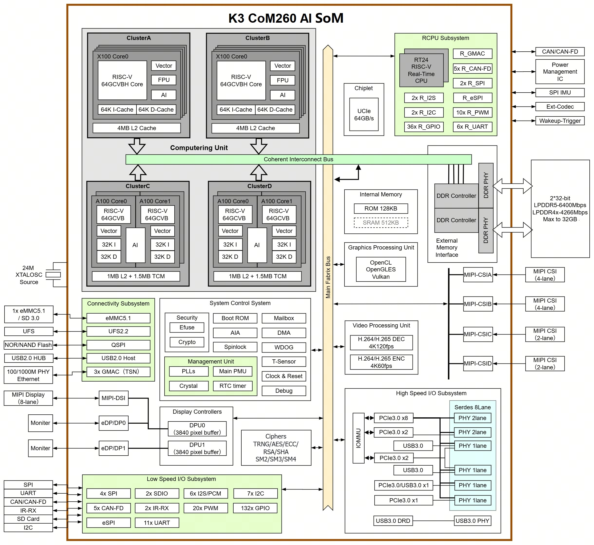

### 3.3 K3 CoM260 Reference Solution Block Diagram

#### 3.3.1 Reference Solution Overview

The K3 CoM260 system solution has the following features:

- Built on the K3 chipset
- Uses a power supply design based on the P1 PMIC + external DC-DC
- DRAM configuration includes 2 × LPDDR5 and UFS 2.2
- Peripheral interfaces include:
  - 7 lanes PCIe 3.0  
  - 3x USB 3.0 ports  
  - 1x GMAC port  
  - TF Card and other interfaces

The overall solution is stable, reliable, and suitable for mass production.

The reference solution block diagram is shown below:
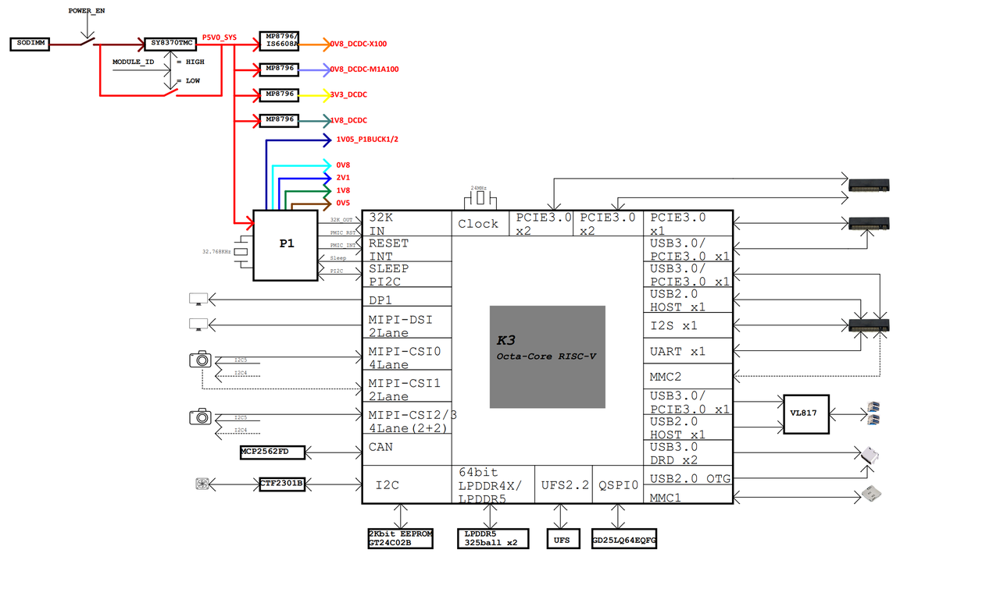

#### 3.3.2 Functional Overview

The K3 CoM260 Development Kit provides the following features:

- **Type-C**: 1 × USB 3.0 Type-C UFP interface for system firmware upgrade  
- **DP**: 1 × DP 1.2 Type-A interface, supporting output up to 3840 × 2160 @ 60fps  
- **MIPI DSI**: 1 × 30 Pin FPC connector; 1 × 2-lane MIPI DSI signal for an LCD panel, and 1 × I2C signal for a CTP panel  
- **MIPI CSI**: 2 × 22 Pin FPC connectors; 2 × MIPI CSI signals, supporting two cameras  
- **40 Pin Header**: Raspberry Pi-compatible 40 Pin header supporting I2C, UART, SPI, I2S, and GPIO debugging  
- **SD-Card**: Supports high-speed TF cards  
- **PCIe Wi-Fi**: 1 × M.2 E-Key connector; module model RTL8852BE; external SMA antenna; supports wireless networking  
- **Ethernet**: 1 × RJ45 connector with 10/100/1000M adaptive Ethernet  
- **PCIe 3.0**: 2 × M.2 M-Key connectors for 2280 and 2230 SSDs  
- **USB 3.0 Type-A**: 2 × USB 3.0 Type-A dual connectors for USB device expansion  
- **12 Pin Button Header**: Used to connect the LED, UART debug, ACOK, power on/off, and reset buttons  
- **FAN**: 1 × 4 Pin fan connector for a 4-wire speed-controllable fan  
- **CAN**: 1 × 4 Pin header with an integrated CAN transceiver for CAN device connection  
- **RTC**: 1 × 2 Pin wire-to-board connector supporting 1.85 V ~ 5 V input

#### 3.3.3 Functional Interfaces

| Function | Available (Yes/No) |
| --- | --- |
| 2 × LPDDR5 (4 GB / 8 GB / 16 GB) | Yes |
| UFS (128 GB) | Yes |
| SPI Flash | Yes |
| DC Jack | Yes |
| DP 1.2 OUT | Yes |
| MIPI DSI | Yes |
| MIPI CSI | Yes |
| SD-Card | Yes |
| Wi-Fi & Bluetooth | Yes |
| GbE | Yes |
| 2 × M.2 M-Key | Yes |
| 2 × USB 3.0 Type-A Dual | Yes |
| 40 Pin | Yes |
| 12 Pin | Yes |
| FAN | Yes |
| CAN | No |
| RTC | No |

## 4. Hardware Description

### 4.1 Product Appearance

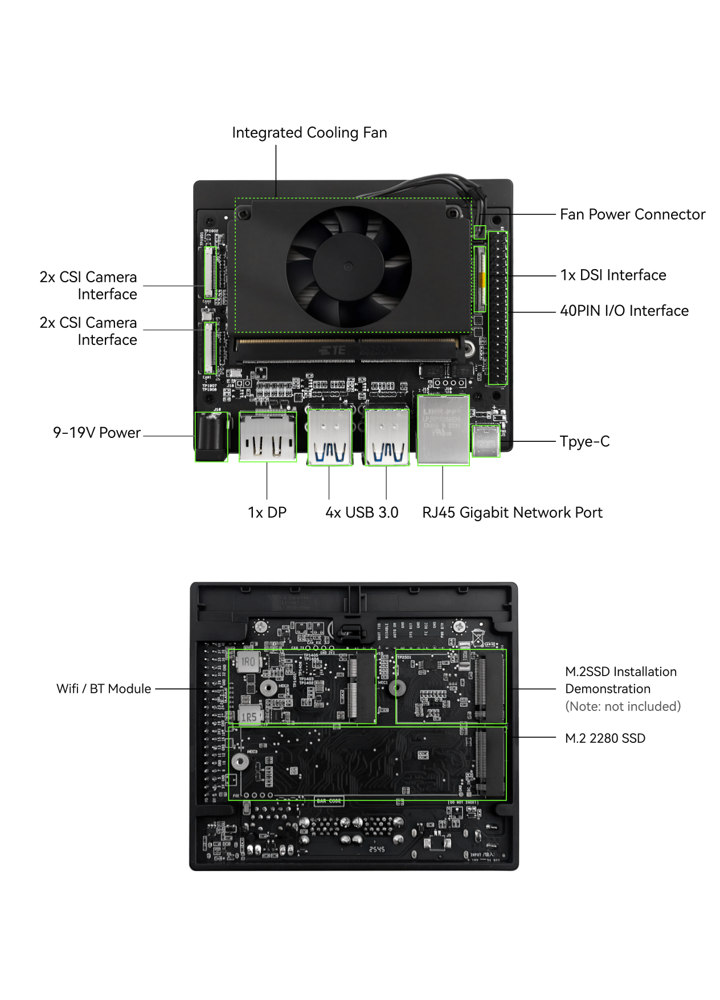

### 4.2 Power Block Diagram

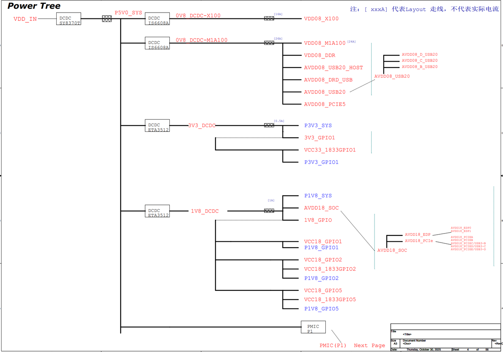  

### 4.3 Boot Download Sel & JTAG Sel

### 4.4 I2C Addresses

K3 CoM260 provides abundant peripheral interfaces. When debugging I2C peripherals, I2C channel multiplexing may be involved. The figure below shows the I2C addresses and pull-up power configuration of the K3 CoM260 Development Kit to avoid address conflicts and voltage-level mismatches.

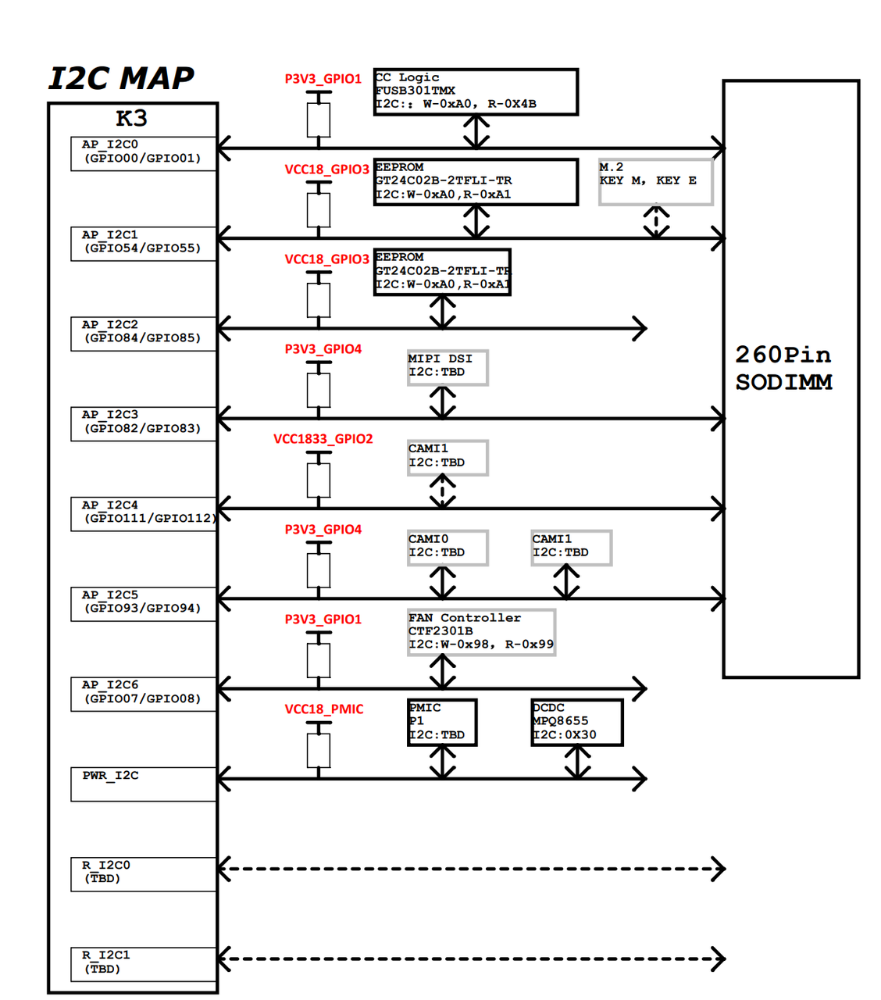

## 5. Module Description

### 5.1 Power Input

The K3 CoM260 Development Kit provides only one power input method: DCIN. Please use a power adapter rated for 12 V-6 A.

### 5.2 Memory

The K3 CoM260 module integrates the following four types of memory:

1. **UFS2.2**: On-board UFS storage, with a default capacity of 128 GB.  
2. **SPI Flash**: On-board SPI Flash.  
3. **DDR**: Two LPDDR5 chips are used, with per-chip capacities of 4 GB / 8 GB / 16 GB.  
4. **EEPROM**: Used to store board information.

### 5.3 Button Interfaces

The K3 CoM260 Development Kit provides multifunction button interfaces, including the power, reset, and download buttons.

| Pin | Signal Name | Function |
| --- | --- | --- |
| 1 | PC_LED- | LED negative |
| 2 | PC_LED+ | LED positive |
| 3 | UART0_RXD | DEBUG UART RX |
| 4 | UART0_TXD | DEBUG UART TX |
| 5 | BMCU_ACOK | Set for button power-on |
| 6 | AUTO_ON_DIS | Short with BMCU_ACOK to enable button power-on |
| 7 | GND | Power ground |
| 8 | PMIC_RST_OUTn | Reset |
| 9 | GND | Power ground |
| 10 | FORCE_RECOVERY | Download |
| 11 | GND | Power ground |
| 12 | SLEEP/WAKE | Power on/off |

### 5.4 MIPI CSI High-Speed Connector

The K3-CoM260 is not limited to specific camera module models. Its high-speed connector provides two sets of 4-lane MIPI CSI interfaces, and different link combination modes can be flexibly selected through onboard resistor configuration.

By default, 
- CAM0 supports 2 lanes
- CAM1 supports 2+2 lanes or 4 lanes

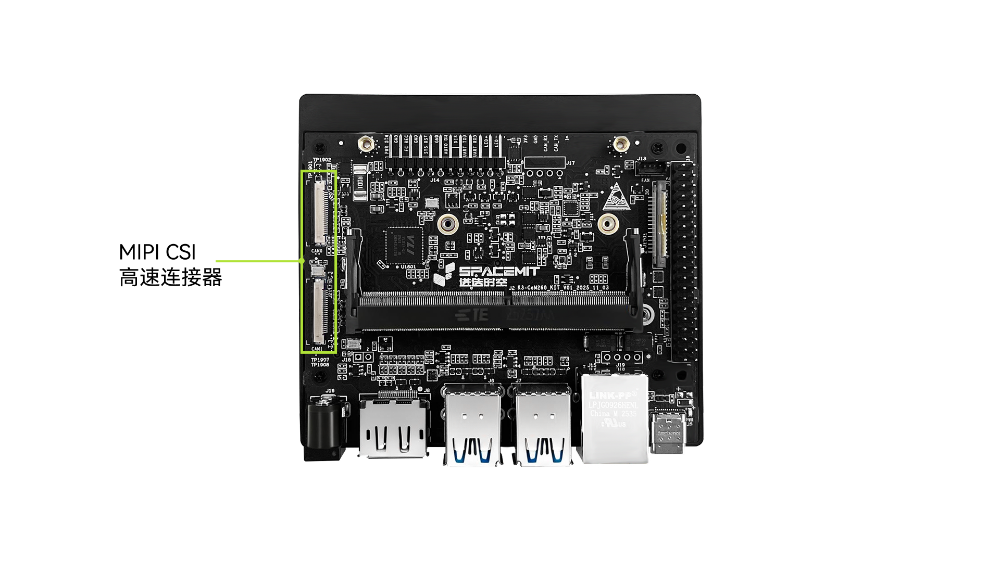

**The 22 Pin high-speed connector pinout is as follows:**

**CAM0**

| Pin | Signal Name          |
|-----|-------------------|
| 1   | VDD_3V3_SYS       |
| 2   | I2C4_SDA           |
| 3   | I2C4_SCL           |
| 4   | GND               |
| 5   | CLK_CAMCK         |
| 6   | CAM_PWDN          |
| 7   | GND               |
| 8   | MIPI_CSI0_DP1     |
| 9   | MIPI_CSI0_DN1     |
| 10  | GND               |
| 11  | MIPI_CSI0_DP0     |
| 12  | MIPI_CSI0_DN0     |
| 13  | GND               |
| 14  | MIPI_CSI1_CLKP    |
| 15  | MIPI_CSI1_CLKN    |
| 16  | GND               |
| 17  | MIPI_CSI1_DP1     |
| 18  | MIPI_CSI1_DN1     |
| 19  | GND               |
| 20  | MIPI_CSI1_DP0     |
| 21  | MIPI_CSI1_DN0     |
| 22  | GND               |

**CAM1**

| Pin | Signal Name         |
|-----|------------------|
| 1   | VDD_3V3_SYS      |
| 2   | I2C4_SDA         |
| 3   | I2C4_SCL         |
| 4   | GND              |
| 5   | CLK_CAMCK        |
| 6   | CAM_PWDN         |
| 7   | GND              |
| 8   | MIPI_CSI3_DP1    |
| 9   | MIPI_CSI3_DN1    |
| 10  | GND              |
| 11  | MIPI_CSI3_DP0    |
| 12  | MIPI_CSI3_DN0    |
| 13  | GND              |
| 14  | MIPI_CSI2_CLKP   |
| 15  | MIPI_CSI2_CLKN   |
| 16  | GND              |
| 17  | MIPI_CSI2_DP1    |
| 18  | MIPI_CSI2_DN1    |
| 19  | GND              |
| 20  | MIPI_CSI2_DP0    |
| 21  | MIPI_CSI2_DN0    |
| 22  | GND              |

### 5.5 MIPI DSI Display Connector

K3 CoM260 supports the Raspberry Pi 4.3-inch capacitive touch display.

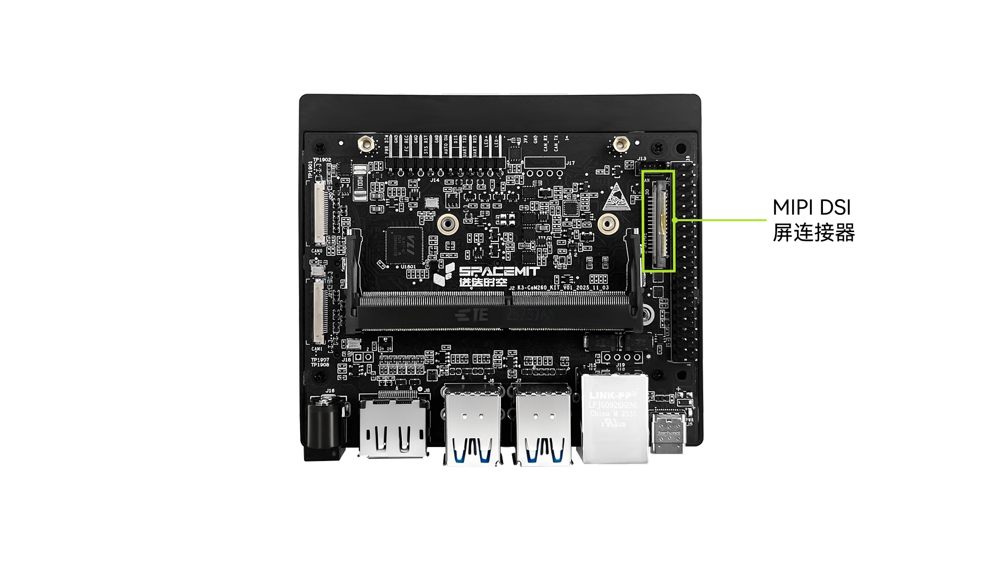

**The display connector pinout is as follows:**

| Pin | Signal Name | Signal Name | Pin |
| --- | --- | --- | --- |
| 1 | GND | GND | 2 |
| 3 | MIPI_DSI1_LANE1_DN | MIPI_DSI1_LANE1_DN | 4 |
| 5 | MIPI_DSI1_LANE1_DP | MIPI_DSI1_LANE1_DP | 6 |
| 7 | GND | GND | 8 |
| 9 | MIPI_DSI1_CLK_N | MIPI_DSI1_CLK_N | 10 |
| 11 | MIPI_DSI1_CLK_P | MIPI_DSI1_CLK_P | 12 |
| 13 | GND | GND | 14 |
| 15 | MIPI_DSI1_LANE0_DN | MIPI_DSI1_LANE0_DN | 16 |
| 17 | MIPI_DSI1_LANE0_DP | MIPI_DSI1_LANE0_DP | 18 |
| 19 | GND | GND | 20 |
| 21 | I2C3_SCL | I2C3_SCL | 22 |
| 23 | I2C3_SDA | I2C3_SDA | 24 |
| 25 | GND | GND | 26 |
| 27 | LCD_VCC33 | LCD_VCC33 | 28 |
| 29 | LCD_VCC33 | LCD_VCC33 | 30 |

### 5.6 Type-C Connector

The Type-C connector on the K3 CoM260 Development Kit supports OTG mode only and does not support power input.

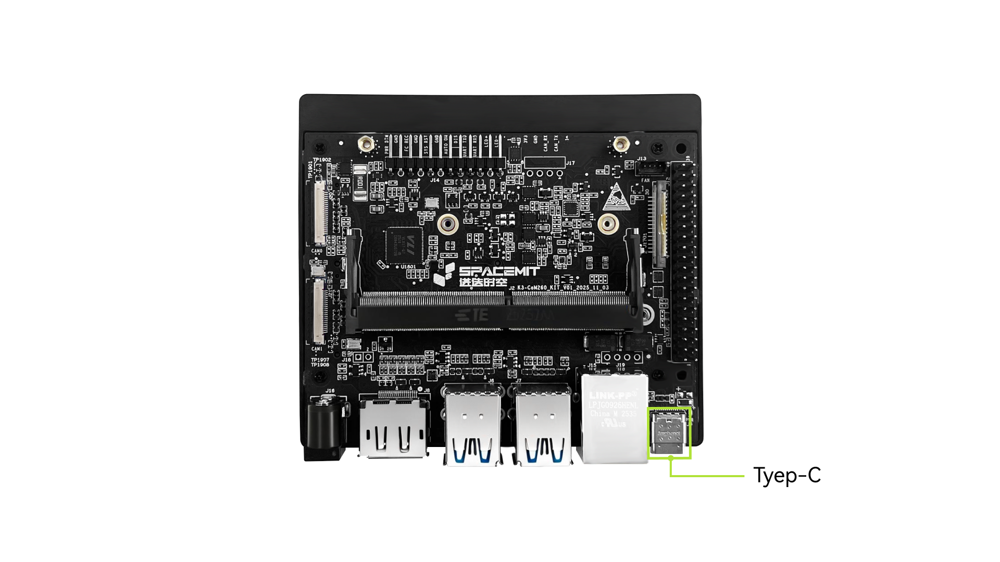

### 5.7 DP Output Interface

The K3 CoM260 Development Kit provides one DP Type-A output interface, supporting up to DP 1.2 and video output up to 3840 × 2160 @ 60fps.

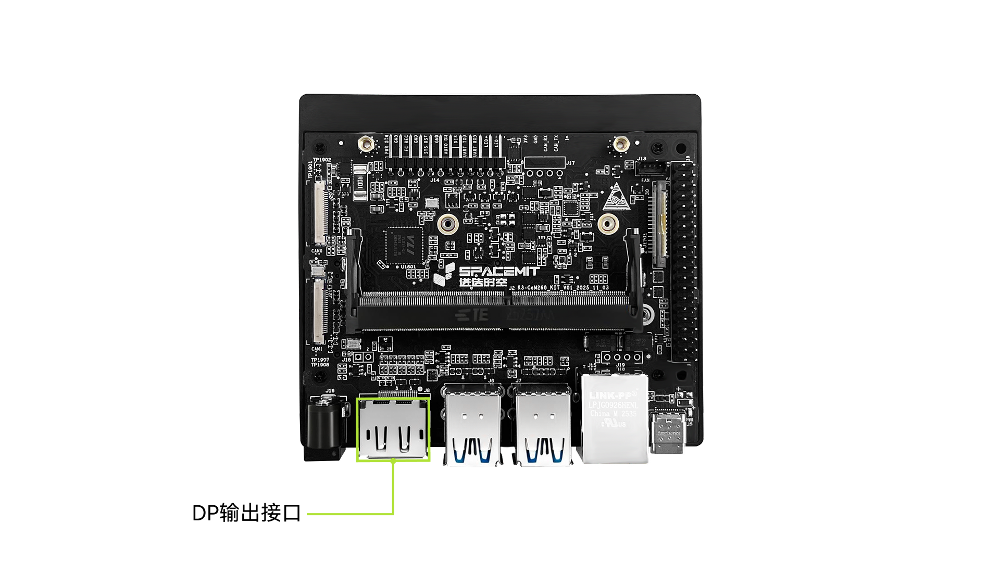

### 5.8 USB Interfaces

The K3 CoM260 Development Kit provides four USB 3.0 Type-A interfaces for connecting various USB peripherals.

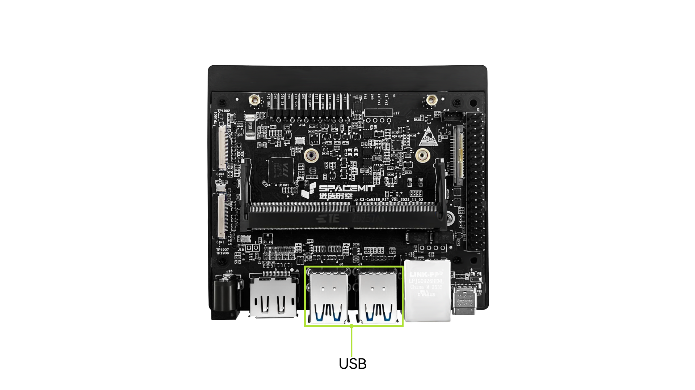

### 5.9 RJ45 Interface

The K3 CoM260 Development Kit provides one RJ45 Gigabit Ethernet port.

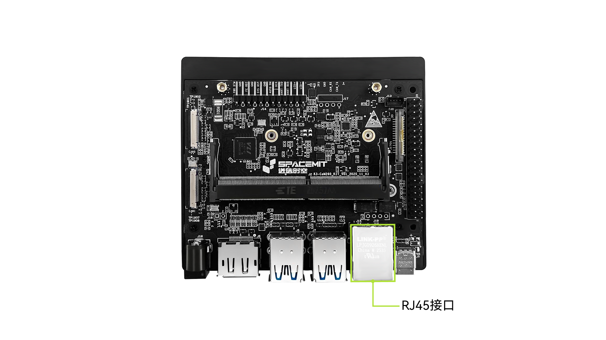

### 5.10 Wi-Fi/Bluetooth Module

The K3 CoM260 Development Kit supports an M.2 2230 E-Key module for wireless networking and Bluetooth connectivity.

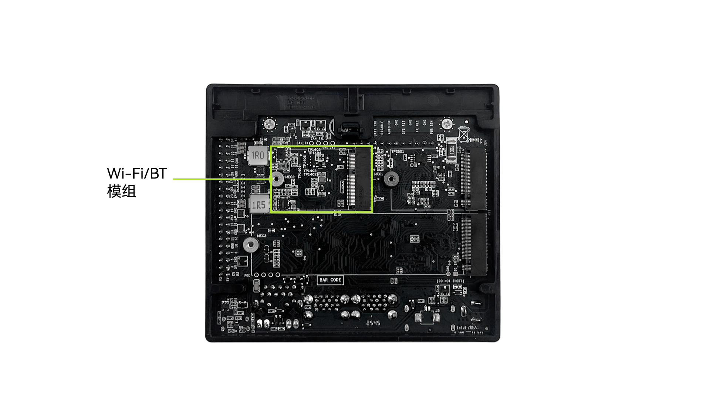

### 5.11 40 Pin Header

The K3 CoM260 Development Kit provides a 40 Pin dual-row header. The pinout is shown below:

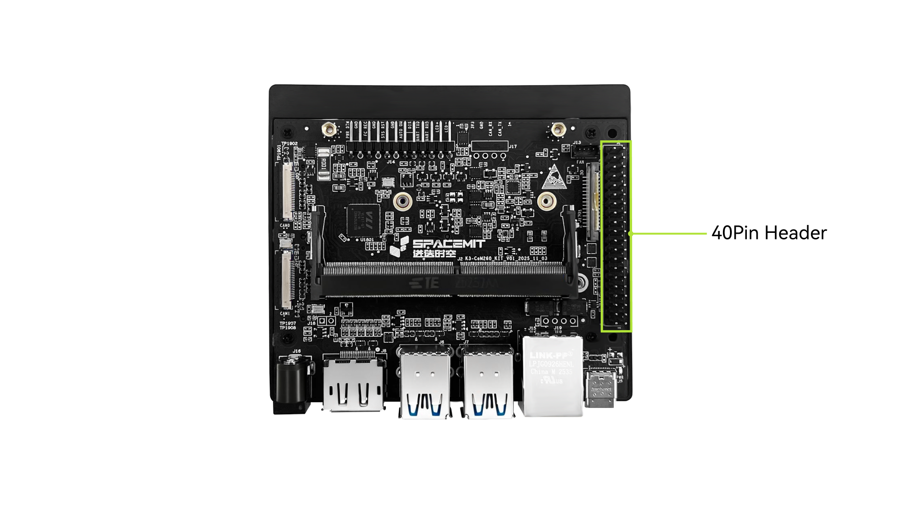

> Note: The IO function can be configured as needed.

| Pin | Signal Name | Signal Name | Pin |
| --- | --- | --- | --- |
| 1 | VDD_3V3_SYS | VDD_5V_GPIO | 2 |
| 3 | I2C3_SDA | VDD_5V_GPIO | 4 |
| 5 | I2C3_SCL | GND | 6 |
| 7 | GPIO09 | UART1_TXD_LS | 8 |
| 9 | GND | UART1_RXD_LS | 10 |
| 11 | UART1_RTS_LS | I2S0_SCLK_LS | 12 |
| 13 | R-SPI0_SCK_LS | GND | 14 |
| 15 | GPIO12_LS | R-SPI0_CS1_LS | 16 |
| 17 | VDD_3V3_SYS | R-SPI0_CS_LS | 18 |
| 19 | SPI0_MOSI_LS | GND | 20 |
| 21 | SPI0_MISO_LS | R-SPI0_MISO_LS | 22 |
| 23 | SPI0_SCK_LS | SPI0_CS0_LS | 24 |
| 25 | GND | SPI0_CS1_LS | 26 |
| 27 | I2C0_SDA | I2C0_SCL | 28 |
| 29 | GPIO01_LS | GND | 30 |
| 31 | GPIO11_LS | GPIO07_LS | 32 |
| 33 | GPIO13_LS | GND | 34 |
| 35 | I2S0_LRCK_LS | UART1_CTS_LS | 36 |
| 37 | R-SPI0_MOSI_LS | I2S0_SDIN_LS | 38 |
| 39 | GND | I2S0_SDOUT_LS | 40 |

### 5.12 TF-Card Interface

K3 CoM260 supports TF cards for storage expansion. It also supports a Debug expansion card for JTAG debugging.

### 5.13 M.2 M-Key Interface

The K3 CoM260 Development Kit provides two M.2 M-Key interfaces, supporting 2280 (the longer SSD shown in the figure) and 2230 (the shorter SSD shown in the figure) NVMe SSD form factors, as well as other M.2 M-Key devices.

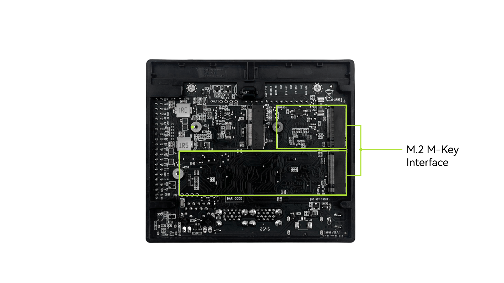

### 5.14 CAN FD Interface

The K3 CoM260 Development Kit integrates an on-board CAN transceiver and can be directly connected to CAN devices.

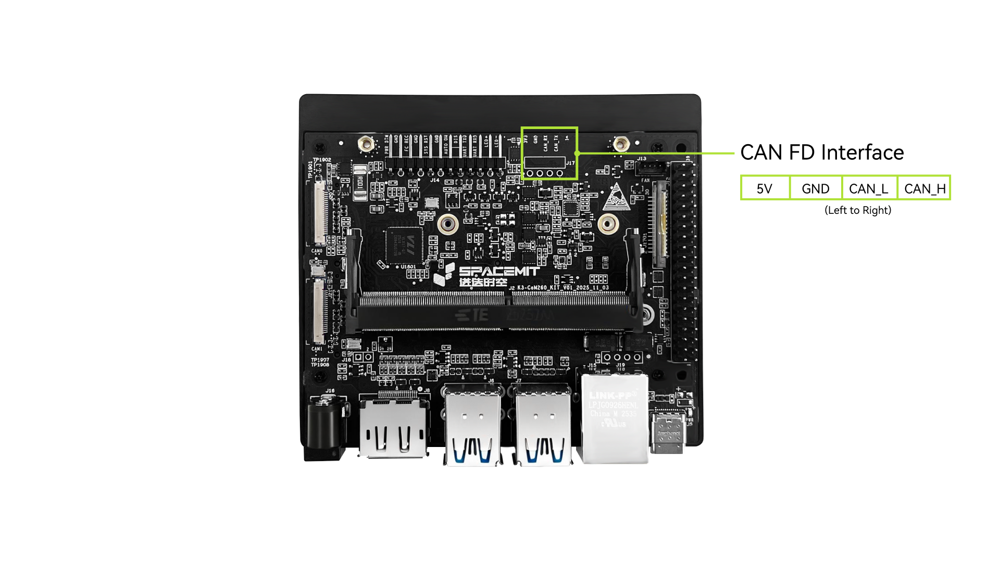

## 6. Initial Setup

### 6.1 Preparation Before Use

#### 6.1.1 Power Adapter

K3 CoM260 is powered through the DCIN interface. A certified DC jack power adapter with the correct output specification is recommended. Supported power specifications are 19V/2.37A or 12V/5A.

#### 6.1.2 Keyboard and Mouse

You can connect a wired keyboard, mouse, or USB receiver to any USB-A port on the K3 CoM260 Development Kit. Bluetooth keyboards and mice are also supported.

#### 6.1.3 Display

K3 CoM260 requires an external display for video output. The product supports both DP and MIPI DSI video interfaces, so either one display or both types of displays can be connected.

> **Note**: If video output is required through the MIPI DSI interface, make sure the display and K3 CoM260 are connected before power-on. The MIPI DSI interface on K3 CoM260 **does not support hot plugging**.

#### 6.1.4 Network Connection

K3 CoM260 supports wired RJ45 network connections and can be connected directly to an Ethernet cable.  
It also supports Wi-Fi and Bluetooth wireless connections. An external antenna can be installed for stronger signal reception.

### 6.2 Power-On

Complete the following connections before powering on the device:

- Connect the device to a display using a video cable, and connect the keyboard and mouse.
- Last, connect the power cable and power on the device.
  - On first power-up: the device powers on automatically.
  - After software shutdown: press the power button briefly to power on again.

After startup:

- The red power indicator on the K3 CoM260 Development Kit lights up.
- The cooling fan on the K3 CoM260 module starts moving.

### 6.3 Configure K3-CoM260 on First Boot

K3 CoM260 comes preinstalled with the Bianbu operating system. A setup wizard runs automatically on first boot, and a display, keyboard, and mouse are required to complete the configuration.

For detailed configuration instructions, refer to [LXQt Startup Wizard (Initial Setup)](https://spacemit.com/community/document/info?lang=en&nodepath=software/SDK/bianbu/user_guide/LXQt/initial_setup_and_sessions.md).

## 7. Firmware Flashing

### 7.1 Enter Flashing Mode

Before entering flashing mode, prepare two push buttons: one for shorting FC_REC to GND, and the other for shorting SYS_RST to GND.

1. **When the device is powered off**
   1. Press and hold the FC_REC button.
   2. Connect the power adapter to power on the device.
   3. Release the FC_REC button.
   4. Use a Type-C data cable to connect the Type-C port on the development board to the host computer.
   5. Use the SpacemiT Titan flashing tool or run the `fastboot` command to flash the firmware.
2. **When the device is already powered on and running**
   1. Press and hold the FC_REC button.
   2. Briefly press the RST button.
   3. Release the FC_REC button.
   4. Use a Type-C data cable to connect the Type-C port on the development board to the host computer.
   5. Use the SpacemiT Titan flashing tool or run the `fastboot` command to flash the firmware.

For the flashing procedure, refer to the [Flashing Tool User Guide](https://www.spacemit.com/community/document/info?lang=en&nodepath=tools/user_guide/flasher_user_guide.md).

### 7.2 Firmware Download and Installation

#### 7.2.1 Bianbu

**Bianbu Introduction:**  
Bianbu is an operating system deeply optimized by SpacemiT for processors based on the RISC-V architecture.

## 8. Serial Debugging

### 8.1 Interface Connection

Connect the host PC to the TX, RX, and GND pins of the 12 Pin interface on the K3-CoM260 carrier board through a USB-to-TTL adapter. The interface signals are shown below:

### 8.2 Debugging on Windows

MobaXterm is used as exmple below:

First, connect the serial hardware correctly, and then confirm under **Ports** in Windows Device Manager that the corresponding COM port can be recognized, as shown below.

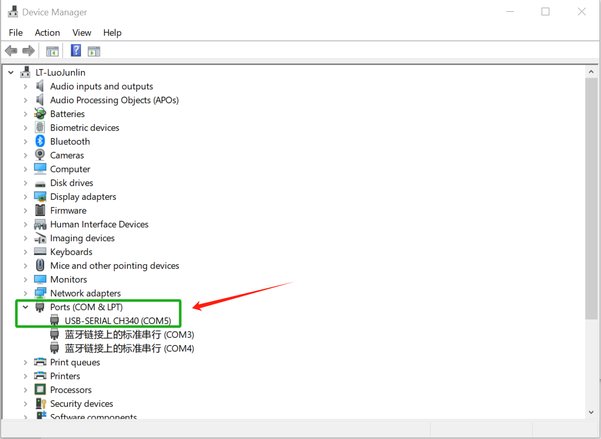

1. Open MobaXterm, then select **Sessions → New Session**.  

   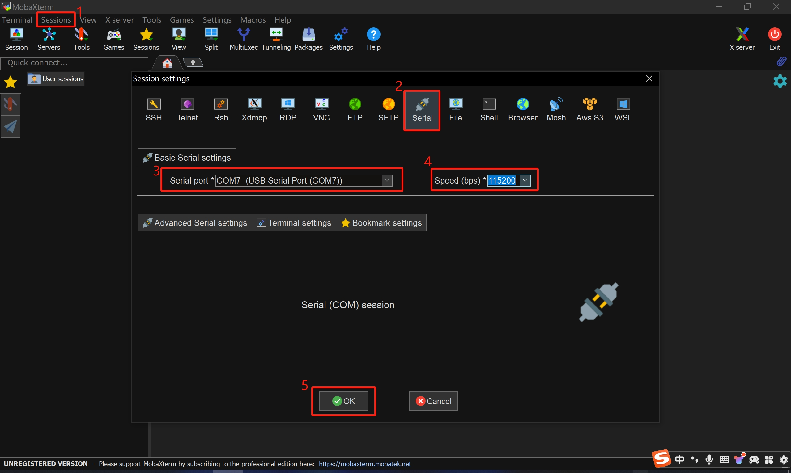

2. In the dialog box that appears, select **Serial**.  
3. In the **Serial port** drop-down list, select the recognized COM port.  
4. Set **Speed** to **115200**.  
5. Click **OK** to enter the serial log output page.

## 9. Precautions

K3 CoM260 is intended for laboratory or engineering environments. Before use, read the following precautions carefully:

1. Do not hot-plug the display interface, CSI interface, or expansion board under any circumstances.  
2. Before unpacking and installation, take necessary anti-static precautions to avoid damage to the development board caused by electrostatic discharge (ESD).  
3. When handling the development board, hold the board edges and avoid touching exposed metal parts to prevent ESD damage to components.  
4. Place the development board on a dry, flat surface, and keep it away from heat sources, electromagnetic interference sources, radiation sources, and electromagnetically sensitive equipment such as medical devices.
