# K3 Pico-ITX User Guide

## PDF Version

Click to have [K3 Pico-ITX User Guide (PDF)](https://cdn-resource.spacemit.com/file/product/K3/k3_pico_ug_en.pdf)

## Revision History

The revision history below records the updates made to this document.

| Revision | Date | Description |
| --- | --- | --- |
| V1.1 | 2026.06.10 | Updated notes for power supply|
| V1.0 | 2026.04.30 | Initial release |

## 1. Quick Start

Welcome to the SpacemiT K3 Pico-ITX single-board computer user guide.

The K3 Pico-ITX is available in two package options:

- **Single Board Kit**
  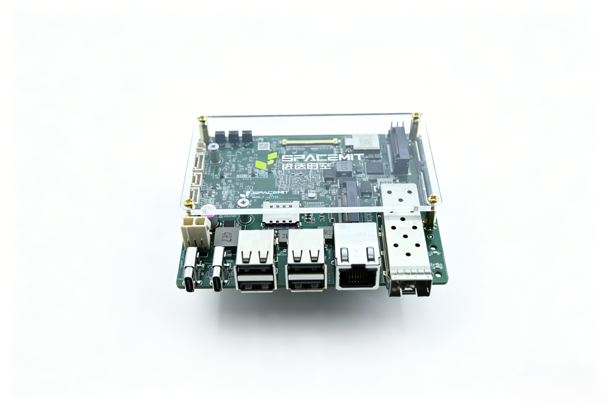

- **Chassis Kit**
  

Before getting started, connect the following required peripherals. Once power is connected, you can power on the board and begin using it:

- A Type-C power adapter or ATX 2-Pin DC power supply (a 20 V / 5 A power adapter is recommended)
  > Note:  
  > - The Type-C power adapter must provide a rated output of at least 20V @ 3.25A;  
  > - The ATX 2-pin DC power supply must provide a rated output of at least 12V @ 5A.
- A monitor
- A keyboard
- A mouse

You can power the K3 Pico-ITX and connect a display in either of the following ways:

**Method 1**: Use a monitor that supports 65 W or higher USB Type-C power delivery, and connect the monitor to the board with a full-featured Type-C cable.

- **Method 1 (Single Board Kit)**
  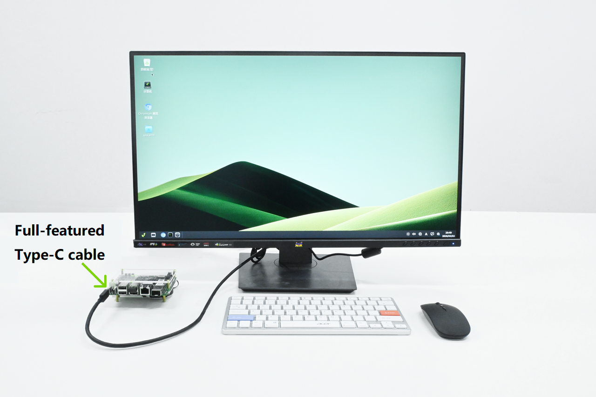

- **Method 1 (Chassis Kit)**
  

**Method 2**: Use a multifunction dock that supports HDMI output, USB, and PD charging. Connect the dock to the board’s full-featured Type-C port to carry both power and display signals.

- **Method 2 (Single Board Kit)**
  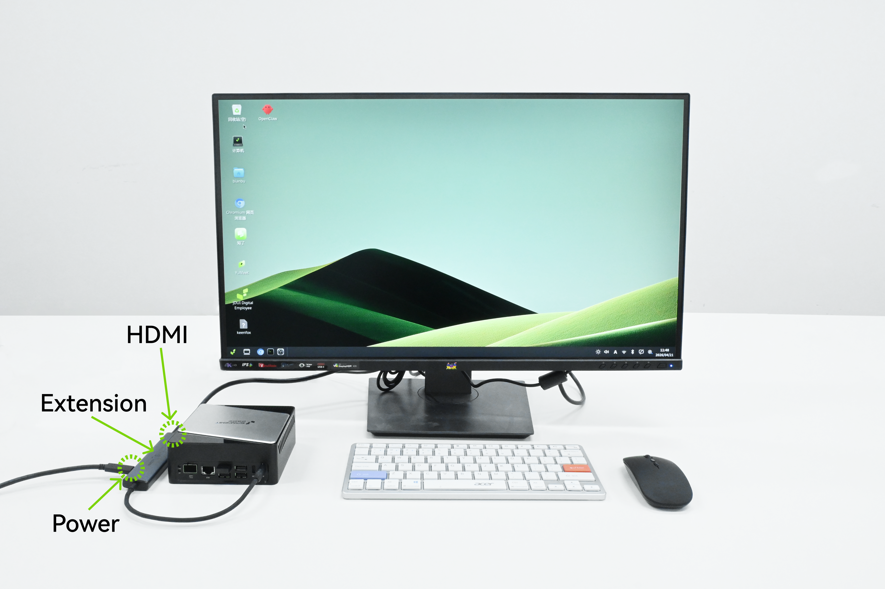

- **Method 2 (Chassis Kit)**
  

> **Note:** To ensure stable operation, make sure the board is placed in a well-ventilated environment before powering it on, and use the bundled heatsink.

### 1.1 U-Boot Version

The K3 Pico-ITX comes preinstalled with the Bianbu LXQt desktop edition. After powering on with the setup above, you can boot directly into Bianbu OS for initial configuration.

For first-boot and session setup, refer to [Initial Setup and Sessions](https://www.spacemit.com/community/document/info?nodepath=software/SDK/bianbu/user_guide/LXQt/initial_setup_and_sessions.md&lang=zh).

### 1.2 UEFI Preview Version

The K3 Pico-ITX supports UEFI boot and configuration, with NVMe SSD, USB, and UFS available as boot devices.

A [UEFI preview image](https://archive.spacemit.com/image/k3/version/bianbu/v4.0/Bianbu-LXQt-UEFI-K3-v4.0-20260430171239.tar.gz) is currently available for the Pico-ITX.

For operating system installation steps, refer to Part 3 [OS Installation](#3-os-installation).

#### 1.2.1 UEFI Setup

Within 3 seconds after powering on the K3 Pico-ITX, press `F2` to enter the UEFI setup screen.

#### 1.2.2 Boot Manager

In the Boot Manager menu, use the <↑> and <↓> keys to select a boot device such as an NVMe SSD, USB storage device, or UFS. You can also enter the UEFI Shell command-line interface.

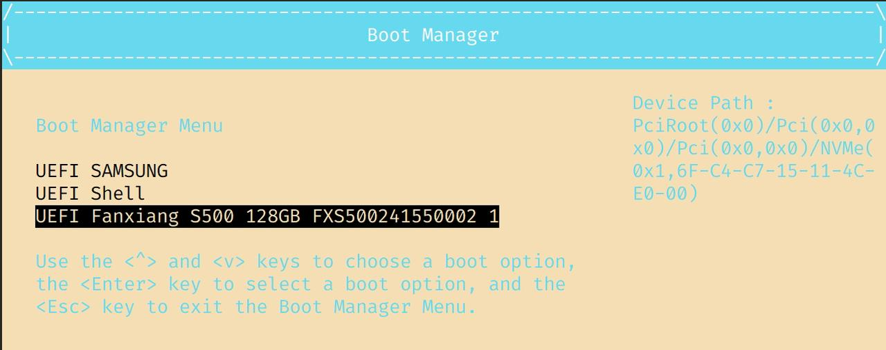

#### 1.2.3 Boot Maintenance Manager

In the Boot Maintenance Manager menu, go to Boot Options and select Change Boot Order to configure boot priority. Use <+> and <-> to adjust the boot order. Press <Enter>, then select Commit Changes and Exit to apply the changes and exit. After returning to the main menu, press <F10> to save the settings.

#### 1.2.4 UEFI Interactive Shell

UEFI Interactive Shell V2.2 is supported. The first time you enter the UEFI Interactive Shell, the screen displays all currently detected storage devices. Press any key other than <Esc>, or wait 5 seconds, to enter the command-line interface. Enter `help` to view supported commands and related help information.

#### 1.2.5 GRUB Boot

GRUB boot is supported, allowing multiple operating systems to be installed and selected at startup.

## 2. Hardware Description

### 2.1 Overview

> **Note:** The board appearance may vary slightly depending on the hardware revision.

| No. | Description                      |
|-----|----------------------------------|
| 1   | Power button PWR                 |
| 2   | FDL flashing button              |
| 3   | Reset button RST                 |
| 4   | eDP interface                    |
| 5   | Wi-Fi and BT module              |
| 6   | M.2 Key B slot                   |
| 7   | M.2 Key M slot                   |
| 8   | 26 Pin FPC connector             |
| 9   | 36 Pin FPC connector             |
| 10  | 10G optical Ethernet port        |
| 11  | Coin-cell battery header         |
| 12  | Front-panel headphone connector  |
| 13  | Front-panel switch header        |
| 14  | EC expansion header              |
| 15  | ATX power connector              |
| 16  | UART pin header                  |
| 17  | Full-featured Type-C port        |
| 18  | DRD Type-C port (no power input) |
| 19  | Dual USB 2.0 Type-A ports        |
| 20  | 1G Ethernet RJ45 port            |

### 2.2 Indicators and Buttons

| Indicator | Status Description |
|:-----|:------|
| Status indicator STAT | Solid green: the board is powered on and running  Blinking green: the board indicates that a forced power-off is imminent  Off: the board is powered off |

| Button | Description |
|:-----|:------|
| Power button PWR | - Short press in Shutdown state: power on - Short press in Standby state: wake the system - Press and hold for 3 s in Normal state: the LED changes from solid on to blinking, indicating imminent power-off; continue holding the button while blinking to force power off - Short press in Normal state: sends a button event, with behavior defined by the OS |
| Firmware flashing button FDL | - Hold while inserting power or resetting power to enter flashing mode |
| Reset button RST | - Short press: power reset, forces a reboot |

### 2.3 Interface Description

#### 2.3.1 Power Input

- USB Type-C supports USB PD 3.0 power delivery, up to 20 V / 5 A

- ATX power input supports up to **12 V / 7 A**. When an ATX power supply is connected, the system will prioritize ATX power.

  > **Note:** ATX and Type-C PD power do not support 1+1 hot redundancy.
  > - When the system is powered by ATX, it will continue to use ATX power even if a PD-capable Type-C cable is connected.
  > - To switch to Type-C PD power, shut down the system, disconnect the ATX power supply, and then power on.
  > - If the ATX power supply is removed while the system is running with Type-C PD power, the system will restart and automatically switch to Type-C PD power.
  > - If an ATX power supply is connected while the system is running on Type-C PD power, the system will restart and switch to ATX power.

- In flashing mode, the full-featured Type-C port supports both power input and USB Device functionality. When connected to a host PC via USB Type-C, the board is recognized by the host and can be used for flashing and firmware updates.

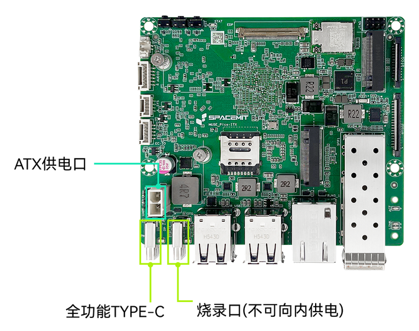  

| No. | Description               |
|-----|---------------------------|
| 15  | ATX power connector       |
| 17  | Full-featured Type-C port |

#### 2.3.2 Flashing Interface

In flashing mode, this interface can only operate as a USB Device for data transfer and cannot supply power to the board. After connecting to a host PC through USB Type-C, the board can be detected by the host PC and used for flashing and firmware updates.

> **Note:** The flashing Type-C port cannot supply power to the board. During flashing, power must be provided through another power input. The USB cable must support data transfer; charge-only USB cables cannot be used for flashing.

  

| No. | Description                     |
|-----|---------------------------------|
| 18  | Flashing port (no power input)  |

#### 2.3.3 Full-Featured Type-C Interface

- Type: Type-C connector
- Supports PD 3.0 power negotiation and connections to DP displays and USB 3.0 peripherals
- Supports DP displays at up to 4K @ 60 Hz, with hot-plug support
- When only a DP display is connected, the DP display is used as the primary display

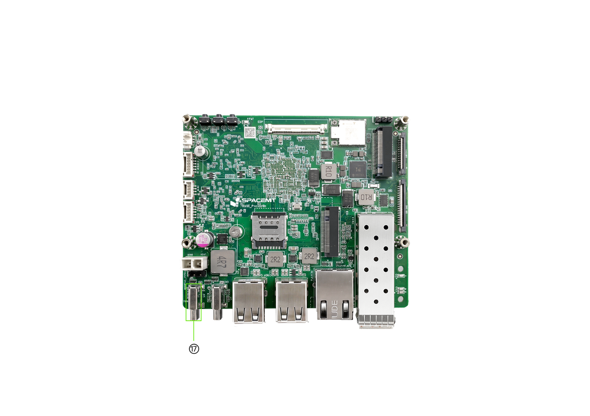  

| No. | Description               |
|-----|---------------------------|
| 17  | Full-featured Type-C port |

#### 2.3.4 High-Speed Expansion Interfaces: M.2 M-Key and M.2 B-Key

- Type: M.2 connector with 4.2 mm stack height
- **M.2 M-Key**
  - Supports 2280 NVMe SSDs
  - PCIe 3.0 x2/x4 bandwidth
- **M.2 B-Key**
  - Supports 2242 PCIe SSDs
  - PCIe 3.0 x2 bandwidth
  - Supports USB 2.0 4G modem modules

> **Note:**
>
> 1. When a PCIe SSD is installed in the M.2 B-Key slot, the M.2 M-Key slot operates at PCIe 3.0 x2. When no SSD is installed in the M.2 B-Key slot, the M.2 M-Key slot operates at PCIe 3.0 x4.
> 2. When used for storage expansion, the M.2 B-Key slot supports PCIe SSD only. SATA SSD is not supported.
> 3. Hot-plugging is not supported. Power off the board before installation or removal.

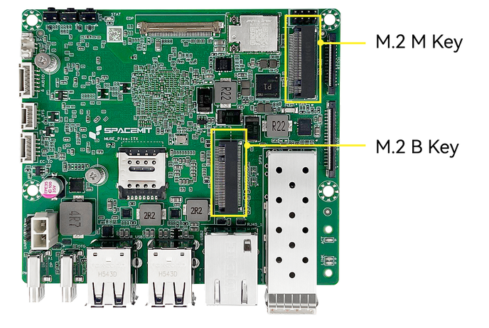  

| No. | Description   |
|-----|---------------|
| 6   | M.2 Key B slot |
| 7   | M.2 Key M slot |

#### 2.3.5 eDP Display Interface

- Type: eDP connector
- Supports external eDP displays at up to 2.5K @ 90 Hz. Hot-plugging is not supported
- When only an eDP display is connected, the eDP display is used as the primary display
- When both a DP display and an eDP display are connected, eDP is the default primary display and DP is used as an extended display. You can change the primary display to DP in the operating system

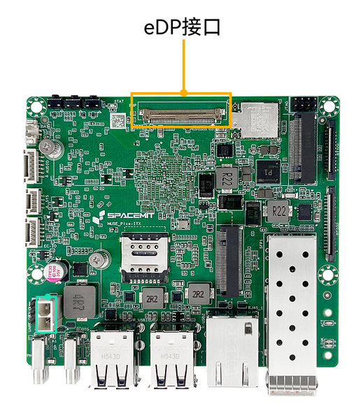  

| No. | Description   |
|-----|---------------|
| 4   | eDP interface |

#### 2.3.6 Audio Interface

- Type: 1.25 mm latch wire-to-board connector

  

| No. | Description                      |
|-----|----------------------------------|
| 12  | Front-panel headphone connector  |

- An onboard audio output header is provided and can be connected to a front-panel 3.5 mm headphone jack using an adapter cable

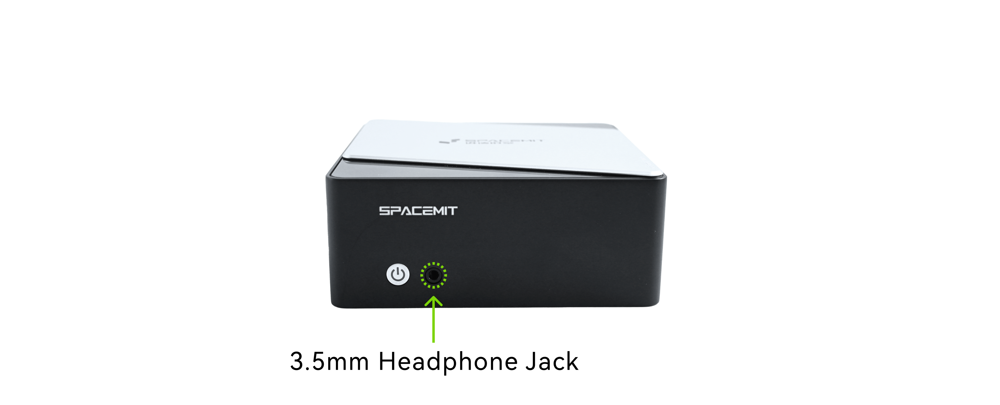

#### 2.3.7 1G Ethernet Interface

- Type: RJ45 with green and yellow status LEDs
- Supports 100 M / 1000 M adaptive switching

The green LED on the Ethernet port is the LINK SPEED indicator and shows link state and link speed:

1. Solid green: link established at the highest supported speed
2. Off: link established but not at the highest supported speed
3. Off: no link established

The yellow LED on the Ethernet port is the ACTIVE indicator and shows link activity:

1. Off: no data transmission
2. Blinking yellow: data is being transmitted; faster blinking indicates higher activity
3. Off: no link established

  

#### 2.3.8 10G Optical Ethernet Interface

- Type: SFP+ optical port
- Supports multimode optical modules, DAC cables, and optical-to-electrical transceiver modules, with 10G/1G auto-negotiation

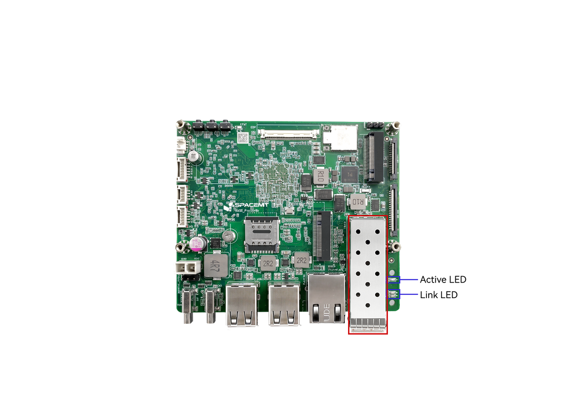

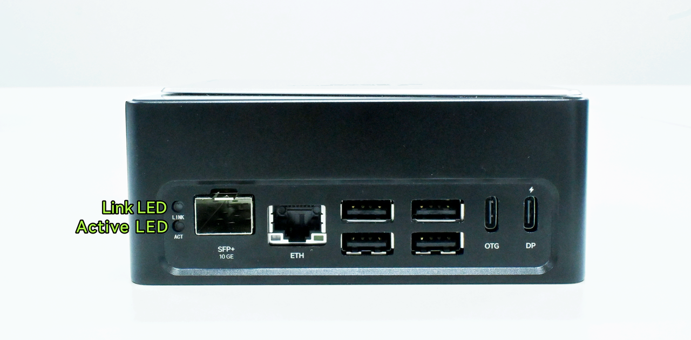

LINK SPEED indicates link state and link speed:

1. Green: link established at the highest supported speed
2. Yellow on the 10G port: link established but not at the highest supported speed
3. Off: no link established

ACTIVE indicates link activity:

1. Off: no data transmission
2. Blinking: data is being transmitted; faster blinking indicates higher activity
3. Off: no link established

#### 2.3.9 USB 2.0 Interface

- Type: USB Type-A
- Plug and play; supports USB 2.0 host mode
- Supports multiple USB devices such as keyboards and mice at the same time

  

| No. | Description                 |
|-----|-----------------------------|
| 19  | Dual USB 2.0 Type-A ports   |

#### 2.3.10 FPC Expansion Interface

- Type: 0.5 mm pitch, 26 Pin + 36 Pin FPC wire-to-board connector
- Available signals:
  - CAN ×5
  - UART ×2
  - GMAC ×1
  - PWM ×2
  - I2C ×1
  - SPI ×1
- Can be connected directly to an expansion board

  

| No. | Description           |
|-----|-----------------------|
| 8   | 26 Pin FPC connector  |
| 9   | 36 Pin FPC connector  |

#### 2.3.11 Wi-Fi Antenna Interface

- Type: onboard PCIe Wi-Fi 6 + BT 5.2 module, compliant with IEEE 802.11a/b/g/n/ac/ax, dual antennas, dual band (2.4 GHz / 5.8 GHz)
- A Wi-Fi antenna is included with the base package and can be installed at the recommended position shown below
    
- The Chassis Kit configuration comes with the Wi-Fi antenna pre-connected and ready to use

### 2.4 Product Specifications

| Item | Specification |
|------|------|
| **Processor** | SpacemiT K3, 8 cores, 2.4 GHz, 60 TOPS general AI compute, compliant with the RVA23 standard, supports IME extension and full virtualization |
| **Display** | - DP Type-C interface, up to 4K (3840 × 2160) at 60 Hz - 40 Pin eDP interface, up to 2.5K (2560 × 1600) at 90 Hz |
| **Memory** | Dual-channel 2 × 32 bit LPDDR5, 6400 MT/s, available in 16 GB / 32 GB |
| **Onboard Storage** | UFS 2.2, available in 128 GB / 256 GB |
| **Storage Expansion** | M.2 M-Key connector for 2280 NVMe SSDs, PCIe Gen3 x4 link |
| **High-Speed Expansion** | M.2 B-Key connector for 2242/3042 expansion cards, providing PCIe Gen3 x2 and USB signals |
| **Real-Time Expansion** | FPC connector supporting EtherCAT, 5 CAN-FD channels, SPI, I2C, UART, and other real-time signal expansion |
| **Wireless Communication** | Onboard PCIe Wi-Fi 6 + BT 5.2 module, compliant with 802.11a/b/g/n/ac/ax, dual antennas, dual band |
| **Wired Networking** | One Ethernet port with RJ45 connector, 100 M / 1000 M adaptive rates |
| **Optical Networking** | 10G Ethernet with SFP+ interface, supporting 10G BASE-R and 10G BASE-X, as well as QinQ, MSI-X, WOL, and other networking features |
| **Audio Interface** | Onboard CODEC circuitry, supporting onboard audio input and output headers |
| **USB Interfaces** | - 2 USB 3.2 Gen1 Type-C ports (one full-featured, one OTG) - 4 USB 2.0 Type-A host ports |
| **Debug Interfaces** | Supports UART and JTAG, with 3 side buttons for power, reset, and firmware flashing |
| **Management System** | Onboard EC management system, supporting power management, intelligent thermal strategy, and system status management, with onboard I2C/UART/GPIO expansion interfaces |
| **Form Factor** | 100 mm × 86 mm, Pico-ITX Plus single-board computer form factor, approximately the size of a 2.5-inch hard drive |
| **Operating System** | Preinstalled with Bianbu 3.0; supports Ubuntu 26.04, OpenHarmony 6.0, OpenKylin, Deepin, Fedora, and other operating systems |
| **Power Input** | Dual Type-C USB PD support, rated input power 65 W; onboard ATX 2 Pin power input supports 12 V @ 7 A |
| **Reliability** | - ESD protection for external board-level interfaces: contact ±4 kV, air ±8 kV - ESD protection at system level: contact ±6 kV, air ±12 kV - Compliant with CCC, CE, FCC, and other EMC certification standards |
| **Clock** | Onboard RTC power connector, supports battery installation for G3-state power retention |
| **Mechanical Options** | - Available as board-only or with a fan-cooled heatsink kit - Available as board-only or with a custom all-metal industrial enclosure - Optional real-time expansion boards, touch display, or industrial terminal configurations |

### 2.5 Block Diagram

## 3. OS Installation

### 3.1 Method 1: Flashing via Type-C Data Cable

#### 3.1.1 Device Powered Off

1. Press and hold the **FDL flashing button**.
2. Connect a full-featured Type-C cable or plug in the power supply cable to power on the device.
3. Release the **FDL flashing button**.
4. Use the flashing Type-C data cable to connect the DRD Type-C port to the host computer.
5. Use the official SpacemiT flashing tool **Titan** or the `fastboot` command to perform the flashing process.

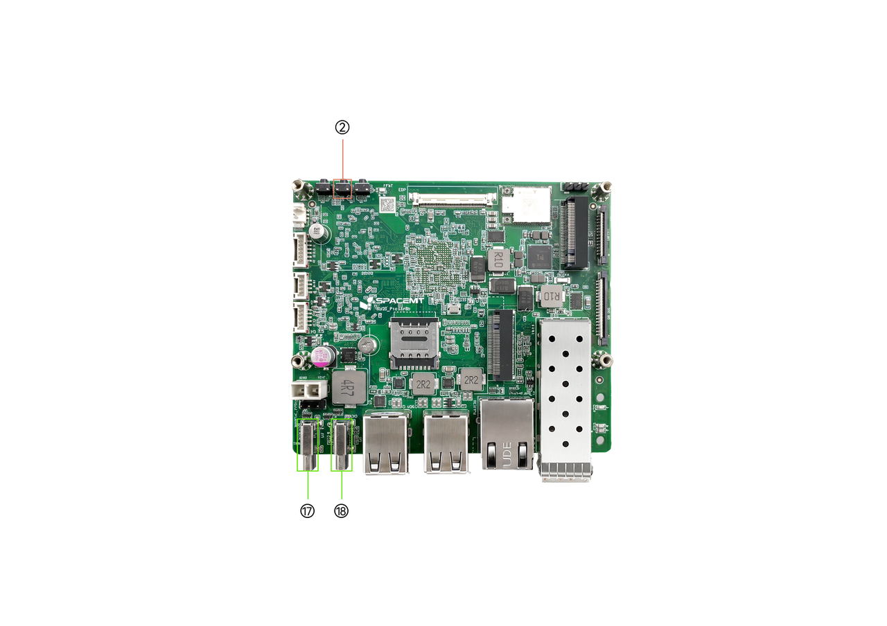

| No. | Description                      |
|-----|----------------------------------|
| 2   | FDL flashing button              |
| 17  | Full-featured Type-C port        |
| 18  | DRD Type-C port (no power input) |

#### 3.1.2 Device Powered by a Full-Featured Type-C Cable or ATX Power Supply (Powered On)

1. Press and hold the **FDL flashing button**.
2. Briefly press the **RST reset button**.
3. Release the **FDL flashing button**.
4. Use the flashing Type-C data cable to connect the DRD Type-C port to the host computer.
5. Use the official SpacemiT flashing tool **Titan** or the `fastboot` command to perform the flashing process.

> **Note:** For the flashing tool manual, see the [Flashing Tool User Guide](https://www.spacemit.com/community/document/info?lang=en&nodepath=tools/user_guide/flasher_user_guide.md).

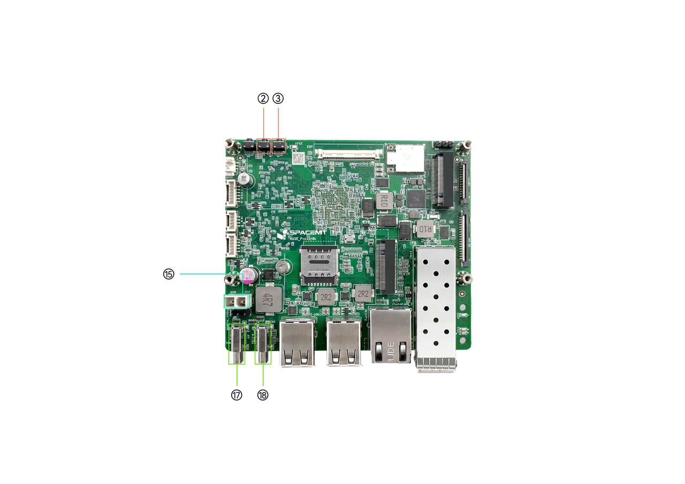

| No. | Description                      |
|-----|----------------------------------|
| 2   | FDL flashing button              |
| 3   | Reset button RST                 |
| 15  | ATX power connector              |
| 17  | Full-featured Type-C port        |
| 18  | DRD Type-C port (no power input) |

### 3.2 Serial Debugging

#### 3.2.1 Interface Connection

Use a **USB-to-TTL** adapter to connect the host PC to the K3 Pico-ITX board header through **TX**, **RX**, and **GND**, as shown below.

Here, Tx and Rx represent the transmit and receive signals of the K3 board, respectively.

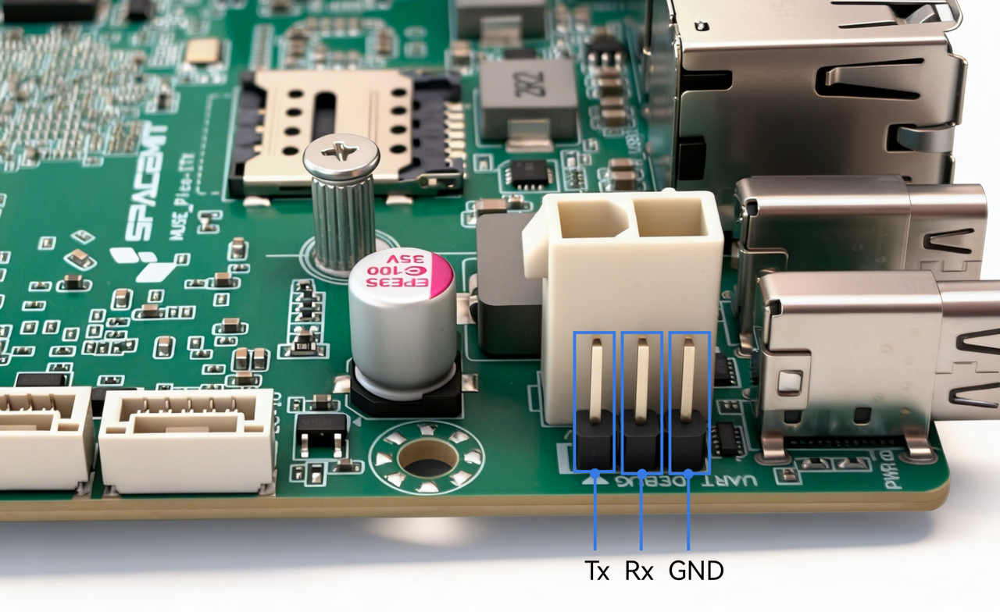  

#### 3.2.2 Debugging on Windows (Using MobaXterm as an Example)

The following steps use MobaXterm as an example.

First, connect the serial hardware correctly, and confirm in Windows Device Manager under **Ports** that the corresponding COM port has been recognized, as shown below.
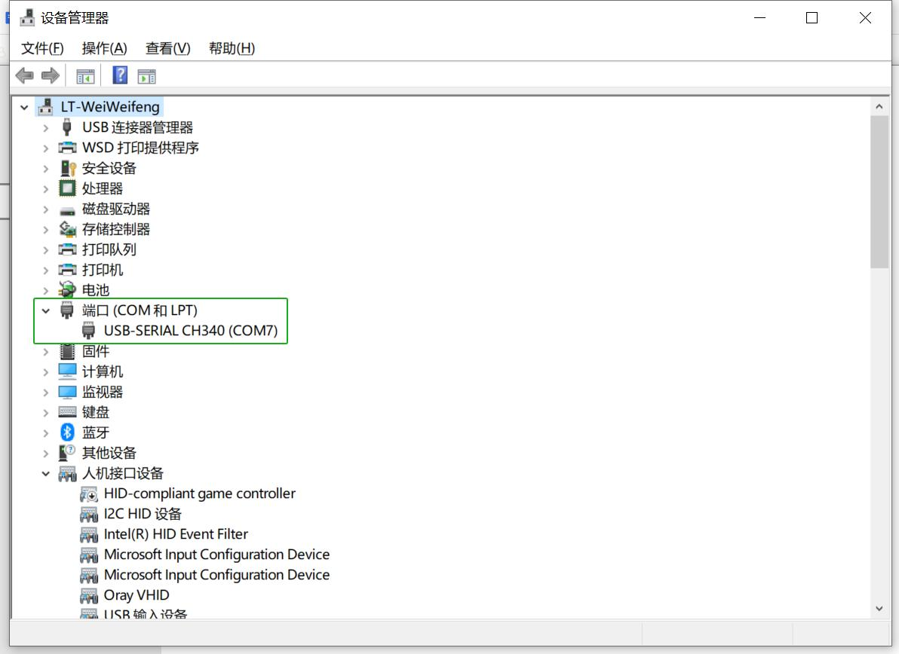

1. Open MobaXterm, then select **Sessions → New Session**.

   

2. In the dialog box, select **Serial**.

3. In the **Serial port** drop-down list, select the detected COM port.

4. Set **Speed** to **115200**.

5. Click **OK** to enter the serial log output page.

## 4. Precautions

The K3 Pico-ITX is suitable for home, office, and industrial environments. Before operating the board, read the following precautions carefully:

1. Do not hot-plug display interfaces, CSI interfaces, or expansion boards under any circumstances.
2. Before unpacking or installing the single-board computer, take proper anti-static precautions to avoid ESD damage to the hardware.
3. When handling the board, hold it by the edges. Do not touch exposed metal parts on the board, to avoid electrostatic damage to components.
4. Place the board on a dry, flat surface, away from heat sources, electromagnetic interference sources, radiation sources, and devices sensitive to electromagnetic radiation, such as medical equipment.
5. Keep the board in a well-ventilated environment. If the system must run continuously at full load for 72 hours or longer, install the original heatsink or implement sufficient cooling measures.

## 5. Appendix — Connector Pinout

### 5.1 FPC Expansion Interface

The K3 Pico-ITX provides **26 Pin + 36 Pin FPC expansion interfaces**.

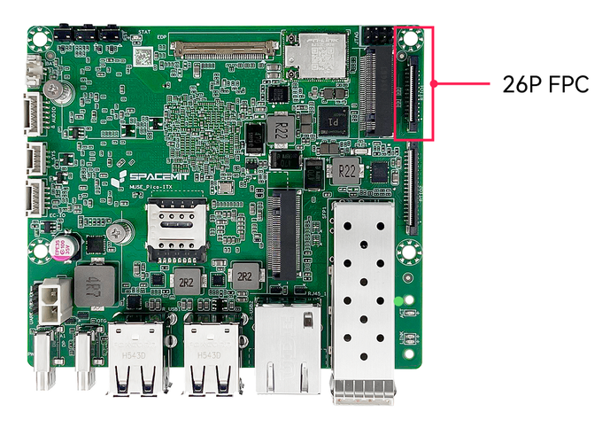  

**26 Pin Connector Pinout**: CAN (from RT24) + I2C (from RT24) + UART + PWM + 3.3 V (main power)

| Pin | Signal | Description |
|:---:|:------:|:------------|
| 1   | 3.3V | IO power supply |
| 2   | 3.3V | IO power supply |
| 3   | R_I2C1_SCL | I2C clock |
| 4   | R_I2C1_SDA | I2C data |
| 5   | GND | Ground |
| 6   | R_UART0_TX | UART TX |
| 7   | R_UART0_RX | UART RX |
| 8   | GND | Ground |
| 9   | UART5_TX | UART TX |
| 10  | UART5_RX | UART RX |
| 11  | RX_PWM1 | PWM |
| 12  | RX_PWM2 | PWM |
| 13  | UART10_TX | UART TX |
| 14  | UART10_RX | UART RX |
| 15  | UART10_CTS | UART CTS |
| 16  | UART10_RTS | UART RTS |
| 17  | GND | Ground |
| 18  | R_CAN4_TX | CAN TX |
| 19  | R_CAN4_RX | CAN RX |
| 20  | GND | Ground |
| 21  | R_CAN3_TX | CAN TX |
| 22  | R_CAN3_RX | CAN RX |
| 23  | GND | Ground |
| 24  | R_CAN2_TX | CAN TX |
| 25  | R_CAN2_RX | CAN RX |
| 26  | GND | Ground |

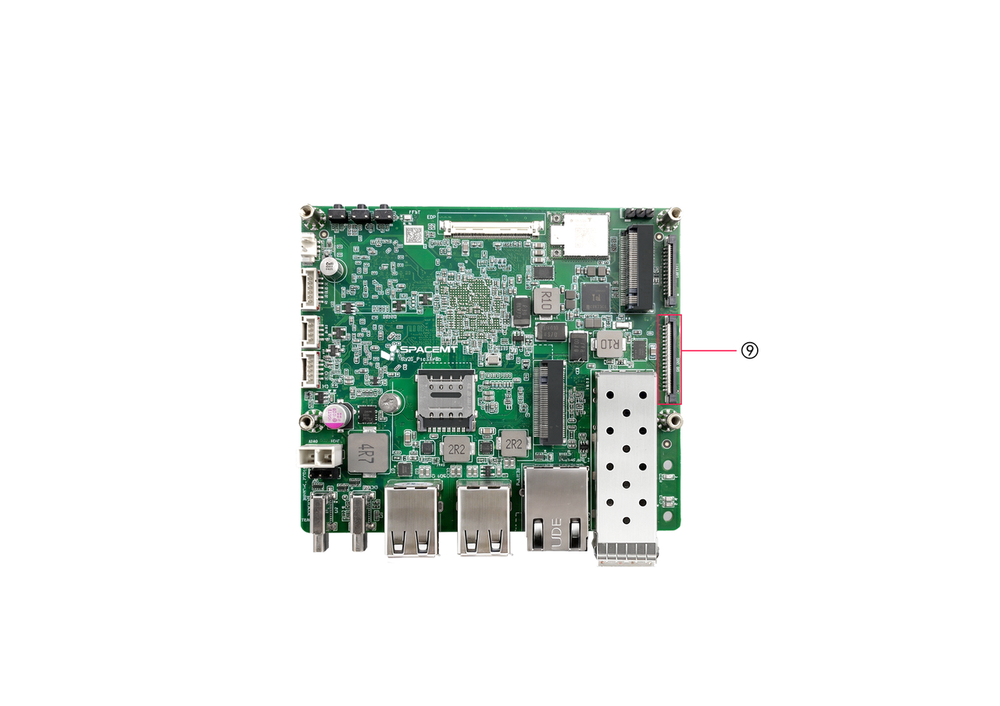

**36 Pin Connector Pinout**: GMAC-MII (from RT24) + CAN + SPI + 1.8 V (main power)

| Pin | Signal | Description |
|:---:|:------:|:------------|
| 1   | 1.8V        | IO power supply |
| 2   | 1.8V        | IO power supply |
| 3   | CAN1_RX     | CAN RX |
| 4   | CAN1_TX     | CAN TX |
| 5   | GND         | Ground |
| 6   | R_TX_CLK    | MAC transmit clock |
| 7   | GND         | Ground |
| 8   | R_TX_D0     | MAC transmit data 0 |
| 9   | R_TX_D1     | MAC transmit data 1 |
| 10  | R_TX_D2     | MAC transmit data 2 |
| 11  | R_TX_D3     | MAC transmit data 3 |
| 12  | GND         | Ground |
| 13  | R_RX_CLK    | MAC receive clock |
| 14  | GND         | Ground |
| 15  | R_RX_D0     | MAC receive data 0 |
| 16  | R_RX_D1     | MAC receive data 1 |
| 17  | R_RX_D2     | MAC receive data 2 |
| 18  | R_RX_D3     | MAC receive data 3 |
| 19  | GND         | Ground |
| 20  | R_TX_EN     | Transmit enable |
| 21  | R_CLK_25M   | 25 MHz reference clock |
| 22  | R_RX_DV     | Receive data valid |
| 23  | R_PWDN/INTn | Ethernet PHY interrupt |
| 24  | R_RESETn    | Ethernet PHY reset input |
| 25  | R_MDIO_MDC  | MDIO clock |
| 26  | R_MDIO_MDIO | MDIO data |
| 27  | R_CRS       | Carrier sense |
| 28  | R_COL       | Collision detect |
| 29  | GND         | Ground |
| 30  | SPI0_MOSI   | SPI TX |
| 31  | SPI0_MISO   | SPI RX |
| 32  | SPI0_SCLK   | SPI clock |
| 33  | SPI0_CS     | SPI chip select |
| 34  | GND         | Ground |
| 35  | R_CAN0_TX   | CAN TX |
| 36  | R_CAN0_RX   | CAN RX |

### 5.2 UART Debug Interface

Use a **USB-to-TTL** adapter to connect the host PC to the K3 Pico-ITX board header through **TX**, **RX**, and **GND**, as shown below.

Here, Tx and Rx represent the transmit and receive signals of the K3 board, respectively.

  

> **Note:** The motherboard appearance may vary slightly depending on the hardware revision.

### 5.3 EC Expansion Interface

| Pin | Signal | Description |
|:---:|:------:|:------------|
| 1 | EC_I2C0_CLK_3V3 | EC I2C bus clock |
| 2 | EC_I2C0_DAT_3V3 | EC I2C bus data |
| 3 | GND | Ground |
| 4 | EC_GPB2/TXD1/CTX0 | Serial TX or GPIO B2 |
| 5 | EC_GPC0/RXD1/CRX0 | Serial RX or GPIO C0 |

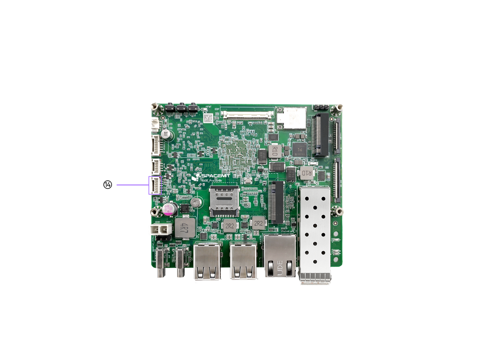  

### 5.4 Audio Expansion Interface

| Pin | Signal | Description |
|:---:|:------:|:------------|
| 1 | MICN_GMS1 | Microphone negative |
| 2 | MICP_GMS0 | Microphone positive |
| 3 | ROUT | Right-channel output |
| 4 | JACK_DET | Headphone jack detection |
| 5 | LOUT | Left-channel output |
| 6 | AUDIO_AGND | Audio analog ground |

  
