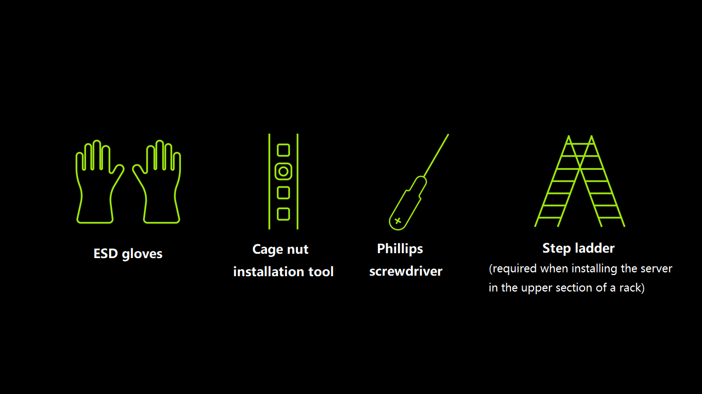

# Cluster Server RV2768 Quick Guide

## Revision History

|Version|Date|Description|
|---|---|---|
|V1.0|2026.07.31|Initial release|

## Overview

The Cluster Server RV2768 is a RISC-V-based cluster server in a 2U, 19-inch rack form factor, integrating up to 48 SpacemiT K3 processors and compliant with the RVA23 profile defined by RISC-V International. For more detail, refer to the [Cluster Server RV2768 Technical White Paper](./rv2768_white_paper.md).

|Item|Specification|
|---|---|
|**Dimensions (H × W × D)**|87.4mm x 447.6mm x 817mm|
|**Temperature**|Operating: 5°C ～40°C (41°F ～ 104°F), compliant with ASHRAE Class A1/A2/A3.  Storage (up to 3 months): -30℃～+60℃（-22℉～+140℉）.  Storage (up to 6 months): –15°C ～ +45°C (5°F to 113°F).  Storage (up to 1 year): –10°C to ～35°C (14°F to 95°F). Maximum temperature change rate: 20°C (36°F) per hour, or 5°C (9°F) per 15 minutes.|
|**Relative Humidity (RH, Non-Condensing)**|Operating: 8%～90%.  Storage (up to 3 months): 8%～85%.  Storage (up to 6 months): 8%～80%.  Storage (up to 1 year): 20%～75%.  Maximum humidity change rate: 20% RH per hour.|
|**Altitude**|≤ 3050 m.  For configurations compliant with ASHRAE Class A1 or A2, when the operating altitude exceeds 900 m, the maximum operating temperature shall be reduced by 1°C for every additional 300 m of elevation.  For configurations compliant with ASHRAE Class A3, when the operating altitude exceeds 900 m, the maximum operating temperature shall be reduced by 1°C for every additional 175 m of elevation.  For configurations compliant with ASHRAE Class A4, when the operating altitude exceeds 900 m, the maximum operating temperature shall be reduced by 1°C for every additional 125 m of elevation.|

## Front & Rear Panels and Indicators

### Front Panel

**Front Panel Layout**

**Front Panel Indicators and Buttons**

|Indicators|Name|Description|
|---|---|---|
||Power Button|- When AC power is connected and the server is in Standby mode, press briefly to power on the server. The Node Management OS, switching system, and all compute nodes enter the operating state. - When the server is powered on, press and hold the button for 6 seconds to force the Node Management OS, switching system, and all compute nodes to power off and return to Standby mode.|
||Power LED|- Off: Server is not powered.  - Blinking Amber: The BMC management system is starting. During this period, the Power button is locked and cannot be operated. BMC startup typically completes within approximately one minute, after which the LED changes to solid amber.  - Solid Amber: Server is in Standby mode.  - Solid Green: Server is powered on and operating normally.|
||Health Status LED|Normal: Off  Abnormal:  - Blinking Red (1 Hz): Major alarm.  - Blinking Red (5 Hz): Critical alarm.|
||UID LED|- Off: The server is not being identified.  - Blinking Blue (for 255 seconds): The server is being identified.  - Solid Blue: The server has been identified.|
||High-Speed Network Port LED (ACT)|LINK/SPEED indicates link status and link speed:  - Solid Green: Link established at the highest supported speed.  - Solid Amber: Link established below the highest supported speed.  - Off: No link established.  ACT indicates network activity:  - Off: No data transmission.  - Blinking Green: Data is being transmitted. The blink rate increases with network activity.|
||High-Speed Network Port LED (SPD)|Same as above|
||BMC Management Port LED|Same as above|

**Front Panel Connectors**

|No.|Connector|No.|Connector|
|---|---|---|---|
|1|High-Speed Network Ports|2|Debug Serial Port|
|3|Local openBMC Management Port|4|Node Management System Full-Function USB Port|

**Connector Description**

|Connector|Type|Qty.|Description|
|---|---|---|---|
|High-Speed Network Ports|SFP+|50|- Ports 0~47 correspond to the high-speed network interfaces of Compute Nodes 0~47.  - Ports 50 and 51 are the integrated switch uplink ports.|
|Debug Serial Port|RJ45|1|Used for debugging. By default, this port is assigned to the operating system serial console. It can be configured through the openBMC CLI as either the openBMC serial console or the switch management serial console.  Note: Uses a 3-wire serial interface with a default baud rate of 115200 bit/s.|
|Node Management Full-Function USB Port|Type-C|1|USB 3.0 Type-C full-function interface supporting DisplayPort (DP) output and a USB 3.2 host interface.  - Connect a DisplayPort monitor to view the boot screen, BIOS, and operating system display. - Connect USB storage devices, keyboards, mice, and other USB peripherals to the Node Management system.|
|Local openBMC Management Port|RJ45|1|Dedicated Ethernet management port for openBMC server management.  Notes:  - The management port is a Gigabit Ethernet interface supporting 100/1000 Mb/s auto-negotiation.  - Do not connect the openBMC management port to a PoE-enabled Ethernet port (for example, a PoE switch with PoE enabled). Doing so may result in communication failures or permanent damage to the management port.|

### Rear Panel

**Rear Panel Layout and Connectors**

|No.|Module|No.|Module|
|---|---|---|---|
|1|Power Supply Module 1|2|Power Supply Module 2|
|3|Power Supply Module 1 AC Inlet|4|Power Supply Module 2 AC Inlet|
|5|Power Supply Module 1 Status LED|6|Power Supply Module 2 Status LED|

**LED**

|No.|Indicator|Status|Corrective Action|
|---|---|---|---|
|5/6|Power Supply Module Status LED|- Off: No AC input power.  - Solid Green: Input and output are operating normally.  - Blinking Green (1 Hz): AC input is normal, and the power supply is operating in SV12 mode.  - Blinking Green (2 Hz): Power supply firmware update in progress.  - Solid Amber: AC input is normal, but no output is present.  - Blinking Amber (1 Hz): A warning condition has been detected (for example, overtemperature or excessive output load), but the power supply continues to operate normally.|Solid Amber: Replace the power supply module.  Possible causes of no power output include: - Overtemperature protection activated. - Output overcurrent or short-circuit protection activated. - Short-circuit protection activated. - Output overvoltage protection activated. - Internal component failure (not all component failures are detectable).|

## Required Tools

## Installation

⚠️ **WARNING**

- Always use installation tools correctly to avoid personal injury.
- If the installation position is above shoulder height, use a step ladder, lifting platform, or similar equipment. When using a ladder, a second person must be present to provide assistance. Do not perform the installation alone, as the server could slip and cause personal injury or equipment damage.

⚠️ **CAUTION**

- Before handling the server, wear ESD gloves and remove any conductive personal items, such as jewelry and watches, to reduce the risk of electric shock or burn injury.
- At least two people are required to lift and move the chassis. Do not attempt to move a heavy chassis alone. Keep your back straight and lift carefully to avoid personal injury.
- Do not lift or carry the server by its rack mounting ears. Doing so may cause the server to slip or become damaged.

### Installation Procedure

1. Install the server
   - Place the Cluster Server onto the L-shaped rack rails, then carefully slide it into the rack.
   - Align the mounting ears on both sides of the server with the rack mounting posts, and secure the server to the rack using the supplied mounting screws.

2. Connect the service network and management network cables.

3. Connect the power cords.

## Power-On

The Cluster Server does not provide a dedicated grounding terminal. The server is grounded through the grounding conductor in the power cord.
The high-voltage power supply provides power for server operation. Direct contact with high-voltage power sources, or indirect contact through wet objects, may result in fatal injury.
The Cluster Server can be powered on using either of the following methods:

- The power supply modules are properly installed but not connected to power. Connect the power supply modules to an external power source, and the Cluster Server powers on automatically with the power supply modules.
- The power supply modules are properly installed and connected to power, and the Cluster Server is in Standby mode (the Power LED is solid amber).
  - Briefly press the Power button on the front panel to power on the server.
  - Power on the server through the BMC Web UI: In the left navigation pane, select Operations → Server Power Operations → Power On.

## Post-Installation Tasks

After the  Cluster Server is installed in the rack and powered on successfully, refer to the Cluster Server User Guide to complete server configuration and other subsequent tasks.
