# Cluster Server RV2768 Technical White Paper

## Revision History

|Version|Date|Description|
|---|---|---|
|V1.0|2026.07.31|Initial release|

## Terminology

| Term | Definition |
| :--- | :--- |
| Server | A computer system that provides computing, storage, networking, or application services to client devices over a network. |
| Baseboard Management Controller (BMC) | A dedicated management controller that monitors and manages server hardware independently of the host operating system. The BMC collects sensor data, monitors hardware health, records events, reports alarms, and provides out-of-band management functions such as power control, hardware monitoring, and remote maintenance. |
| Compute Node | The smallest independently managed computing unit within the cluster server. Each compute node integrates a processor, dedicated memory, storage resources, and network interfaces. It supports independent power management, PXE network boot, remote debugging, and high-speed interconnect through the internal switching fabric. |
| Compute Board | A field-replaceable hardware module that hosts one or more compute nodes. The compute board supports independent installation, removal, and maintenance, and serves as a modular building block of the cluster server architecture. |
| Node Management Board | The central management controller of the cluster server responsible for in-band management, task scheduling, workload distribution, and coordination of all compute boards. It also provides external service access and management interfaces. |
| Switch System | The internal switching subsystem that provides high-speed network connectivity among compute nodes, the node management network, and external networks. It is responsible for internal packet forwarding and network communication throughout the cluster. |
| Gigabit Ethernet (GE) | An Ethernet technology supporting a data rate of 1 Gbit/s. Gigabit Ethernet is backward compatible with 100BASE-TX and 10BASE-T Ethernet standards and is defined by the IEEE 802.3z standard. |
| 10 Gigabit Ethernet (10GE) | A high-speed Ethernet technology supporting data rates of 10 Gbit/s. It is backward compatible with Gigabit Ethernet and earlier Ethernet standards, operates in full-duplex mode, and is defined by IEEE 802.3ae standard. |
| Server Standby | The server power state in which AC power is present and the BMC has completed initialization, while the compute subsystem remains powered off and awaits user commands. |
| Server Power On | The operation that powers on the entire server, including the Node Management Board, Switch System, and all Compute Boards, bringing the server into its normal operating state. |
| Server Power Off | The operation that powers off the Node Management Board, Switch System, and all Compute Boards. After shutdown, the server enters Standby mode, with only the BMC remaining operational. |
| Node Power On | The operation that applies electrical power to a compute node. |
| Node Power Off | The operation that removes electrical power from a compute node. |
| Boot Node | The operation that starts the operating system on a powered compute node. The compute node must already be powered on before the operating system can boot. |
| Shutdown Node | The operation that gracefully shuts down the operating system running on a compute node while leaving the node electrically powered. |
| Reboot Node | The operation that restarts a compute node by shutting down the operating system, cycling node power, and booting the operating system again. |
| Recovery Mode | A dedicated maintenance mode used for firmware recovery, system restoration, and software or firmware upgrades when the system cannot boot normally. |
| Hot Swap | The capability to install or remove a hardware module without shutting down the running system, allowing maintenance with minimal impact on system operation. |
| ASHRAE Environmental Class | Environmental operating classifications defined by ASHRAE TC 9.9 Thermal Guidelines for Data Processing Environments. These classes specify allowable temperature, humidity, and dew point ranges for reliable operation of IT equipment in data centers. |
| IEC (International Electrotechnical Commission) | An international standards organization that develops and publishes standards for electrical, electronic, and related technologies, supporting product design, testing, interoperability, and regulatory compliance. |

## Overview

The Cluster Server RV2768 is a RISC-V-based cluster server in a 2U, 19-inch rack form factor, integrating up to 48 SpacemiT K3 processors and compliant with the RVA23 profile defined by RISC-V International.

RVA23 targets general-purpose application processors, requiring support for Vector and Hypervisor extensions, and represents a modern performance standard for AI and high-performance workloads. The system delivers 768 native RISC-V cores, making it well-suited for running large numbers of AI agents and applications while handling compute-intensive data processing tasks.

With a multi-node cluster architecture and full hardware virtualization, the server allows multiple users to run independent computing environments simultaneously without interference, providing hardware-level isolation between users. Leveraging vector extensions, it delivers up to 2880 TOPS of AI compute and supports up to 1536 GB of memory, enabling concurrent AI inference workloads.

## Key Features

- **Reliable & Serviceable**
  - Independent maintenance, remote access, debugging, and upgrade per compute node
  - Front I/O design for simplified servicing and improved thermal efficiency (no rear cabling)
  - Rear “N+1” redundant fan design
- **Flexible Compute Scaling**
  - 2U chassis supporting up to 48 compute nodes (384 CPU cores + 384 AI cores)
  - External switch connectivity to any node via independent, non-blocking channels
- **Intelligent Management**
  - PXE boot support for diskless startup via network
  - Integrated Layer 3 management switch supporting VLAN segmentation, dynamic routing, and link aggregation
  - Built-in BMC for system monitoring, thermal control, and compute module management
- **Standards-Compliant Architecture**
  - RVA23 profile support, meeting instruction set requirements for high-end Linux distributions over the next five years and beyond
  - Full hardware virtualization across CPU, memory, interrupts, and I/O
  - 1024-bit wide parallel AI compute for efficient integration with mainstream AI ecosystems

## Physical Structure

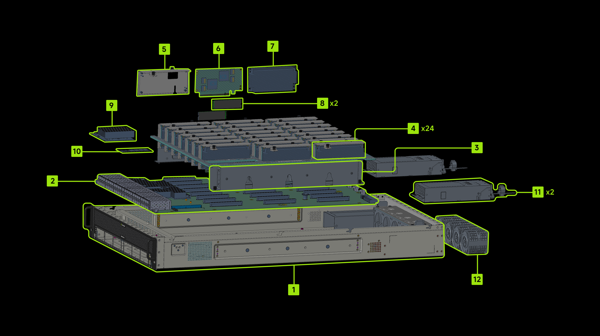

| No. | Component | No. | Component |
| :--- | :--- | :--- | :--- |
| 1 | Chassis | 2 | Mainboard |
| 3 | Compute Board Bracket | 4 | Compute Boards × 24 |
| 5 | Compute Board Handle Strip | 6 | Compute Board |
| 7 | Compute Board Heatsink | 8 | Compute Board NVMe SSD × 2 |
| 9 | Node Management Board with Heatsink | 10 | M.2 SATA Drive |
| 11 | Power Supply Modules × 2 | 12 | Fan Modules × 4 |

## Logical Structure

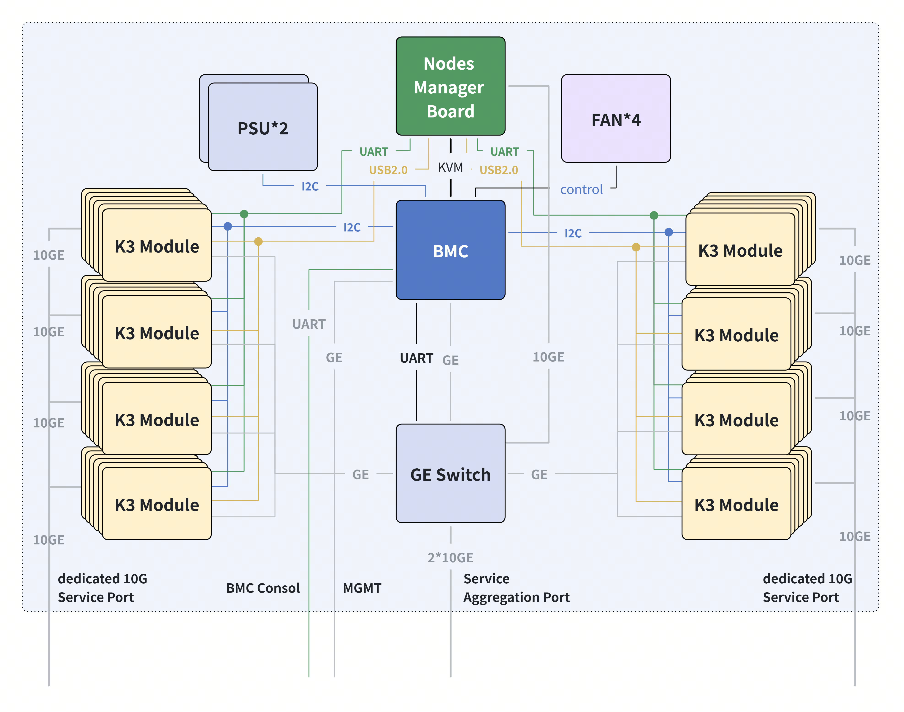

## Hardware

### Front Panel

**Front Panel Layout**

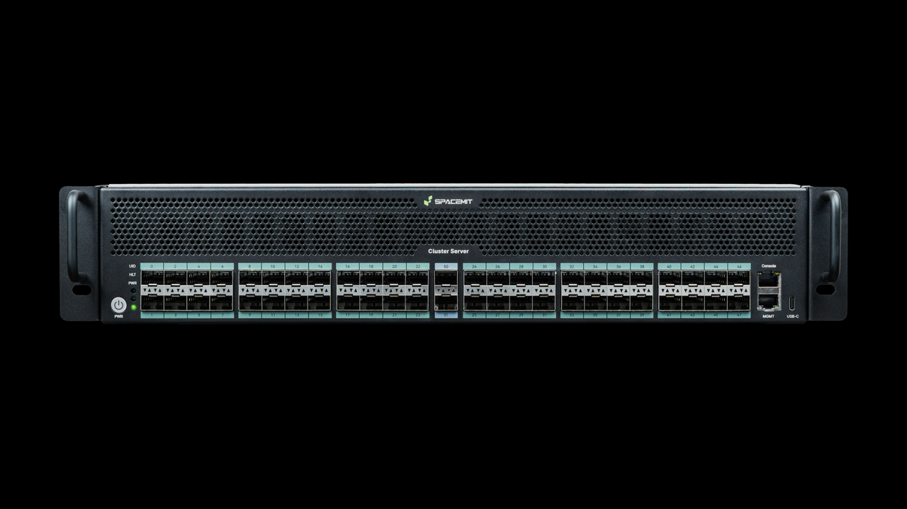

**Front Panel Indicators and Buttons**

|Indicators|Name|Description|
|---|---|---|
|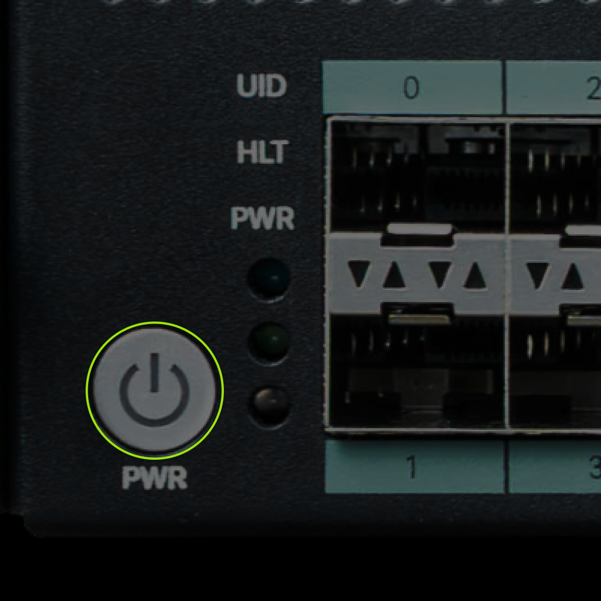|Power Button|- When AC power is connected and the server is in Standby mode, press briefly to power on the server. The Node Management OS, switching system, and all compute nodes enter the operating state. - When the server is powered on, press and hold the button for 6 seconds to force the Node Management OS, switching system, and all compute nodes to power off and return to Standby mode.|
||Power LED|- Off: Server is not powered.  - Blinking Amber: The BMC management system is starting. During this period, the Power button is locked and cannot be operated. BMC startup typically completes within approximately one minute, after which the LED changes to solid amber.  - Solid Amber: Server is in Standby mode.  - Solid Green: Server is powered on and operating normally.|
||Health Status LED|Normal: Off  Abnormal:  - Blinking Red (1 Hz): Major alarm.  - Blinking Red (5 Hz): Critical alarm.|
|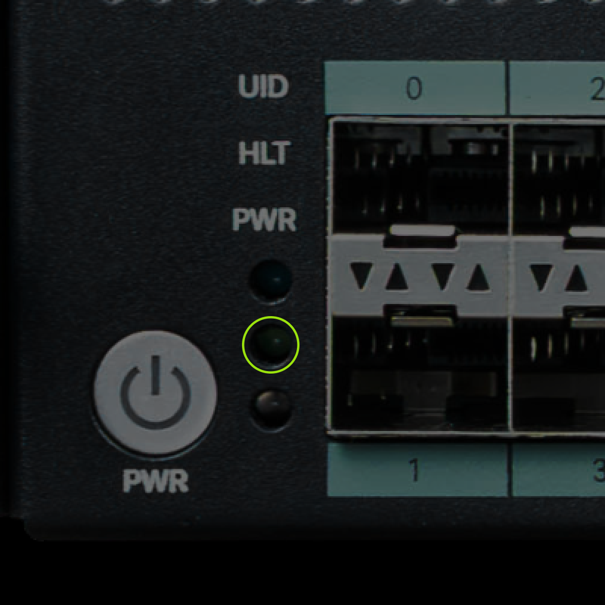|UID LED|- Off: The server is not being identified.  - Blinking Blue (for 255 seconds): The server is being identified.  - Solid Blue: The server has been identified.|
||High-Speed Network Port LED (ACT)|LINK/SPEED indicates link status and link speed:  - Solid Green: Link established at the highest supported speed.  - Solid Amber: Link established below the highest supported speed.  - Off: No link established.  ACT indicates network activity:  - Off: No data transmission.  - Blinking Green: Data is being transmitted. The blink rate increases with network activity.|
|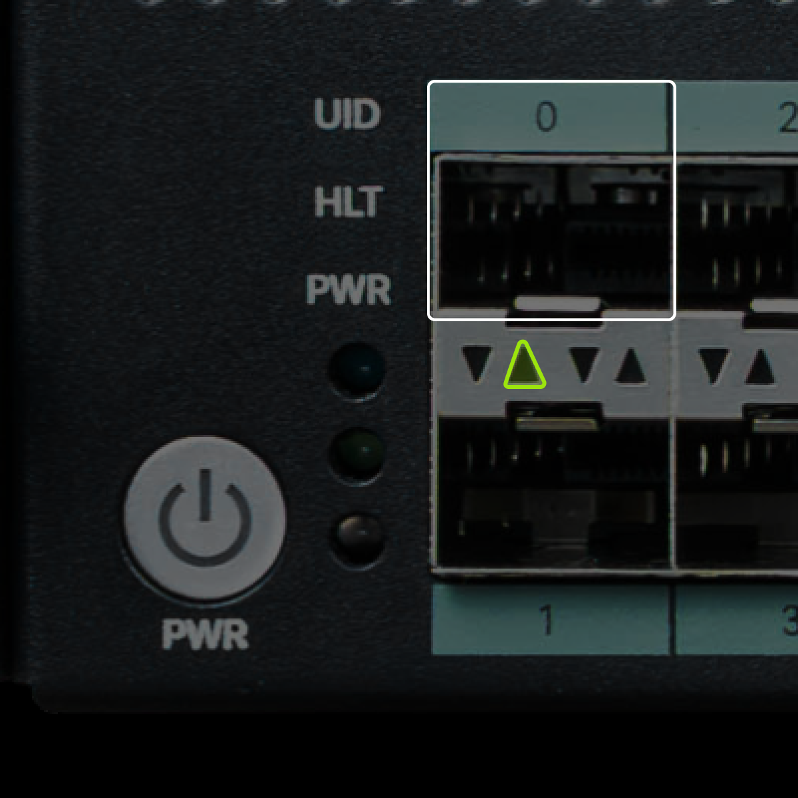|High-Speed Network Port LED (SPD)|Same as above|
||BMC Management Port LED|Same as above|

**Front Panel Connectors**

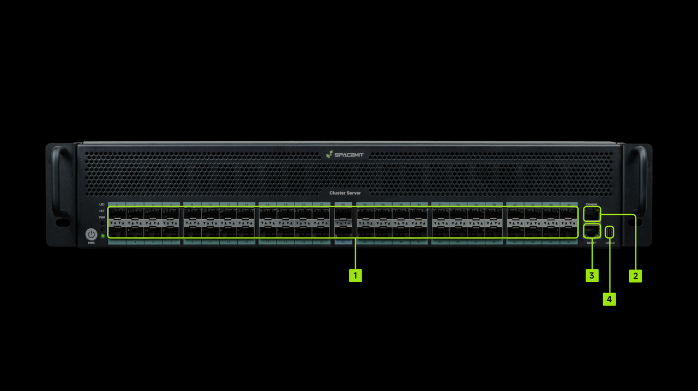

|No.|Connector|No.|Connector|
|---|---|---|---|
|1|High-Speed Network Ports|2|Debug Serial Port|
|3|Local openBMC Management Port|4|Node Management System Full-Function USB Port|

**Connector Description**

|Connector|Type|Qty.|Description|
|---|---|---|---|
|High-Speed Network Ports|SFP+|50|- Ports 0~47 correspond to the high-speed network interfaces of Compute Nodes 0~47.  - Ports 50 and 51 are the integrated switch uplink ports.|
|Debug Serial Port|RJ45|1|Used for debugging. By default, this port is assigned to the operating system serial console. It can be configured through the openBMC CLI as either the openBMC serial console or the switch management serial console.  Note: Uses a 3-wire serial interface with a default baud rate of 115200 bit/s.|
|Node Management Full-Function USB Port|Type-C|1|USB 3.0 Type-C full-function interface supporting DisplayPort (DP) output and a USB 3.2 host interface.  - Connect a DisplayPort monitor to view the boot screen, BIOS, and operating system display. - Connect USB storage devices, keyboards, mice, and other USB peripherals to the Node Management system.|
|Local openBMC Management Port|RJ45|1|Dedicated Ethernet management port for openBMC server management.  Notes:  - The management port is a Gigabit Ethernet interface supporting 100/1000 Mb/s auto-negotiation.  - Do not connect the openBMC management port to a PoE-enabled Ethernet port (for example, a PoE switch with PoE enabled). Doing so may result in communication failures or permanent damage to the management port.|

### Rear Panel

**Rear Panel Layout and Connectors**

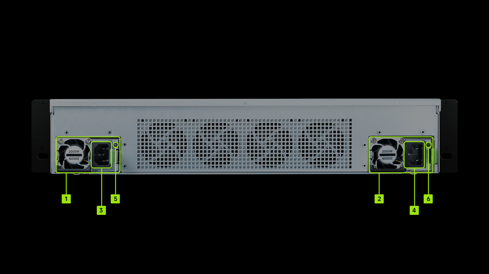

|No.|Module|No.|Module|
|---|---|---|---|
|1|Power Supply Module 1|2|Power Supply Module 2|
|3|Power Supply Module 1 AC Inlet|4|Power Supply Module 2 AC Inlet|
|5|Power Supply Module 1 Status LED|6|Power Supply Module 2 Status LED|

**LED**

|No.|Indicator|Status|Corrective Action|
|---|---|---|---|
|5/6|Power Supply Module Status LED|- Off: No AC input power.  - Solid Green: Input and output are operating normally.  - Blinking Green (1 Hz): AC input is normal, and the power supply is operating in SV12 mode.  - Blinking Green (2 Hz): Power supply firmware update in progress.  - Solid Amber: AC input is normal, but no output is present.  - Blinking Amber (1 Hz): A warning condition has been detected (for example, overtemperature or excessive output load), but the power supply continues to operate normally.|Solid Amber: Replace the power supply module.  Possible causes of no power output include: - Overtemperature protection activated. - Output overcurrent or short-circuit protection activated. - Short-circuit protection activated. - Output overvoltage protection activated. - Internal component failure (not all component failures are detectable).|

### Boards

**Mainboard**

| No. | Component | No. | Component |
| :--- | :--- | :--- | :--- |
| 1 | Node Management Board Connector | 2 | Compute Board Connector |
| 3 | Switch System Chipset | 4 | BMC Management Chipset |
| 5 | PSU0 Connector | 6 | PSU1 Connector |
| 7 | Fan Module 0 Connector | 8 | Fan Module 1 Connector |
| 9 | Fan Module 2 Connector | 10 | Fan Module 3 Connector |
| 11 | Button Cell Battery | 12 | CPLD Debug JTAG Connector |
| 13 | CMOS Header | 14 | BMC Debug Serial Port (3.3 V TTL) |

**Node Management Board**

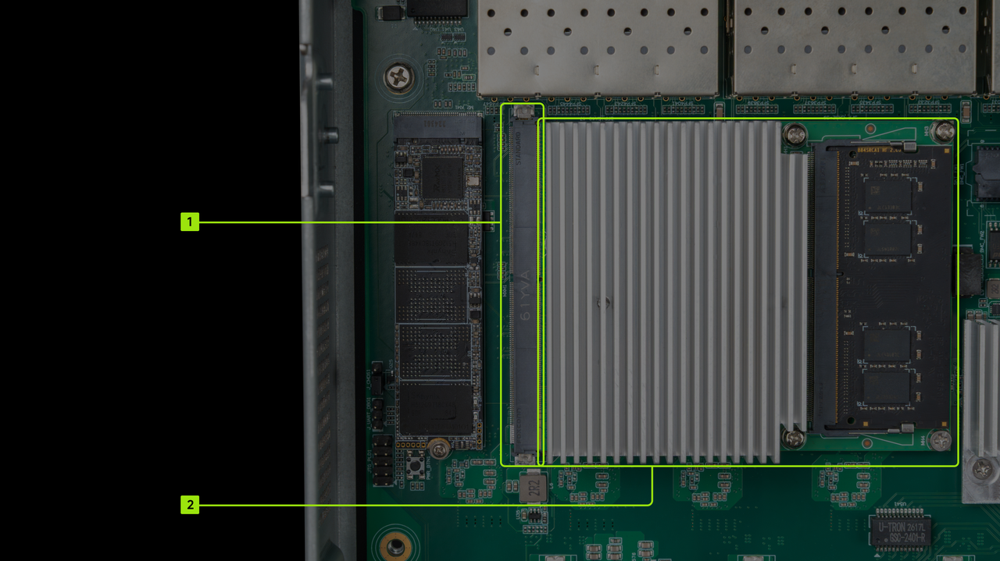

| No. | Component | No. | Component |
| :--- | :--- | :--- | :--- |
| 1 | Slot | 2 | Node Management Board |

- Supports one node management board.
- The board slot uses an MXM 3.1 interface. Node management boards of different specifications are available as options; refer to the component compatibility list for details.

**Compute Board**

- Supports up to 24 compute boards. Hot-swap of compute boards is not supported while the server is powered on; the server must be powered off before inserting or removing a compute board.
- The mainboard slot is a PCIe x16 slot with custom pin assignments modified from the standard PCIe x16 definition. In the pin table below, modified pins are highlighted in red; the original standard PCIe slot definitions are shown in blue. The module interface supports two independent single-channel compute nodes.
- Compute boards with different CPU generations can be mixed in the same chassis. Boards with different CPUs are distinguished by their on-board electronic label information.

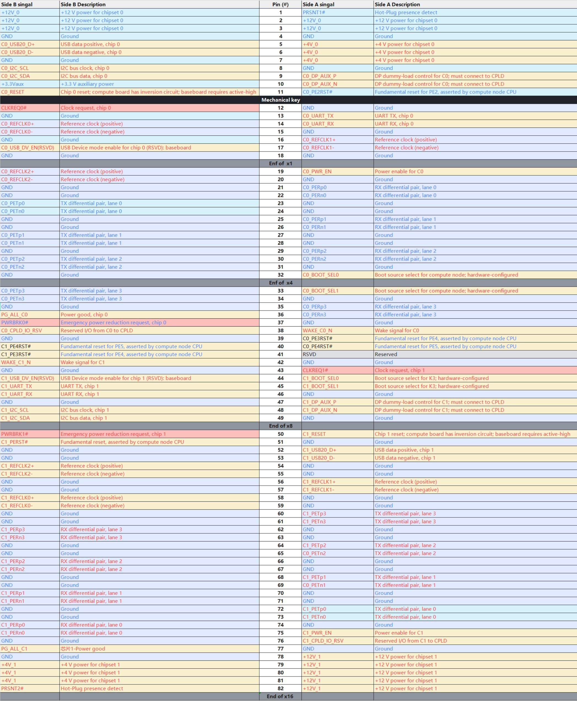

**Compute Board Numbering**

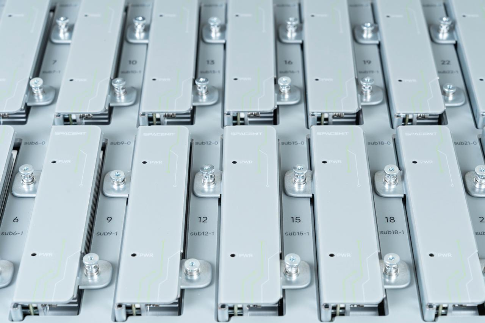

The RV2768 integrates 24 compute boards, numbered `sub0` through `sub23`. Each compute board (`sub*`) contains two compute nodes, identified as `sub*-0` and `sub*-1`, for a total of 48 compute nodes. In addition to the internal network, each compute node provides an independent external 10GE Ethernet interface. The following table maps compute nodes to their external network ports and identifies recommended board locations for partially populated systems to maintain cooling airflow efficiency.

| Compute Board No. | Compute Node No. | External Network Port No. | Recommended Installation Location for 8-Board Configuration | Recommended Installation Location for 16-Board Configuration |
| :---: | :---: | :---: | :---: | :---: |
| sub0 | sub0-0 | 0 | ✅ | ✅ |
| | sub0-1 | 1 | ✅ | ✅ |
| sub1 | sub1-0 | 2 | | ✅ |
| | sub1-1 | 3 | | ✅ |
| sub2 | sub2-0 | 4 | | |
| | sub2-1 | 5 | | |
| sub3 | sub3-0 | 6 | ✅ | ✅ |
| | sub3-1 | 7 | ✅ | ✅ |
| sub4 | sub4-0 | 8 | | ✅ |
| | sub4-1 | 9 | | ✅ |
| sub5 | sub5-0 | 10 | | |
| | sub5-1 | 11 | | |
| sub6 | sub6-0 | 12 | ✅ | ✅ |
| | sub6-1 | 13 | ✅ | ✅ |
| sub7 | sub7-0 | 14 | | ✅ |
| | sub7-1 | 15 | | ✅ |
| sub8 | sub8-0 | 16 | | |
| | sub8-1 | 17 | | |
| sub9 | sub9-0 | 18 | ✅ | ✅ |
| | sub9-1 | 19 | ✅ | ✅ |
| sub10 | sub10-0 | 20 | | ✅ |
| | sub10-1 | 21 | | ✅ |
| sub11 | sub11-0 | 22 | | |
| | sub11-1 | 23 | | |
| sub12 | sub12-0 | 24 | ✅ | ✅ |
| | sub12-1 | 25 | ✅ | ✅ |
| sub13 | sub13-0 | 26 | | ✅ |
| | sub13-1 | 27 | | ✅ |
| sub14 | sub14-0 | 28 | | |
| | sub14-1 | 29 | | |
| sub15 | sub15-0 | 30 | ✅ | ✅ |
| | sub15-1 | 31 | ✅ | ✅ |
| sub16 | sub16-0 | 32 | | ✅ |
| | sub16-1 | 33 | | ✅ |
| sub17 | sub17-0 | 34 | | |
| | sub17-1 | 35 | | |
| sub18 | sub18-0 | 36 | ✅ | ✅ |
| | sub18-1 | 37 | ✅ | ✅ |
| sub19 | sub19-0 | 38 | | ✅ |
| | sub19-1 | 39 | | ✅ |
| sub20 | sub20-0 | 40 | | |
| | sub20-1 | 41 | | |
| sub21 | sub21-0 | 42 | ✅ | ✅ |
| | sub21-1 | 43 | ✅ | ✅ |
| sub22 | sub22-0 | 44 | | ✅ |
| | sub22-1 | 45 | | ✅ |
| sub23 | sub23-0 | 46 | | |
| | sub23-1 | 47 | | |

### Internal Switch System

The Cluster Server integrates a Layer 3 management switch with 216 Gbps switching capacity. It supports 48 Gigabit Ethernet connections directly to the compute nodes, two pairs of 10GBase-R connections to the BMC and Node Management Board, and two 10GBase-R external uplink ports on the front panel.

**The switch supports the following features:**

**Layer 2 Switching and VLAN Features**
- Switching capacity and tables:
  - MAC address table: 32K entries (2 × 16K, 4-way hash).
  - Multicast table: 4K entries; supports a 16 Mbit packet buffer and jumbo frames up to 12 KB.
- VLAN features:
  - Supports 802.1Q and QinQ (4K VLANs, including IVL, SVL, and hybrid modes, with flexible inner and outer tag forwarding).
  - Supports Protocol VLAN (eight global configurations), MAC-based VLAN, and IP-subnet-based VLAN.
  - VLAN translation: 2K ingress and 1K egress translations; supports MAC-table-based N:1 VLAN translation.
  - Sixteen VLAN profiles for learning and unknown unicast/multicast flooding domains, plus port-based VLAN filtering.

**Layer 3 Routing and Advanced Features**
- IP routing: Supports IPv4 and IPv6 unicast and multicast routing, with up to 12K network routes and 12K host routes. Forwarding uses longest prefix matching (LPM).

The following figure shows the Cluster Server internal switch system connections.

**Management Subnet Topology**

The BMC connection to the internal switch GE port retains access only to the 10GE port corresponding to the Node Management Board and is isolated through VLANs, as shown below.

> Note: The BMC cannot directly access the service network, including the K3 service network.

**Service Subnet Topology (Default State; Configurable)**

1. In the default state, the Node Management Board, all compute nodes (K3 Nodes), and the switch's two 10G uplink ports can communicate freely with one another.
   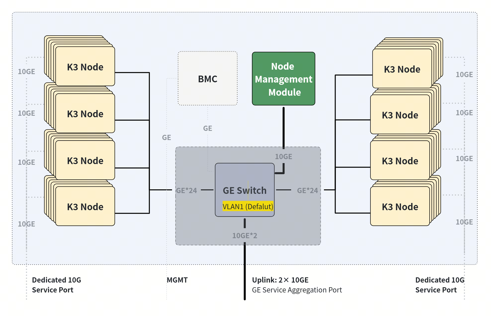

2. In the user-configured state, selected K3 Nodes can be assigned to an independent VLAN to form a logical subnet. Other K3 Nodes cannot access this logical subnet, as shown below.

   K3 Nodes 0 to 5 are assigned to a logical subnet. K3 Nodes 0 to 5 can communicate with the Node Management Board, but cannot communicate with other K3 Nodes.
   

### Power Supply Modules

The Cluster Server uses CRPS (Common Redundant Power Supply) standard redundant power modules. Two power supply modules are configured to provide 1+1 redundancy. The system supports a maximum output power of 2000 W, ensuring continued operation in the event of a single power supply failure and improving system availability.

| Parameter | Specification |
| :--- | :--- |
| Power supply specification | CRPS (Common Redundant Power Supply) |
| Number of power supply modules | 2 (1+1 redundancy) |
| Input voltage | 100–240 V AC |
| Output power | 2000 W |
| Output voltage | 12 V |
| Redundancy mode | 1+1 redundancy |

### Fan Modules

Fan specifications (at an ambient temperature of 25°C):

| Parameter | Specification |
| :--- | :--- |
| Rated voltage | 12 V |
| Rated current | 10.3 A |
| Rated power | 123.6 W |
| Speed | Inlet side: - Virtual speed: 34,000 ±10% RPM - Actual speed: 26,400 ±10% RPM Outlet side: - Virtual speed: 34,000 ±10% RPM - Actual speed: 20,700 ±10% RPM |

Four 6056 fan modules are supported.
- N+1 redundancy is supported, allowing the server to operate normally if a single fan or rotor fails.
- Intelligent fan-speed adjustment is supported.
- Fan modules installed in the same server must have the same P/N code.
- Fan module installation locations:

## Specifications

| Module | Item | Description |
| :--- | :--- | :--- |
| **Physical** | Form Factor | 2U rackmount |
| | Dimensions | 87.4 mm × 447.6 mm × 816.8 mm |
| | Compute Modules | Up to 24 modules, each with 2 K3 nodes, independently serviceable |
| | Compute Nodes | Up to 48 physically isolated nodes, each independently manageable and maintainable |
| **Compute Node** | CPU Cores | 8 × X100 cores per K3, SPECint2006 > 9.0/GHz, up to 2.4 GHz |
| | AI Cores | 8 × A100 cores per node, 60 TOPS @INT4 |
| | RAM | LPDDR5, 8 / 16 / 32 GB options, up to 6400 MT/s |
| | ROM | NVMe SSD (PCIe 3.0 x4), 64 / 128 / 256 GB, optional UFS |
| | Networking | 1GE port for internal management network, 10GE port for external connectivity |
| | Features | PXE boot, remote access, debugging, and upgrade |
| **Switch System** | External Ports | 2 × 10GbE SFP+ and 48 × 10GbE SFP+ |
| | Topology | Network connectivity between compute node interfaces, sideband management ports, and external ports |
| **System (Chassis)** | Power | 2000 W / 3000 W PSU (Platinum/Titanium), hot-swappable, 1+1 redundancy |
| | Cooling | 4 fans |
| | Installation | L-type rail support |
| **Management** | System Management | Unified multi-node module management and integrated switch management, with a dedicated front GE management port for full fault monitoring and operations |
| | Node Management | Power control, reset, firmware configuration, serial debug, and remote console |
| **Software** | OS | Optional pre-installed mainstream Linux distributions |
| | Software Platform | Cluster management, distributed computing, AI agent clusters |
| **Operating Conditions** | Temperature | 5°C–40°C (41°F–104°F), ASHRAE A1/A2/A3 compliant |
| | Humidity | 8%–90% |

## System Management Platforms

| Platform | Front-End Illustration | Core Functions |
| :--- | :--- | :--- |
| Cluster Server Cluster Management System | 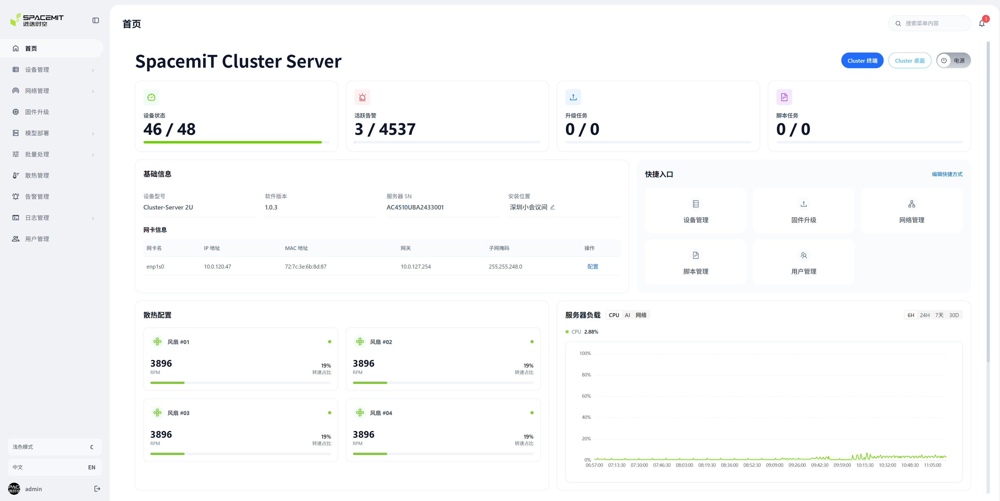 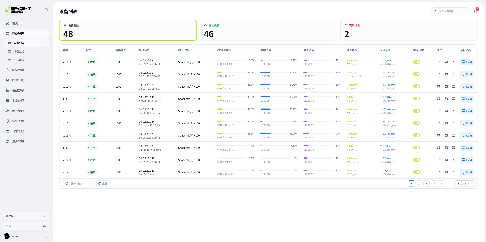 | - Management of 48 compute modules - Power control and reboot operations for individual compute nodes - SSH, serial console, KVM, and file operations for compute modules - Batch firmware upgrades - Compute-node monitoring and alarms - Batch deployment of large language models - Network configuration for switch management modules - Batch script execution - Server thermal management - Log auditing - API support |
| Cluster Flow Distributed Computing Platform | 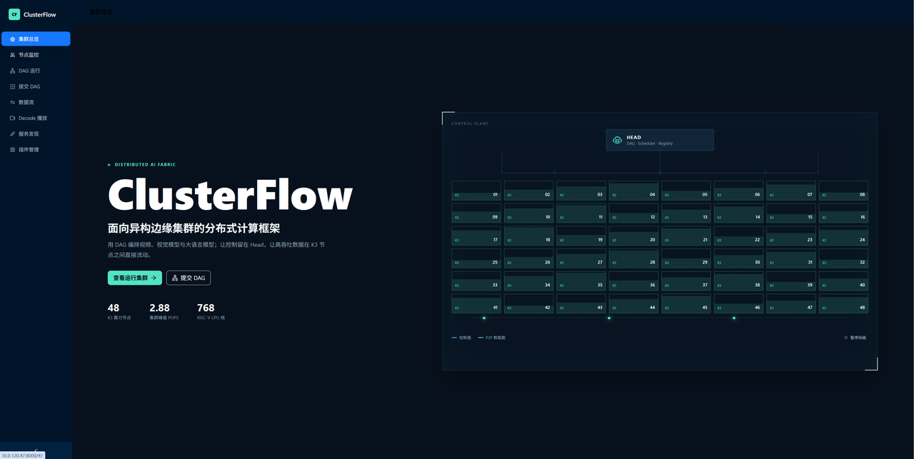 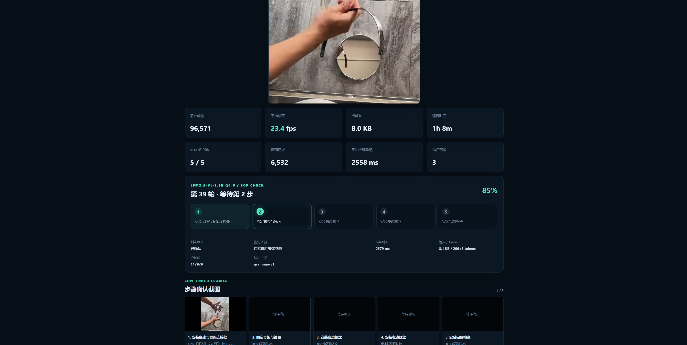 | - DAG orchestration engine - Intelligent scheduler for maximum node utilization - Plugin system for modular compute workloads - Process isolation and sandbox management with data-file isolation between compute units - Proprietary DataFrame protocol for maximum utilization of node communication bandwidth - Automatic node discovery - Support for VLM, YOLO, and other model plugins - Plugin development SDK that allows development to focus on compute logic - Built-in SOP behavior-analysis demo |
| Cluster Agent Intelligent Agent Cluster Platform | 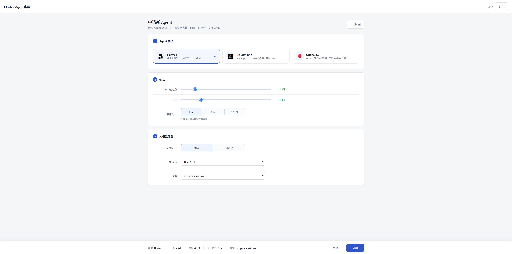 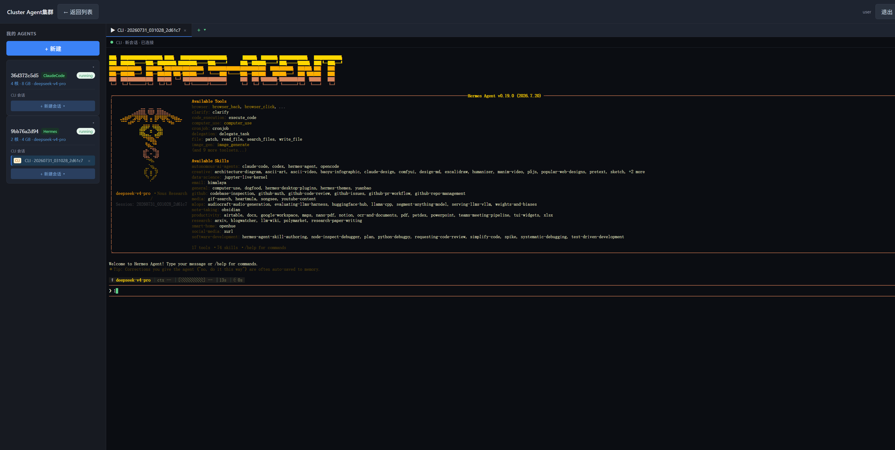 | - Request one or more intelligent agents in three steps - Preconfigured Hermes, Claude Code, and other agents for immediate use - Built-in large language model interfaces requiring no additional configuration - Dynamic resource scheduling through K3S virtualized containers - Dynamic adjustment of CPU cores and memory allocated to requested agents - Backend management software for Agent clusters spanning multiple Cluster Servers |

