# MUSE Book用户使用指南

## 产品简介

MUSE Book 是一款搭载进迭时空 8 核 RISC-V AI-CPU M1的笔记本电脑，同时是全球首款可量产的 RISC-V 笔记本电脑。MUSE Book 是进迭时空的生态产品之一，基于 RISC-V 架构的硬件设计，预装 Bianbu 操作系统和开源软件，旨在为所有 RISC-V 的热爱玩家、创新型开发者、技术爱好者、研究人员等提供更高效便捷的本地RISC-V开发平台。

M1 芯片是进迭时空 K1 芯片的高性能版本。M1 芯片集成了八核进迭时空 RISC-V X60核，提供 50KDMIPS 算力和融合 2Tops AI 算力，可实现与所有主流 AI 生态的快速对接；支持 4K H.265/H.264/VP9/VP8 等编解码格式；支持 3D 图像引擎，OpenCL 3.0/OpenGLES 3.2/Vulkan 1.3。

除了搭载进迭时空M1芯片外，MUSE Book 还有以下特征：

一、任性快充， 双USB-C接口皆可支持PD3.0充电协议  
二、全场景AI开发，搭载高清1080P摄像输入、双扬声器和MEMS麦克风  
三、搭载38Wh电池，支持至多8h+的续航时间使用  
四、既是Book也是Pi，专属MUSE开发者接口，与外界互连到芯片级输入输出引脚，含I2C/UART/PWM/JTAG/GPIO等信号  

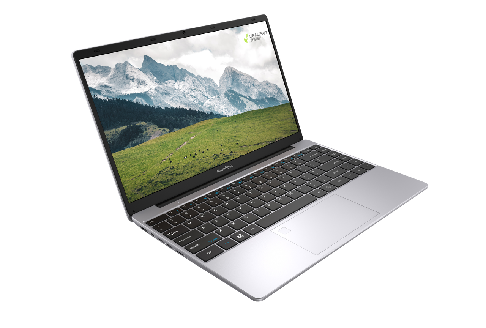

**参考方案框图**：  
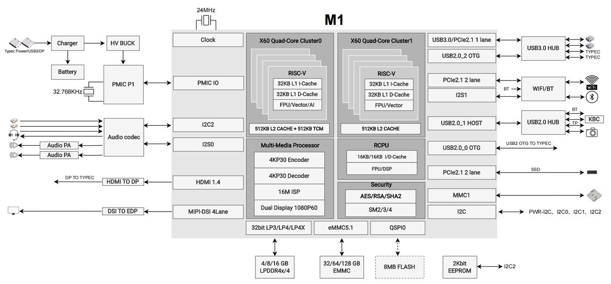

## 产品规格

### 规格参数：

| 项目 | 参数 |
|------|------|
| **处理器** | SpacemiT M1，8核64位RISC-V处理器, 融合2.0 TOPS AI算力 |
| **显示** | 支持双屏显示：  自带14.1寸IPS屏，1080P@60Hz，全彩RGB，250nits亮度  支持DP Type-C接口，最高支持1080P@60Hz |
| **内存** | LPDDR4X，2400MT/s速率，可选配8GB/16GB容量 |
| **本地存储** | NVMe SSD，可选配128GB/256GB/512GB容量 |
| **扩展存储** | TF卡接口，支持UHS-Ⅱ模式存储卡 |
| **无线通讯** | 支持Wi-Fi6＆BT5.2 |
| **USB接口** | 2路USB3.0 Type-A host接口 1路USB3.0 Type-C 全功能接口，满足USB PD快充、DP显示和超高速数据传输 1路USB3.0 Type-C OTG接口，同时支持USB PD快充 |
| **调试接口** | MUSE特色8Pin开发者接口，附带2个内嵌按键，用于硬件复位和升级 |
| **人机交互** | 集成1080P FHD高清摄像头 内置双麦克风和立体扬声器 标配全键位键盘和触摸板，部分型号选配指纹模组 |
| **外观形态** | 金属机身，322.6*209.2*17.8mm尺寸，仅1360g重 |
| **操作系统** | 支持Bianbu Desktop、Ubuntu、OpenKylin、Deepin等操作系统 |
| **供电系统** | 内置38Wh容量7.6V智能电池，支持PD3.0快充，产品配带65W适配器 |

**接口示意**：  
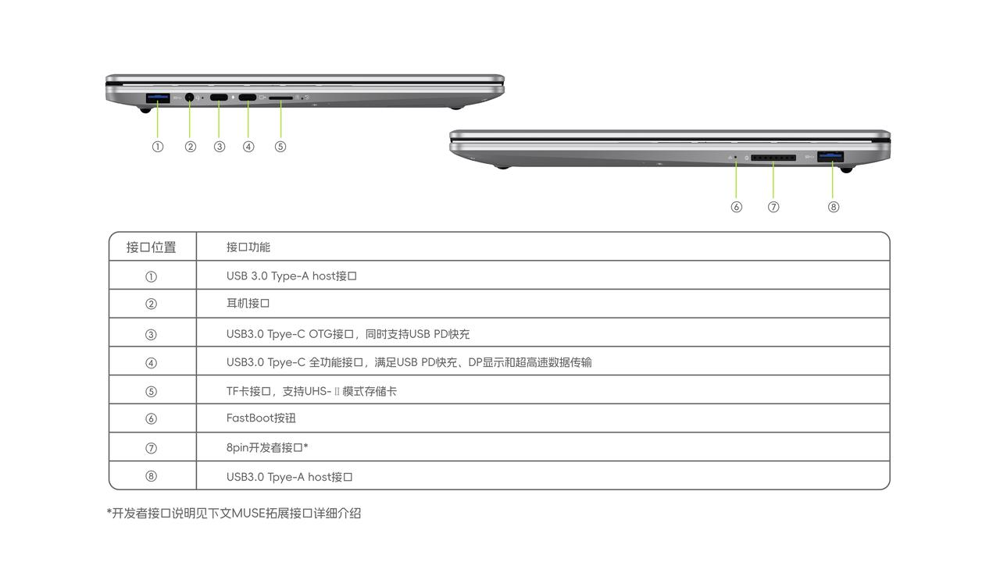

## 硬件优势

## 独有MUSE拓展接口：

专为开发者设计的笔电外置接口，接口采用2.54mm 规格排母，引出芯片 UART/PWM/GPIO/JTAG 等信号，使开发者无需拆机使用常规杜邦线即可与主控连接通信，并可支持DIY各种外设传感器。  
配合“Fastboot”和“Reset”按钮，即可完成便捷刷机和开发。

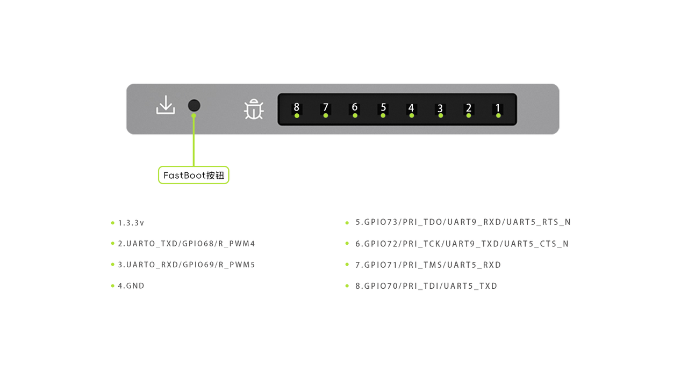

### 自定义键盘：

- 键盘表面特殊喷油处理，敲击手工更细腻顺滑  
- F1、F2快捷键为复制粘贴键，一键实现复制（Ctrl+C）粘贴（Ctrl+V）  
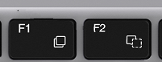

- F11为自定义编程快捷键，可在设置的键盘里灵活配置快捷功能或脚本  
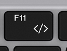

- 更适合开发者的键盘布局，方便开发者更好的移动和查看代码  
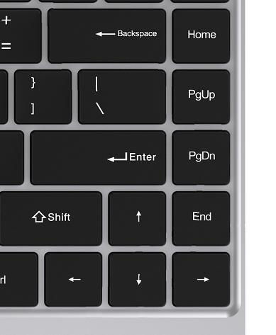

### 触摸板：

防指纹超润滑手感的玻璃触控板，贴合手指的舒适设计，支持多指触控

### 屏幕：

- 14寸窄边框设计，屏占比高达约84%，在书写代码的过程中，能在一屏中看见更多的内容，减少手动翻页的频率  
- 采用1080P全高清，100%sRGB高色域，及250nits高亮度屏

### 摄像头：

- 1080P FHD高清摄像头，在人像画面清晰真切的同时，可完全满足人物姿势识别、物体识别等AI视觉识别应用开发

### 电池：

- 4800mAh智能电池，支持PD3.0 Type-C快充技术，配合65W原装适配器多设备适用，120分钟可充电至80%

### 接口：

- 配备高速USB接口，轻松响应外设连接需求；  
- 支持双屏联动，一线扩屏＆充电，视野扩宽，开发更简洁高效；  
- 双USB-C接口皆可支持PD3.0充电协议，任意一个快充接口都可以连接充电器，实现对设备充电。

### 重量＆体积：

- 采用金属机身（A、D），具有强耐腐蚀和抗冲击能力，坚固耐用。圆枕边缘设计，表面细腻喷漆处理，外观更加美观大方，质感十足，手感舒适。  
- 支持180°大开合，轻至1.3kg，薄至17.8mm

### 无风扇设计：

超大散热片配合进迭时空M1 RISC-V高效能CPU，无风扇加持也能轻松保障CPU性能的持久输出，构建舒适的开发创作环境。

## 初次设置

### 使用前准备

MUSE Book是笔记本电脑形态，通常您可以直接运行使用它，无需任何外设。  
如您想更完善的使用它，建议您可以添加以下设备：

#### 电源适配器

MUSE Book采用USB-PD3.0协议Type-C接口供电/充电。为达到最佳性能效果，建议您选用MUSE Book原装的电源适配器。

| 产品 | 支持的PD协议电压/电流 |
|------|------------------------|
| 原装电源适配器 | 20V＝2A、12V=3A、9V=3A、5V=3A |
| MUSE Book | 65W USB-C |

当电源适配器正常插入整机，电池正在充电状态时，侧边的充电灯会绿色闪烁；当电池充满时，侧边的充电灯会绿色常亮。

#### 键盘＆鼠标：

您可以使用MUSE Book上的任一USB端口连接有线键盘/鼠标或USB接收器，或者通过蓝牙的方式连接键鼠。  
请注意：靠近屏幕的Type-C口不支持USB2.0外设作为从设备，您的键盘/鼠标可能无法通过该口正常使用。

#### 显示器：

MUSE Book除支持内置屏幕的显示外，还支持扩展屏幕。可通过机身左侧靠近TF卡槽的Type-C口进行DP协议的音视频信号传输。  
同时，如显示器的Type-C接口还支持反向充电，能够实现一线连（一根Type-C线同时进行屏幕扩展显示和充电）  
扩屏后有以下四种状态可供您选择（按F8快捷键可以便捷切换）：镜像（复制）、拼接（扩展）、仅显示内置显示屏、仅显示外部显示屏。

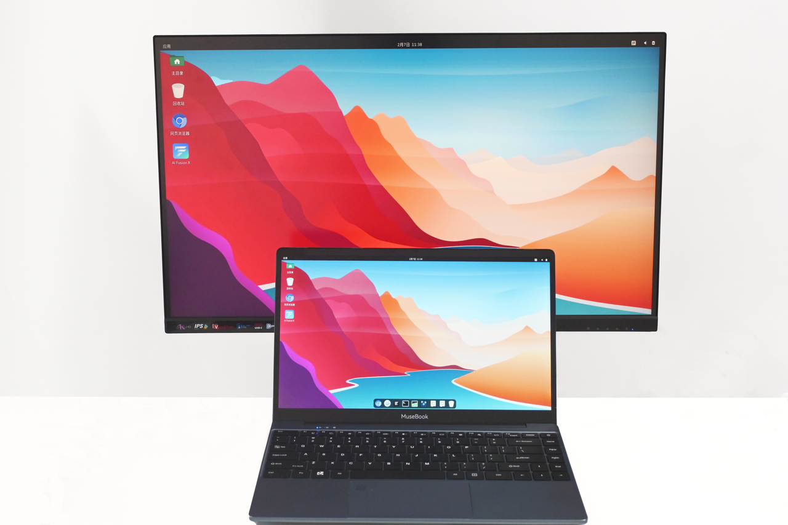

#### 音频：

MUSE Book通过内置麦克风和喇叭即可进行音频输入和输出，除此之外，您可以使用位于笔记本电脑机身左侧的3.5mm耳机孔连接音频外部设备，此时内置的麦克风和喇叭音频会切换至音频外设。  
Type-C接口支持音视频同时传输。  
您可以通过声卡设置，切换内置声卡（ES8326）或HDMI声卡。

#### 网络连接：

MUSE Book支持无线Wi-Fi和蓝牙的连接。  
MUSE Book不支持有线RJ45网口，但您仍可以通过USB转RJ45网口直接与网线连接。

## 开始启动

打开您的LCD屏幕面板：  
直接翻开显示屏（如图），调整转轴的角度以获得最合适的视觉效果。

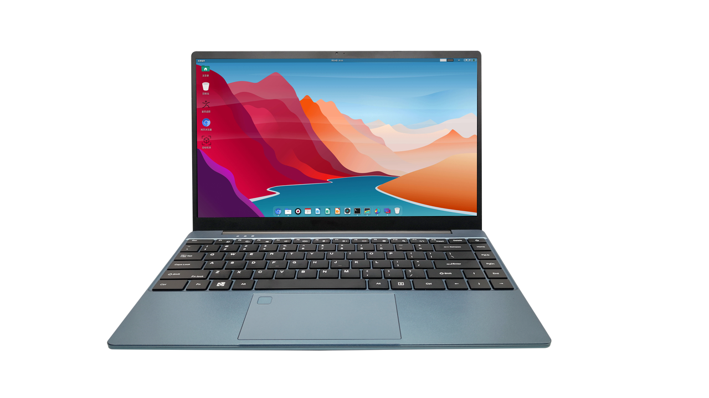

电源按钮①长按一秒后，笔记本电脑开机运行，蓝色电源指示灯亮起，在此之前请确保计算机已连接电源适配器或电池电量足够。  
当您在进入系统之后，关闭盖子，系统自动触发休眠模式，减少运行功耗；此时打开盖子，电源按钮①按压一秒即可唤醒系统。

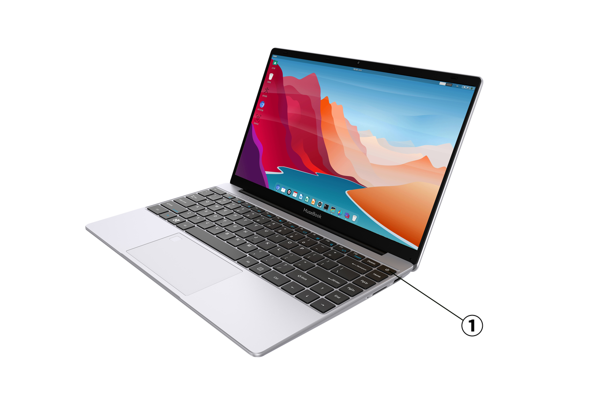

## 使用键盘快捷方式

**常用按键快捷功能（默认Fn lock 状态）**

| 按键 | 功能 |
|------|------|
| F1 | 复制 |
| F2 | 粘贴 |
| F3 | 静音 |
| F4 | 音量减 |
| F5 | 音量加 |
| F6 | 亮度减 |
| F7 | 亮度加 |
| F8 | 扩屏选项 |
| F9 | 触摸板开关 |
| F10 | 搜索 |
| F11 | 可编程自定义快捷键 |

### MUSE Book首次启动配置指引

您的MUSE Book会预装进迭时空Bianbu操作系统，将在首次启动时运行配置向导。您需要显示器、键盘、鼠标来浏览向导。

#### 系统语言：

此页面帮助您配置系统的语言，默认显示English和中文，如需更多语言，可点击下方三个点，弹出更多选项。

#### 输入法：

此页面帮助您配置系统的键盘布局和输入法

#### 无线上网：

此页面帮助您连接到WiFi网络，从列表中选择您的网络并进行连接；如暂未有合适WiFi网络，可在左上角选择跳过该设置

#### 位置服务：

此页面可选择是否打开位置服务，如打开位置服务可便捷您的使用体验，但相应的可能会带来位置隐私泄露的风险

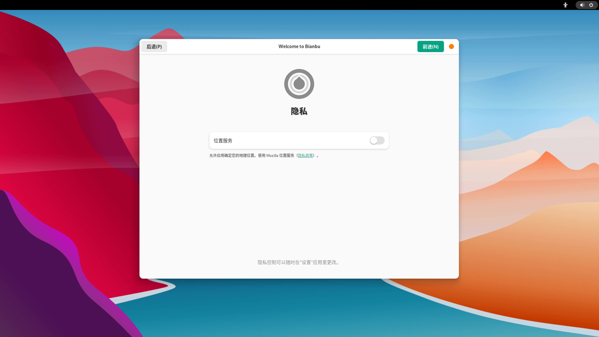

#### 时区：

此页面帮助配置您所在时区信息，联网状态下系统能够自动同步相应时区时间，可以搜索城市来添加设置

#### 设置您的用户名和密码：

该页面帮助您设置用户名和密码，请牢记您的密码

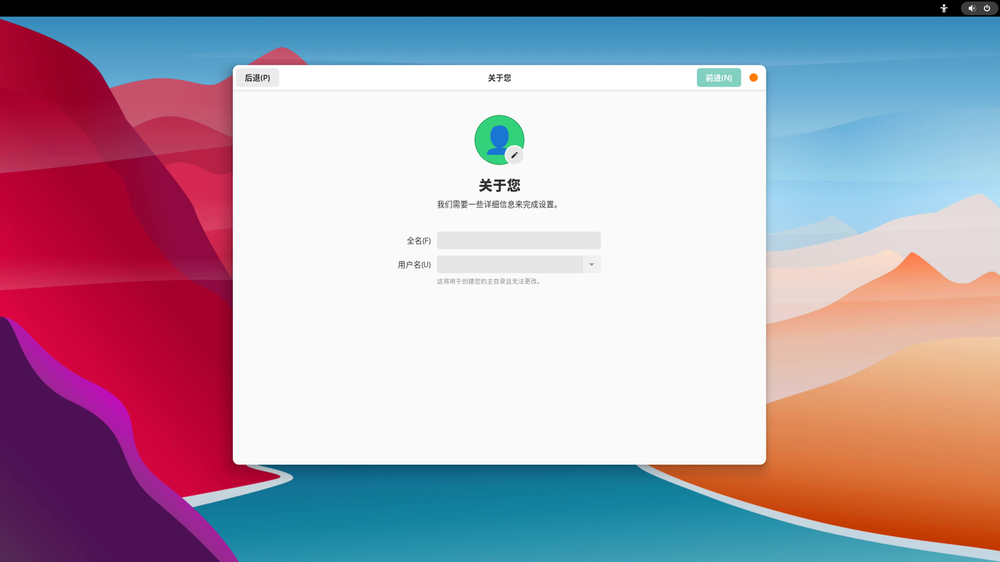  

#### 配置完成

配置完成，点击“开始使用Bianbu”吧，后可进入桌面

## 刷入固件

### 进入刷机模式

可选用以下两种方式进入下载模式：

1）通过卡针按住机身右侧暗孔中的Fastboot按钮（⑥号接口）来执行开机；  
2）通过在终端执行：`reboot fastboot`（推荐）

然后通过MUSE Book的Type-C接口（此处必须选用③号OTG接口）与（PC）上位机进行USB连接，通过进迭时空官方刷机工具Titan或者fastboot命令即可进行刷机操作。

 

### 固件下载和安装

#### Bianbu

**Bianbu简介**：  
Bianbu是进迭时空针对RISC-V架构的处理器做了深度优化的操作系统，MUSEBook适用于并出厂预装Bianbu Desktop版本

**Bianbu网站**：  
如需获取更多Bianbu相关信息，详见：[Bianbu](https://bianbu.spacemit.com/)

**Bianbu desktop固件下载地址**：[https://archive.spacemit.com/image/k1/version/bianbu/](https://archive.spacemit.com/image/k1/version/bianbu/)

**Bianbu desktop固件的安装和升级**, 详见：[系统升级](https://bianbu.spacemit.com/user_guide/upgrade/)

## 串口调试

### 接口连接：

上位机经USB转TTL设备与MUSE Book拓展接口第2（TX）、3（RX）、4（GND）正常连接。拓展接口信号如图：

### Windows 调试：

以“MobaXterm”为例：  
首先，请正确连接硬件串口，并确认在设备管理器的端口中有COM口的显示，如图：

打开“MobaXterm”软件，选择“Sessions”——“New Session”，在弹出的对话框中，选择“Serial”，"Serial port"选择上图中识别到的对应COM口，“Speed”波特率选择“115200”，最后点击“OK”，即可进入打印页面

  

## 蓝牙使用建议

## 蓝牙扫描

1. 打开蓝牙设置界面后，蓝牙自动扫描设备，半分钟后停止扫描；  
2. 如果需重新扫描设备，请关闭设置界面后重新打开；

### 蓝牙连接

蓝牙设备出现未知错误时，可通过以下步骤修复；  
1. 移除出错的蓝牙设备连接；  
2. 重新扫描设备，配对设备；  
3. 连接设备成功后，关闭蓝牙设置界面；

### 蓝牙传输

蓝牙传输速率、带宽和稳定性跟以下环境因素相关：  
1. 障碍物的阻挡；  
2. 距离超出有效范围；  
3. 同时运行的其他无线设备；  

当出现传输文件失败、音频播放断续等现象，可排查以上三类环境因素。