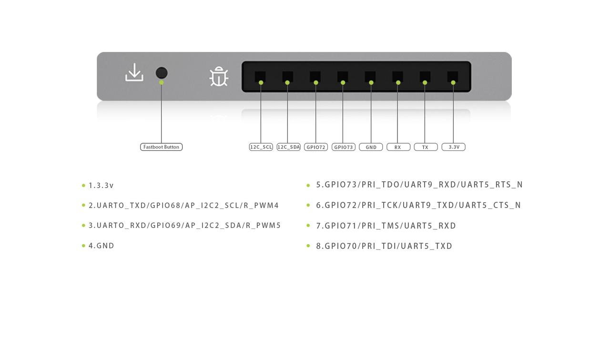

# MUSE Book User Guide

## Introduction

MUSE Book is a laptop equipped with the SpacemiT 8-core RISC-V AI-CPU M1, and it is the world's first mass-produced RISC-V laptop. MUSE Book is one of the ecological products from SpacemiT, designed basing on RISC-V architecture, with pre-installed the Bianbu operating system and open-source software. It aims to provide a more efficient and convenient local RISC-V development platform for RISC-V devotee, innovative developers, tech enthusiasts, and researchers.  
M1 is a high-performance version of the SpacemiT K1. It integrates 8 RISC-V X60 cores, offering 50K DMIPS computing power and 2 TOPS AI computing power, enabling quick integration with all mainstream AI ecosystems. It supports 4K H.265/H.264/VP9/VP8 encoding and decoding formats, and features a 3D graphics engine with OpenCL 3.0, OpenGLES 3.2 and Vulkan 1.3 support.  
In addition to the SpacemiT M1, the MUSE Book comes with the following features:  
- Narrow Bezel Design  
  The B-side features a 100% sRGB full HD matte screen  
- Fanless Design  
  Thanks to the energy efficiency of the M1 chip, the entire machine adopts a fan-less passive thermal design  
- Lightweight & Thin Design  
  Weight of only 1.3 kg and thickness of 17.8 mm  
- Special 8-Pin Development Interface  
  Featuring a 2.54mm pitch connector with I2C, UART, PWM, GPIO, and JATG signals; compatible with DuPont wires for easy connection, enabling direct debugging and DIY projects with Raspberry Pi peripherals.  
- Support for dual Type-C PD 3.0 fast charging  
- Equipped with a 1080P HD camera, dual speakers, and a microphone, making it convenient for AI applications  
- Equipped with a 38Wh battery, supporting more than 8 hours battery life  


The reference solution block diagram of MUSE Book is depicted below.  


## Specifications

| Category             | Item                        | Specification  |
|----------------------|-----------------------------|----------------|
| System Main Control  | CPU                         | SpacemiT M1, 8-core, RISC-V CPU, integrated 2 TOPs AI computing power                                                       |
| Display              | Expansion Display Interface | Type-C interface (DP signal), supporting up to 1080P @ 60Hz output                                                          |
| Memory               | Type                        | LPDDR4X, 2666MT soldered                                                                                                    |
|                      | Maximum Capacity            | 16GB                                                                                                                        |
| Storage              | Interface                   | M.2 2280 Key M ×1, PCIe (NVMe)                                                                                              |
|                      | Maximum Capacity            | 1TB (SSD)                                                                                                                   |
| Screen               | Size/Type                   | 14.1 inches, IPS                                                                                                            |
|                      | Resolution                  | 1920×1080@60Hz, 16:9                                                                                                        |
|                      | Color Gamut                 | 72% NTSC（≈100% sRGB）                                                                                                      |
|                      | Brightness                  | 250 nits                                                                                                                    |
| Wireless             | Type                        | WiFi/BT module soldered                                                                                                     |
|                      | Wireless Card IC            | RTL8852BE                                                                                                                   |
|                      | Protocols                   | Support for Wi-Fi 6 & BT 5.2                                                                                                |
| I/O Interfaces       | Left Side                   | - Type-C ×1 (U3G1 data transfer, including U2 OTG, PD fast charging)<br>- Full-function Type-C ×1 (U3G1 data transfer, PD fast charging, DP video signal)<br>- 3.5mm headphone jack ×1<br>- TF card slot ×1<br>- USB 3.0 Type-A ×1<br>- Restart button (hidden) |
|                      | Right Side                  | - USB 3.0 Type-A ×1<br>- Fastboot button (hidden, supporting long press to enter Fastboot mode)<br>- Expansion interface (1× 8Pin, 2.54mm pitch connector, I2C/UART/PWM included, etc.) |
| Audio/Video          | Video                       | 1080P FHD HD Camera                                                                                                         |
|                      | Audio                       | ES8326B, dual microphones & speakers                                                                                        |
| Appearance           | Dimensions                  | 322.6 × 209.2 × 17.8 mm                                                                                                     |
|                      | Material                    | Metal (A, D), Plastic (B, C)                                                                                                |
|                      | Weight                      | 1360g                                                                                                                       |
| Software Features    | System                      | Bianbu OS, Ubuntu OS, Linux OS                                                                                              |
|                      | Browser                     | Chromium                                                                                                                    |
| Power                | Power Input                 | PD3.0 Type-C fast charging, original adapter: 65W                                                                           |
|                      | Battery                     | 38Wh, 7.6V power supply                                                                                                     |
| Convenience          | Fingerprint Module          | Optional                                                                                                                    |

**Interface ports**：  


## Hardware Advantages

## Unique MUSE Expansion Interface

Designed specifically for developers, this laptop's external interface uses a 2.54mm pitch connector, allowing access to signals such as I2C, UART, PWM, GPIO, and JTAG, without needing to open the device. Developers can easily connect and communicate with the main control unit using standard DuPont wires, and it supports DIY various peripheral sensors.
With the "Fastboot" and "Reset" buttons, convenient flashing and development can be completed easily.


### Custom Keyboard

- The keyboard features a special spray oil treatment on the surface, providing a more refined and smooth typing experience.
- F1 and F2 serve as copy and paste keys, similarly to the key combination Ctrl+C and Ctrl+V respectively.


- F11 serves as a customizable programming shortcut key, allowing users to flexibly configure shortcut functions or scripts in the keyboard settings.  


- The keyboard layout is optimized for developers, facilitating easier navigation and code visibility.  


### Touchpad

The glass touchpad features anti-fingerprint, ultra-smooth texture, providing a comfortable design that fits the fingers and supports multi-finger touch gestures.

### Display

- The 14-inch narrow bezel design offers an impressive screen-to-body ratio of approximately 84%. This allows developers to view more content on a single screen while coding, reducing the frequency of manual page turns. 
- Featuring 1080P full HD resolution, 100% sRGB high color gamut, and 250 nits brightness

### Camera

- The 1080P FHD camera provides clear and vivid images, fully supporting development for AI visual recognition application, such as pose detection, and object recognition.

### Battery

- The 4800mAh smart battery supports PD3.0 Type-C fast charging technology. Paired with a 65W original adapter, it is compatible with multiple devices and can charge to 80% in just 120 minutes.

### Interfaces

- Equipped with high-speed USB Interfaces to easily meet peripheral connection needs
- Support for dual-screen linkage, allowing for simultaneous expansion and charging, widening the field of view for simpler and more efficient development
- The dual Type-C PD3.0 fast charging ports allow either port to connect to the charger for device charging

### Weight & Dimensions

- Metal body (A and D sides) featuring strong anti-corrosion and impact resistance. 
- Rounded edge design with finely sprayed surface treatment for enhanced aesthetic appeal and tactile quality. 
- Support for 180° hinge opening, with a weight of only 1.3kg and a thickness of just 17.8mm

### Fanless Design

With a large heat sink paired with the advanced M1 RISC-V efficient CPU, the fanless design ensures sustained CPU performance output, creating a comfortable development environment.

## Initial Setup

### Preparation Before Use

The MUSE Book is in the form of a laptop thus user can typically run it directly without any peripherals. However, for a more satisfactory experience, it is recommend adding some devices as per following subsections.

#### Power Adapter

The MUSE Book uses a USB-PD3.0 protocol Type-C interface for power supply/charging. To achieve optimal performance, it is advisable to use the original power adapter designed for the MUSE Book as tabled below.

| Items | Supported PD Protocol Voltage/Current |
|------|------------------------|
| Original Power Adapter | 20V＝2A、12V=3A、9V=3A、5V=3A |
| MUSE Book | 65W USB-C |

When the power adapter is properly connected to MUSE Book and the battery is charging, the charging light on the side will blink green. When the battery is fully charged, instead, the charging light will remain solid green.


#### Keyboard & Mouse

User can connect a wired keyboard/mouse or USB receiver to any USB port on the MUSE Book, or connect them via Bluetooth.

**Note.** The Type-C port near the screen does not support USB 2.0 peripherals as host devices, so user's keyboard/mouse may not function properly through that port.

#### Display

The MUSE Book supports not only its built-in screen but also external displays. User can transmit audio and video signals via the Type-C port located on the left side, near the TF card slot, which supports DP protocol.
Additionally, if the monitor's Type-C port supports reverse charging, user can achieve a one-cable connection (a single Type-C cable can be used for both display extension and charging).
After extending the display, user has the following four modes to choose from (switching between them is easy by pressing the F8 shortcut key):
- Mirror (Duplicate)
- Extend (Splice)
- Show only built-in display
- Show only external display


#### Audio

The MUSE Book utilizes its built-in microphone and speakers for audio input and output. Additionally, user can connect external audio devices using the 3.5mm headphone jack located on the left side of the laptop. When connected, the audio will switch from the built-in microphone and speakers to the external audio device.
The Type-C port supports simultaneous audio and video transmission.
User can switch between the built-in sound card (ES8326) and the HDMI sound card through the sound card settings.


#### Network Connection

The MUSE Book supports wireless Wi-Fi and Bluetooth connection. 
The MUSE Book doesn't support wired network port RJ45, but user can still connect directly to an Ethernet cable using a USB to RJ45 adapter.

## Start Up

Just simply lift the screen and adjust the hinge angle to achieve the best viewing experience with MUSE Book as shown below.


Long press the power button ① for one second to turn on MUSE Book 
The blue power indicator will light on. Please ensure that the MUSE Book is connected to the power adapter or that the battery has sufficient charge before powering on.
Once entered MUSE Book, closing the lid will automatically trigger sleep mode, reducing power consumption. To wake up MUSE Book, just simply open the lid and press the power button for one second.
Some useful keyboard shortcuts for the MUSE Book are tabled below.


**Common Key Shortcuts**
(Default Fn Lock Status)

| Keys | Function |
|------|------|
| F1 | Copy |
| F2 | Paste |
| F3 | Mute |
| F4 | Volume Down |
| F5 | Volume Up |
| F6 | Decrease Brightness |
| F7 | Increase Brightness |
| F8 | Display Options |
| F9 | Touchpad Toggle |
| F10 | Search |
| F11 | Programmable Custom Shortcut Key |

### Configurations At The First Boot

The MUSE Book comes with the pre-installed Bianbu desktop operating system, which will run the configuration wizard at the first boot. User should use a monitor, keyboard and mouse to navigate through the wizard for performing the required initial settings.

#### System Language

Choose the system language. English and Chinese are displayed by default. If need more language options, just click the three dots below to show them.


#### Input Method

Configure the MUSE Book’s keyboard layout and input method.


#### Wireless Internet Connection

Select a valid Wi-Fi network from the list and connect it. If there is no suitable Wi-Fi network, skip this setting by clicking on the upper right corner.


#### Location Services

Turn on location services can facilitate the usage experience, but it may also bring risks of location privacy leakage. Please be aware and careful!


#### Time Zone

Configure user time zone information. While online (i.e. Wi-Fi connected), the system can automatically synchronize the corresponding time zone, then user can search for cities to add settings


#### Username & Password Account

Set username and password account.

  


#### Configuration Completed

When the configuration is completed, click “Start using Bianbu” thus MUSE Book will enter the desktop of Biandu OS.


## Firmware Flashing

### Enter Flash Mode & Start Flashing Process

You can enter download mode using either of the following methods:

1. Use a SIM-eject tool to press and hold the Fastboot button located inside the small hole on the right side of the device (Interface ⑥) while powering it on.

2. Execute the following command in the terminal (recommended):

```
reboot fastboot
```

After entering download mode, connect the device to the host PC via the Type-C port on MUSE Book (you must use the OTG port, Interface ③).
You may then flash the firmware using the official Spatial Era flashing tool Titan or the fastboot command.

 


### Firmware Download and Installation

### Bianbu

Bianbu OS is an operating system that has been deeply optimized by SpacemiT for advanced RISC-V architecture processors. MUSE Pi is suitable for and pre-installed with Bianbu OS Desktop version. At the same time, MUSE Pi is suitable for Bianbu OS NAS version.

For more information about Bianbu OS, please visit [Bianbu](https://bianbu.spacemit.com/)

For Bianbu OS desktop/NAS firmware download, please visit [https://archive.spacemit.com/image/k1/version/bianbu/](https://archive.spacemit.com/image/k1/version/bianbu/)

**Note.** The firmware package containing the word NAS is the firmware of Bianbu OS NAS.

## Serial Port Debugging

### Interface Connection

To establish a serial debugging connection, connect the host computer to the MUSE Book's expansion interface as shown below.



### Debugging Under Windows OS
Let’s take the “MobaXterm” software tool as example.
Firstly, please connect the hardware serial port correctly and confirm that there is a COM port displayed in the port list of the device manager, as shown below.


Open the "MobaXterm" software tool then select "Sessions" - "New Session" **(1)** in the screen appearing. In the pop-up dialog box appearing,

- Select "Serial" **(2)**
- Select the corresponding COM port identified above for "Serial port" **(3)**
- Select "115200" for "Speed" **(4)**
- Click "OK" **(5)**

as shown below.

  

Thus the print page will be entered as shown below.


## Bluetooth Usage Recommendations

## Bluetooth Scanning

- After opening the Bluetooth settings interface, Bluetooth will automatically scan for devices and will stop scanning after half a minute
- If it is necessary to rescan for devices, please close the settings interface and reopen it.

### Bluetooth Connection

If an unknown error occurs with a Bluetooth device, user can follow these steps to fix it:
1. Remove the problematic Bluetooth device connection
2. Rescan for devices and pair them again
3. After successfully connected the device, close the Bluetooth settings interface

### Bluetooth Transmission

Bluetooth transmission speed, bandwidth and stability are related to the following environmental factors:
- Obstructions blocking the signal
- Distance exceeding the effective range
- Other wireless devices operate simultaneously
If experiencing issues such as file transfer failures or audio playback interruptions, please check the environmental factors just mentioned above.