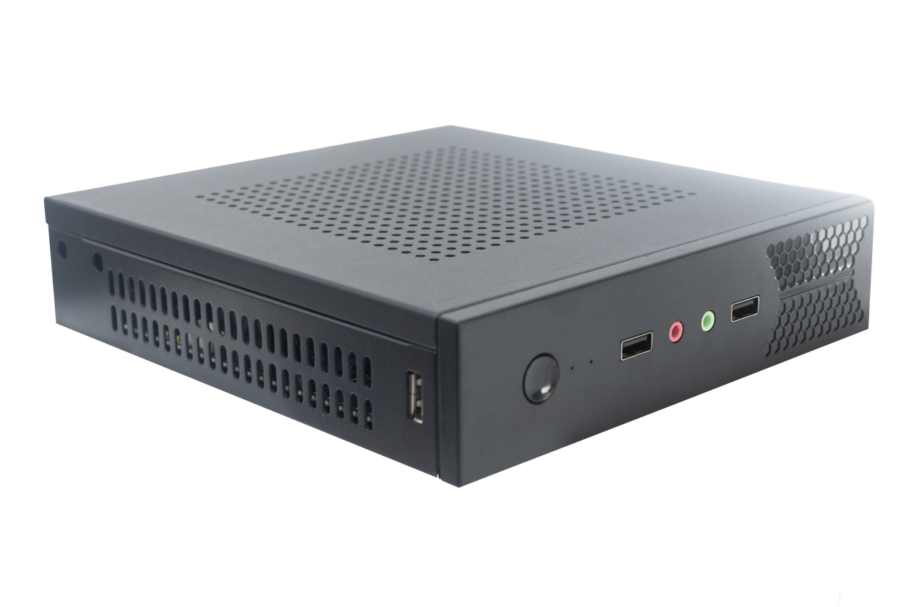
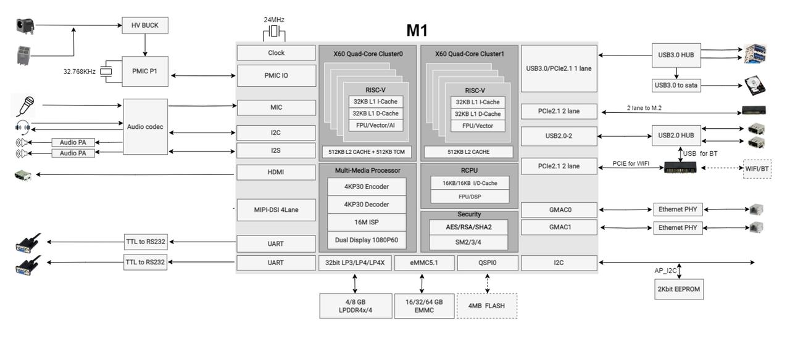
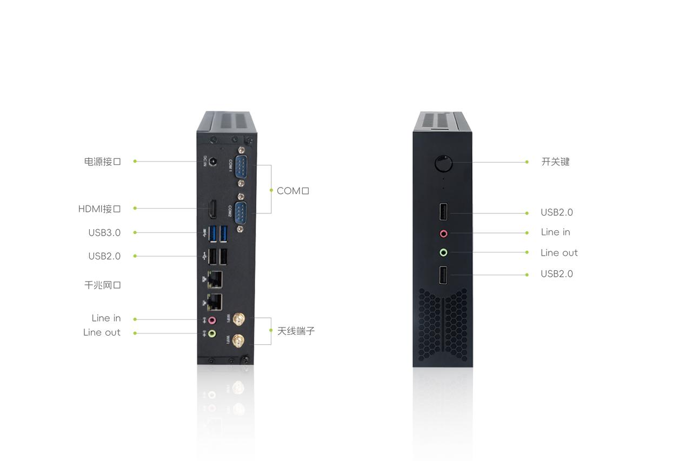
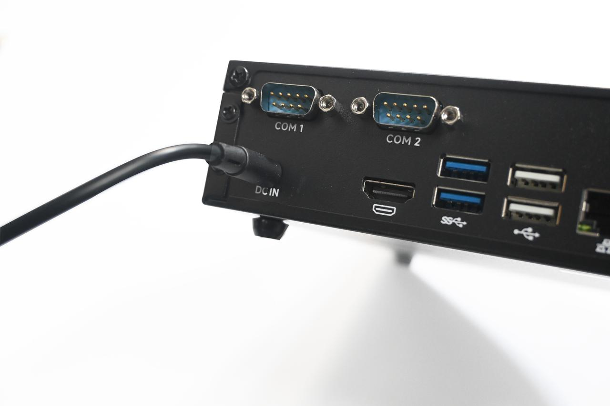
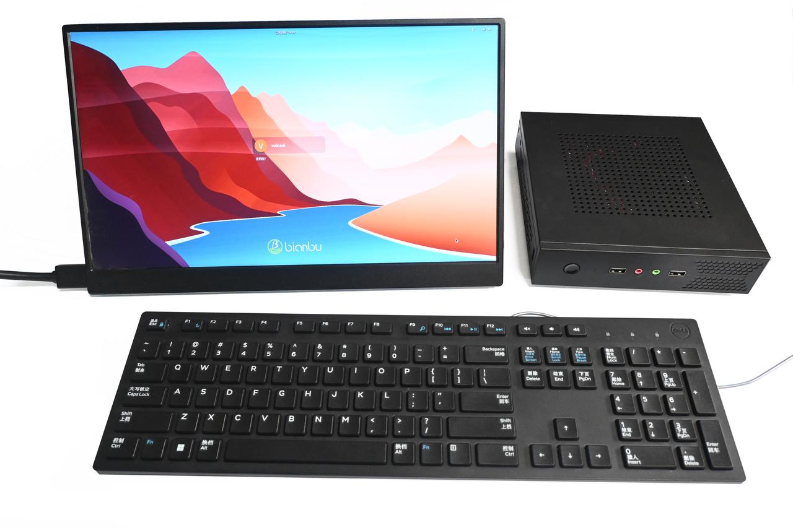
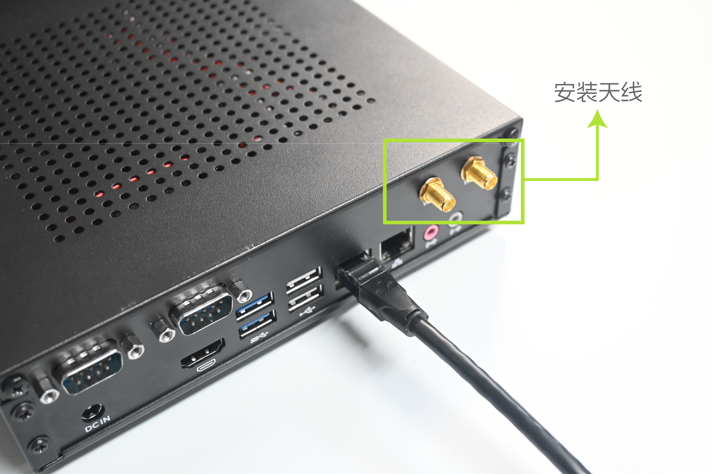
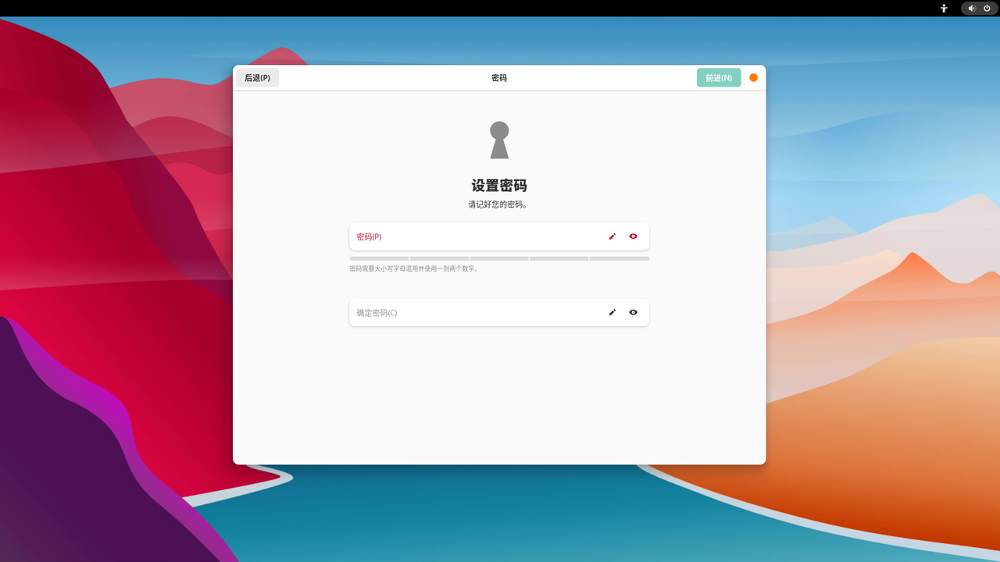
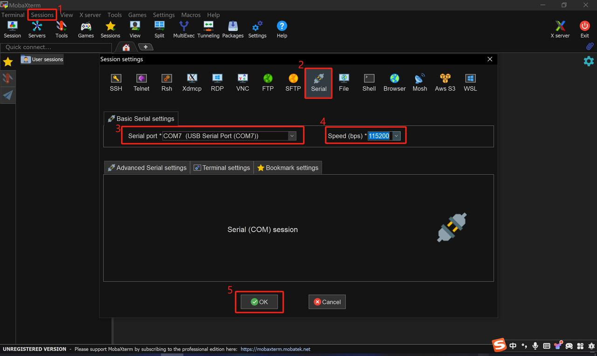

sidebar_position: 2

# MUSE Box User Guide

## 产品简介

MUSE Box 是针对开发者设计的RISC-V迷你主机，主板采用标准的MINI-ITX尺寸设计，集成丰富的扩展接口和插针，无风扇设计，搭配进迭时空M1芯片。M1芯片是进迭时空K1芯片的高性能版本。M1芯片集成了八个进迭时空RISC-V X60核，提供50KDMIPS算力和融合2TOPS AI算力，可实现与所有主流AI生态的快速对接；支持4K H.265/H.264/VP9/VP8等编解码格式；支持3D图像引擎，OpenCL 3.0/OpenGLES 3.2/Vulkan 1.3。  

**产品逻辑框图**：  

## 产品规格

**处理器**  
SpacemiT M1，8核64位RISC-V处理器, 提供50KDMIPS CPU算力和2.0 TOPS AI算力  

**显示**  
HDMI输出，最高支持1080P@60Hz  

**内存**  
LPDDR4X，2666MT/s速率，16GB容量  

**本地存储**  
eMMC 5.1，32GB容量  

**扩展存储**  
- M.2 2280 M-Key连接器，可装配 NVMe SSD，最高容量支持1TB；  
- SATA接口，可装配1个SATA硬盘；  

**无线通讯**  
NGFF M.2 E-Key双天线无线网卡，RTL8852BE芯片组，支持Wi-Fi6＆BT5.2  

**后面板**  
2.5/5.5 DC IN*1，HDMI*1，USB2.0 Type-A*2（下方口为OTG口），USB3.0 Type-A*2，RJ45（1000M）*2，3.5mm Line in*1＆Line out*1，RS232 COM口*2  

**前面板**  
USB2.0 Type-A*2，3.5mm Line in*1＆Line out*1  

**音频插针**  
1组9pin插针， 2 x 5-1 2.54mm规格  

**USB插针**  
2组USB2.0插针（含4组U2信号），2组USB3.0插针  

**COM插针**  
2组9pin 插针，2 x 5-1 2.54mm 规格，RS232规范  

**开机键＆指示灯插针**  
1组9pin插针，2 x 5-1 2.54mm 规格   

**尺寸**  
机身为185*45*197mm，主板为170*170mm Mini-ITX规格尺寸  

**材质**  
全金属  

**重量**  
932g  

**系统**  
Bianbu OS、Ubuntu、Linux  

**浏览器**  
Chromium  

**电源输入**  
12V，2.5/5.5 DC JACK供电接口   
主板支持4Pin ATX DC IN  

**接口示意**：  
  

# 硬件优势

**无风扇设计，高效散热**：  
散热片配合进迭时空M1 RISC-V高效能CPU，无风扇加持也能轻松保障CPU性能的持久输出，构建舒适的开发、工作、娱乐环境  

**精巧灵动，坚固耐用**：  
- 1.6L轻巧体积，同时支持显示器壁挂，释放更多桌面等空间  
- 整机重量仅0.93KG，轻松“手”握  
- 机身采用全金属，具有强耐腐蚀和抗冲击能力，坚固耐用  

**高速内存，超大存储**：  
- 采用 LPDDR4X-2666Mhz高速内存，最高支持16GB，高速加载，带来更快的软件本地运行效率  
- 最高支持1TB PCIe SSD存储，同时还可扩展SATA机械硬盘，更大的储存空间、更快的响应速度  

**全高清输出**：  
- 支持全高清显示输出，提高工作效率的同时画面更加清晰细腻  
  - 1 x HDMI （最高支持1920*1080Hz@60Hz）  

**无线连接**：  
- 内置M.2 2230 Key E无线模块，搭载PCIe 高速双频WiFi6和蓝牙5.2，远距离无线传输，信号更畅通，网络连接更快更稳  

**接口**：  
- 双RS232 COM口（DB9）  
- 配备多组高速USB接口，轻松响应外设连接需求；  
- 双千兆网口  

## 初次设置

### 使用前准备

MUSE Box是单主机形态产品，您需要连接必要的外设来使用它。

#### 电源适配器

MUSE Box采用12V DC IN接口供电，您需使用包装随附电源适配器来进行供电。  
将电源适配器尾端和DC IN接口相连接。  

#### 键盘＆鼠标：

您可以使用MUSE Box上的任一USB端口连接有线键盘/鼠标或USB接收器，以及通过蓝牙的方式连接键鼠。  

#### 显示器：

MUSE Box需要通过外置显示器将画面显示出来。MUSE Box支持HDMI视频接口，因此您可以连接带有HDMI视频接口的显示器。  

#### 音频：

MUSE Box可以通过HDMI信号在显示器上进行音频的输出。  
除此之外，您还可以使用机身前侧或者后侧的3.5mm音频输入输出孔来连接音频外设。  
您可以通过声卡设置，切换音频孔声卡（ES8326）或HDMI声卡。  
[图片](./static/box_audio.PNG)

#### 网络连接：

MUSE Box支持有线RJ45网口，您可以通过RJ45网口直接与网线连接，如连接单根网线，两个网口可任选其一。  
MUSE Box支持无线WiFi和蓝牙的连接，请在使用前，取出包装随附的两根天线并安装在对应的天线孔。  

## 开始启动

提前连接您的所需要的外设，并按下启动按钮：  
将设备通过视频连接线连接到HDMI显示器，同时连接上键盘和鼠标。  
最后连接上电源线，并通电即可开机。（首次通电即开机，若软件关机后，需短按蓝色灯左侧的电源按钮1S即可开机）计算机运行后，蓝色的电源指示灯会亮起。  

## 首次启动时配置您的 MUSE Box

您的MUSE Box会预装进迭时空Bianbu desktop操作系统，将在首次启动时运行配置向导。您需要显示器、键盘、鼠标来浏览向导。

**系统语言**：  
此页面帮助您配置系统的语言，默认显示English和中文，如需更多语言，可点击下方三个点，弹出更多选项。  

**输入法**：  
此页面帮助您配置系统的键盘布局和输入法  

**无线上网**：  
此页面帮助您连接到WiFi网络，从列表中选择您的网络并进行连接；如暂未有合适WiFi网络，可在左上角选择跳过该设置  

**位置服务**：  
此页面可选择是否打开位置服务，如打开位置服务可便捷您的使用体验，但相应的可能会带来位置隐私泄露的风险  

**时区**：  
此页面帮助配置您所在时区信息，联网状态下系统能够自动同步相应时区时间，可以搜索城市来添加设置  

**设置您的用户名和密码**：  
该页面帮助您设置用户名和密码，请牢记您的密码  
  

**配置完成**  
配置完成，点击“开始使用Bianbu”吧，后可进入桌面  

## 刷入固件

### 进入刷机模式

旋转并解锁机身后面的两颗螺丝后，往后推盖子即可将上盖打开并看见和使用主板。  
  
按住主板内的Fastboot（烧录）按钮，并按住reset按钮重启，即可进入刷机模式。  
此时通过MUSE Box的Type-A（位于机身后端USB2.0接口的下口为OTG口），与上位机进行USB连接，通过进迭时空官方刷机工具Titan或者fastboot命令即可进行刷机操作  
注意：请使用USB数据线刷机  

### 固件下载和安装

**Bianbu**  

**Bianbu简介**：  
Bianbu是进迭时空针对RISC-V架构的处理器做了深度优化的操作系统，MUSEBook适用于并出厂预装Bianbu Desktop版本  

**Bianbu网站**：  
如需获取更多Bianbu相关信息，详见：[https://bianbu.spacemit.com/](https://bianbu.spacemit.com/)  

**Bianbu desktop固件下载地址**：[https://archive.spacemit.com/image/k1/version/bianbu/](https://archive.spacemit.com/image/k1/version/bianbu/)  

**Bianbu desktop固件的安装和升级**：[https://bianbu.spacemit.com/user_guide/](https://bianbu.spacemit.com/user_guide/)  

## 串口调试 

### 接口连接：

上位机经USB转TTL设备与MUSE Box主板接口的TX、RX、GND正常连接。接口信号如图：  

### Windows调试：

以“MobaXterm”为例：  
首先，请正确连接硬件串口，并确认在设备管理器的端口中有COM口的显示，如图：  
  

打开“MobaXterm”软件，选择“Sessions”——“New Session”，在弹出的对话框中，选择“Serial”，"Serial port"选择上图中识别到的对应COM口，“Speed”速率选择“115200”，最后点击“OK”，即可进入打印页面  
  
