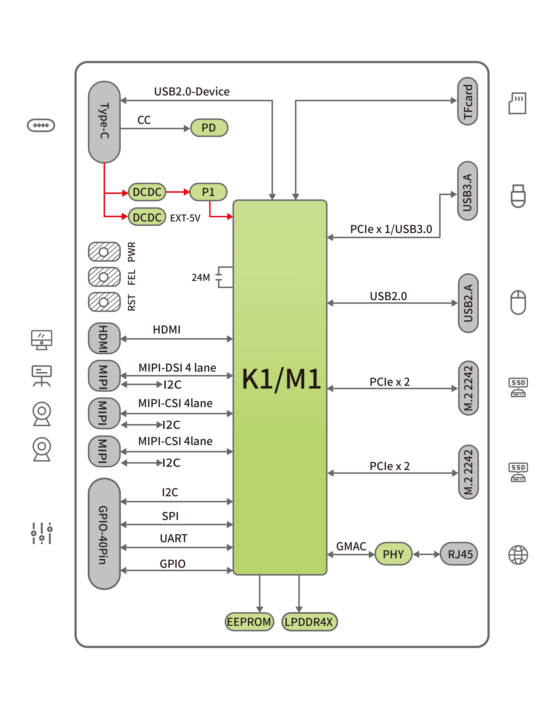
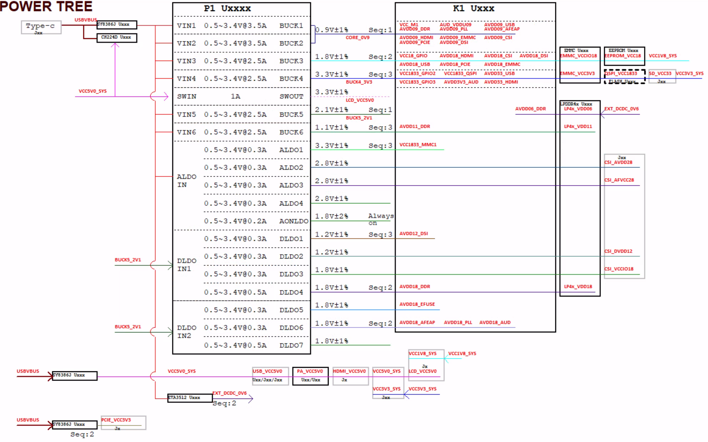
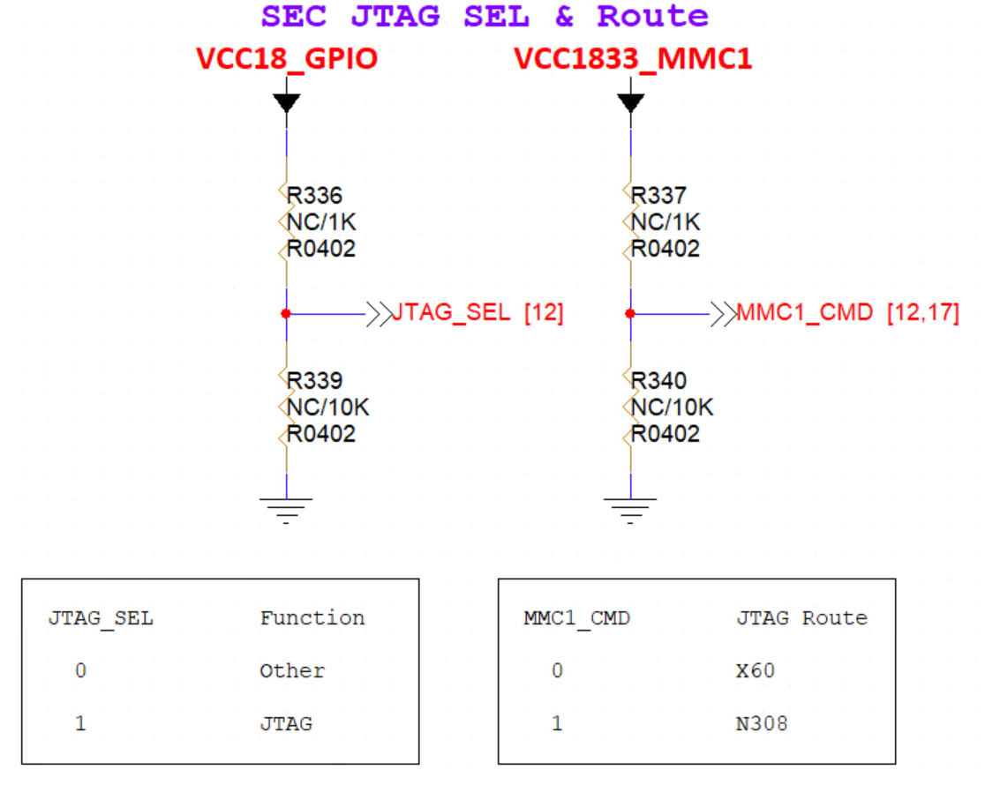
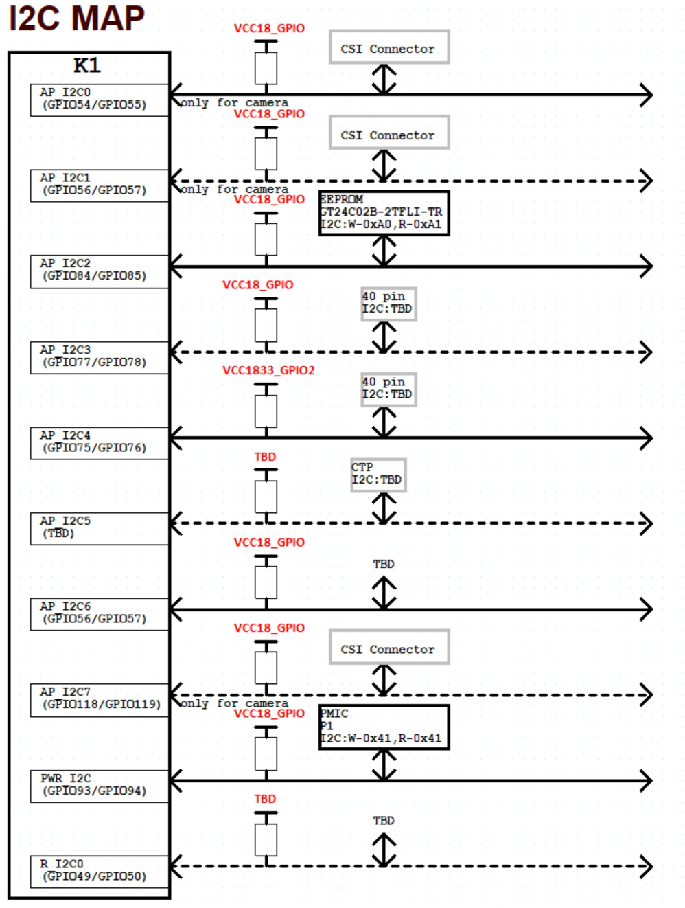
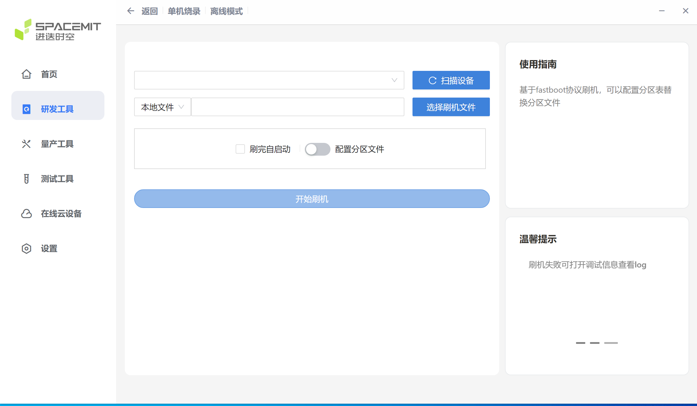

sidebar_position: 2

# MUSE Card User Guide

## 产品简介

MUSE Card 是进迭时空生态产品开发板系列，第一代搭载了进迭时空八核 RISC-V 高性能处理器 M1，核内融合 2.0Tops 通用 AI 算力，可支持所有 AI 模型算法的快速部署。

MUSE Card 充分展现了 M1 的方案和接口扩展性，设计引出了 M1 芯片原生的 HDMI、单网口、USB3.0、USB2.0、双 M.2 2242 M-KEY 等接口，可适配进迭自研 BianbuOS、BianbuNAS、OpenHarmony、OpenKylin、Deepin 等操作系统，可快速用于行业控制、NAS、机器视觉、网关等产品形态评估和孵化。

## 前言

### 概述

本文档主要介绍 MUSE Card 基本功能和硬件特性、多功能硬件配置、软件调试操作使用方法，旨在帮助调试人员更快、更准确地使用 MUSE Card，熟悉 M1 芯片开发应用方案。

**产品版本**

本产品对应的产品版本如下：

<table>
<tbody>
<tr>
<td><strong>产品名称</strong></td>
<td><strong>产品版本</strong></td>
</tr>
<tr>
<td>MUSE Card</td>
<td>MUSE Card_P1_LP4X200B32X1_V20_08061538</td>
</tr>
</tbody>
</table>

## 缩略词

缩略语包括文档中常用词组的简称：

<table>
<tbody>
<tr>
<td><strong>缩略词</strong></td>
<td><strong>英文描述</strong></td>
<td><strong>中文描述</strong></td>
</tr>
<tr>
<td>X60</td>
<td>self-innovate X60 RISC-V processor core</td>
<td>进迭自研RISC-V核</td>
</tr>
</tbody>
</table>

## 产品规格

<table>
<tbody>
<tr>
<td><strong>系统主控</strong></td>
<td>CPU</td>
<td>SpacemiT M1（SpacemiT  Key Stone® M1 芯片高性能版），8核 RISC-V中央处理器，融合 2.0 Tops AI算力 8*RISC-V X60 Core 64-bit </td>
</tr>
<tr>
<td><strong>显示</strong> </td>
<td>显示接口</td>
<td>MIPI DSI 4lane ＆ HDMI标准视频接口 最高支持1080P@60Hz输出</td>
</tr>
<tr>
<td rowspan=2 colspan=1><strong>内存</strong></td>
<td>类型</td>
<td>LPDDR4X，2400MT板贴</td>
</tr>
<tr>
<td>支持容量</td>
<td>8GB/16GB可选</td>
</tr>
<tr>
<td rowspan=3 colspan=1><strong>存储</strong></td>
<td>SSD</td>
<td>PCIe（NVMe)</td>
</tr>
<tr>
<td>SPI NOR Flash</td>
<td>64Mb，用于板号信息、SSD启动引导</td>
</tr>
<tr>
<td>TF Card</td>
<td>支持，接口可复用为UART、JTAG，用于调试</td>
</tr>
<tr>
<td rowspan=2 colspan=1><strong>I/O接口</strong></td>
<td>侧I/O</td>
<td>1*USB2.0 Type-C(Device，支持最大12V 3A PD供电) 1*USB 3.0 Type-A 1*USB 2.0 Type-A 1*RJ45（1000M/100M/10M自适应） 1*HDMI 1*TF Card</td>
</tr>
<tr>
<td>板上I/O</td>
<td>2*MIPI CSI 4lane（4+4或 4+2+2） 1*MIPI DSI 4lane 2*M.2 2242 M-KEY 40Pin 标准GPIO插座</td>
</tr>
<tr>
<td><strong>按键</strong></td>
<td>功能</td>
<td>复位键、烧录键</td>
</tr>
<tr>
<td rowspan=2 colspan=1><strong>外观</strong></td>
<td>尺寸</td>
<td>85mm*56mm</td>
</tr>
<tr>
<td>材质</td>
<td>PCB单板，黑色，可选透明外壳</td>
</tr>
<tr>
<td><strong>软件功能</strong></td>
<td>系统</td>
<td>Bianbu OS、Ubuntu、Bianbu Linux、OpenHarmony、OpenKylin、Deepin等</td>
</tr>
<tr>
<td><strong>电源</strong></td>
<td>电源输入</td>
<td>支持PD3.0协议Type-C供电</td>
</tr>
<tr>
<td rowspan=2 colspan=1><strong>可靠性</strong> </td>
<td>ESD</td>
<td>接口防护接触±4KV，空气±8KV</td>
</tr>
<tr>
<td>工作温度</td>
<td>消费级和工业级可选，-20℃~70℃ / -40℃~85℃</td>
</tr>
</tbody>
</table>

## 系统概述

### M1 芯片概述

M1 是一款高性能、超低功耗的 SOC，集成了 8 核 RISC-V CPU 内核和 SpacemiT 道一 AI 计算能力。M1 具有以下特点：

- 集成自主创新的 SpacemiT X60™RISC-V 处理器核，遵循 RISC-V 64GCVB 体系结构和 RVA22 标准。
- 通过探索 RISC-V 定制指令扩展 2.0TOPS AI 算力，实现 CPU AI 融合算力，支持 TensorFlowLite、TensorFlow、ONNX RunTime 等主流 AI 推理框架。
- 通过实现不同电源的划分，以及不同层级的功率状态。实现超低功耗，使 M1 更具竞争力和领先优势。
- 支持全功能界面，丰富更具创新性的应用程序和产品。
- 兼容主流操作系统，满足各种应用场景的需求。
- 符合工业级可靠性标准。

### M1 芯片框图

### M1 MUSE Card 参考方案框图

#### 参考方案框图
M1 MUSE Card 系统采用 M1 的芯片，P1 PMIC+ 外挂 DCDC 的供电方案；DRAM 采用 LPDDR4X；有双 M.2 2242 M-KEY、USB2.0 TYPEA、USB3.0 TYPEA、TF Card、HDMI、MIPI DSI、MIPI CSI、TYPEC、RJ45 等外设接口，集成了一个稳定的可量产化的方案。参考方案框图如下：

#### 功能概述

M1 MUSE Card 包含的功能如下：

- TYPEC：一路 USB2.0 DEVICE TYPEC 接口，兼容系统固件升级通道及 PD3.0 12V/3A 供电通道。
- HDMI1.4 OUT：一路 HDMI1.4 OUT TYPEA 接口，最大可支持 1920x1080@60Hz 输出。
- MIPI DSI/TP：通过 31pin 座子，一路 4lane MIPI DSI 信号支持 LCD 屏、一路 I2C 信号支持 CTP 屏。可通过配套屏转接小板实现显示、触摸功能。
- MIPI CSI：通过 60 pin 高速座子，两路 4lane MIPI CSI 信号分别支持 16M 与 8M 摄像头；可通过座子对应线序设计小板匹配特定摄像头模组。实现拍摄录像功能。
- 40pin 双排插针：兼容树莓派标准 40pin 双排插针，支持 I2C、UART、SPI、JTAG 和 GPIO 调试。
- TF 卡座：支持高速 TF 卡。
- Ethernet：支持单路 RJ45 接口 10/100/1000M 以太网。
- PCIe2.1 2lane Interface：两路标准 M.2 2242 M-KEY 接口，用于扩展 PCIe 设备。
- USB2.0 TYPEA：单通道 USB2.0 TYPEA 接口，用于扩展 USB 设备。
- USB3.0 TYPEA：单通道 USB3.0 TYPEA 接口，用于扩展 USB 设备。
- UART Debug：用户调试查看 LOG 信息使用；支持 3 pin 单排插针（J25）调试 X60；板上 40pin 双排扩展排针的 pin6、8、10,也支持作为 UART 调试接口引脚。
- JTAG：支持 40pin 双排插针 pin7、11、13、15 调试 PRI JTAG。支持通过配套的 TF 卡转接子板调试 SEC JTAG。
- System Key：包含 Reset、Power on、DownLoad（FEL）按键。
- SWITCH：支持启动介质选择（更改电阻）。

#### 功能接口

<table>
<tbody>
<tr>
<td><strong>功能</strong></td>
<td><strong>是否可用</strong></td>
</tr>
<tr>
<td>LPDDR4x </td>
<td>YES</td>
</tr>
<tr>
<td>SPI FLASH</td>
<td>YES</td>
</tr>
<tr>
<td>TYPEC 12V Input</td>
<td>YES</td>
</tr>
<tr>
<td>HDMI1.4 OUT</td>
<td>YES</td>
</tr>
<tr>
<td>MIPI DSI/TP</td>
<td>YES</td>
</tr>
<tr>
<td>MIPI CSI</td>
<td>YES</td>
</tr>
<tr>
<td>TF卡</td>
<td>YES</td>
</tr>
<tr>
<td>千兆网口10M/100M/1000M </td>
<td>YES</td>
</tr>
<tr>
<td>PCIe2.0 2lane Interface (2Port)</td>
<td>YES</td>
</tr>
<tr>
<td>USB2.0 TYPEA</td>
<td>YES</td>
</tr>
<tr>
<td>USB3.0 TYPEA</td>
<td>YES</td>
</tr>
<tr>
<td>UART Debug (3pin+40pin)</td>
<td>YES</td>
</tr>
<tr>
<td>JTAG (40pin)</td>
<td>YES</td>
</tr>
<tr>
<td>System Key</td>
<td>YES</td>
</tr>
</tbody>
</table>

## 硬件介绍

### 实物图

### 电源框图

### Boot Download Sel & JTAG Sel

SEC2 JTAG 配置电路：M1 SEC2 JTAG 与 MMC1（TF CARD）接口复用，当 JTAG\_SEL 拉高，MMC1\_CMD 拉低，即可配置为 SEC2 JTAG 调试 X60 CPU。

Boot Download Sel 配置电路：M1 支持配置 strap pin 选择启动介质。strap pin 默认下拉，自行增加上拉电阻：
MUSE CARD 已配置为 NOR+SSD 启动

**注：**Boot 启动顺序为：默认首先 TF 卡启动 → 未检测到卡 → 根据设置的 strap pin 方式启动

**NOR+SSD 烧录启动时，SSD 必须插入如下图所示 slot**

### I2C 地址

开发板预留丰富的外围接口，用户调试 I2C 外设会涉及到 I2C 通道复用情况，下图为现有的开发板器件对应的 I2C 地址和上拉电源，避免地址冲突和电平不匹配。

## 模块简述

### 电源输入

MUSE Card 仅提供一种电源输入方式：Type-C 输入，需使用支持 PD3.0 的适配器，输入电压默认调节为 12V。通过前端降压变换器（buck）电源后，得到电源 VCC5V0\_SYS 与 VCC4V0，分别给外挂 DCDC 和 PMIC 供电，输出不同电压供系统使用。M.2 座 3.3V 供电电流较大，由适配器输入电源通过前端降压变换器（buck）输出得到。

### 存储器

SPI Flash：64Mb 大小，以快速支持启动需求。

DDR：开发板 DDR 使用一片 8/16GB LPDDR4X。

EEPROM：开发板支持 EEPROM 存储板卡信息。

### 按键输入

### MIPI CSI 高速座子

MUSE Card 不固定支持某一摄像头模组，高速座子包含两组 4lane 信号，可根据高速座子对应线序自行设计小板来匹配特定模组，实现 4lane+4lane 或 4lane+2lane+2lane 的摄像头组合。

60pin 高速座子接口线序如下：

<table>
<tbody>
<tr>
<td>pin</td>
<td>信号名称</td>
<td>信号名称</td>
<td>pin</td>
</tr>
<tr>
<td>1</td>
<td>GND</td>
<td>CAM_MCLK2</td>
<td>60</td>
</tr>
<tr>
<td>2</td>
<td>MIPI_CSI_DN0</td>
<td>VCC5V0_SYS</td>
<td>59</td>
</tr>
<tr>
<td>3</td>
<td>MIPI_CSI_DP0</td>
<td>CAM_I2C7_SDA</td>
<td>58</td>
</tr>
<tr>
<td>4</td>
<td>GND</td>
<td>CAM_I2C7_SCL</td>
<td>57</td>
</tr>
<tr>
<td>5</td>
<td>MIPI_CSI1_DN1</td>
<td>CAMERA2_RST</td>
<td>56</td>
</tr>
<tr>
<td>6</td>
<td>MIPI_CSI1_DP1</td>
<td>CAMERA2_PDN</td>
<td>55</td>
</tr>
<tr>
<td>7</td>
<td>GND</td>
<td>CAM_MCLK1</td>
<td>54</td>
</tr>
<tr>
<td>8</td>
<td>MIPI_CSI1_DN2</td>
<td>GND</td>
<td>53</td>
</tr>
<tr>
<td>9</td>
<td>MIPI_CSI1_DP2</td>
<td>CAM_I2C1_SDA</td>
<td>52</td>
</tr>
<tr>
<td>10</td>
<td>GND</td>
<td>CAM_I2C1_SCL</td>
<td>51</td>
</tr>
<tr>
<td>11</td>
<td>MIPI_CSI1_DN3</td>
<td>GND</td>
<td>50</td>
</tr>
<tr>
<td>12</td>
<td>MIPI_CSI1_DP3</td>
<td>MIPI_CSI3_DN0</td>
<td>49</td>
</tr>
<tr>
<td>13</td>
<td>GND</td>
<td>MIPI_CSI3_DP0</td>
<td>48</td>
</tr>
<tr>
<td>14</td>
<td>MIPI_CSI1_CLKN</td>
<td>GND</td>
<td>47</td>
</tr>
<tr>
<td>15</td>
<td>MIPI_CSI1_CLKP</td>
<td>MIPI_CSI3_DN1</td>
<td>46</td>
</tr>
<tr>
<td>16</td>
<td>GND</td>
<td>MIPI_CSI3_DP1</td>
<td>45</td>
</tr>
<tr>
<td>17</td>
<td>CAMERA0_RST</td>
<td>GND</td>
<td>44</td>
</tr>
<tr>
<td>18</td>
<td>CAMERA0_PDN</td>
<td>MIPI_CSI3_DN2</td>
<td>43</td>
</tr>
<tr>
<td>19</td>
<td>GND</td>
<td>MIPI_CSI3_DP2</td>
<td>42</td>
</tr>
<tr>
<td>20</td>
<td>CAM_MCLK0</td>
<td>GND</td>
<td>41</td>
</tr>
<tr>
<td>21</td>
<td>GND</td>
<td>MIPI_CSI3_DN3</td>
<td>40</td>
</tr>
<tr>
<td>22</td>
<td>CAM_I2C0_SDA</td>
<td>MIPI_CSI3_DP3</td>
<td>39</td>
</tr>
<tr>
<td>23</td>
<td>CAM_I2C0_SCL</td>
<td>GND</td>
<td>38</td>
</tr>
<tr>
<td>24</td>
<td>GND</td>
<td>MIPI_CSI3_CLKN</td>
<td>37</td>
</tr>
<tr>
<td>25</td>
<td>GND</td>
<td>MIPI_CSI3_CLKP</td>
<td>36</td>
</tr>
<tr>
<td>26</td>
<td>CSI_DVDD12</td>
<td>GND</td>
<td>35</td>
</tr>
<tr>
<td>27</td>
<td>CSI_VCCI018</td>
<td>MIPI_CSI2_CLKN</td>
<td>34</td>
</tr>
<tr>
<td>28</td>
<td>CSI_AVDD28</td>
<td>MIPI_CSI2_CLKP</td>
<td>33</td>
</tr>
<tr>
<td>29</td>
<td>CSI_AFVCC28</td>
<td>GND</td>
<td>32</td>
</tr>
<tr>
<td>30</td>
<td>CAMERA1_PDN</td>
<td>CAMERA1_RST</td>
<td>31</td>
</tr>
</tbody>
</table>

### MIPI DSI 屏连接座

开发板支持 1080P 屏（JL-M101N013-P12WU-M402632），屏座接口型号为 FH35C-31S-0.3SHW(50)：

屏接口顺序：

<table>
<tbody>
<tr>
<td>pin</td>
<td>信号名称</td>
<td>信号名称</td>
<td>pin</td>
</tr>
<tr>
<td>1</td>
<td>MIPI_DSI1_LANE0_DN</td>
<td>MIPI_DSI1_LANE0_DP</td>
<td>2</td>
</tr>
<tr>
<td>3</td>
<td>GND</td>
<td>MIPI_DSI1_LANE1_DN</td>
<td>4</td>
</tr>
<tr>
<td>5</td>
<td>MIPI_DSI1_LANE1_DP</td>
<td>GND</td>
<td>6</td>
</tr>
<tr>
<td>7</td>
<td>MIPI_DSI1_CLK_N</td>
<td>MIPI_DSI1_CLK_P</td>
<td>8</td>
</tr>
<tr>
<td>9</td>
<td>GND</td>
<td>MIPI_DSI1_LANE2_DN</td>
<td>10</td>
</tr>
<tr>
<td>11</td>
<td>MIPI_DSI1_LANE2_DP</td>
<td>GND</td>
<td>12</td>
</tr>
<tr>
<td>13</td>
<td>MIPI_DSI1_LANE3_DN</td>
<td>MIPI_DSI1_LANE3_DP</td>
<td>14</td>
</tr>
<tr>
<td>15</td>
<td>GND</td>
<td>MIPI_LCD_ADC_1V8</td>
<td>16</td>
</tr>
<tr>
<td>17</td>
<td>LCD_PWR_EN_1V8</td>
<td>LCD_RST_1V8</td>
<td>18</td>
</tr>
<tr>
<td>19</td>
<td>LCD_BL_EN_1V8</td>
<td>LCD_BL_PWM_1V8</td>
<td>20</td>
</tr>
<tr>
<td>21</td>
<td>GND</td>
<td>TP_INT_1V8</td>
<td>22</td>
</tr>
<tr>
<td>23</td>
<td>TP_RST_1V8</td>
<td>AP_12C6_SCL</td>
<td>24</td>
</tr>
<tr>
<td>25</td>
<td>AP_12C6_SDA</td>
<td>LCD_VCC18</td>
<td>26</td>
</tr>
<tr>
<td>27</td>
<td>GND</td>
<td>GND</td>
<td>28</td>
</tr>
<tr>
<td>29</td>
<td>LCD_VCC5V0</td>
<td>LCD_VCC5V0</td>
<td>30</td>
</tr>
<tr>
<td>31</td>
<td>LCD_VCC5V0</td>
<td>GND</td>
<td>32</td>
</tr>
<tr>
<td>33</td>
<td>GND</td>
<td></td>
<td></td>
</tr>
</tbody>
</table>

### Type-C 座

开发板 Type-C 座子，支持 USB2.0 DEVICE，内置调压芯片支持 PD3.0 协议调压到 12V 给 MUSE CARD 供电。

### HDMI 输出接口

开发板支持一路 HDMI 标准 A 输出接口，支持 HDMI1.4，最大可支持 1080p 60fps 视频输出。

### USB 接口

开发板提供一个 USB2.0 接口和一个 USB3.0 接口，方便开发者接入 USB 设备。

### RJ45 接口

开发板支持单个 RJ45 千兆网接口。

### 40pin 接口

开发板支持 40pin 双排插针，线序如下：

PS:** “粗体”**为当前默认功能，若要使用其他功能需要自行配置

<table>
<tbody>
<tr>
<td>pin</td>
<td>管脚定义</td>
<td>管脚定义</td>
<td>pin</td>
</tr>
<tr>
<td>1</td>
<td>VCC3V3_SYS</td>
<td>VCC5V0_OUT</td>
<td>2</td>
</tr>
<tr>
<td>3</td>
<td><strong>AP_I2C4_SDA_3V3</strong> {GPIO[52] / R_SPI_RXD / R_UART1_RXD / R_PWM7}</td>
<td>VCC5V0_OUT</td>
<td>4</td>
</tr>
<tr>
<td>5</td>
<td><strong>AP_I2C4_SCL_3V3</strong> {R_SPI_TXD / R_UART1_TXD / R_PWM6}</td>
<td>GND </td>
<td>6</td>
</tr>
<tr>
<td>7</td>
<td><strong>PRI_TDI</strong> {GPI0_70_3V3 / AP_I2C2_SCL_3V3 / UART5_TXD}</td>
<td><strong>R_UART0_TXD_3V3</strong> {GPIO[47] / R_CAN_TX0 / R_PWM8 / AP_I2C3_SCL}</td>
<td>8</td>
</tr>
<tr>
<td>9</td>
<td>GND</td>
<td><strong>R_UART0_RXD_3V3</strong> {GPIO[48] / R_CAN_RX0 / R_IR_RX / AP_I2C3_SDA / KP_MKOUT[2]}</td>
<td>10</td>
</tr>
<tr>
<td>11</td>
<td><strong>GPIO_71_3V3</strong> {PRI_TMS / AP_I2C2_SDA_3V3 / UART5_RXD}</td>
<td><strong>GPI0_74_3V3</strong> {R_PWM9 / PCIe2_WAKEN}</td>
<td>12</td>
</tr>
<tr>
<td>13</td>
<td><strong>GPI0_72_3V3</strong> {PRI_TCK / UART9_TXD / UART5_CTS_N}</td>
<td>GND</td>
<td>14</td>
</tr>
<tr>
<td>15</td>
<td><strong>GPI0_73_3V3</strong> {PRI_TDO / UART9_RXD / UART5_RTS_N}</td>
<td><strong>GPIO_91_3V3</strong> {MN_CLK2 / DSI_TE / R_I2C0_SCL}</td>
<td>16</td>
</tr>
<tr>
<td>17</td>
<td>VCC3V3_SYS</td>
<td><strong>GPIO_92_3V3</strong> {MN_CLK / PWM7 / R_I2C0_SDA}</td>
<td>18</td>
</tr>
<tr>
<td>19</td>
<td><strong>SPI3_MOSI_3V3</strong> {GPIO[77] / SPI2_MOSI / AP_I2C3_SCL / UART8_CTS_N / R_PWM0 / KP_MKOUT[2] / AP_CW[14]}</td>
<td>GND</td>
<td>20 </td>
</tr>
<tr>
<td>21</td>
<td><strong>SPI3_MISO_3V3</strong> {GPIO[78] / SPI2_MISO / AP_I2C3_SDA / UART8_RTS_N / R_PWM1 / KP_MKIN[3] / AP_CW[15]}</td>
<td><strong>GPIO_49_3V3</strong> {R_SPI_SCLK / R_UART1_CTS_N / R_PWM4 / R_I2C0_SCL / KP_MKIN[3]}</td>
<td>22</td>
</tr>
<tr>
<td>23</td>
<td><strong>SPI3_SCLK_3V3</strong> {GPIO[75] / SPI2_SCLK / CAN_TX0 / UART8_TXD / AP_I2C4_SCL / AP_CW[12]}</td>
<td><strong>SPI3_CS_3V3</strong> {GPIO[76] / SPI2_CS / CAN_RX0 / UART8_RXD / AP_I2C4_SDA / AP_CW[13]}</td>
<td>24</td>
</tr>
<tr>
<td>25 </td>
<td>GND</td>
<td><strong>GPIO_50_3V3</strong> {R_SPI_FRM / R_UART1_RTS_N / R_PWM5 / R_I2C0_SDA / KP_MKOUT[3]}</td>
<td>26</td>
</tr>
<tr>
<td>27</td>
<td><strong>AP_I2C3_SDA_3V3</strong> {GPIO[38] / GMAC1_TX_D2 / R_I2S3_SCLK / PWM8}</td>
<td><strong>AP_I2C3_SCL_3V3</strong> {GPIO[39] / GMAC1_TX_D3 / R_I2S3_LRCK / PWM9}</td>
<td>28</td>
</tr>
<tr>
<td>29</td>
<td><strong>GPIO_29_3V3</strong> {GMAC1_RXDV / UART1_TXD / PWM1 / PCIe0_PERSTN}</td>
<td>GND</td>
<td>30</td>
</tr>
<tr>
<td>31</td>
<td><strong>GPIO_30_3V3</strong> {GMAC1_RX_D0 / UART1_RXD / PWM2 / PCIe0_WAKEN}</td>
<td><strong>GPIO_34_3V3</strong> {GMAC1_RX_D3 / UART4_RXD / PWM4 / PCIe1_CLKREQN}</td>
<td>32</td>
</tr>
<tr>
<td>33</td>
<td><strong>GPIO_31_3V3</strong> {GMAC1_RX_D1 / UART1_CTS_N / PCIe0_CLKREQN}</td>
<td>GND</td>
<td>34</td>
</tr>
<tr>
<td>35</td>
<td><strong>GPIO_32_3V3</strong> {GMAC1_RX_CLK / UART1_RTS_N / MN_CLK / PCIe1_PERSTN}</td>
<td><strong>GPIO_35_3V3</strong> {GMAC1_TX_D0 / UART4_CTS_N / PWM5 / PCIe2_PERSTN}</td>
<td>36</td>
</tr>
<tr>
<td>37</td>
<td><strong>GPIO_33_3V3</strong> {GMAC1_RX_D2 / UART4_TXD / PWM3 / PCIe1_WAKEN}</td>
<td><strong>GPIO_46_3V3</strong> {GMAC1_CLK_REF / PWM16}</td>
<td>38</td>
</tr>
<tr>
<td>39</td>
<td>GND</td>
<td><strong>GPIO_37_3V3</strong> {GMAC1_TX / PWM7 / PCIe2_CLKREQN}</td>
<td>40</td>
</tr>
</tbody>
</table>

### UART 调试接口

开发板设计 3pin 单排插针，支持 UART0（GPIO68-TX，GPIO69-RX）调试接口，主控端线序从左到右 TX、RX、GND。

### TF 卡接口（无弹片）

开发板支持 TF 卡，方便开发者接入 TF 卡设备。同时支持 debug 扩展卡，用于 UART0 或 JTAG 调试。

### M.2 KEY M 接口

开发板支持双 M.2 2242 M-KEY 接口，方便开发者接入 SSD 以及其他 M.2 KEY M 设备，同时支持连接 JMB582 扩展卡转 SATA。

## 初次设置

### 使用前准备

MUSE Card 是开发板形态产品，因此您需要连接必要的外设来使用它：

**电源适配器**

MUSE Card 采用 USB-PD3.0 协议 Type-C 接口供电，  您可以使用支持该协议的电源适配器，建议电源适配器输出功率不低于 30W。

**键盘＆鼠标：**

您可以使用 MUSE Card 上的任一 USB-A 端口连接有线键盘/鼠标或 USB 接收器，或者通过蓝牙的方式连接键鼠。

**显示器：**

MUSE Card 通过外置显示器将画面显示出来。MUSE Card 支持 HDMI 和 MIPI DSI 视频接口，因此您可以同时连接带有 HDMI 与 MIPI DSI 视频接口的显示器。

请注意，若要通过 MIPI DSI 视频接口输出画面，请在开机前就将 MIPI DSI 视频线连接好显示器和 MUSE Card，MUSE Card 的 MIPI DSI 视频接口不支持热插拔。

**音频：**

MUSE Card 支持 HDMI 音频，在操作系统设置输出源为 HDMI 后，可以在 HDMI 设备上播放声音。

**网络连接：**

MUSE Card 支持有线 RJ45 网口，您可以通过 RJ45 网口直接与网线连接。

### 开始启动

**提前连接您的所需要的外设，并按下启动按钮：**

将设备通过视频连接线连接到显示器，同时连接上键盘和鼠标。

最后连接上电源线，并通电即可开机。（首次通电即开机，若软件关机后，需短按电源按钮 1S 即可开机），开发板运行后，红色的电源指示灯会亮起。

### 首次启动时配置您的 MUSE Card

您的 MUSE Card 会预装进迭时空 Bianbu desktop 操作系统，将在首次启动时运行配置向导。您需要显示器、键盘、鼠标来浏览向导。

**系统语言：**

此页面帮助您配置系统的语言，默认显示 English 和中文，如需更多语言，可点击下方三个点，弹出更多选项。

**输入法：**

此页面帮助您配置系统的键盘布局和输入法。

**无线上网：**

此页面帮助您连接到 WiFi 网络，从列表中选择您的网络并进行连接；如暂未有合适 WiFi 网络，可在左上角选择跳过该设置。

**位置服务：**

此页面可选择是否打开位置服务，如打开位置服务可便捷您的使用体验，但相应的可能会带来位置隐私泄露的风险。

**时区：**

此页面帮助配置您所在时区信息，联网状态下系统能够自动同步相应时区时间，可以搜索城市来添加设置。

**设置您的用户名和密码：**

该页面帮助您设置用户名和密码，请牢记您的密码。

**配置完成**

配置完成，点击“开始使用 Bianbu”吧，后可进入桌面。

## 刷入固件

### 进入刷机模式

进入刷机模式有以下步骤：

1. 按住烧录按键，不松开；
2. 插上 type-C 电源启动；
3. 松开烧录按键；

如果已接上电源，可按以下步骤进入刷机模式：

1. 按住烧录按键，不松开；
2. 短按 Reset 复位按键；
3. 松开烧录按键；

（按钮图示详见产品规格中的主板接口示意）

此时通过 MUSE Card 的 Type-C 口，与上位机进行 USB 连接，通过进迭时空官方刷机工具 Titan 或者 fastboot 命令即可进行刷机操作。

### 固件下载和安装

### Bianbu

**Bianbu 简介：**

Bianbu 是进迭时空针对 RISC-V 架构的处理器做了深度优化的操作系统，MUSEBook 适用于并出厂预装 Bianbu Desktop 版本。同时 MUSE Card 适用于 Bianbu NAS 版本。

**Bianbu 网站：**

如需获取更多 Bianbu 相关信息，详见：[简介 | Bianbu | 进迭时空开发者社区](https://bianbu.spacemit.com/)

**Bianbu desktop/NAS 固件下载地址：**

[Index of /image/k1/version/bianbu](https://archive.spacemit.com/image/k1/version/bianbu/)

其中含有 NAS 字样的固件包，为 Bianbu NAS 的固件

**Bianbu desktop/NAS 固件的安装和升级：**

详见：[系统升级 | Bianbu | 进迭时空开发者社区](https://bianbu.spacemit.com/user_guide/upgrade)

## 串口调试

### 接口连接：

上位机经 USB 转 UART_TTL 设备与 MUSE Card 主板接口的 TX、RX、GND 正常连接。接口信号如图：

### Windows 调试：

以“MobaXterm”为例：

首先，请正确连接硬件串口，并确认在设备管理器的端口中有 COM 口的显示，如图：

打开“MobaXterm”软件，选择“Sessions”——“New Session”，在弹出的对话框中，选择“Serial”，"Serial port"选择上图中识别到的对应 COM 口，**“Speed”速率选择“115200”**，最后点击“OK”，即可进入打印页面。

## 注意事项

M1 MUSE Card 适用于实验室或者工程环境，开始操作前，请先阅读以下注意事项：

1. 任何情况下不可对屏幕接口、CSI 接口及扩展板进行热插拔操作。
2. 拆封开发板包装和安装前，为避免静电释放（ESD）对开发板硬件造成损伤，请采取必要防静电措施。
3. 持开发板时请拿开发板边沿，不要触碰到开发板上的外露金属部分，以免静电对开发板元器件造成损坏。
4. 请将开发板放置于干燥的平面上，以保证它们远离热源、电磁干扰源与辐射源、电磁辐射敏感设备（如：医疗设备）等。
