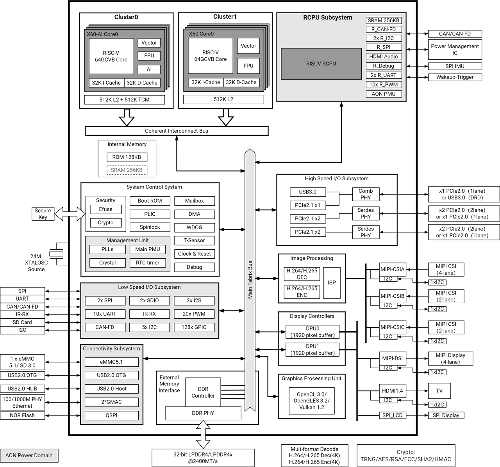
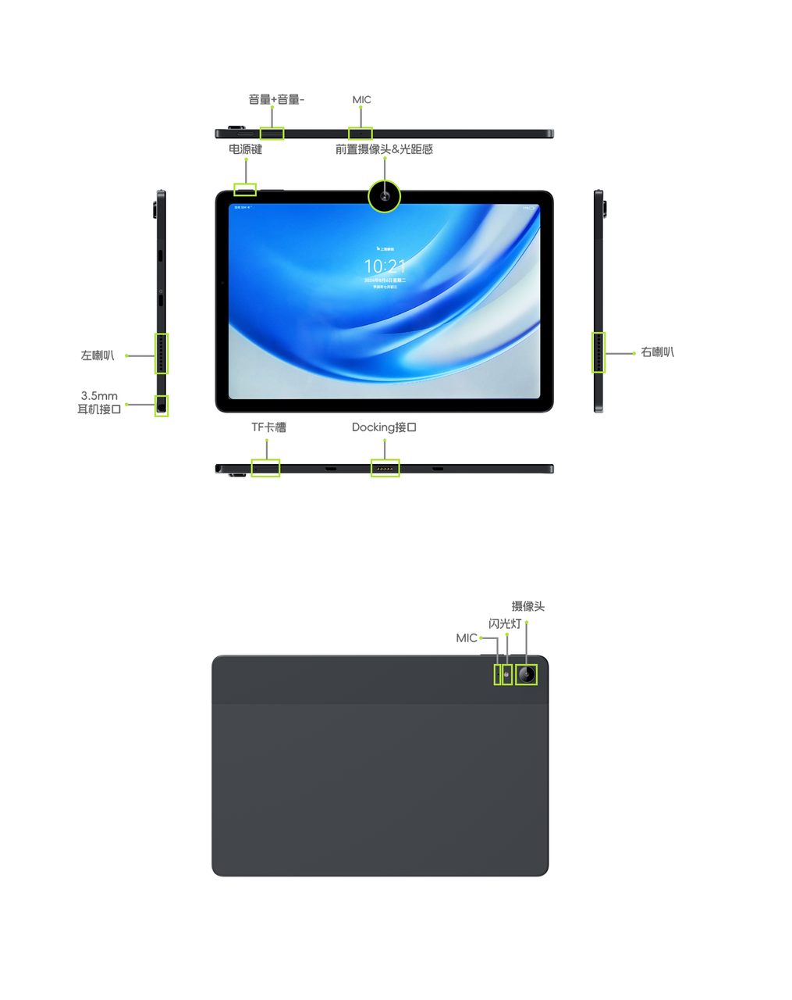

# MUSE Paper 用户使用指南

```
最新版本：2025/04/15
```

## 重要提醒

MUSEPaper作为一款专为开发者设计的平板，我们的团队正在不懈努力，持续优化操作系统的用户体验及硬件功能。为确保您能持续畅享卓越性能与最新功能，我们诚挚推荐，在首次开机后即刻进行OTA升级，以拥抱每一次升级后的体验。

## 产品简介  

MUSE Paper是一款基于RISC-V架构和OpenHarmony操作系统的平板电脑，采用了进迭时空最新一代RISC-V芯片K1，拥有强大的AI通用计算能力与出色的能效表现。搭载了OpenHarmony操作系统，实现了多任务处理与应用切换的流畅体验，真正做到"所见即所得"，无论是工业/行业定制，还是日常办公、学习娱乐，都能够轻松应对。开源RISC-V处理器架构结合开源OpenHarmony操作系统，真正实现了移动终端设备从硬件到软件的全栈式开源开放。  


## 前言

本文档主要介绍MUSE Paper基本功能和硬件特性、多功能硬件配置、软件调试操作使用方法，旨在助力开发调试及系统测试人员更为迅速、准确地使用 MUSE Paper ，熟悉K1芯片开发应用方案。

## 适用对象

本文档主要适用于以下工程师：  
技术支持工程师、单板硬件开发工程师、嵌入式软件开发工程师、测试工程师


## 缩略词

缩略语包括文档中常用词组的简称

| 缩略词 | 英文描述   | 中文描述  |
|--------|-----------|------------------------|
| X60    | self-innovate X60™ RISC-V processor core   | 进迭时空自研RISC-V核   |

## 产品规格

| 类别         | 项目             | 参数     |
|--------------|------------------|---------|
| 系统主控     | CPU              | SpacemiT K1, 8核，RISC-V中央处理器，融合2.0Tops AI算力                                                                                  |
| 外观         | 尺寸             | 256.8 × 168.5 × 7.2 mm                                                                                                                  |
|              | 重量             | 约453g                                                                                                                                  |
|              | 材质             | 铝合金阳极氧化 + 塑料喷漆                                                                                                               |
| 显示         | 显示接口         | 分辨率1920×1200，10.95" LCD屏                                                                                                           |
| 内存         | 类型             | LPDDR4x，2400MT/s 板贴                                                                                                                  |
|              | 支持容量         | 可选 8GB / 16GB                                                                                                                         |
| 存储         | eMMC             | 可选 128GB / 256GB                                                                                                                      |
|              | TF card          | 支持，同时可作为 UART、JTAG 口，用于调试                                                                                                |
| 摄像头       | 像素             | 前置 800 万像素，后置 1300 万像素                                                                                                       |
|              | 闪光灯           | 支持                                                                                                                                    |
|              | 自动对焦         | 后摄支持                                                                                                                                |
| 无线         | 类型             | 板贴 WiFi/BT 模块                                                                                                                       |
|              | 协议             | 支持 Wi-Fi 6 & BT 5.2                                                                                                                   |
| I/O 接口     | 侧 I/O           | USB 3.0 OTG Type-C ×1（input PD3.0 9V@2A，output 5V@1A）<br>USB 2.0 OTG Type-C ×1（input PD3.0 9V@2A，output 5V@1A）<br>Docking 座子 ×1，USB/UART mux，USB2.0 for keyboard，UART0 for debug port |
| 按键         | 功能             | 开关机、音量控制                                                                                                                        |
| 传感器       | sensor           | 支持光距感、磁力计、重力计、陀螺仪、霍尔开关                                                                                            |
| 多媒体       | 音频输出         | 喇叭（8Ω@1W ×2）/ 支持 Type-C 数字耳机、3.5mm 接口耳机                                                                                  |
|              | 音频输入         | 硅麦 ×2                                                                                                                                 |
| 软件功能     | 系统             | 预装 OpenHarmony 5.0                                                                                                                    |
| 可靠性       | ESD              | 接触 ±4kV，空气 ±8kV                                                                                                                    |
|              | 工作温度         | 非凝结，-10°C ~ 45°C                                                                                                                    |
|              | 湿度             | 相对湿度 ≤90% ±2%                                                                                                                       |
| 电源         | 电池             | 7000mAh 聚合物电池                                                                                                                      |
|              | 电源输入         | PD3.0 18W 快充，Type-C 供电                                                                                                             |

## 系统概述

### 1. K1芯片概述

K1是一款高性能、超低功耗的SOC，集成了8核RISC-V CPU内核和SpacemiT®道一™AI计算能力。K1具有以下特点：  
- 集成进迭时空自主创新的SpacemiT® X60™RISC-V处理器核，遵循RISC-V 64GCVB体系结构和RVA22标准。  
- 通过探索RISC-V定制指令扩展2.0TOPS AI算力，实现CPU AI融合算力，支持TensorFlowLite、TensorFlow、ONNX RunTime等主流AI推理框架。  
- 通过实现不同电源的划分，以及不同层级的功率状态。实现超低功耗，使K1更具竞争力和领先优势。  
- 支持全功能界面，丰富更具创新性的应用程序和产品。  
- 兼容主流操作系统，满足各种应用场景的需求。  
- 符合工业级可靠性标准。

### 2. K1 芯片框图



### 3. MUSE Paper参考方案框图

#### 3.1 参考方案框图

MUSE Paper 系统采用K1 的芯片，P1 PMIC+外挂DCDC的供电方案；存储采用LPDDR4x、eMMC5.1；支持双Type-C OTG扩展USB外设、docking键盘\调试串口，以及支持TF卡扩展存储；集成了一个稳定的可量产化的方案。参考方案框图如下：  
[图片](./static/paper_block2.png)

#### 3.2 功能概述

MUSE Paper包含的功能如下：  
- 显示：10点触控、10.95” LCD，分辨率1920*1200，典型亮度450nit  
- 摄像头：前置800万像素，后置1300万像素，后置摄像头支持自动对焦  
- USB2.0 OTG Type-C：兼容系统固件升级通道、PD3.0 9V/2A快充，以及OTG拓展USB设备  
- USB3.0 OTG Type-C：兼容PD3.0 9V/2A快充，以及OTG拓展USB设备  
- Docking连接器：USB\UART二合一，USB2.0 for keyborad，UART0 for debug port  
- Audio Interface：外挂顺芯ES8326B方案，支持立体声双喇叭、耳机输出声音、双MIC录音  
- TF卡槽：支持高速TF卡  
- SDIO WiFi：模组型号为RTL8852BS，支持无线上网功能  
- 电池：典型容量7000mAh  
- 其它：支持光距感，磁力计，重力计，陀螺仪，霍尔开关，振动马达  

#### 3.3 功能接口

| 功能                        | 是否可用 |
|-----------------------------|----------|
| LPDDR4x (8/16GB)            | YES      |
| eMMC (128/256GB)            | YES      |
| TYPEC 9V Input              | YES      |
| Audio (SPK、MIC、Earphone)  | YES      |
| MIPI DSI/CTP                | YES      |
| MIPI CSI                    | YES      |
| TF卡                        | YES      |
| SDIO WIFI&BT                | YES      |
| USB2.0 OTG Type-C           | YES      |
| USB3.0 OTG Type-C           | YES      |
| System Key（PWR、V+、V-）   | YES      |

#### 3.4 关键功能标识



# 使用指南

MUSE Paper是平板电脑形态，您可以直接运行使用它，无需任何外设。为了确保最佳性能，请保持您的平板电脑通过OTA升级保持最新。更新将修复已知问题并引入新功能。设备会在有更新时通知您，请及时安装。如需手动检查更新，请前往设置 > 系统 > 软件更新。  
如您想更完善的使用它，建议您添加以下设备：

- **电源适配器**  
MUSE Paper 采用 USB-PD3.0 协议 Type-C 接口供电/充电。为达到最佳充电速度，建议您选用 MUSE Paper 原装的电源适配器。

| 产品             | 支持的PD协议电压/电流 |
|------------------|------------------------|
| 原装电源适配器   | 9V/2A、5V/2A           |
| MUSE Paper       | 18W USB-C              |

- **USB Type-C线缆**  
您可以通过MUSE Paper的USB2.0 Type-C，使用hdc工具连接至上位机进行深度调试操作。

- **USB-hub**  
您可以通过MUSE Paper的Type-C接口，使用USB-hub拓展USB键鼠、USB存储设备，便于开发、调试、测试工作的进行。

## 刷入固件

### 进入刷机模式

开机或系统重启期间，长按“音量+”按键即可进入刷机模式。  
此时通过 MUSE Paper 的USB2.0 Type-C（有充电标识），与上位机进行 USB 连接，通过进迭时空官方刷机工具 [TitanFlasher](https://developer.spacemit.com/documentation?token=O6wlwlXcoiBZUikVNh2cczhin5d) 或者 fastboot 命令即可进行刷机操作。

### 固件下载和安装

#### OpenHarmony 

**OpenHarmony 简介**：  
OpenHarmony（开源鸿蒙）系统由华为公司捐赠，开放原子基金会运营的开源操作系统，与华为公司的HarmonyOS系统为同一技术底座，旨在构建万物智联的大一统鸿蒙生态，OpenHarmony系统是国内发展最为迅速，最具有自主可控的数字底座。MUSE Paper 适用于并出厂预装 OpenHarmony5.0  

**OpenHarmony 网站**：[https://developer.spacemit.com/documentation?token=OQRQwIzlAiPAxikkNSJcKvFJnQf](https://developer.spacemit.com/documentation?token=OQRQwIzlAiPAxikkNSJcKvFJnQf)  
 
**OpenHarmony 固件下载地址**：[https://archive.spacemit.com/image/k1/version/openharmony5.0/](https://archive.spacemit.com/image/k1/version/openharmony5.0/)  