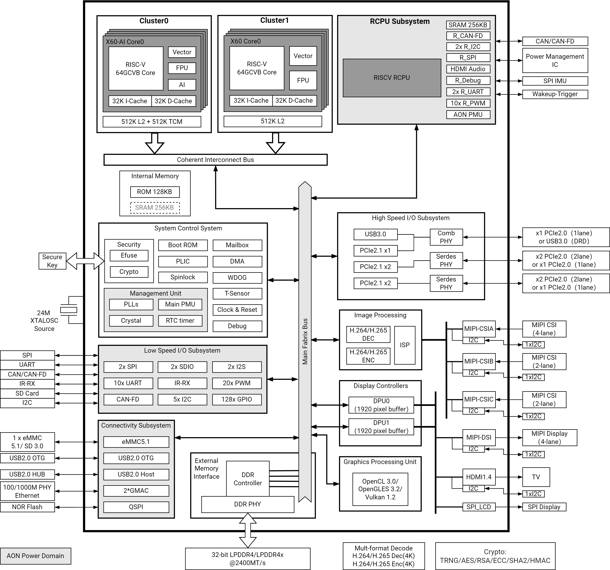
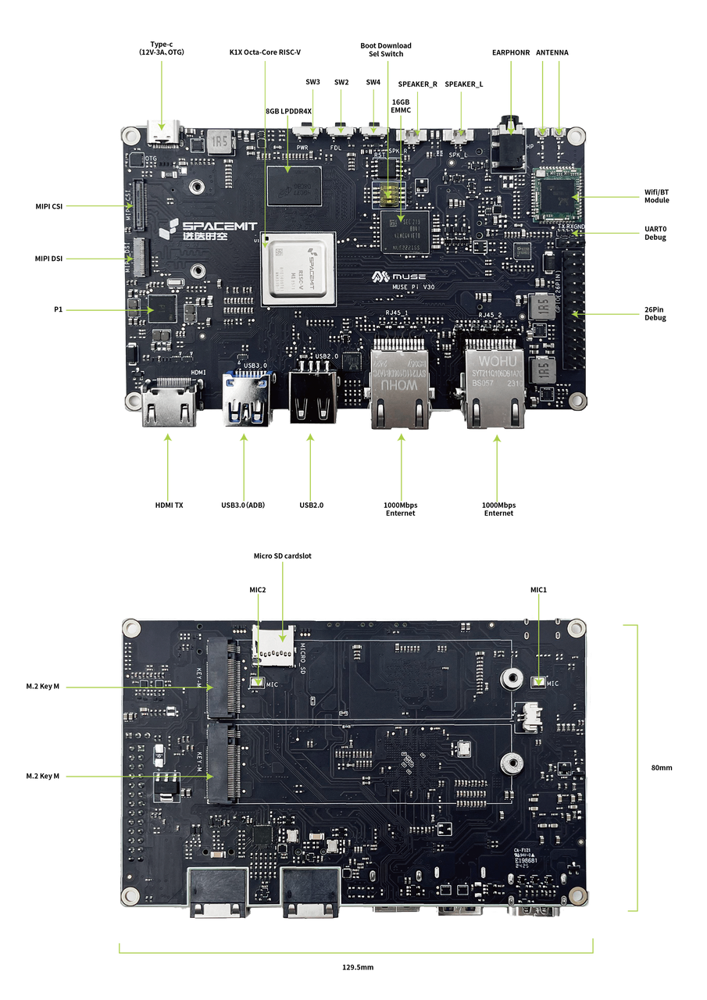
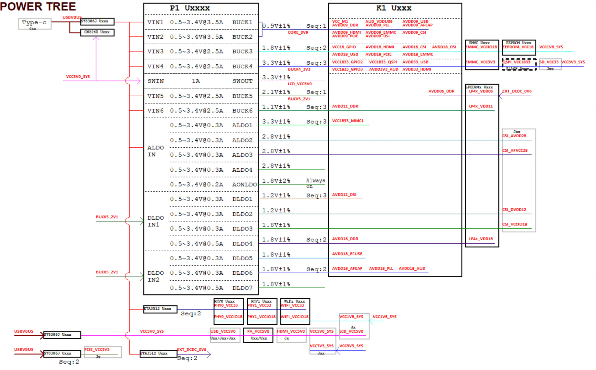
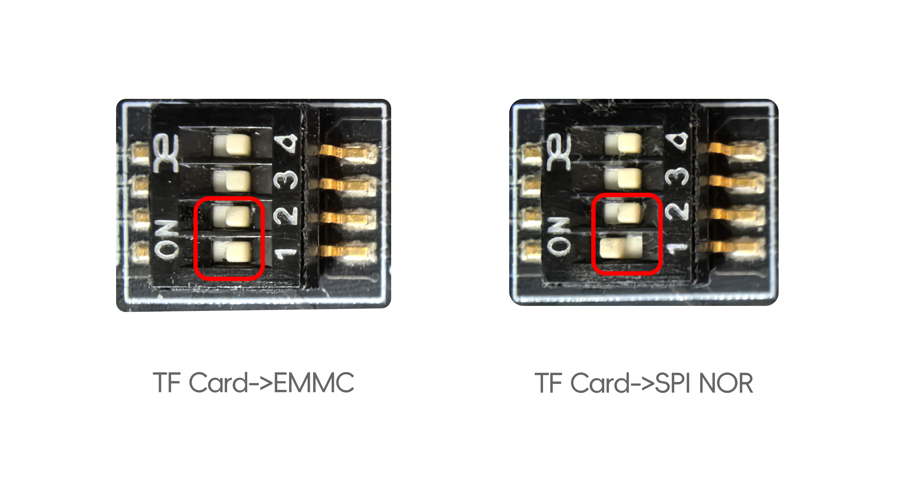
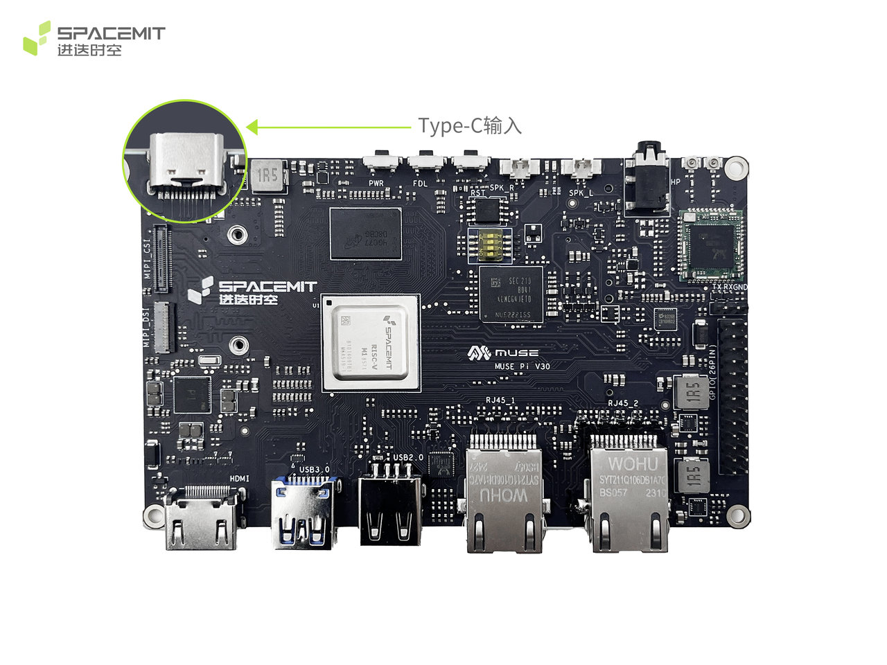
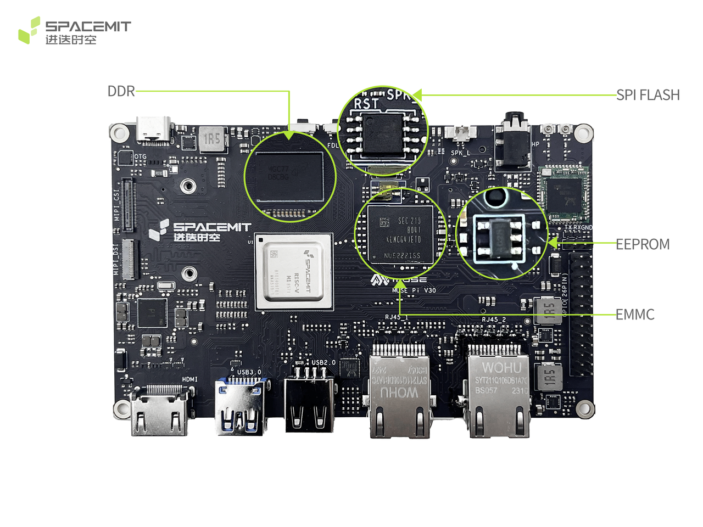
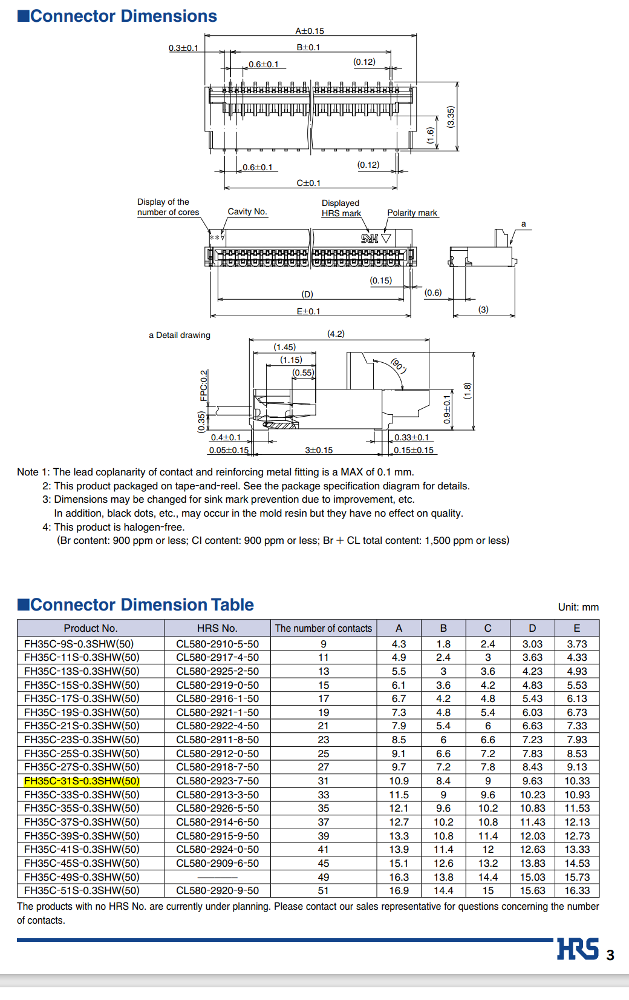
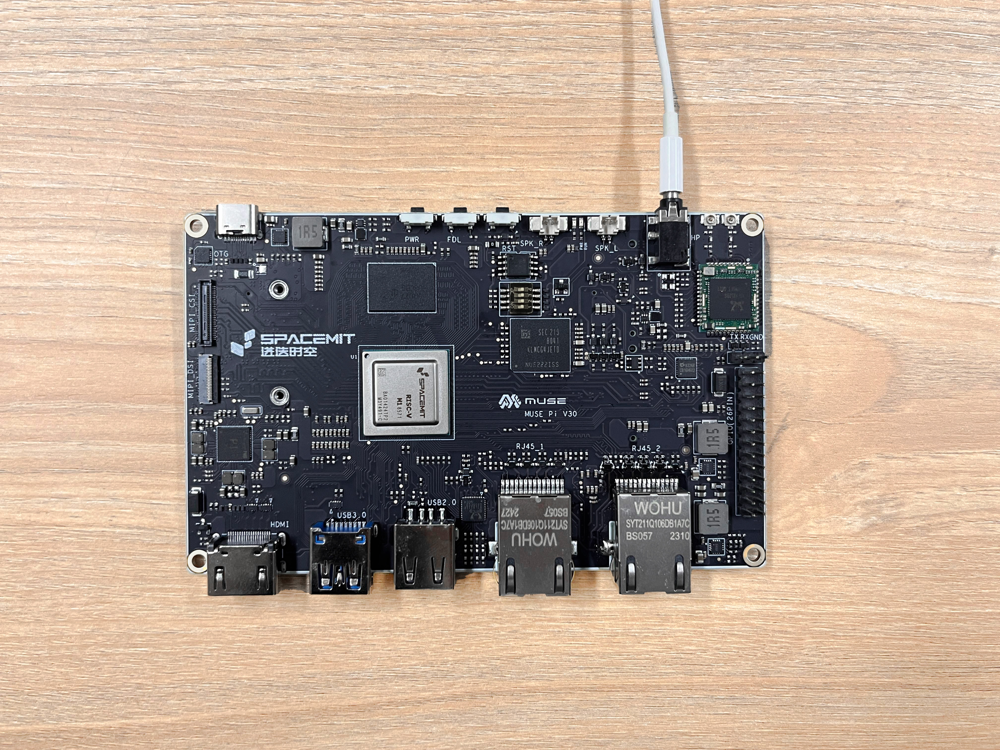
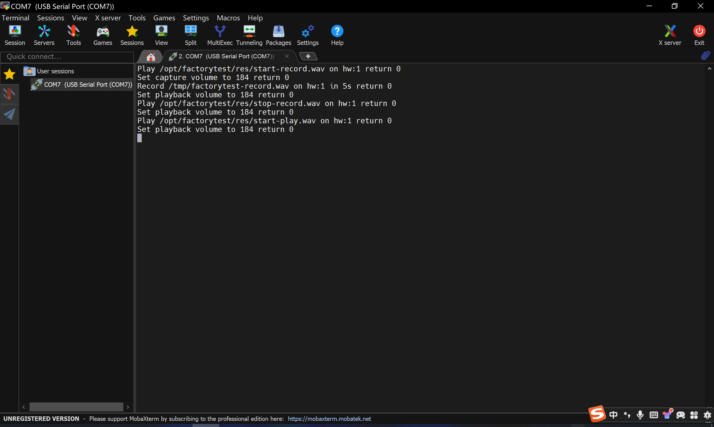

# MUSE Pi User Guide

```
Last version: 2025/07/18
```

## Introduction

**MUSE Pi** is a **SpacemiT**'s ecological product in the development board series, the first generation equipped with SpacemiT 8-core RISC-V high-performance processor M1, which features a built-in 2.0 TOPS general AI computing power, enabling the rapid deployment of all AI model algorithms.

MUSE Pi fully shows the solution and interface expandability of the M1 processor. Its design includes the native interfaces of the M1 chip, such as HDMI, dual Ethernet ports, USB 3.0, USB 2.0, and dual PCIe 2.1 x2.

MUSE Pi is compatible with SpacemiT's self-developed Bianbu OS, Bianbu OS NAS, OpenHarmony OS, OpenKylin OS, Deepin OS, and other operating systems, making it suitable for product evaluation and incubation in areas, such as industrial control, NAS, machine vision, and gateways.

## Specifications

<table>
<tbody>
<tr>
<td><strong>System Main Control</strong></td>
<td>CPU</td>
<td>SpacemiT M1, 8-core RISC-V CPU, integrated with 2 TOPS AI computing power</td>
</tr>
<tr>
<td><strong>Display</strong></td>
<td>Display Interface</td>
<td>MIPI DSI 4-lane & HDMI standard video interface, supporting up to 1080P@60Hz output</td>
</tr>
<tr>
<td rowspan=2 colspan=1><strong>Memory</strong><br/></td>
<td>Type</td>
<td>LPDDR4X, onboard 2400 MT</td>
</tr>
<tr>
<td>Maximum Capacity</td>
<td>16GB</td>
</tr>
<tr>
<td rowspan=3 colspan=1><strong>Storage</strong></td>
<td>SSD</td>
<td>PCIe (Nvme)</td>
</tr>
<tr>
<td>eMMC</td>
<td>Default 16GB</td>
</tr>
<tr>
<td>TF card</td>
<td>Supported and can also serve as UART and JTAG ports for debugging</td>
</tr>
<tr>
<td rowspan=2 colspan=1><strong>Wireless</strong></td>
<td>Type</td>
<td>Onboard WiFi/BT module</td>
</tr>
<tr>
<td>Protocol</td>
<td>Support for WiFi 6 & BT 5.2</td>
</tr>
<tr>
<td rowspan=2 colspan=1><strong>I/O Interfaces</strong></td>
<td>Side I/O</td>
<td>- HDMI x1<br/>- USB 3.0 Type-A x1<br/>- USB 2.0 Type-A x1<br/>- USB2.0 Type-C (OTG, supporting maximum 12V 3A PD power supply) x1<br/>- RJ45 (1000M/100M/10M adaptive) x2<br/>- TF card x1<br/>- 3.5mm audio jack x1</td>
</tr>
<tr>
<td>Onboard I/O</td>
<td>- MIPI DSl 4 lane x1, <br/>- MIPlCSl 4 lane x2 (supporting 4+4 or 4+2+2)<br/>- M.2 2280 KEY M x2, <br/>- 26 Pin standard PIO socket</td>
</tr>
<tr>
<td><strong>Buttons</strong></td>
<td>Function</td>
<td>- Reset button x1<br/>- Power button x1<br/>- Programming button x1</td>
</tr>
<tr>
<td rowspan=2 colspan=1><strong>Appearance</strong></td>
<td>Dimensions</td>
<td>129.45x80mm</td>
</tr>
<tr>
<td>Material</td>
<td>PCB board, black (optional transparent case)</td>
</tr>
<tr>
<td rowspan=2 colspan=1><strong>Software Functionality</strong></td>
<td>Operating System</td>
<td>- Bianbu OS<br/>- Ubuntu OS<br/>- Linux OS</td>
</tr>
<tr>
<td>Browser</td>
<td>Chromium</td>
</tr>
<tr>
<td rowspan=3 colspan=1><strong>Reliability</strong></td>
<td>ESD</td>
<td>ESD contact ±4 KV, air ±8 KV</td>
</tr>
<tr>
<td>Operating Temperature</td>
<td>Options:<br/>- Commercial grade: -20°C to +70°C <br/>- Industrial grade: -40°C to +85°C</td>
</tr>
<tr>
<td>Humidity</td>
<td>Relative humidity (%) ≤ 90 ± 2%</td>
</tr>
</tbody>
</table>

## System Overview

### K1 Introduction

SpacemiT Key Stone® K1 is a high-performance and ultra-low-power SoC that integrates 8 RISC-V CPU cores with SpacemiT® Daoyi™ AI computing power. It comes with the following most relevant advantages:

- Integration with SpacemiT® self-innovated X60™ RISC-V core processor which adheres to the RISC-V 64GCVB architecture and RVA22 standard
- Capable of delivering 2.0 TOPS AI computing power by leveraging customized RISC-V instructions to enable CPU AI fusion computing
- Support for the popular AI inference frameworks such as TensorFlow Lite, TensorFlow, and ONNX Runtime
- Attainment of ultra-low power consumption through the incorporation of multiple granular power islands and dynamic power state adjustments, making K1 highly competitive in energy efficiency
- Availability of full-feature interfaces for enabling innovative applications and products
- Compatibility with mainstream OS to meet the needs of various application scenarios
- Compliance with the industrial-grade reliability standards

The architecture of K1 is depicted below.



### K1 MUSE Pi Design

The MUSE Pi system uses the K1 chip, coupled with a P1 PMIC and external DCDC power supply solution. The storage features LPDDR4X and eMMC. Peripheral interfaces include:

- **2x PCIe 2.0 2-lane M.2 KEY M**
- **USB 2.0 TYPE A**
- **USB 3.0 TYPE A**
- **Wi-Fi/Bluetooth**
- **TF Card**
- **HDMI TX**
- **MIPI DSI**
- **MIPI CSI**
- **USB Type-C**
- **2x RJ45**

K1 MUSE Pi integrates a stable, production-ready solution, its design is depicted below.
   

### Functions Overview

MUSE Pi includes the following functionalities:

- **Type-C**
  One USB 2.0 Device Type-C interface, compatible with system firmware upgrade and PD 3.0 12V/3A power supply
- **Audio Interface**
  External use of ES8326B solution, supporting stereo speaker, headphone output and dual microphone recording
- **HDMI 1.4 OUT**
  One HDMI 1.4 OUT Type A interface, supporting up to 1920x1080@60Hz output
- **MIPI DSI/TP**
  Through a 31-pin connector, one 4-lane MIPI DSI signal supports LCD screens, and one I2C signal supports CTP screens. Display and touch functionality can be achieved through a compatible screen adapter board.
- **MIPI CSI**
  Through a 60-pin high-speed connector, two 4-lane MIPI CSI signals support 16M and 8M cameras, respectively. A corresponding adapter board can be designed to match specific camera modules for photo and video functionality.
- **26-pin Dual-row Connector**
  Compatibility with the Raspberry Pi standard 26-pin dual-row connector, supporting I2C, UART, SPI, JTAG, and GPIO debugging.
- **TF Card Slot**
  Support for high-speed TF cards
- **SDIO Wi-Fi**
  Wi-Fi module is RTL8852BS with an external SMA antenna, supporting wireless internet connectivity.
- **Ethernet**
  Support for two RJ45 interfaces with 10/100/1000M Ethernet
- **PCIe 2.1 2-lane Interface**
  Two standard M.2 KEY M interfaces for PCIe device expansion
- **USB 2.0 Type A**
  One channel USB 2.0 Type A interface for USB device expansion
- **USB 3.0 Type A**
  One channel USB 3.0 Type A interface for USB device expansion
- **UART Debug**
  Used for user debugging and log output, it supports a 3-pin single-row connector (J25) for X60™ debugging, and pins 6, 8 and 10 of a 26-pin dual-row connector for RCPU debugging
- **JTAG**
  Support for PRI JTAG debugging via pins 7, 11, 13, and 15 of a 26-pin dual-row connector, and for SEC2 JTAG debugging via a compatible TF card adapter board
- **System Keys**
  Integration of Reset, PWRON, and DOWNLOAD (FEL) function buttons
- **SWITCH**
  Support for boot medium selection

### Functional Interfaces

<table>
<tbody>
<tr>
<td><strong>Function</strong></td>
<td><strong>Availability</strong></td>
</tr>
<tr>
<td>LPDDR4x (4GB)</td>
<td>Yes</td>
</tr>
<tr>
<td>eMMC (16GB)</td>
<td>YES</td>
</tr>
<tr>
<td>SPI FLASH</td>
<td>Not labeled by default</td>
</tr>
<tr>
<td>TYPEC 12V Input</td>
<td>Yes</td>
</tr>
<tr>
<td>Audio (SPK, MIC, Earphone)</td>
<td>Yes</td>
</tr>
<tr>
<td>HDMI1.4 OUT</td>
<td>Yes</td>
</tr>
<tr>
<td>MIPI DSI/TP</td>
<td>Yes</td>
</tr>
<tr>
<td>MIPI CSI</td>
<td>Yes</td>
</tr>
<tr>
<td>TF Card</td>
<td>Yes</td>
</tr>
<tr>
<td>SDIO WIFI&BT</td>
<td>Yes</td>
</tr>
<tr>
<td>Gigabit Ethernet ports 10M/100M/1000M (2Port)</td>
<td>Yes</td>
</tr>
<tr>
<td>PCIe2.0 2lane Interface (2Port)</td>
<td>Yes</td>
</tr>
<tr>
<td>USB2.0 TYPEA</td>
<td>Yes</td>
</tr>
<tr>
<td>USB3.0 TYPEA</td>
<td>Yes</td>
</tr>
<tr>
<td>UART Debug (3pin+26pin)</td>
<td>Yes</td>
</tr>
<tr>
<td>JTAG (26pin)</td>
<td>Yes</td>
</tr>
<tr>
<td>System Key</td>
<td>Yes</td>
</tr>
</tbody>
</table>

## Hardware Overview

### Physical Diagram



### Power Block Diagram



### Boot Download Sel&JTAG Sel

The K1 SEC2 JTAG interface is multiplexed with the MMC1 (TF CARD) interface. When JTAG_SEL is pulled high and MMC1_CMD is pulled low, it can be configured for SEC2 JTAG debugging of the X60™ CPU.


<table>
<tbody>
<tr>
<td><strong>TF CARD Signal</strong></td>
<td><strong>JTAG Multiplexed Signal</strong></td>
</tr>
<tr>
<td>MMC1_CLK</td>
<td>SEC2_TCK</td>
</tr>
<tr>
<td>MMC1_DATA0</td>
<td>SEC2_TRSTn</td>
</tr>
<tr>
<td>MMC1_DATA1</td>
<td>SEC2_TDO</td>
</tr>
<tr>
<td>MMC1_DATA2</td>
<td>SEC2_TDI</td>
</tr>
<tr>
<td>MMC1_DATA3</td>
<td>SEC2_TMS</td>
</tr>
</tbody>
</table>

**Boot Download Selection Configuration Circuit**

The K1 supports configuring the strap pin to select the boot medium. The strap pin is normally pulled down by default, and can be configured to pull up by turning on the dip switch.


<table>
<tbody>
<tr>
<td><strong>Switch1</strong></td>
<td><strong>Switch2</strong></td>
<td><strong>Boot Sequence</strong></td>
<td><strong>Note</strong></td>
</tr>
<tr>
<td>OFF</td>
<td>OFF</td>
<td>TF Card-&gt;EMMC<br/></td>
<td>Default</td>
</tr>
<tr>
<td>ON</td>
<td>OFF</td>
<td>TF Card-&gt;SPI NOR</td>
<td>SPI NOR loads the SSD kernel by default</td>
</tr>
</tbody>
</table>



It is important to note that when a TF card containing firmware is inserted, the device will always boot from the TF card regardless of the DIP switch configuration.

When the DIP switch is used to configure the device’s boot path, the firmware flashing process will, by default, write the firmware to the corresponding boot device. For example, if the DIP switch is set to boot from SPI NOR, the firmware will be written to both SPI NOR and SSD during flashing.
Please note that the SSD must be installed in M.2 Slot 1.


### I2C Address

MUSE Pi reserves a variety of peripheral interfaces. Users debugging I2C peripherals will encounter I2C channel multiplexing situations. The following diagram shows the I2C addresses of the existing components on MUSE Pi and their pull-up power supply to avoid address conflicts and level mismatches.


## Module Overview

### Power Input

MUSE Pi comes with only one Type-C connector as power input method, which requires a PD 3.0 compatible adapter.

The default input voltage is adjusted to 12V. After being processed by a front-end buck converter, the system generates VCC5V0_SYS and VCC4V0, which supply power to the external DC-DC converter and PMIC, respectively, providing different voltages for system use. The M.2 slot requires a significant current at 3.3V, which is obtained from the adapter input power through the front-end buck converter.



### Memory

- Utilizes eMMC FLASH storage with a default capacity of 16GB
- Reserved positions for SPI devices
- Equipped with 4GB LPDDR4X memory
- Supports EEPROM for storing board card information



### Key Input

MUSE Pi comes with

- A Power (PWR) button
- A Force Download (FDL) button
- A Reset (RST) button


### MIPI CSI High-Speed Connector

MUSE Pi does not specifically support any particular camera module. The high-speed connector includes two sets of 4-lane signals (one set for MCLK and one set for I2C, which may require clarification). Users can design their own small boards according to the pin assignments of the high-speed connector to match specific modules, enabling camera combinations such as 4-lane + 4-lane or 4-lane + 2-lane + 2-lane.


The pinout for the 60-pin high-speed connector is as follows:

<table>
<tbody>
<tr>
<td>Pin</td>
<td>Signal Name</td>
</tr>
<tr>
<td>1</td>
<td>GND</td>
</tr>
<tr>
<td>2</td>
<td>MIPI_CSI1_DN0</td>
</tr>
<tr>
<td>3</td>
<td>MIPI_CSI_DP0</td>
</tr>
<tr>
<td>4</td>
<td>GND</td>
</tr>
<tr>
<td>5</td>
<td>MIPI_CSI1_DN1</td>
</tr>
<tr>
<td>6</td>
<td>MIPI_CSI1_DP1</td>
</tr>
<tr>
<td>7</td>
<td>GND</td>
</tr>
<tr>
<td>8</td>
<td>MIPI_CSI1_DN2</td>
</tr>
<tr>
<td>9</td>
<td>MIPI_CSI1_DP2</td>
</tr>
<tr>
<td>10</td>
<td>GND</td>
</tr>
<tr>
<td>11</td>
<td>MIPI_CSI1_DN3</td>
</tr>
<tr>
<td>12</td>
<td>MIPI_CSI1_DP3</td>
</tr>
<tr>
<td>13</td>
<td>GND</td>
</tr>
<tr>
<td>14</td>
<td>MIPI_CSI1_CLKN</td>
</tr>
<tr>
<td>15</td>
<td>MIPI_CSI1_CLKP</td>
</tr>
<tr>
<td>16</td>
<td>GND</td>
</tr>
<tr>
<td>17</td>
<td>CAMERA0_RST</td>
</tr>
<tr>
<td>18</td>
<td>CAMERA0_PDN</td>
</tr>
<tr>
<td>19</td>
<td>GND</td>
</tr>
<tr>
<td>20</td>
<td>CAM_MCLK0</td>
</tr>
<tr>
<td>21</td>
<td>GND</td>
</tr>
<tr>
<td>22</td>
<td>CAM_I2C0_SDA</td>
</tr>
<tr>
<td>23</td>
<td>CAM_I2C0_SCL</td>
</tr>
<tr>
<td>24</td>
<td>GND</td>
</tr>
<tr>
<td>25</td>
<td>GND</td>
</tr>
<tr>
<td>26</td>
<td>CSI_DVDD12</td>
</tr>
<tr>
<td>27</td>
<td>CSI_VCCIO18</td>
</tr>
<tr>
<td>28</td>
<td>CSI_AVDD28</td>
</tr>
<tr>
<td>29</td>
<td>CSI_AFVCC28</td>
</tr>
<tr>
<td>30</td>
<td>CAMERA1_PDN</td>
</tr>
<tr>
<td>31</td>
<td>CAMERA1_RST</td>
</tr>
<tr>
<td>32</td>
<td>GND</td>
</tr>
<tr>
<td>33</td>
<td>MIPI_CSI2_CLKP</td>
</tr>
<tr>
<td>34</td>
<td>MIPI_CSI2_CLKN</td>
</tr>
<tr>
<td>35</td>
<td>GND</td>
</tr>
<tr>
<td>36</td>
<td>MIPI_CSI3_CLKP</td>
</tr>
<tr>
<td>37</td>
<td>MIPI_CSI3_CLKN</td>
</tr>
<tr>
<td>38</td>
<td>GND</td>
</tr>
<tr>
<td>39</td>
<td>MIPI_CSI3_DP3</td>
</tr>
<tr>
<td>40</td>
<td>MIPI_CSI3_DN3</td>
</tr>
<tr>
<td>41</td>
<td>GND</td>
</tr>
<tr>
<td>42</td>
<td>MIPI_CSI3_DP2</td>
</tr>
<tr>
<td>43</td>
<td>MIPI_CSI3_DN2</td>
</tr>
<tr>
<td>44</td>
<td>GND</td>
</tr>
<tr>
<td>45</td>
<td>MIPI_CSI3_DP1</td>
</tr>
<tr>
<td>46</td>
<td>MIPI_CSI3_DN1</td>
</tr>
<tr>
<td>47</td>
<td>GND</td>
</tr>
<tr>
<td>48</td>
<td>MIPI_CSI3_DP0</td>
</tr>
<tr>
<td>49</td>
<td>MIPI_CSI3_DN0</td>
</tr>
<tr>
<td>50</td>
<td>GND</td>
</tr>
<tr>
<td>51</td>
<td>NC</td>
</tr>
<tr>
<td>52</td>
<td>NC</td>
</tr>
<tr>
<td>53</td>
<td>NC</td>
</tr>
<tr>
<td>54</td>
<td>NC</td>
</tr>
<tr>
<td>55</td>
<td>NC</td>
</tr>
<tr>
<td>56</td>
<td>NC</td>
</tr>
<tr>
<td>57</td>
<td>NC</td>
</tr>
<tr>
<td>58</td>
<td>NC</td>
</tr>
<tr>
<td>59</td>
<td>NC</td>
</tr>
<tr>
<td>60</td>
<td>NC</td>
</tr>
</tbody>
</table>

### MIPI DSI Display Connector

MUSE Pi supports a 1080P display (JL-M101N013-P12WU-M402632). The connector model for the display socket is FH35C-31S-0.3SHW(50) as depicted below.



The display interface pinout is as follows:

<table>
<tbody>
<tr>
<td>pin</td>
<td>Signal Name</td>
<td>Signal Name</td>
<td>pin</td>
</tr>
<tr>
<td>1</td>
<td>MIPI_DSI1_LANE0_DN</td>
<td>MIPI_DSI1_LANE0_DP</td>
<td>2</td>
</tr>
<tr>
<td>3</td>
<td>GND</td>
<td>MIPI_DSI1_LANE1_DN</td>
<td>4</td>
</tr>
<tr>
<td>5</td>
<td>MIPI_DSI1_LANE1_DP</td>
<td>GND</td>
<td>6</td>
</tr>
<tr>
<td>7</td>
<td>MIPI_DSI1_CLK_N</td>
<td>MIPI_DSI1_CLK_P</td>
<td>8</td>
</tr>
<tr>
<td>9</td>
<td>GND</td>
<td>MIPI_DSI1_LANE2_DN</td>
<td>10</td>
</tr>
<tr>
<td>11</td>
<td>MIPI_DSI1_LANE2_DP</td>
<td>GND</td>
<td>12</td>
</tr>
<tr>
<td>13</td>
<td>MIPI_DSI1_LANE3_DN</td>
<td>MIPI_DSI1_LANE3_DP</td>
<td>14</td>
</tr>
<tr>
<td>15</td>
<td>GND</td>
<td>MIPI_LCD_ADC_1V8</td>
<td>16</td>
</tr>
<tr>
<td>17</td>
<td>LCD_PWR_EN_1V8</td>
<td>LCD_RST_1V8</td>
<td>18</td>
</tr>
<tr>
<td>19</td>
<td>LCD_BL_EN_1V8</td>
<td>LCD_BL_PWM_1V8</td>
<td>20</td>
</tr>
<tr>
<td>21</td>
<td>GND</td>
<td>TP_INT_1V8</td>
<td>22</td>
</tr>
<tr>
<td>23</td>
<td>TP_RST_1V8</td>
<td>AP_12C6_SCL</td>
<td>24</td>
</tr>
<tr>
<td>25</td>
<td>AP_12C6_SDA</td>
<td>LCD_VCC18</td>
<td>26</td>
</tr>
<tr>
<td>27</td>
<td>GND</td>
<td>GND</td>
<td>28</td>
</tr>
<tr>
<td>29</td>
<td>LCD_VCC5V0</td>
<td>LCD_VCC5V0</td>
<td>30</td>
</tr>
<tr>
<td>31</td>
<td>LCD_VCC5V0</td>
<td>GND</td>
<td>32</td>
</tr>
<tr>
<td>33</td>
<td>GND</td>
<td></td>
<td></td>
</tr>
</tbody>
</table>


### Type-C Connector

MUSE Pi has a Type-C connector that supports USB 2.0 Device and complies with the PD 3.0 protocol for voltage regulation up to 12V output.


### HDMI Output Interface

MUSE Pi supports one HDMI Standard A output interface, with a maximum compatibility of HDMI 1.4. It can support video output up to 1080p at 60fps.


### USB Interface

MUSE Pi provides one USB 2.0 interface and one USB 3.0 interface, allowing developers to easily connect USB devices.


### RJ45 Interface

MUSE Pi supports two RJ45 Gigabit Ethernet interfaces.


### Wi-Fi/BT Module

MUSE Pi supports Wi-Fi/BT module, enabling wireless internet access and Bluetooth functionality.


### 26-Pin Interface

MUSE Pi features a 26-pin dual-row header. The pinout is as follows:

**Note.** **Bold black** color indicates the currently default function, manual configuration is required to use any other function.

<table>
<tbody>
<tr>
<td></td>
<td>Pin</td>
<td>Signal Name</td>
<td>pin</td>
</tr>
<tr>
<td>1</td>
<td>VCC3V3_SYS</td>
<td>VCC5V0_OUT</td>
<td>2</td>
</tr>
<tr>
<td>3</td>
<td><strong>AP_I2C4_SDA_3V3</strong><br/>{GPIO[52] / R_SPI_RXD / R_UART1_RXD / R_PWM7}</td>
<td>VCC5V0_OUT</td>
<td>4</td>
</tr>
<tr>
<td>5</td>
<td><strong>AP_I2C4_SCL_3V3</strong><br/>{R_SPI_TXD / R_UART1_TXD / R_PWM6}</td>
<td>GND<br/></td>
<td>6</td>
</tr>
<tr>
<td>7</td>
<td><strong>PRI_TDI</strong><br/>{GPI0_70_3V3 / AP_I2C2_SCL_3V3 / UART5_TXD}</td>
<td><strong>R_UART0_TXD_3V3</strong><br/>{GPIO[47] / R_CAN_TX0 / R_PWM8 / AP_I2C3_SCL}</td>
<td>8</td>
</tr>
<tr>
<td>9</td>
<td>GND</td>
<td><strong>R_UART0_RXD_3V3</strong><br/>{GPIO[48] / R_CAN_RX0 / R_IR_RX / AP_I2C3_SDA / KP_MKOUT[2]}</td>
<td>10</td>
</tr>
<tr>
<td>11</td>
<td><strong>GPIO_71_3V3</strong><br/>{PRI_TMS / AP_I2C2_SDA_3V3 / UART5_RXD}</td>
<td><strong>GPI0_74_3V3</strong><br/>{R_PWM9 / PCIe2_WAKEN}</td>
<td>12<br/></td>
</tr>
<tr>
<td>13</td>
<td><strong>GPI0_72_3V3</strong><br/>{PRI_TCK / UART9_TXD / UART5_CTS_N}</td>
<td>GND</td>
<td>14</td>
</tr>
<tr>
<td>15</td>
<td><strong>GPI0_73_3V3</strong><br/>{PRI_TDO / UART9_RXD / UART5_RTS_N}</td>
<td><strong>GPIO_91_3V3</strong><br/>{MN_CLK2 / DSI_TE / R_I2C0_SCL}</td>
<td>16</td>
</tr>
<tr>
<td>17</td>
<td>VCC3V3_SYS</td>
<td><strong>GPIO_92_3V3</strong><br/>{MN_CLK / PWM7 / R_I2C0_SDA}</td>
<td>18</td>
</tr>
<tr>
<td>19</td>
<td><strong>SPI3_MOSI_3V3</strong><br/>{GPIO[77] / SPI2_MOSI / AP_I2C3_SCL / UART8_CTS_N / R_PWM0 / KP_MKOUT[2] / AP_CW[14]}</td>
<td>GND</td>
<td>20<br/></td>
</tr>
<tr>
<td>21</td>
<td><strong>SPI3_MISO_3V3</strong><br/>{GPIO[78] / SPI2_MISO / AP_I2C3_SDA / UART8_RTS_N / R_PWM1 / KP_MKIN[3] / AP_CW[15]}</td>
<td><strong>GPIO_49_3V3</strong><br/>{R_SPI_SCLK / R_UART1_CTS_N / R_PWM4 / R_I2C0_SCL / KP_MKIN[3]}</td>
<td>22</td>
</tr>
<tr>
<td>23</td>
<td><strong>SPI3_SCLK_3V3</strong><br/>{GPIO[75] / SPI2_SCLK / CAN_TX0 / UART8_TXD / AP_I2C4_SCL / AP_CW[12]}</td>
<td><strong>SPI3_CS_3V3</strong><br/>{GPIO[76] / SPI2_CS / CAN_RX0 / UART8_RXD / AP_I2C4_SDA / AP_CW[13]}</td>
<td>24</td>
</tr>
<tr>
<td>25</td>
<td>GND</td>
<td><strong>GPIO_50_3V3</strong><br/>{R_SPI_FRM / R_UART1_RTS_N / R_PWM5 / R_I2C0_SDA / KP_MKOUT[3]}</td>
<td>26</td>
</tr>
</tbody>
</table>


### JTAG Interface

MUSE Pi reserves the Primary JTAG debugging channel in the 26-pin interface, with the pinout as follows.

<table>
<tbody>
<tr>
<td>26pin</td>
<td>Net Name</td>
<td>JTAG Single Name</td>
</tr>
<tr>
<td>7</td>
<td>GPI0_70_3V3</td>
<td>PRI_TDI</td>
</tr>
<tr>
<td>11</td>
<td>GPIO_71_3V3</td>
<td>PRI_TMS</td>
</tr>
<tr>
<td>13</td>
<td>GPI0_72_3V3</td>
<td>PRI_TCK</td>
</tr>
<tr>
<td>15</td>
<td>GPI0_73_3V3</td>
<td>PRI_TDO</td>
</tr>
</tbody>
</table>


### UART Debug Interface

MUSE Pi features a 3pin single-row header for UART0 debugging. The pinout is as follows (from left to right):

- TX (GPIO68)
- RX (GPIO69)
- GND


### Audio Interface

MUSE Pi includes two speaker interfaces, supporting a 3.5mm headphone jack.


### TF Card Interface (Non-Spring Loaded)

MUSE Pi supports TF cards, allowing developers to easily connect TF card devices. It also supports debug expansion cards for UART0 or JTAG debugging.


### M.2 KEY M Interface

MUSE Pi supports the M.2 KEY M interface, allowing developers to easily connect SSDs and other M.2 KEY M devices. It also supports connecting the JMB582 expansion card to convert to SATA.


## Initial Setup

### Preparation Before Use

MUSE Pi is a software development board, so need to connect all necessary peripherals in order to use it.

**Power Adapter**

MUSE Pi uses a USB-PD 3.0 protocol Type-C interface for power supply/charging. User can use any Type-C power adapter that provides the correct power mode and has relevant quality certifications. It is recommended that the maximum power of the adapter is no less than 30W.


**Keyboard & Mouse**

User can connect a wired keyboard/mouse or a USB receiver to any USB-A port on the MUSE Pi, as well as connect a keyboard and mouse via Bluetooth.


**Display**

MUSE Pi requires an external display to output video. It supports both HDMI and MIPI DSI video interfaces, allowing user to connect one or both types of displays simultaneously.

To be noted, if user wants to output video through the MIPI DSI interface, it is necessary to make sure to connect the MIPI DSI cable to both the display and the MUSE Pi before powering it on, as the MIPI DSI interface does not support hot swapping.


**Audio**

MUSE Pi can output audio through the HDMI signal to the display.

In addition, user can connect audio peripherals using the 3.5mm headphone jack located on the side I/O of the device.

User can switch between the audio jack (ES8326) and HDMI audio output through the sound card settings.



**Network Connection**

MUSE Pi supports a wired RJ45 Ethernet port, allowing user to connect directly with an Ethernet cable. User can use either of the two ports available.

MUSE Pi also supports wireless connections via WiFi and Bluetooth. If user need to enhance the signal, it is possible to install an antenna.


### Start Up

**Required Peripherals Connection**

User can connect required peripherals in advance and press the start button as follows:

- Connect MUSE Pi to the monitor via the video cable, and connect the keyboard and mouse at the same time.
- Finally, connect the power cord and turn on the power (the first time power on, turn on the device; if the software is shut down, it is necessary to press the power button for 1 second to turn it on). After MUSE Pi is running, the red power indicator will light up.


### Configurations At The First Boot

MUSE Pi comes with the pre-installed Bianbu desktop operating system, which will run the configuration wizard at the first boot. User will need a monitor, keyboard and mouse to navigate through the wizard for performing the required initial settings.


**System Language：**

Choose the system language. English and Chinese are displayed by default. If need more language options, just click the three dots below to show them.


**Input Method**

Configure the MUSE Pi's keyboard layout and input method.


**Wireless Internet Connection**

Select a valid Wi-Fi network from the list and connect it. If there is no suitable Wi-Fi network, skip this setting by clicking on the upper right corner.


**Location Services**

Turn on location services can facilitate the usage experience, but it may also bring risks of location privacy leakage. Please be aware and careful!


**Time Zone**

Configure user time zone information. While online (i.e. Wi-Fi connected), the system can automatically synchronize the corresponding time zone, then user can search for cities to add settings.


**Username & Password Account**

Set username and password account.


**Configuration Completed**

When the configuration is completed, click "Start using Bianbu" thus MUSE Pi will enter the desktop of Biandu OS.


## Firmware Flashing

### Entering Flash Mode & Starting the Flashing Process

**When the device is powered off**

1. Press and hold the **DOWNLOAD (FDL) button**.
2. Connect the power cable.
3. Release the **DOWNLOAD (FDL) button**.
4. Connect a USB data cable to the flashing USB port, and use the official Spatial Era flashing tool **Titan** or the **fastboot** command to begin the flashing process.

**When the device is already powered on**

1. Press and hold the **FDL button**.
2. Briefly press the **Reset button**.
3. Release the **FDL button**.
4. Connect a USB data cable to the flashing USB port, and use the official Spatial Era flashing tool **Titan** or the **fastboot** command to perform the flashing operation.

**Note:** Please use a USB data cable when flashing firmware.


### Firmware Download and Installation

### Bianbu

Bianbu OS is an operating system that has been deeply optimized by SpacemiT for advanced RISC-V architecture processors. MUSE Pi is suitable for and pre-installed with Bianbu OS Desktop version. At the same time, MUSE Pi is suitable for Bianbu OS NAS version.

For more information about Bianbu OS, please visit [Bianbu](https://bianbu.spacemit.com/)

For Bianbu OS desktop/NAS firmware download, please visit [https://archive.spacemit.com/image/k1/version/bianbu/](https://archive.spacemit.com/image/k1/version/bianbu/)

**Note.** The firmware package containing the word NAS is the firmware of Bianbu OS NAS.

## Serial Port debugging

### Interface Connection

The host computer is normally connected to the TX, RX and GND of the MUSE Pi via the USB to TTL device. The signal interface connector is shown below.


### Debugging Under Windows

Let's take the "**MobaXterm**" software tool as example.

Firstly, please connect the hardware serial port correctly and confirm that there is a COM port displayed in the port list of the device manager, as shown below.


Open the "MobaXterm" software tool then select "Sessions" - "New Session" **(1)** in the screen appearing. In the pop-up dialog box appearing,

- Select "Serial" **(2)**
- Select the corresponding COM port identified above for "Serial port" **(3)**
- Select "115200" for "Speed" **(4)**
- Click "OK" **(5)**

as shown below.


Thus the print page will be entered as shown below.



## Cautions 

MUSE Pi is suitable for laboratory or engineering environments. Please read the following notes before starting operation:

- Do not hot-swap the screen interface, CSI interface and expansion board under any circumstances.
- Before unpacking and installing the development board, take necessary anti-static measures to avoid damage to the development board hardware caused by electrostatic discharge (ESD).
- When holding the development board, please hold the edge of the development board and do not touch the exposed metal part of the development board to avoid static electricity from damaging the components of the development board.
- Please place the development board on a dry surface to ensure that it is away from heat sources, electromagnetic interference sources and radiation sources, and electromagnetic radiation sensitive equipment (such as medical equipment).
