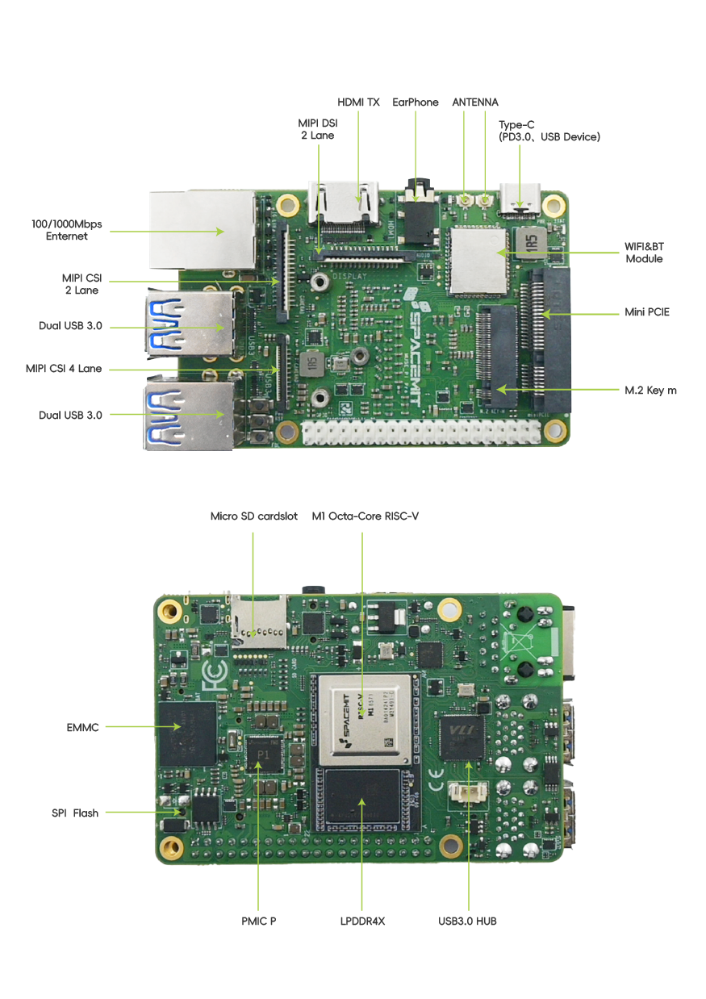
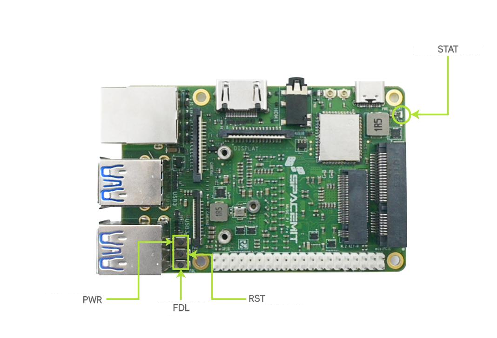

# MUSE Pi Pro User Guide

```
Last version: 2025/11/16
```

## 1. Introduction

**MUSE Pi Pro** is a single-board computer integrating a RISC-V 8-core processor, onboard storage, general-purpose interface components and expansion ports onto a single PCB. It supports UEFI boot, multiple operating systems and versatile applications, making it a complete standalone computing system.

MUSE Pi Pro comes in a compact 1.8-inch board form factor, designed to deliver efficient computing performance under low-power, space-constrained scenarios. It is especially suitable for large language model applications, robotics, education & research and IoT devices, providing essential computing power and extensive interface expansion for the new era of AI.

## 2. Hardware

### 2.1 Block Diagram


### 2.2 Physical Dimensions


> **Note.**
>
> - All dimensions are in mm
> - All dimensions are approximate and for reference purposes only
> - All dimensions should not be used for producing production data
> - All dimensions are subject to part and manufacturing tolerances
> - All dimensions may be subject to change
> - Not all the board components are shown, please refer to the physical diagram for a comprehensive    representation

### 3.3 Physical Diagram

MUSE Pi Pro looks like below.



> **Note:** The real appearance of MUSE Pi Pro might vary slightly depending on the hardware version.

### 3.4 Indicators & Buttons

<table>
<tbody>
<tr>
<td><strong>Indicator </strong>Status LED (STAT)</td>
<td><strong>Status Description</strong></td>
</tr>
<tr>
<td>Off</td>
<td>No power connected or system error</td>
</tr>
<tr>
<td>Solid green</td>
<td>System booted successfully and running normally</td>
</tr>
<tr>
<td>Solid green for 3s, then 1 blink</td>
<td>Boot error (SPI Flash content or communication issue)</td>
</tr>
<tr>
<td>Solid green for 3s, then 2 blinks</td>
<td>External RAM error (DDR communication issue or memory failure)</td>
</tr>
<tr>
<td>Solid green for 3s, then 3 blinks</td>
<td>Kernel error (invalid image or storage issue)</td>
</tr>
<tr>
<td>Solid green for 3s, then 4 blinks</td>
<td>Grub error (invalid or incompatible boot configuration)</td>
</tr>
</tbody>
</table>



### 3.5 Interfaces

#### Power & Programming Interface (PWR)

- **Type:** USB Type-C
- **Power Delivery:** Support for USB-PD protocol with 5V/3A, 9V/3A and 12V/3A input
- **Firmware Mode:** When entering programming mode, this port serves both as the power input and USB device interface. It connects to a host computer via USB Type-C and can be detected for firmware flashing and upgrade operations.

> **Notes.**
>
> - A USB cable that supports data transmission is required for programming. Charging-only cables are not supported.
> - To ensure system stability during upgrades, please use a USB power supply capable of delivering at least 10W.


#### Storage Expansion Interface (M.2-M Key)

- **Type:** 3.2mm-height M.2 connector
- **Protocol:** Support for NVMe
- **Form Factor:** 2230
- **Interface:** PCIe 2.0 x 2

> **Note.** SSDs are not hot-swappable, please install or remove the drive only when the system is powered off.


#### Display Interface (HDMI)

- **Type:** HDMI Type-A
- **Function:** Used for the UEFI boot configuration interface and desktop OS display
- **Resolution:** Support for 1080P@60Hz
- **Hot-Swap:** Supported

#### Display Interface (DISPLAY)

- **Type:** 15-pin, 1mm-pitch FPC connector
- **Interface:** MIPI DSI (2 lanes) with I²C channel, touch support included
- **Display Behavior:**

  - When only a MIPI display is connected, it acts as the primary screen
  - When both MIPI and HDMI displays are connected, the MIPI screen is set as the default primary display, with HDMI as the secondary (extended) screen
  - To make HDMI the primary display, adjustments can be made within the operating system

> **Note.** MIPI devices are not hot-swappable, please power off the system before installing or removing.


#### Camera Input Interface (CAMERA0)

- **Type:** 22-pin, 0.5mm-pitch FPC connector
- **Compatibility:** Support for camera modules as per list in the document **"****K1 Key Components AVL****"**
  

#### Camera Input Interface (CAMERA1)

- **Type:** 15-pin, 1mm-pitch FPC connector
- **Compatibility:** Support for camera modules as per list in the document **"****K1 Key Components AVL****"**


#### Audio Headphone Jack (AUDIO)

- **Type:** Standard 3.5mm headphone jack
- **Audio System:** Based on the ES8326 audio codec. User can select this channel and test audio output through the system settings interface.

#### Wired Ethernet Port (1G ETH)

- **Type:** RJ45 with yellow and green status LEDs
- **Speed:** Support for 1000Mbps / 100Mbps with auto-negotiation
- **Green LED - LINK SPEED indicator:**

  - **Solid green:** Link established at maximum speed
  - **Off:** Link established, but not at maximum speed
  - **No light:** No link established
- **Yellow LED - ACTIVE indicator:**

  - **Off:** No data transmission
  - **Blinking yellow:** Active data transmission (faster blinking = higher activity)
  - **No light:** No link established

#### USB3 Interface

- **Type:** USB Type-A
- **Features:** Plug-and-play, supporting USB 3.0 host protocol
- Support for multiple USB devices such as keyboard, mouse, external drive, USB camera, and USB computer stick
- For the full list of compatible USB devices, please refer to the document **"****K1 Key Components AVL****"**

#### High-Speed Expansion Interface (miniPCIe)

- **Type:** 9.9mm High miniPCIe connector
- **Features:** Supports for both USB 2.0 and PCIe 2.0 x 1
- For the list of compatible USB and PCIe devices, please refer to the document **"****K1 Key Components AVL****"**
- Can install standard miniPCIe full-width modules

> **Note:** MiniPCIe devices are not hot-swappable. Please ensure the system is powered off before removing or installing devices.


### General Purpose Input/Output Interface (GPIO)

- **Type:** 2.54mm pitch, 2 x 20 pin header
- **Features:**

  - PIN2 and PIN4 provide 5V power and can be used for fan or expansion board power supply, with a maximum output current of 1A
  - PIN6, PIN8 and PIN10 are GND, debugUART\_Tx (transmit side) and debugUART\_Rx (receive side) respectively, and can be used for debugging serial communication
- For more information on GPIO usage, please refer to **this documentation link**
- To facilitate peripheral expansion for users, the extended I/O functionality has been defined. Please refer to **this documentation link** for more information.
- The GPIO voltage level is 3.3V, supporting multi-function pin multiplexing. The pin definitions and resources are shown below.


## 3. Quick Start

### 3.1 Precautions

The MUSE Pi Pro is suitable for home, office or industrial environments. Before starting operation, please read the following precautions:

- Never hot-swap the screen interface, CSI interface or expansion boards.
- Before unpacking and installing the single-board computer, take necessary anti-static precautions to prevent electrostatic discharge (ESD) from damaging the hardware.
- When handling the single-board computer, hold the edges and avoid touching exposed metal parts to prevent electrostatic damage to components.
- Place the single-board computer on a dry and flat surface, and keep it away from heat sources, electromagnetic interference, radiation sources and sensitive equipment (e.g. medical devices).
- Place the single-board computer in a well-ventilated environment. If running continuously for 72 hours or more at full load, install the factory cooling solution or implement effective cooling measures.

### 3.2 Preparation

Since MUSE Pi Pro is a single-board computer, some peripherals are needed for working with it, in particular:

- A power supply
- A display
- An HDMI cable
- A keyboard
- A mouse


### 3.3 Start Up

Once all necessary peripherals are connected, simply power on MUSE Pi Pro to start up.

After powering on at the first time, MUSE Pi Pro needs some configurations as described in the following section.

### 3.4 Configuring MUSE Pi Pro At The First Boot

MUSE Pi Pro supports UEFI boot and configuration. After powering on, the boot medium can be selected and the computer setup can be personalized.

Within 3 seconds of powering on, press the **F2 key** to enter the UEFI setup interface.


#### UEFI Configuration Guide

The following functions are available:

- **Boot Manager Menu**
  Enter the Boot Manager menu, then use the **↑ **and** ↓ keys** to select the boot medium among

  - EMMC storage
  - SSD
  - USB drive
  - SD card

  then confirm the selection by pressing the **Enter key.**
  
  It is also possible to enter the UEFI shell command line interface.
- **Boot Maintenance Manager Menu**
  Enter the Boot Maintenance Manager menu, then select "**Boot Options**," then choose "**Change Boot Order**" to set the boot medium priority. Use **+** and **- keys** to adjust the boot order.
  After pressing the **Enter key**, select "**Commit Change and Exit**" to apply the changes and exit, returning to the main menu. Press the **F10 key** to save the settings.
  
- **UEFI Interactive Shell**
  MUSE Pi Pro supports UEFI Interactive Shell V2.2.
  Upon first entering the UEFI Interactive Shell, all detected storage devices will be displayed.
  After pressing any key (except **Esc**) or waiting 5 seconds, the EFI Shell will be ready to execute commands.
  Type "**help**" to display the supported commands and related help information.
  

> **Notes.**
>
> 1. Open source **UEFI** firmware repository for **Bianbu Linux**:
>    - [edk2](https://gitee.com/bianbu-linux/edk2)
>    - [edk2-platforms](https://gitee.com/bianbu-linux/edk2-platforms)
>
> 2. **UEFI** firmware development for **MUSE Pi Pro**:
>    - [UEFI Open Source Series - Part 3](https://mp.weixin.qq.com/s/s7S3pQesObrmAF_56Cq9Lg)

#### Bianbu Desktop OS Configuration Guide

If the **F2 key** is not pressed within 3 seconds after powering on the MUSE Pi Pro, by default it will boot from the onboard storage medium and launch the pre-installed Bianbu Desktop operating system.

A configuration wizard will be run upon first startup that includes the following steps.

##### System Language

Choose the system language. English and Chinese are displayed by default. If need more language options, just click the three dots below to show them.


##### Input Method

Configure the MUSE Pi Pro’s keyboard layout and input method.


##### Wireless Internet Connection

Select a valid Wi-Fi network from the list and connect it. If there is no suitable Wi-Fi network, skip this setting by clicking on the upper right corner.


##### Location Services

Turn on location services can facilitate the usage experience, but it may also bring risks of location privacy leakage. Please be aware and careful!


##### Time Zone

Configure user time zone information. While online (i.e. Wi-Fi connected), the system can automatically synchronize the corresponding time zone, then user can search for cities to add settings.


##### Username & Password Account

Set username and password


##### Configuration completed

When the configuration is completed, click “Start using Bianbu” thus MUSE Pi Pro will enter the desktop of Biandu OS.


## 4. Firmware Flashing & Serial Port Debugging

### 4.1 Flashing Process

#### Via USB Type-C Cable

- When the device is powered off,

  - Press and hold the **Firmware Download (FDL)** button without releasing it
  - Connect the USB Type-C cable to the device and the host computer, which also supplies power to turn on the device itself
  - Release the **Firmware Download (FDL)** button
  - Use

    - Either the official **Titan Flasher** tool provided by **SpacemiT** as per description in the [related documentation](https://developer.spacemit.com/documentation?token=B9JCwRM7RiBapHku6NfcPCstnqh)
    - Or the **fastboot** command

    to proceed with the firmware flashing operation
- When the device is powered on and connected to the USB Type-C cable for power,

  - Press and hold the **Firmware Download (FDL)** button without releasing it
  - Press shortly the **Reset (RST)** button
  - Release the **Firmware Download (FDL)** button
  - Use

    - Either the official **Titan Flashe**r tool provided by **SpacemiT** as per description in the [related documentation](https://developer.spacemit.com/documentation?token=B9JCwRM7RiBapHku6NfcPCstnqh)
    - Or the **fastboot** command

    to proceed with the firmware flashing operation


### 4.2 Serial Port Debugging

#### Interface Connection

The host computer is normally connected to the TX, RX and GND of the MUSE Pi via the USB to TTL device. The signal interface connection is shown below.


#### Debugging Under Windows OS

Let’s take the “**MobaXterm**” software tool as example.

Firstly, please connect the hardware serial port correctly and confirm that there is a COM port displayed in the port list of the device manager, as shown below.


Open the “MobaXterm” software tool then select “Sessions” - “New Session” (1) in the screen appearing. In the pop-up dialog box appearing,

- Select “Serial” (2)
- Select the corresponding COM port identified above for “Serial port” (3)
- Select “115200” for “Speed” (4)
- Click “OK” (5)

as shown below.


Thus the print page will be entered as shown below.


## 5. Precautions

The MUSE Pi Pro is designed for home, office, and industrial environments. Before operation, please read the following precautions:

1. Do not hot-plug the display interface, CSI interface, or any expansion board under any circumstances.

2. Before unboxing and installing the single-board computer, take appropriate electrostatic discharge (ESD) protection measures to prevent hardware damage.

3. When handling the single-board computer, hold it by the edges. Avoid touching any exposed metal components to prevent potential ESD damage to onboard devices.

4. Place the board on a dry, flat surface, ensuring it is kept away from heat sources, electromagnetic interference (EMI), radiation sources, and EMI-sensitive equipment (e.g., medical devices).

5. Ensure proper ventilation. For continuous full-load operation of 72 hours or longer, install the original heatsink or apply sufficient and effective cooling measures.

## 6. Open-Source Resources

**Structure Drawing:**


## 7. Appendix — Interface Pin Assignments

### 7.1 MIPI CSI High-Speed Connectors

The MUSE Pi Pro is equipped with one 4-lane MIPI CSI (FPC 22-pin) interface and one 2-lane MIPI CSI (FPC 15-pin) interface.


**15-Pin High-Speed Connector Pin Assignment**：

| pin | Signal Name |
|-----|----------|
| 1 | GND |
| 2 | MIPI_CSI3_DN0 |
| 3 | MIPI_CSI3_DP0 |
| 4 | GND |
| 5 | MIPI_CSI3_DN1 |
| 6 | MIPI_CSI3_DP1 |
| 7 | GND |
| 8 | MIPI_CSI3_CLKN |
| 9 | MIPI_CSI3_CLKP |
| 10 | GND |
| 11 | CAMERA1_PDN |
| 12 | CAM_MCLK1 |
| 13 | CAM_I2C1_SCL_3V3 |
| 14 | CAM_I2C1_SDA_3V3 |
| 15 | CSI_VCC33 |


**22-Pin High-Speed Connector Pin Assignment**：

| pin | Signal Name |
|-----|----------|
| 1 | GND |
| 2 | MIPI_CSI1_DN0 |
| 3 | MIPI_CSI1_DP0 |
| 4 | GND |
| 5 | MIPI_CSI1_DN1 |
| 6 | MIPI_CSI1_DP1 |
| 7 | GND |
| 8 | MIPI_CSI1_CLKN |
| 9 | MIPI_CSI1_CLKP |
| 10 | GND |
| 11 | MIPI_CSI1_DN2 |
| 12 | MIPI_CSI1_DP2 |
| 13 | GND |
| 14 | MIPI_CSI1_DN3 |
| 15 | MIPI_CSI1_DP3 |
| 16 | GND |
| 17 | CAMERA0_PDN |
| 18 | CAM_MCLK0 |
| 19 | GND |
| 20 | CAM_I2C0_SCL_1833 |
| 21 | CAM_I2C0_SDA_1833 |
| 22 | CSI_VCC33 |

### 7.2 MIPI DSI Display Connector

The MUSE Pi Pro includes one 2-lane MIPI DSI FPC 15-pin interface.


**MIPI DSI FPC 15-Pin High-Speed Connector Pin Assignment**：

| pin | Signal Name |
|-----|----------|
| 1 | GND |
| 2 | MIPI_DSI1_LANE1_DN |
| 3 | MIPI_DSI1_LANE1_DP |
| 4 | GND |
| 5 | MIPI_DSI1_CLK_N |
| 6 | MIPI_DSI1_CLK_P |
| 7 | GND |
| 8 | MIPI_DSI1_LANE0_DN |
| 9 | MIPI_DSI1_LANE0_DP |
| 10 | GND |
| 11 | AP_I2C5_SCL_3V3 |
| 12 | AP_I2C5_SDA_3V3 |
| 13 | GND |
| 14 | LCD_VCC33 |
| 15 | LCD_VCC33 |

### 7.3 40pin Header

The development board supports a 40-pin dual-row header. The pin assignments are as follows:


| pin | Signal Name | Signal Name | pin |
|-----|----------|----------|-----|
| 1 | VCC3V3_SYS | VCC5V0_OUT | 2 |
| 3 | AP_I2C4_SDA_3V3 | VCC5V0_OUT | 4 |
| 5 | AP_I2C4_SCL_3V3 | GND | 6 |
| 7 | GPIO_70_3V3 | UART0_TXD_3V3 | 8 |
| 9 | GND | UART0_RXD_3V3 | 10 |
| 11 | GPIO_71_3V3 | GPI0_74_3V3 | 12 |
| 13 | GPIO_72_3V3 | GND | 14 |
| 15 | GPIO_73_3V3 | GPIO_91_3V3 | 16 |
| 17 | VCC3V3_SYS | GPIO_92_3V3 | 18 |
| 19 | SPI3_MOSI_3V3 | GND | 20 |
| 21 | SPI3_MISO_3V3 | GPIO_49_3V3 | 22 |
| 23 | SPI3_SCLK_3V3 | SPI3_CS_3V3 | 24 |
| 25 | GND | GPIO_50_3V3 | 26 |
| 27 | AP_I2C3_SDA_3V3 | AP_I2C3_SCL_3V3 | 28 |
| 29 | GPIO_51_3V3 | GND | 30 |
| 31 | GPIO_52_3V3 | GPIO_34_3V3 | 32 |
| 33 | GPIO_47_3V3 | GND | 34 |
| 35 | GPIO_48_3V3 | GPIO_35_3V3 | 36 |
| 37 | GPIO_33_3V3 | GPIO_46_3V3 | 38 |
| 39 | GND | GPIO_37_3V3 | 40 |

### 7.4 UART Debug Interface

The board provides UART debugging via Pin 6, 8, and 10 of the 40-pin header for X60 debugging.
On the host controller side, the pin order from top to bottom is:
GND → RX → TX

