# MUSE Pi Pro User Guide

```
Last version: 2025/12/10
```

## 1. Introduction

**MUSE Pi Pro** is a single-board computer integrating a RISC-V 8-core processor, onboard storage, general-purpose interface components and expansion ports onto a single PCB. It supports UEFI boot, multiple operating systems and versatile applications, making it a complete standalone computing system.

MUSE Pi Pro comes in a compact 1.8-inch board form factor, designed to deliver efficient computing performance under low-power, space-constrained scenarios. It is especially suitable for large language model applications, robotics, education & research and IoT devices, providing essential computing power and extensive interface expansion for the new era of AI.

## 2. Hardware

### 2.1 On-Board Resources Overview

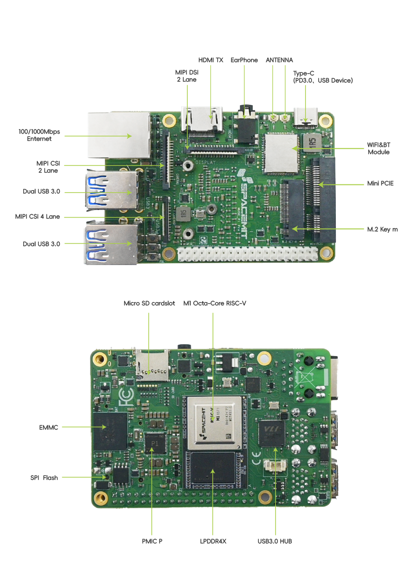

> **Note:** Board appearance may vary slightly between hardware revisions.

### 2.2 Indicators and Buttons

#### LED Indicators

| LED   | Description       |
| ------ | -------- |
| **STAT (System Status)** | - **Off:** No power or hardware fault<br>- **Solid green:** System booted and running normally<br>- **Solid green for 3s → 1 blink:** Boot error (SPI Flash content or communication failure)<br>- **Solid green for 3s → 2 blinks:** External RAM error (DDR communication failure or memory damage)<br>- **Solid green for 3s → 3 blinks:** Kernel error (invalid image or storage corruption)<br>- **Solid green for 3s → 4 blinks:** GRUB/bootloader error (invalid or incompatible boot content) |

#### Buttons

| Button   | Description    |
| ---------- | -------- |
| **PWR (Power Button)**      | - **Shutdown → 1s press:** Power on<br>- **Standby → 1s press:** Wake up<br>- **Normal operation → 3s press:** Forced power-off |
| **RST (Reset Button)**      | - **Short press:** System reset (cold reboot)                                                                                   |
| **FDL (Firmware Download)** | - **Hold while powering on / resetting:** Enter firmware flashing mode                                                          |

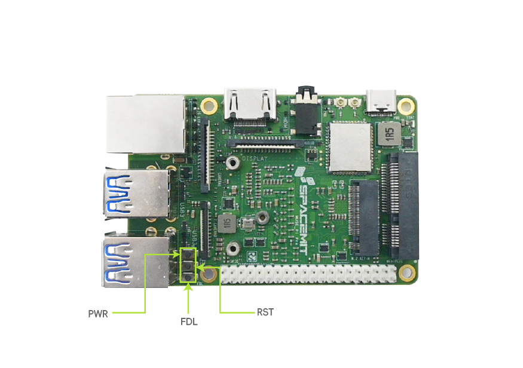

### 2.3 Interface Description

#### Power & Firmware Download Port (PWR)

- Connector type: **USB Type-C**
- Supports **USB-PD** power profiles: 5V/3A, 9V/3A, 12V/3A
- In firmware download mode, the port functions as both **power input** and **USB Device**, allowing the host PC to detect the board and perform flashing operations.

> **Important:**
>
> - A USB cable with **data lines** is required. Charge-only cables are not supported for flashing.
> - To ensure reliable system upgrade, use a USB power source capable of **≥10W**.

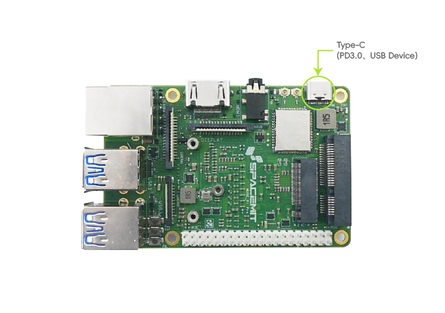

### M.2 M-Key Storage Expansion

- Connector: **M.2 (Key-M), height 3.2 mm**
- Supports **NVMe protocol**, 2230 form-factor SSDs
- PCIe 2.0 ×2 bandwidth

> **Important:** Hot-plug is **not supported**. Install or remove SSDs only when power is off.

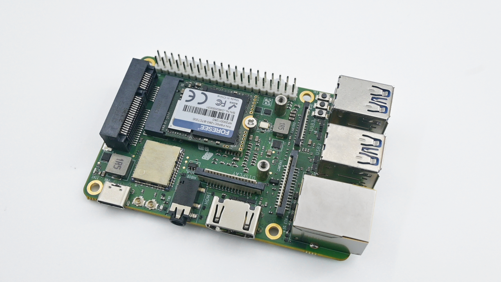

#### HDMI Display Output

- Connector type: **HDMI Type-A**
- Used for UEFI boot configuration display
- Desktop OS display supports **1080p @ 60Hz**
- Hot-plug supported

#### MIPI DSI Display Interface (DISPLAY)

- Connector: **15-pin, 1.0 mm FFC**
- **MIPI DSI 2-lane**, includes I²C control channel and touch support
- When only a MIPI panel is connected → it becomes the **primary display**
- When both MIPI and HDMI displays are connected → MIPI is the **default primary -isplay**; HDMI acts as extended display
  (primary display can be changed in OS settings)

> **Important:** Hot-plug for MIPI devices is **not supported**.


#### Camera Interface CAMERA0

- Connector: **22-pin, 0.5 mm FFC**
- Compatible camera modules listed in:
  **K1 AVL – Key Component List**


#### Camera Interface CAMERA1

- Connector: **15-pin, 1.0 mm FFC**
- Compatible camera modules listed in the **K1 AVL**


#### Audio Interface (AUDIO)

- Standard **3.5 mm TRRS audio jack**
- Backed by **ES8326** audio codec
- Selectable in the system audio settings for playback/recording tests

#### 1G Ethernet Port (1G ETH)

- Connector: **RJ45 with LED indicators**
- Supports **1000M/100M**, auto-negotiation

**Green LED (LINK SPEED):**

1. Solid green → Link established at highest supported speed
2. Off → Link established but not at top speed
3. Off when no link is established

**Yellow LED (ACTIVE):**

1. Off → No data traffic
2. Blinking → Active data transfer (faster blinking = higher traffic)
3. Off when no link is established

#### USB3 Host Interface

- Connector: **USB Type-A**
- Supports **USB 3.0 Host**
- Compatible with multiple devices simultaneously (keyboard, mouse, drive, USB camera, compute stick, etc.)
- Device compatibility list: **K1 AVL**

#### miniPCIe Expansion Slot

- Connector: **miniPCIe, height 9.9 mm**
- Supports **USB 2.0** and **PCIe 2.0 ×1**
- Compatible with standard full-size miniPCIe modules (4G/5G, wireless, network cards)

> **Important:** Hot-plug is **not supported**.

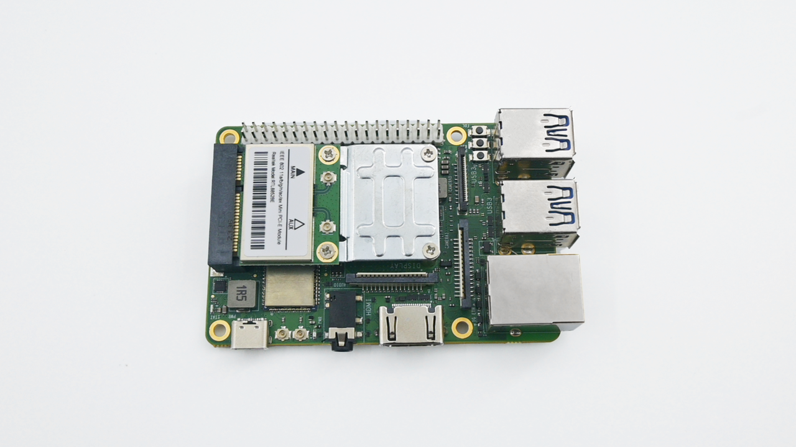

#### GPIO Header

- Connector: **2×20, 2.54 mm pitch**
- **PIN2 / PIN4:** 5V output (up to 1A) for fans or expansion boards
- **PIN6 / PIN8 / PIN10:** GND / debugUART_TX / debugUART_RX
- GPIO usage and driver documentation:
  [https://bianbu-linux.spacemit.com/development_guide/peripheral_driver/](https://bianbu-linux.spacemit.com/development_guide/peripheral_driver/)
- Extended IO definition:
  [https://bianbu.spacemit.com/bianbu-star/user_guide/defaut_pin/](https://bianbu.spacemit.com/bianbu-star/user_guide/defaut_pin/)
- GPIO voltage domain: **3.3V**, supports multi-function pinmux


### 2.4 Product Specifications

| Item    | Specification   |
| ------ | --- |
| **Processor**          | SpacemiT M1, 8-core 64-bit RISC-V processor, integrated **2.0 TOPS AI compute**                                                                                      |
| **Display**            | HDMI 1.4 Type-A, up to **1080p60**<br>2-lane MIPI DSI, up to **1080p60**                                                                                             |
| **Memory**             | LPDDR4X @ 2400 MT/s, **8 GB / 16 GB** options                                                                                                                        |
| **On-board Storage**   | eMMC 5.1, **64 GB / 128 GB** options                                                                                                                                 |
| **Storage Expansion**  | M.2 M-Key for 2230 NVMe SSD<br>MicroSD slot supporting **UHS-II**                                                                                                    |
| **Wireless**           | On-board Wi-Fi 6 + Bluetooth 5.2<br>Optional dual-wireless via M.2 / miniPCIe                                                                                        |
| **Ethernet**           | 1× RJ45, 1 Gbps / 100 Mbps auto-negotiation                                                                                                                          |
| **Audio**              | 3.5 mm headset interface                                                                                                                                             |
| **USB**                | Four **USB 3.0** Type-A host ports<br>One **USB 2.0 Type-C** device port                                                                                             |
| **Debug Interfaces**   | UART TTL Debug + hardware buttons (Reset / Power / FDL)                                                                                                              |
| **IO Expansion**       | - M.2 M-Key slot for SSD / PCIe adapters<br>- miniPCIe slot for 4G/5G / Wi-Fi / network cards<br>- 40-pin GPIO header                                                |
| **MIPI Interfaces**    | 1× 2-lane MIPI DSI (15-pin)<br>1× 4-lane MIPI CSI (22-pin)<br>1× 2-lane MIPI CSI (15-pin)                                                                            |
| **Form Factor**        | Single-board computer, **FEMTO-ITX**, 85 mm × 56 mm                                                                                                                  |
| **Operating Systems**  | Bianbu Desktop, Ubuntu, OpenKylin, Deepin, Fedora                                                                                                                    |
| **Power Input**        | USB-PD supported                                                                                                                                                     |
| **Reliability**        | Interfaces protected to **±4kV contact**, **±8kV air** (ESD)<br>Meets **CE / FCC** EMC standards<br>Temperature options: Consumer −20°C~70°C / Industrial −40°C~85°C |
| **Mechanical Options** | Passive/active cooling<br>Metal or acrylic chassis<br>Optional touchscreen or industrial terminal accessories                                                        |

### 2.5 Block Diagram


## 3. Quick Start

### 3.1 Precautions

The MUSE Pi Pro is suitable for home, office or industrial environments. Before starting operation, please read the following precautions:

- Never hot-swap the screen interface, CSI interface or expansion boards.
- Before unpacking and installing the single-board computer, take necessary anti-static precautions to prevent electrostatic discharge (ESD) from damaging the hardware.
- When handling the single-board computer, hold the edges and avoid touching exposed metal parts to prevent electrostatic damage to components.
- Place the single-board computer on a dry and flat surface, and keep it away from heat sources, electromagnetic interference, radiation sources and sensitive equipment (e.g. medical devices).
- Place the single-board computer in a well-ventilated environment. If running continuously for 72 hours or more at full load, install the factory cooling solution or implement effective cooling measures.

### 3.2 Preparation

Since MUSE Pi Pro is a single-board computer, some peripherals are needed for working with it, in particular:

- A power supply
- A display
- An HDMI cable
- A keyboard
- A mouse

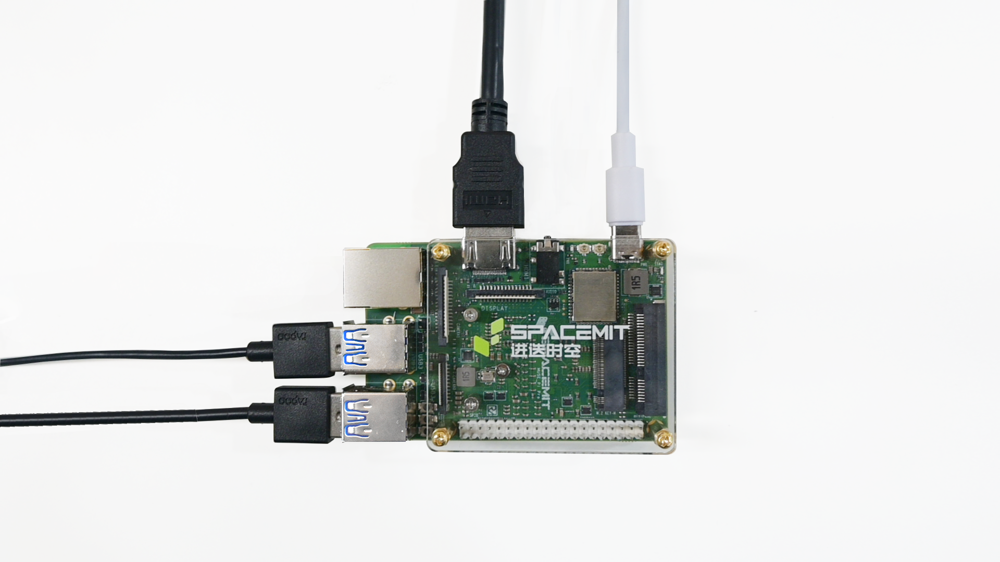

### 3.3 Start Up

Once all necessary peripherals are connected, simply power on MUSE Pi Pro to start up.

After powering on at the first time, MUSE Pi Pro needs some configurations as described in the following section.

### 3.4 Configuring MUSE Pi Pro At The First Boot

MUSE Pi Pro supports UEFI boot and configuration. After powering on, the boot medium can be selected and the computer setup can be personalized.

Within 3 seconds of powering on, press the **F2 key** to enter the UEFI setup interface.

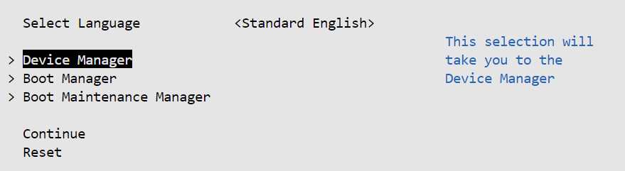

#### UEFI Configuration Guide

The following functions are available:

- **Boot Manager Menu**
  Enter the Boot Manager menu, then use the **↑ **and** ↓ keys** to select the boot medium among

  - EMMC storage
  - SSD
  - USB drive
  - SD card

  then confirm the selection by pressing the **Enter key.**
  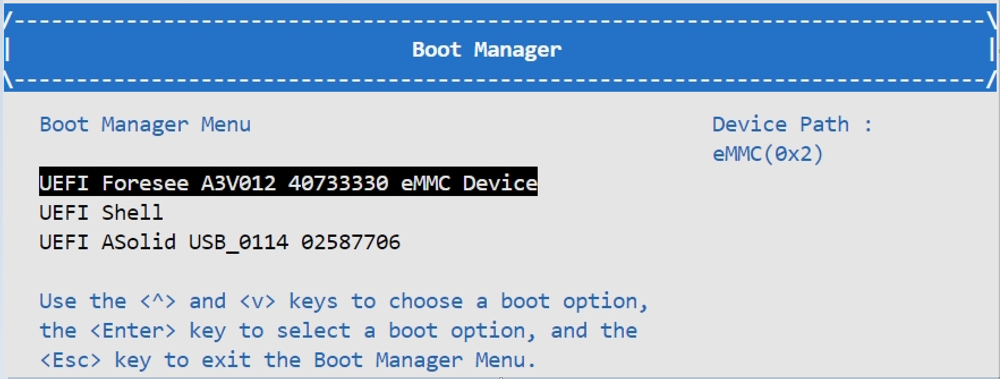
  It is also possible to enter the UEFI shell command line interface.
- **Boot Maintenance Manager Menu**
  Enter the Boot Maintenance Manager menu, then select "**Boot Options**," then choose "**Change Boot Order**" to set the boot medium priority. Use **+** and **- keys** to adjust the boot order.
  After pressing the **Enter key**, select "**Commit Change and Exit**" to apply the changes and exit, returning to the main menu. Press the **F10 key** to save the settings.
  
- **UEFI Interactive Shell**
  MUSE Pi Pro supports UEFI Interactive Shell V2.2.
  Upon first entering the UEFI Interactive Shell, all detected storage devices will be displayed.
  After pressing any key (except **Esc**) or waiting 5 seconds, the EFI Shell will be ready to execute commands.
  Type "**help**" to display the supported commands and related help information.
  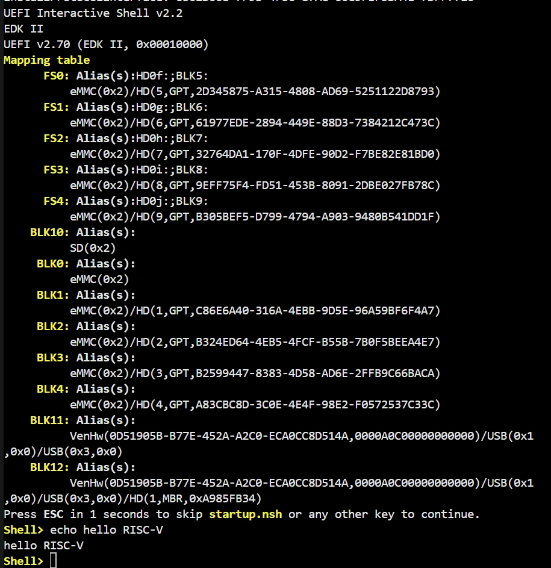

> **Notes.**
>
> 1. Open source **UEFI** firmware repository for **Bianbu Linux**:
>    - [edk2](https://gitee.com/bianbu-linux/edk2)
>    - [edk2-platforms](https://gitee.com/bianbu-linux/edk2-platforms)
>
> 2. **UEFI** firmware development for **MUSE Pi Pro**:
>    - [UEFI Open Source Series - Part 3](https://mp.weixin.qq.com/s/s7S3pQesObrmAF_56Cq9Lg)

#### Bianbu Desktop OS Configuration Guide

If the **F2 key** is not pressed within 3 seconds after powering on the MUSE Pi Pro, by default it will boot from the onboard storage medium and launch the pre-installed Bianbu Desktop operating system.

A configuration wizard will be run upon first startup that includes the following steps.

##### System Language

Choose the system language. English and Chinese are displayed by default. If need more language options, just click the three dots below to show them.


##### Input Method

Configure the MUSE Pi Pro’s keyboard layout and input method.


##### Wireless Internet Connection

Select a valid Wi-Fi network from the list and connect it. If there is no suitable Wi-Fi network, skip this setting by clicking on the upper right corner.


##### Location Services

Turn on location services can facilitate the usage experience, but it may also bring risks of location privacy leakage. Please be aware and careful!


##### Time Zone

Configure user time zone information. While online (i.e. Wi-Fi connected), the system can automatically synchronize the corresponding time zone, then user can search for cities to add settings.

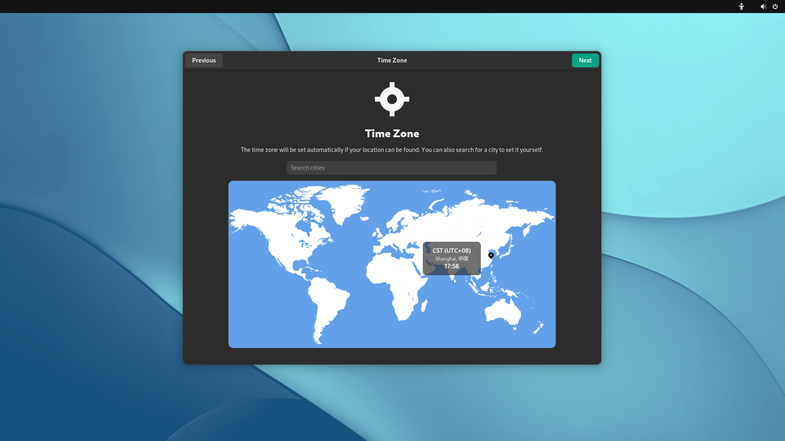

##### Username & Password Account

Set username and password


##### Configuration completed

When the configuration is completed, click “Start using Bianbu” thus MUSE Pi Pro will enter the desktop of Biandu OS.

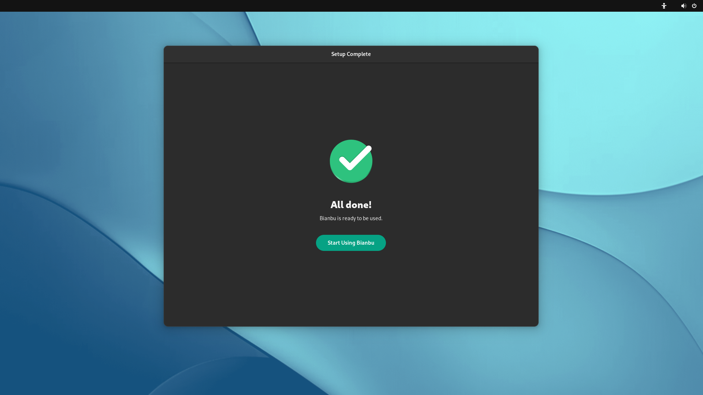

## 4. Firmware Flashing & Serial Port Debugging

### 4.1 Flashing Process

#### Via USB Type-C Cable

- When the device is powered off,

  - Press and hold the **Firmware Download (FDL)** button without releasing it
  - Connect the USB Type-C cable to the device and the host computer, which also supplies power to turn on the device itself
  - Release the **Firmware Download (FDL)** button
  - Use

    - Either the official **Titan Flasher** tool provided by **SpacemiT** as per description in the [related documentation](https://developer.spacemit.com/documentation?token=B9JCwRM7RiBapHku6NfcPCstnqh)
    - Or the **fastboot** command

    to proceed with the firmware flashing operation
- When the device is powered on and connected to the USB Type-C cable for power,

  - Press and hold the **Firmware Download (FDL)** button without releasing it
  - Press shortly the **Reset (RST)** button
  - Release the **Firmware Download (FDL)** button
  - Use

    - Either the official **Titan Flashe**r tool provided by **SpacemiT** as per description in the [related documentation](https://developer.spacemit.com/documentation?token=B9JCwRM7RiBapHku6NfcPCstnqh)
    - Or the **fastboot** command

    to proceed with the firmware flashing operation


### 4.2 Serial Port Debugging

#### Interface Connection

The host computer is normally connected to the TX, RX and GND of the MUSE Pi via the USB to TTL device. The signal interface connection is shown below.

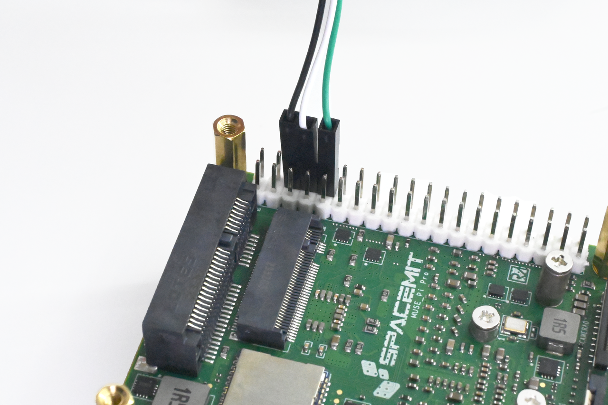

#### Debugging Under Windows OS

Let’s take the “**MobaXterm**” software tool as example.

Firstly, please connect the hardware serial port correctly and confirm that there is a COM port displayed in the port list of the device manager, as shown below.

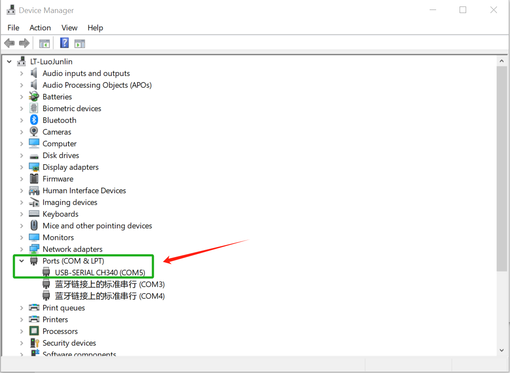

Open the “MobaXterm” software tool then select “Sessions” - “New Session” (1) in the screen appearing. In the pop-up dialog box appearing,

- Select “Serial” (2)
- Select the corresponding COM port identified above for “Serial port” (3)
- Select “115200” for “Speed” (4)
- Click “OK” (5)

as shown below.

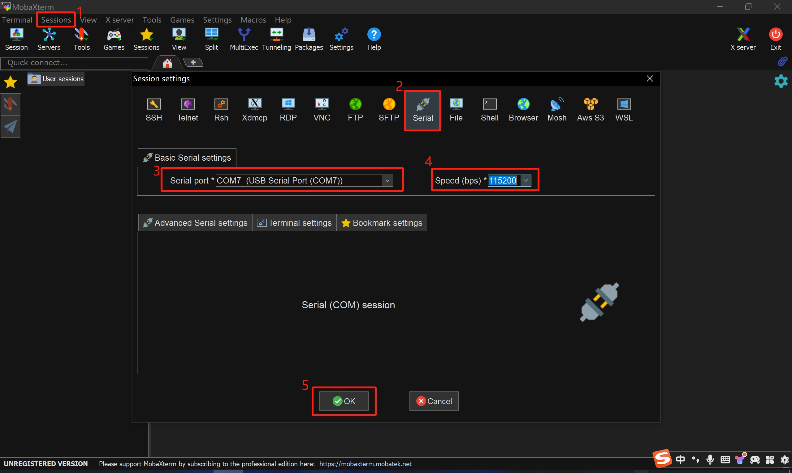

Thus the print page will be entered as shown below.

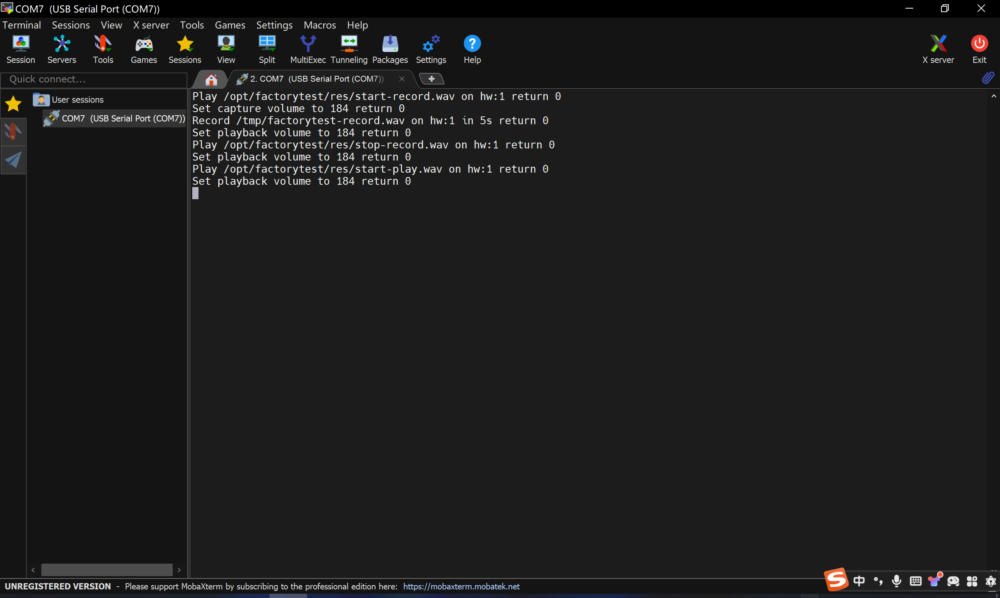

## 5. Precautions

The MUSE Pi Pro is designed for home, office, and industrial environments. Before operation, please read the following precautions:

1. Do not hot-plug the display interface, CSI interface, or any expansion board under any circumstances.

2. Before unboxing and installing the single-board computer, take appropriate electrostatic discharge (ESD) protection measures to prevent hardware damage.

3. When handling the single-board computer, hold it by the edges. Avoid touching any exposed metal components to prevent potential ESD damage to onboard devices.

4. Place the board on a dry, flat surface, ensuring it is kept away from heat sources, electromagnetic interference (EMI), radiation sources, and EMI-sensitive equipment (e.g., medical devices).

5. Ensure proper ventilation. For continuous full-load operation of 72 hours or longer, install the original heatsink or apply sufficient and effective cooling measures.

## 6. Open-Source Resources

**Structure Drawing:**

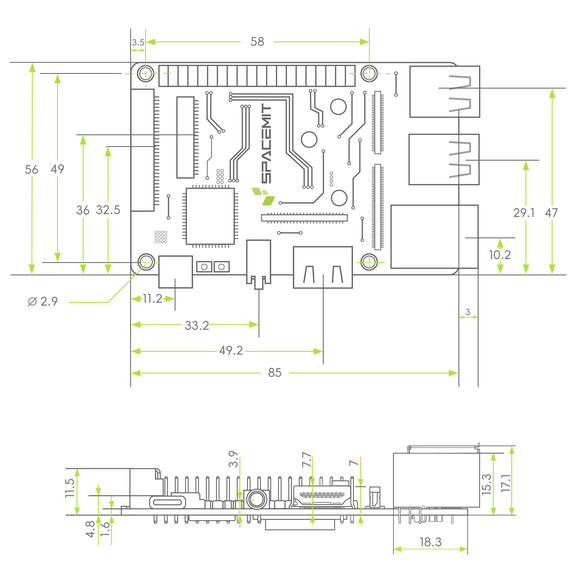

## 7. Appendix — Interface Pin Assignments

### 7.1 MIPI CSI High-Speed Connectors

The MUSE Pi Pro is equipped with one 4-lane MIPI CSI (FPC 22-pin) interface and one 2-lane MIPI CSI (FPC 15-pin) interface.


**15-Pin High-Speed Connector Pin Assignment**：

| pin | Signal Name |
|-----|----------|
| 1 | GND |
| 2 | MIPI_CSI3_DN0 |
| 3 | MIPI_CSI3_DP0 |
| 4 | GND |
| 5 | MIPI_CSI3_DN1 |
| 6 | MIPI_CSI3_DP1 |
| 7 | GND |
| 8 | MIPI_CSI3_CLKN |
| 9 | MIPI_CSI3_CLKP |
| 10 | GND |
| 11 | CAMERA1_PDN |
| 12 | CAM_MCLK1 |
| 13 | CAM_I2C1_SCL_3V3 |
| 14 | CAM_I2C1_SDA_3V3 |
| 15 | CSI_VCC33 |

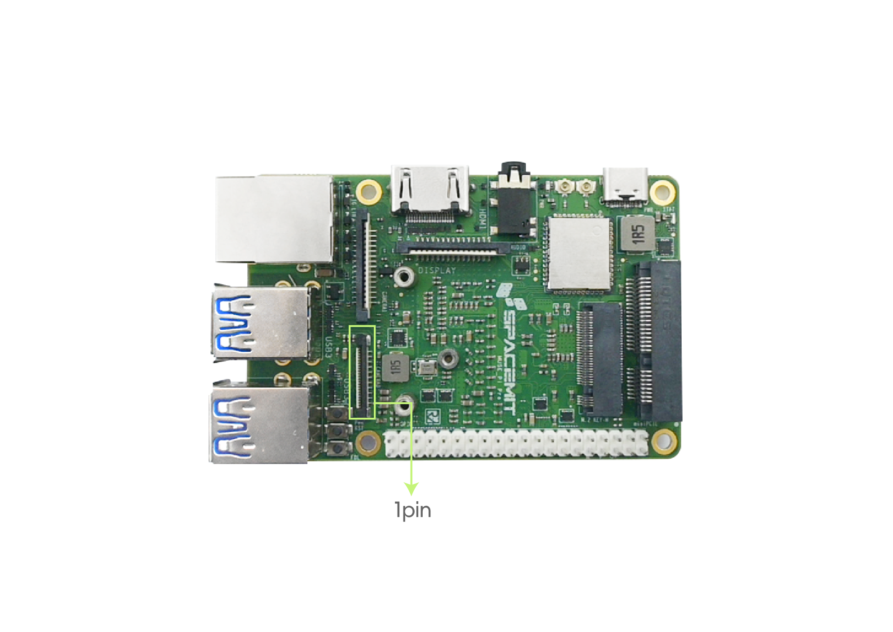

**22-Pin High-Speed Connector Pin Assignment**：

| pin | Signal Name |
|-----|----------|
| 1 | GND |
| 2 | MIPI_CSI1_DN0 |
| 3 | MIPI_CSI1_DP0 |
| 4 | GND |
| 5 | MIPI_CSI1_DN1 |
| 6 | MIPI_CSI1_DP1 |
| 7 | GND |
| 8 | MIPI_CSI1_CLKN |
| 9 | MIPI_CSI1_CLKP |
| 10 | GND |
| 11 | MIPI_CSI1_DN2 |
| 12 | MIPI_CSI1_DP2 |
| 13 | GND |
| 14 | MIPI_CSI1_DN3 |
| 15 | MIPI_CSI1_DP3 |
| 16 | GND |
| 17 | CAMERA0_PDN |
| 18 | CAM_MCLK0 |
| 19 | GND |
| 20 | CAM_I2C0_SCL_1833 |
| 21 | CAM_I2C0_SDA_1833 |
| 22 | CSI_VCC33 |

### 7.2 MIPI DSI Display Connector

The MUSE Pi Pro includes one 2-lane MIPI DSI FPC 15-pin interface.

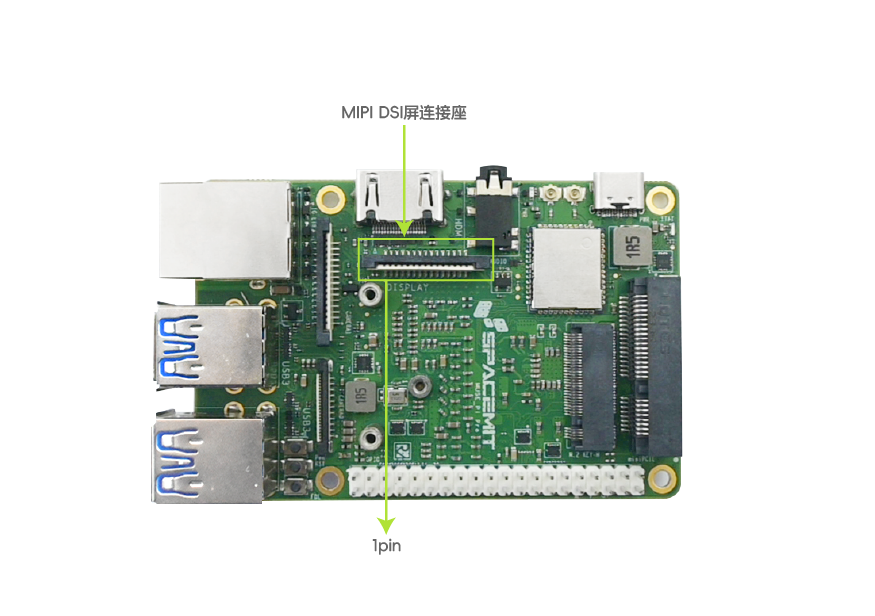

**MIPI DSI FPC 15-Pin High-Speed Connector Pin Assignment**：

| pin | Signal Name |
|-----|----------|
| 1 | GND |
| 2 | MIPI_DSI1_LANE1_DN |
| 3 | MIPI_DSI1_LANE1_DP |
| 4 | GND |
| 5 | MIPI_DSI1_CLK_N |
| 6 | MIPI_DSI1_CLK_P |
| 7 | GND |
| 8 | MIPI_DSI1_LANE0_DN |
| 9 | MIPI_DSI1_LANE0_DP |
| 10 | GND |
| 11 | AP_I2C5_SCL_3V3 |
| 12 | AP_I2C5_SDA_3V3 |
| 13 | GND |
| 14 | LCD_VCC33 |
| 15 | LCD_VCC33 |

### 7.3 40pin Header

The development board supports a 40-pin dual-row header. The pin assignments are as follows:


| pin | Signal Name | Signal Name | pin |
|-----|----------|----------|-----|
| 1 | VCC3V3_SYS | VCC5V0_OUT | 2 |
| 3 | AP_I2C4_SDA_3V3 | VCC5V0_OUT | 4 |
| 5 | AP_I2C4_SCL_3V3 | GND | 6 |
| 7 | GPIO_70_3V3 | UART0_TXD_3V3 | 8 |
| 9 | GND | UART0_RXD_3V3 | 10 |
| 11 | GPIO_71_3V3 | GPI0_74_3V3 | 12 |
| 13 | GPIO_72_3V3 | GND | 14 |
| 15 | GPIO_73_3V3 | GPIO_91_3V3 | 16 |
| 17 | VCC3V3_SYS | GPIO_92_3V3 | 18 |
| 19 | SPI3_MOSI_3V3 | GND | 20 |
| 21 | SPI3_MISO_3V3 | GPIO_49_3V3 | 22 |
| 23 | SPI3_SCLK_3V3 | SPI3_CS_3V3 | 24 |
| 25 | GND | GPIO_50_3V3 | 26 |
| 27 | AP_I2C3_SDA_3V3 | AP_I2C3_SCL_3V3 | 28 |
| 29 | GPIO_51_3V3 | GND | 30 |
| 31 | GPIO_52_3V3 | GPIO_34_3V3 | 32 |
| 33 | GPIO_47_3V3 | GND | 34 |
| 35 | GPIO_48_3V3 | GPIO_35_3V3 | 36 |
| 37 | GPIO_33_3V3 | GPIO_46_3V3 | 38 |
| 39 | GND | GPIO_37_3V3 | 40 |

### 7.4 UART Debug Interface

The board provides UART debugging via Pin 6, 8, and 10 of the 40-pin header for X60 debugging.
On the host controller side, the pin order from top to bottom is:
GND → RX → TX

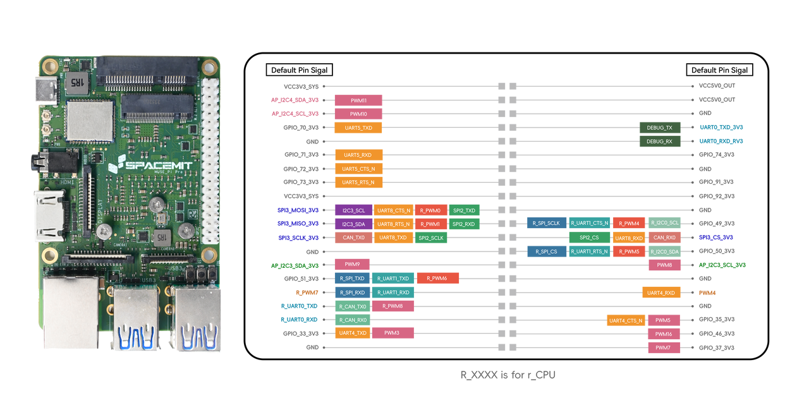