# MUSE Pi Pro 用户使用指南

```
最新版本：2025/04/10
```

## 1. 产品简介

MUSE Pi Pro 单板计算机将 RISC-V 八核处理器、存储硬盘、通用接口部件和扩展接口布置在同一块电路板上，支持 UEFI 启动以及多种操作系统和应用的运行，是一款完整的计算机系统产品。MUSE Pi Pro 为1.8寸单板，能够满足大语言模型应用、机器人、教育科研和物联网等场景中低功耗、空间紧凑情况下的算力需求，为 AI 新时代提供计算能力和丰富的接口扩展。

## 2. 硬件描述

### 2.1 资源概览


> **备注**：主板外观可能因为硬件版本不同而有细微的差别

### 2.2 指示灯和按键

**指示灯**

| 指示灯 | 状态说明 |
|--------|----------|
| **状态指示灯 STAT** | - 熄灭：未连接电源或异常<br>- 绿色常亮：系统启动完成，正常运行；<br>- 绿色常亮3s后闪烁1次：Boot异常，代表SPI FLASH内容或通讯异常；<br>- 绿色常亮3s后闪烁2次：外部RAM异常，代表DDR通讯异常或内存损坏；<br>- 绿色常亮3s后闪烁3次：Kernel异常，代表烧写镜像有误或介质损坏；<br>- 绿色常亮3s后闪烁4次：Grub异常，代表引导内容有误或不适配； |

**按键**

| 按键 | 使用说明 |
|------|----------|
| **电源按键 PWR** | - 关机（Shutdown）状态按下1s后松开：开机启动<br>- 待机（Standby）状态按下1s后松开：唤醒系统<br>- 开机（Normal）状态按下3s：强制下电关机 |
| **复位按键 RST** | - 短按：电源复位，系统强制重启 |
| **固件烧录 FDL** | - 按住：插入电源或电源复位，进入烧录模式 |

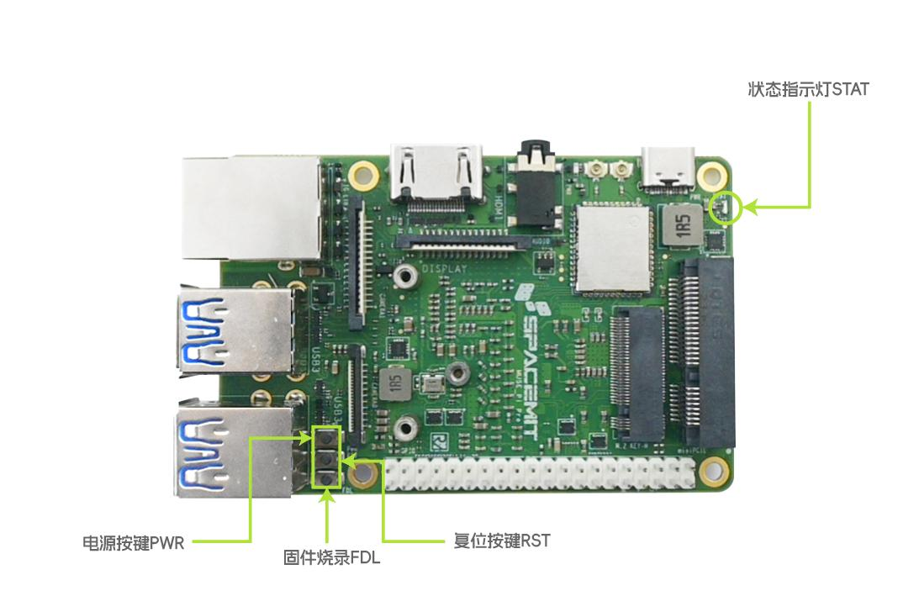

### 2.3 接口说明

#### 电源和烧录接口 PWR

- 类型：USB Type-C；
- 支持USB-PD协议供电，支持5V/3A、9V/3A和12V/3A;
- 进入烧录模式时，接口同时接受电源和USB device，通过USB Type-C与上位机连接，可被扫描和识别到设备，支持烧录升级操作。

> **注意**：烧录时，USB线缆须为数据通讯线缆，仅支持充电USB线缆无法烧录，为了系统升级过程稳定，请确保USB有10W及以上的供电功率

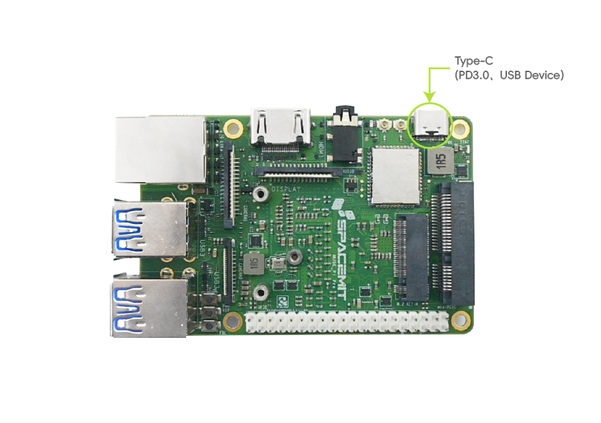

#### 存储扩展接口 M.2-M key

- 类型：3.2mm高度M.2连接器；
- 支持NVMe协议，尺寸为2230，PCIe2.0 x2带宽。

> **注意**：不可热插拔SSD，移除或安装请在下电状态下进行。

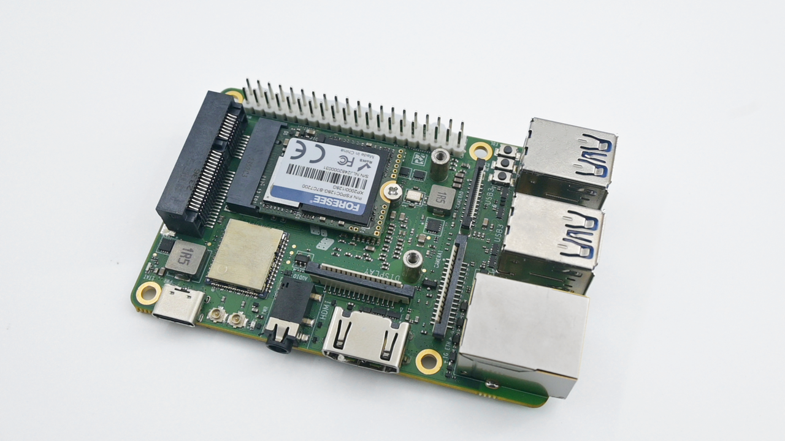

#### 显示接口 HDMI

- 类型：HDMI Type-A；
- HDMI为UEFI启动配置界面显示接口，桌面操作系统显示界面支持1080P@60Hz，支持热插拔。

#### 显示接口 DISPLAY

- 类型：15pin，1mm间距软排线连接器；
- 接口为MIPI DSI-2lanes，带I2C通道，支持触控；
- 显示接口仅连接MIPI屏幕时，MIPI屏幕为主显示屏；
- 当MIPI屏与HDMI屏同时连接时，默认主屏幕为MIPI屏，HDMI为副屏扩展；如需将HDMI屏设置为主屏，可在操作系统内修改；

> **注意**：不可热插拔MIPI设备，移除或安装请在下电状态下进行。


#### 摄像输入接 CAMERA0

- 类型：22pin，0.5mm间距软排线连接器；
- 摄像模组兼容列表，详见 [K1关键物料AVL](https://developer.spacemit.com/documentation?token=MHrtw0FymiAJFNkRsXjc46ygnDh&type=file)。


#### 摄像输入接 CAMERA1

- 类型：15pin，1mm间距软排线连接器；
- 摄像模组兼容列表，详见《K1 关键物料AVL》。


#### 音频耳机接口 AUDIO

- 类型：标准3.5mm耳机接口；
- 对应音频系统通道为ES8326，可以在操作系统设置界面选择该接口通道和测试音频效果。

#### 有线以太网接口 1G ETH

- 类型：RJ45，带黄绿指示灯；
- 支持1000M/100M速率，自适应切换；
- 网口绿色LED为LINK SPEED指示灯，指示链接情况和链接速率：
  1）LINK SPEED绿色常亮，链路建立且为最高速率状态；  
  2）LINK SPEED熄灭，链路建立但处于非最高速率状态；  
  3）链路未建立时，LINK SPEED不点亮，保持熄灭状态；
- 网口黄色LED为ACTIVE指示灯，指示链路活跃状态：
  1）ACT灯熄灭，链路无数据传输；  
  2）ACT灯黄色闪烁，链路有数据传输，处于活跃状态，越活跃闪烁频次越快；  
  3）链路未建立时，ACT不点亮，保持熄灭状态；

#### 通用串行总线接口 USB3

- 类型：USB Type-A；
- 即插即用，支持USB3.0 host协议；
- 满足多个USB设备，如同时接入键盘、鼠标、硬盘、USB摄像头和USB计算棒等，USB设备兼容列表，详见《K1 关键物料AVL》。

#### 高速扩展接口 miniPCIe

- 类型：9.9mm高miniPCIe 连接器；
- 同时支持USB2.0和PCIe2.0 x1，USB和PCIe设备兼容列表，详见《K1 关键物料AVL》；
- 可安装标准miniPCIe全宽尺寸模组。

> **注意**：不可热插拔miniPCIe设备，移除或安装请在下电状态下进行。

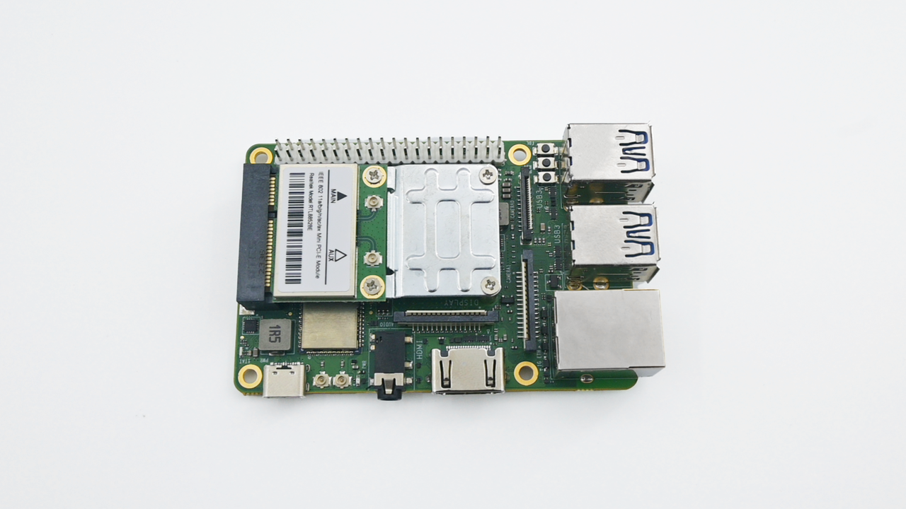

#### 通用输入输出接口 GPIO

- 类型：2.54mm间距，2*20排针；
- PIN2、PIN4为5V，可作为散热风扇，扩展板供电使用，最大输出电流为1A；
- PIN6、PIN8、PIN10为GND、debugUART_Tx（主机侧发送端）、debugUART_Rx（主机侧接收端），可作为调试串口；
- GPIO接口使用方法，详见《设备开发》中外设驱动章节: [外设驱动](https://bianbu-linux.spacemit.com/development_guide/peripheral_driver/)
- 为方便用户扩展外设，我们定义了扩展IO功能：[MUSE Pi/MUSE Pi Pro 扩展 IO定义](https://bianbu.spacemit.com/bianbu-star/user_guide/defaut_pin/) 
- GPIO电平域为3.3V，支持多功能复用，引脚定义和资源如下图；
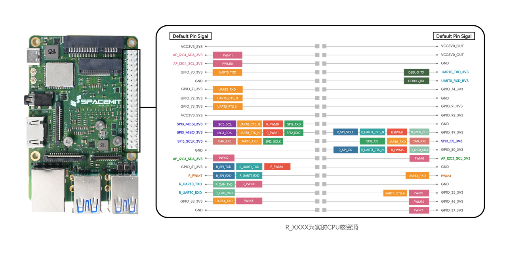

### 2.4 产品规格

| 项目 | 规格 |
|------|------|
| **处理器** | SpacemiT M1，8核64位RISC-V处理器，融合2.0 TOPS AI算力 |
| **显示** | HDMI1.4 Type-A接口，最高支持1080P@60Hz<br>2lane MIPI DSI FPC接口，最高支持1080P@60Hz |
| **内存** | LPDDR4X，2400MT/s速率，可选配8GB/16GB容量 |
| **本地存储** | eMMC5.1，可选配64GB/128GB容量 |
| **扩展存储** | M.2 M-Key连接器，可装配2230尺寸NVMe SSD<br>Micro SD卡接口，支持UHS-Ⅱ模式存储卡 |
| **无线通讯** | 板载WiFi6&BT5.2, 并支持通过M.2/mPCIE连接器，扩展为双无线通讯 |
| **有线网络** | 支持一路以太网，RJ45接口，1000M/100M自适应速率 |
| **音频接口** | 3.5mm音频耳麦接口 |
| **USB接口** | 4路USB3.0 Type-A host接口，1路USB2.0 Type-C device接口 |
| **调试接口** | UART串行TTL调试接口，附带3个侧边按键，用于硬件复位、开关机和烧录升级 |
| **IO扩展接口** | - 标准M.2 M-Key定义的连接器卡槽，可安装2230长度的M.2板卡，支持SSD、PCIe转SATA、PCIe通讯板卡等<br>- 标准miniPCIe定义的连接器卡槽，可安装全宽miniPCIe板卡，支持4G/5G模块、PCIe无线通讯模块和PCIe网络模块<br>- 40Pin标准GPIO接口 |
| **MIPI接口** | 1路 2lanes MIPI DSI FPC 15p接口<br>1路 4lanes MIPI CSI FPC 22p接口，1路 2lanes MIPI CSI FPC 15p接口 |
| **外观形态** | 单板计算机，遵循FEMTO-ITX定义尺寸，85mm*56mm，信用卡大小 |
| **操作系统** | 支持Bianbu Desktop、Ubuntu、OpenKylin、Deepin、Fedora等操作系统 |
| **电源输入** | 支持 |
| **可靠性** | 外设接口ESD可防护接触±4kV，空气±8kV；满足CE、FCC等电磁兼容认证标准<br>可选消费级-20°C~70°C或工业级-40°C~85°C |
| **时钟** | 板载RTC时钟电源接口，支持安装电池，满足G3状态供电 |
| **结构** | 可选配被动或主动风冷散热器<br>可选配钣金机箱或亚克力外壳<br>可选配触摸屏或工业接线端子多种配置 |

### 2.5 逻辑框图


## 3. 快速上手

### 3.1 使用前准备

MUSE Pi Pro是单板计算机形态产品，您需要连接必要的外设来使用它：

- 一个电源
- 一台显示器
- 一根HDMI线缆
- 一个键盘
- 一个鼠标


### 3.2 开始启动

提前连接您所需要的外设，接通电源后即可开机。  
单板计算机运行后，您可以通过下列步骤配置您的MUSE Pi Pro：

### 3.3 开始启动时配置您的MUSE Pi Pro

MUSE Pi Pro支持UEFI启动和配置，您可以在上电开机后选择启动介质和个性化配置计算机：  
您在MUSE Pi Pro上电开机3s内，按下"F2"按键，将进入UEFI设置界面。


#### UEFI 配置指引：

上电开机时，按下<F2>按键，进入UEFI设置界面，支持以下功能操作：

1）**启动管理 Boot Manager**  
在Boot Manager Menu通过<↑>和<↓>按键，选择EMMC存储、SSD硬盘、USB硬盘、SD卡进行启动，或选择进入命令行界面UEFI shell；


2）**启动维护 Boot Maintenance Manager**  
在Boot Maintenance Manager菜单，进入boot options，选择Change Boot Order，对启动介质优先级进行设置，按<+>和<->调整启动优先级；<Enter>后选择Commit Change and Exit提交优先级设置并退出，返回主菜单，按<F10>保存设置；

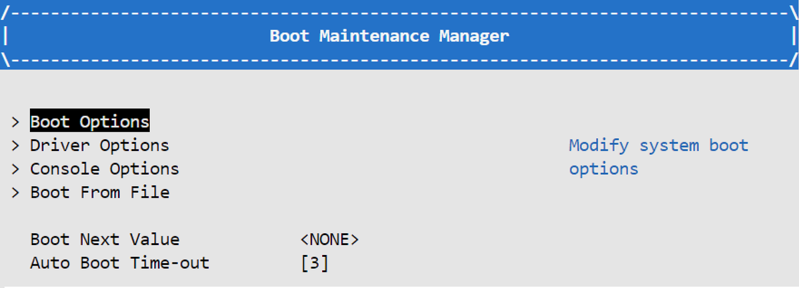

3）**交互命令行 UEFI Interactive Shell**  
支持UEFI Interactive Shell V2.2版本，当您第一次进入 UEFI Interactive Shell时，它将打印您的计算机检测到的所有存储设备，一旦您按下除 <Esc> 以外的任意键或等待 5 秒，EFI Shell 就应该准备好执行命令，输入`help`显示支持的指令及相关帮助信息。

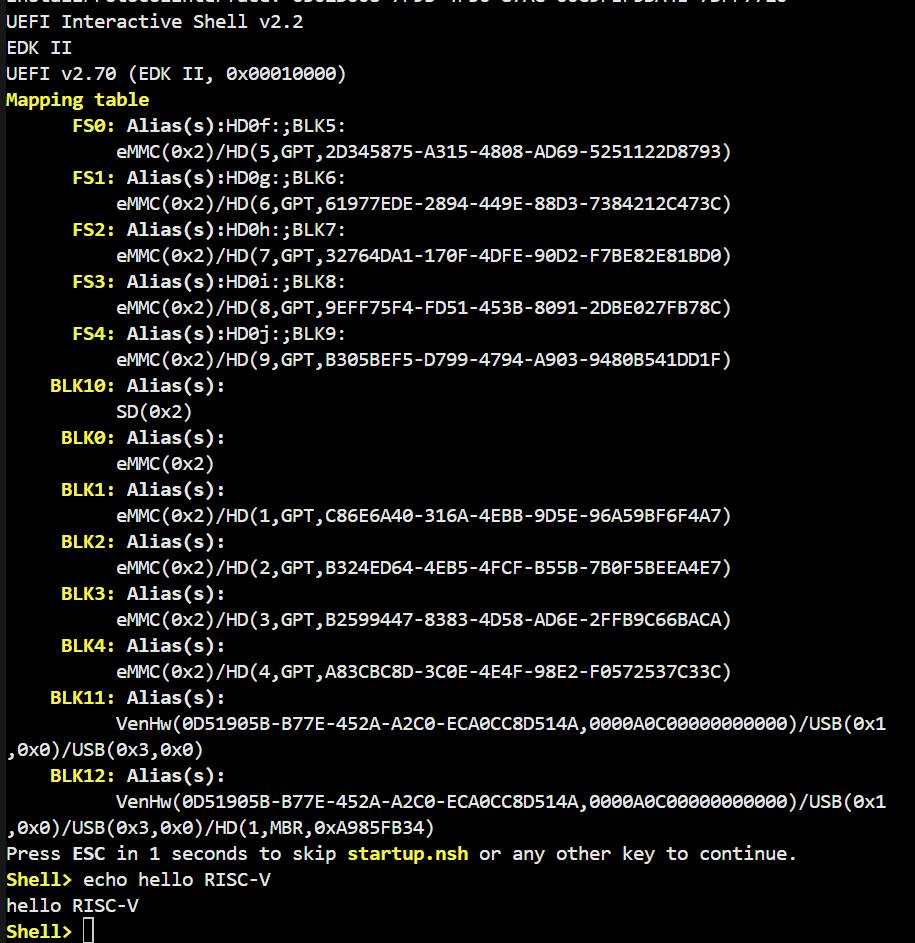

**进迭时空开源UEFI源码仓库**：  
- https://gitee.com/bianbu-linux/edk2-platforms  
- https://gitee.com/bianbu-linux/edk2  

参考 **[基于MUSE Pi Pro的UEFI固件制作](https://mp.weixin.qq.com/s/s7S3pQesObrmAF_56Cq9Lg)**

#### Bianbu desktop 操作系统配置指引：

如果您的MUSE Pi Pro未在开机3秒内按下"F2"，默认将从板载存储介质启动，进入预先安装好的Bianbu desktop 操作系统。该系统在首次启动时运行配置向导。您需要显示器、键盘、鼠标来浏览向导，向导内容如下：

1）**系统语言**：  
此页面帮助您配置系统的语言，默认显示 English 和中文，如需更多语言，可点击下方三个点，弹出更多选项


2）**输入法**:  
此页面帮助您配置系统的键盘布局和输入法

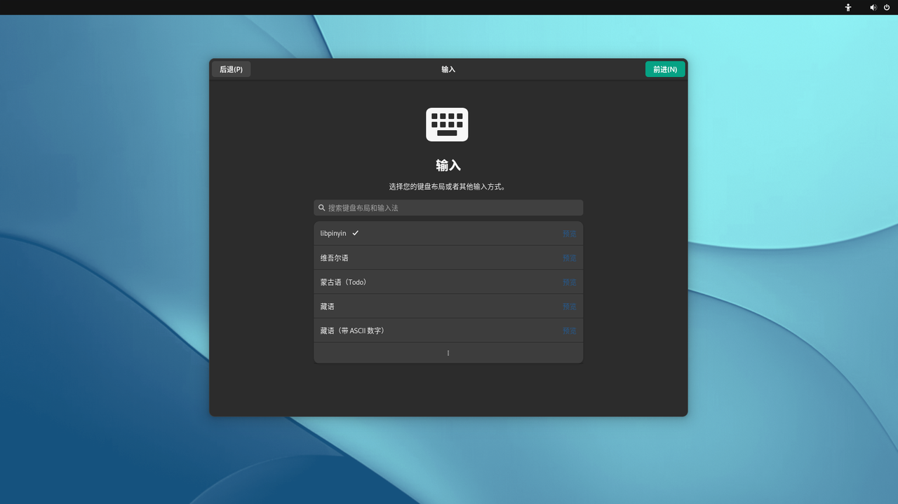

3）**无线上网**：  
此页面帮助您连接到 WiFi 网络，从列表中选择您的网络并进行连接；如暂未有合适 WiFi 网络，可在左上角选择跳过该设置


4）**位置服务**：  
此页面可选择是否打开位置服务，如打开位置服务可便捷您的使用体验，但相应的可能会带来位置隐私泄露的风险

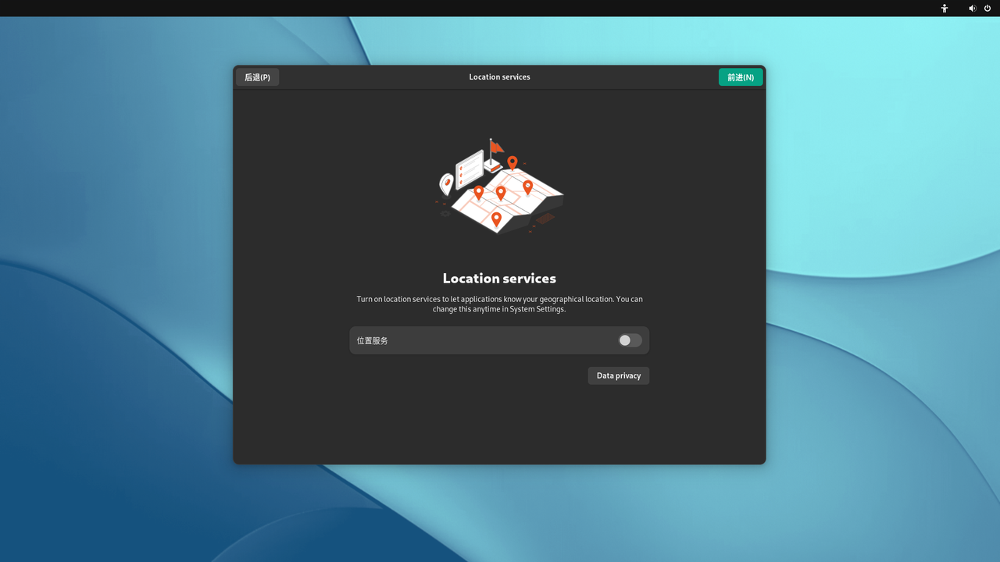

5）**时区**：  
此页面帮助配置您所在时区信息，联网状态下系统能够自动同步相应时区时间，可以搜索城市来添加设置


6）**设置您的用户名和密码**：  
该页面帮助您设置用户名和密码，请牢记您的密码

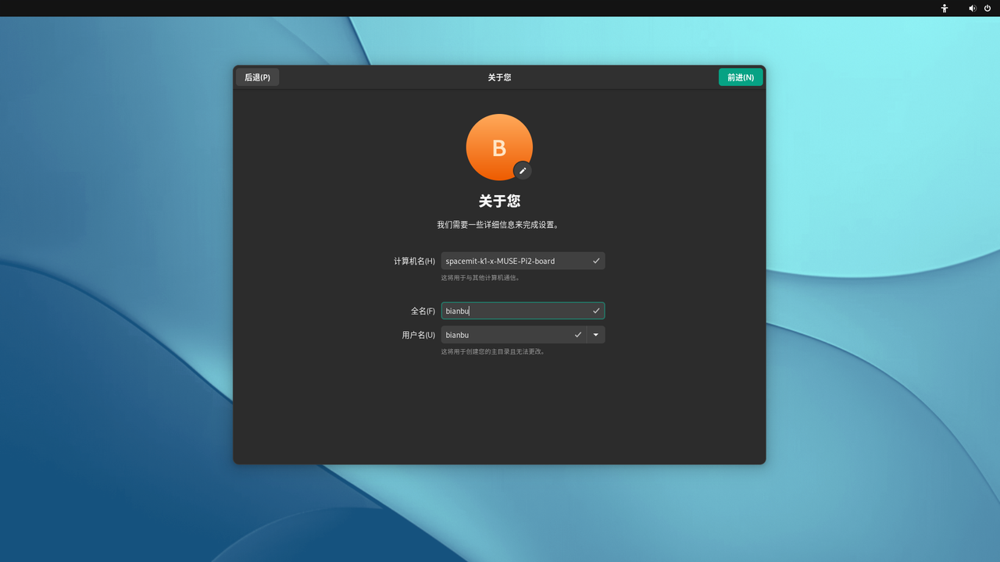  


7）**配置完成**  
配置完成，点击 “开始使用 Bianbu” 吧，后可进入桌面


## 4. 安装调试指引

### 4.1 安装操作系统

#### 方式1: Type-C数据线烧录

- **设备未上电，处于关机状态时**
  1）按住 “固件烧录FDL按键” 不松开  
  2）插上Type-C 数据线，与上位机电脑连接，并供电给设备开机  
  3）松开 “固件烧录FDL按键”  
  4）通过进迭时空官方刷机工具 Titan 或者 fastboot 命令即可进行操作

- **设备已插上 USB Type-C 数据线供电，并处于开机状态时**
  1）按住 “固件烧录FDL按键”不松开  
  2）短按“复位按键RST按键”  
  3）松开 “固件烧录FDL按键”  
  4）通过进迭时空官方刷机工具 Titan 或者 fastboot 命令即可进行操作

> **备注**：进迭时空官方刷机工具使用手册请访问链接：[刷机工具使用手册](https://developer.spacemit.com/documentation?token=O6wlwlXcoiBZUikVNh2cczhin5d)


### 4.2 串口调试

#### 接口连接：

上位机经 USB 转 TTL 设备与 MUSE Pi Pro主板接口的 TX、RX、GND 正常连接。接口信号如图：

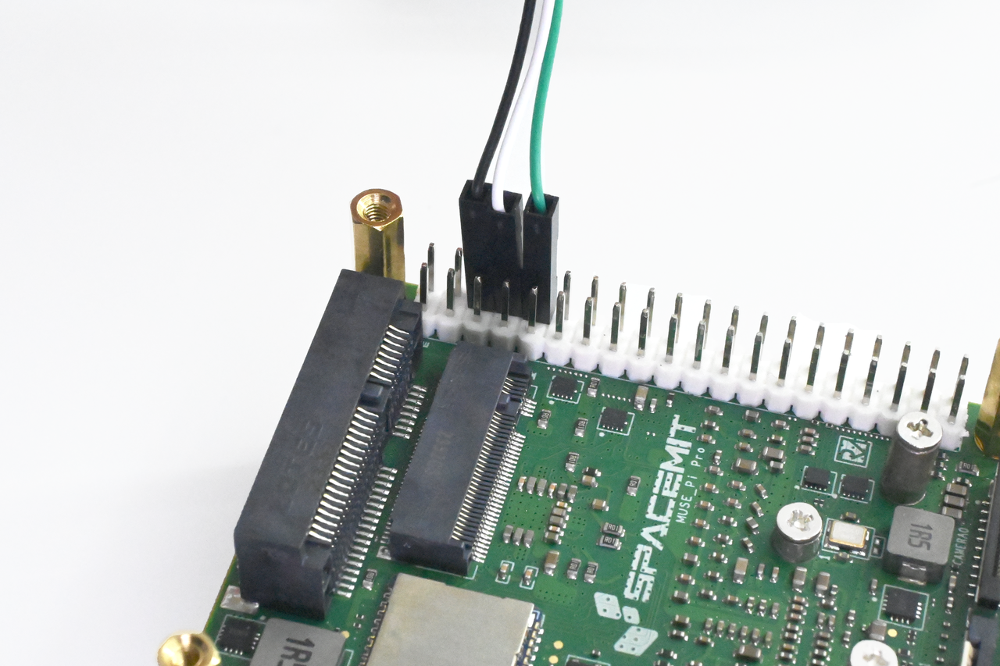

#### Windows系统调试:

以 “MobaXterm” 为例:  
首先，请正确连接硬件串口，并确认在设备管理器的端口中有 COM 口的显示，如图:


打开 “MobaXterm” 软件，选择 “Sessions”——“New Session”，在弹出的对话框中，选择 “Serial”，"Serial port" 选择上图中识别到的对应 COM 口，“Speed” 速率选择 “115200”，最后点击 “OK”，即可进入打印页面

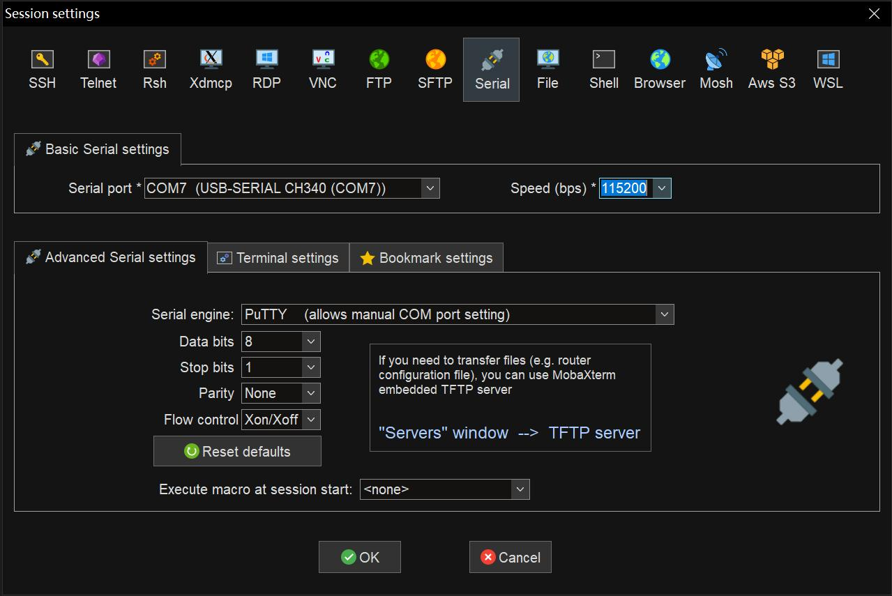

## 5. 注意事项

MUSE Pi Pro适用于家居、办公室或工业环境，开始操作前，请先阅读以下注意事项：

1）任何情况下不可对屏幕接口、CSI接口及扩展板进行热插拔操作。  
2）拆封单板计算机包装和安装前，为避免静电释放（ESD）对单板硬件造成损伤，请采取必要防静电措施。  
3）持单板计算机时请拿单板边沿，不要触碰到单板上的外露金属部分，以免静电对单板元器件造成损坏。  
4）请将单板计算机放置于干燥的平面上，以保证它们远离热源、电磁干扰源与辐射源、电磁辐射敏感设备（如：医疗设备）等。  
5）请将单板计算机置于通风良好的环境，如需72h及以上长时间满载运行，请装配原厂散热器，或采取充分有效的散热措施。

## 6. 开源资料

**结构尺寸图**：

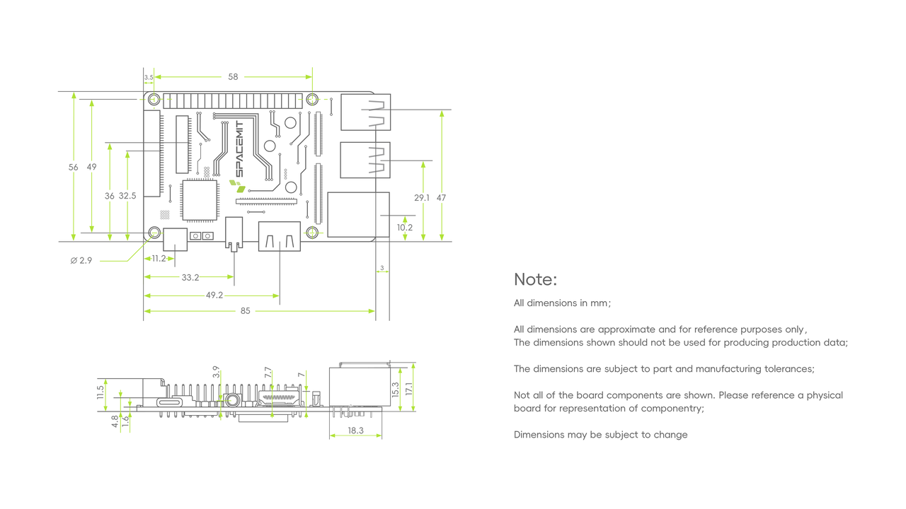

## 7. 附录——接口线序

## 7.1 MIPI CSI 高速连接器

MUSE Pi Pro上配备了1路 4lanes MIPI CSI FPC 22p接口与1路 2lanes MIPI CSI FPC 15p接口。

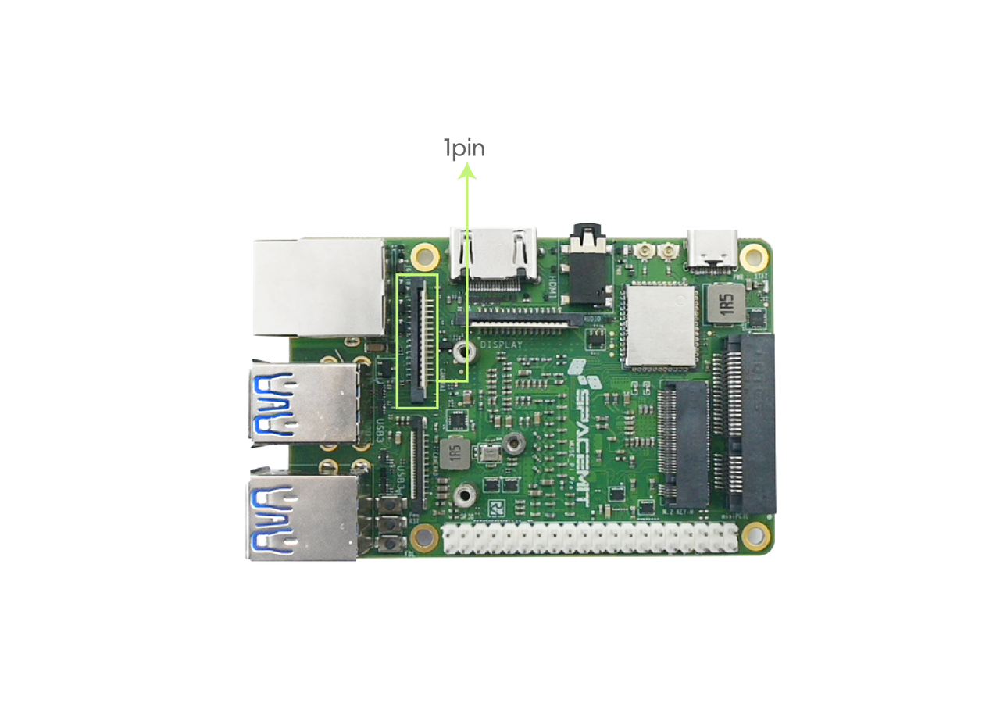

**15pin高速连接器接口线序如下**：

| pin | 信号名称 |
|-----|----------|
| 1 | GND |
| 2 | MIPI_CSI3_DN0 |
| 3 | MIPI_CSI3_DP0 |
| 4 | GND |
| 5 | MIPI_CSI3_DN1 |
| 6 | MIPI_CSI3_DP1 |
| 7 | GND |
| 8 | MIPI_CSI3_CLKN |
| 9 | MIPI_CSI3_CLKP |
| 10 | GND |
| 11 | CAMERA1_PDN |
| 12 | CAM_MCLK1 |
| 13 | CAM_I2C1_SCL_3V3 |
| 14 | CAM_I2C1_SDA_3V3 |
| 15 | CSI_VCC33 |


**22pin高速连接器接口线序如下**：

| pin | 信号名称 |
|-----|----------|
| 1 | GND |
| 2 | MIPI_CSI1_DN0 |
| 3 | MIPI_CSI1_DP0 |
| 4 | GND |
| 5 | MIPI_CSI1_DN1 |
| 6 | MIPI_CSI1_DP1 |
| 7 | GND |
| 8 | MIPI_CSI1_CLKN |
| 9 | MIPI_CSI1_CLKP |
| 10 | GND |
| 11 | MIPI_CSI1_DN2 |
| 12 | MIPI_CSI1_DP2 |
| 13 | GND |
| 14 | MIPI_CSI1_DN3 |
| 15 | MIPI_CSI1_DP3 |
| 16 | GND |
| 17 | CAMERA0_PDN |
| 18 | CAM_MCLK0 |
| 19 | GND |
| 20 | CAM_I2C0_SCL_1833 |
| 21 | CAM_I2C0_SDA_1833 |
| 22 | CSI_VCC33 |

### 7.2 MIPI DSI屏连接座

MUSE Pi Pro上配备了1路 2lanes MIPI DSI FPC 15p接口。

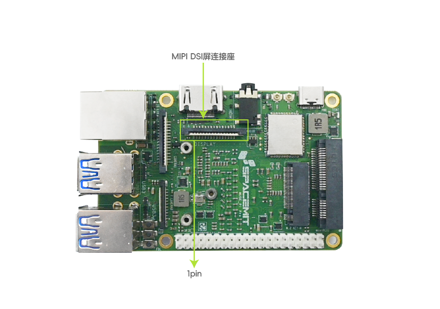

**MIPI DSI FPC 15pin高速连接器接口线序如下**：

| pin | 信号名称 |
|-----|----------|
| 1 | GND |
| 2 | MIPI_DSI1_LANE1_DN |
| 3 | MIPI_DSI1_LANE1_DP |
| 4 | GND |
| 5 | MIPI_DSI1_CLK_N |
| 6 | MIPI_DSI1_CLK_P |
| 7 | GND |
| 8 | MIPI_DSI1_LANE0_DN |
| 9 | MIPI_DSI1_LANE0_DP |
| 10 | GND |
| 11 | AP_I2C5_SCL_3V3 |
| 12 | AP_I2C5_SDA_3V3 |
| 13 | GND |
| 14 | LCD_VCC33 |
| 15 | LCD_VCC33 |

### 7.3 40pin 接口

开发板支持40pin双排插针，线序如下：


| pin | 信号名称 | 信号名称 | pin |
|-----|----------|----------|-----|
| 1 | VCC3V3_SYS | VCC5V0_OUT | 2 |
| 3 | AP_I2C4_SDA_3V3 | VCC5V0_OUT | 4 |
| 5 | AP_I2C4_SCL_3V3 | GND | 6 |
| 7 | GPIO_70_3V3 | UART0_TXD_3V3 | 8 |
| 9 | GND | UART0_RXD_3V3 | 10 |
| 11 | GPIO_71_3V3 | GPI0_74_3V3 | 12 |
| 13 | GPIO_72_3V3 | GND | 14 |
| 15 | GPIO_73_3V3 | GPIO_91_3V3 | 16 |
| 17 | VCC3V3_SYS | GPIO_92_3V3 | 18 |
| 19 | SPI3_MOSI_3V3 | GND | 20 |
| 21 | SPI3_MISO_3V3 | GPIO_49_3V3 | 22 |
| 23 | SPI3_SCLK_3V3 | SPI3_CS_3V3 | 24 |
| 25 | GND | GPIO_50_3V3 | 26 |
| 27 | AP_I2C3_SDA_3V3 | AP_I2C3_SCL_3V3 | 28 |
| 29 | GPIO_51_3V3 | GND | 30 |
| 31 | GPIO_52_3V3 | GPIO_34_3V3 | 32 |
| 33 | GPIO_47_3V3 | GND | 34 |
| 35 | GPIO_48_3V3 | GPIO_35_3V3 | 36 |
| 37 | GPIO_33_3V3 | GPIO_46_3V3 | 38 |
| 39 | GND | GPIO_37_3V3 | 40 |

### 7.4 UART调试接口

支持40pin双排插针pin6、8、10调试X60，主控端线序从上到下GND，RX，TX。

