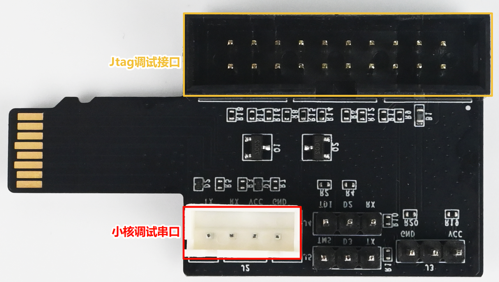
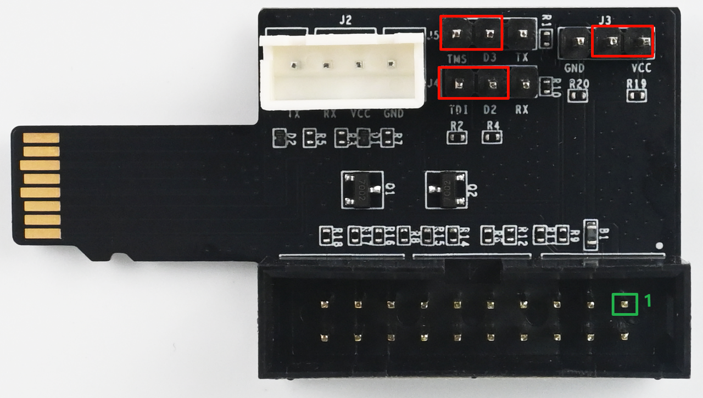
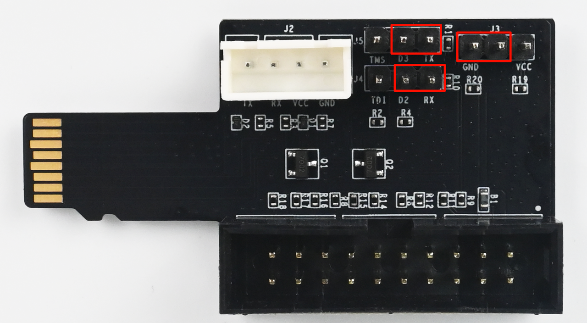
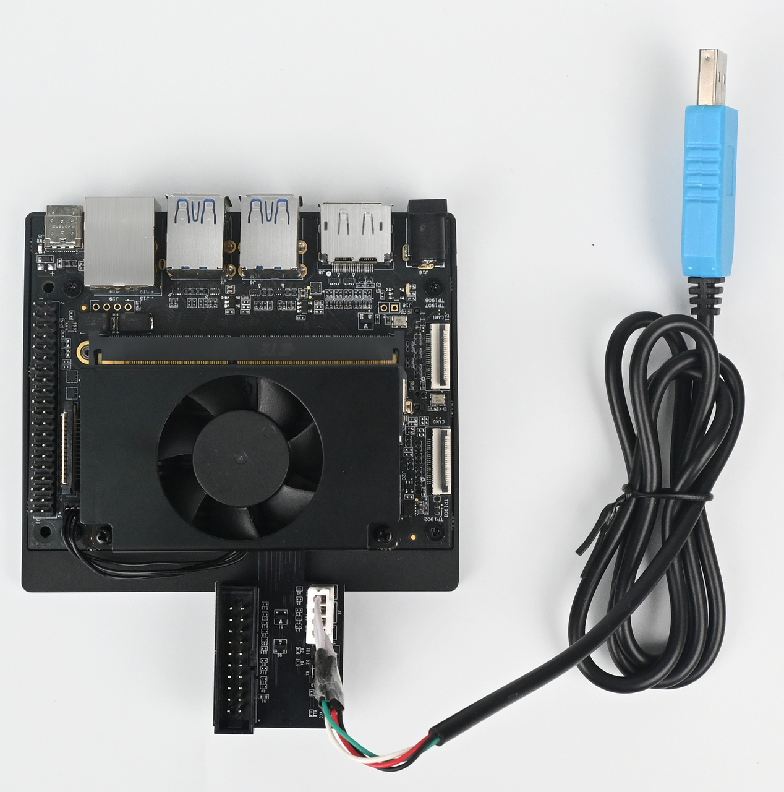

# TF 卡扩展调试子板使用说明

## 产品简介

K1/K3 芯片在 MMC 信号引脚上复用了 JTAG 与小核（RCPU）调试串口功能，因此提供 TF 卡扩展调试子板，方便用户在 K1/K3 产品上使用 JTAG 与小核调试串口。

## 硬件描述

如下图所示，扩展板包含一个 20-pin 牛角座（用于连接 J-Link 调试器）、一个 XH2.54-4P 连接器（用于连接 3.3V UART 串口线），以及若干排针（用于适配不同的使用场景）。

## 使用方法

### K1 系列产品

牛角座线序如下（TDI、TMS 线序与 K3 产品相反）：

| 引脚 | 信号 | 引脚 | 信号 |
| :--- | :--- | :--- | :--- |
| 1 | 3.3V | 2 | 3.3V |
| 3 | TRSTn | 4 | GND |
| 5 | **TDI** | 6 | GND |
| 7 | **TMS** | 8 | GND |
| 9 | TCK | 10 | GND |
| 11 | NA | 12 | GND |
| 13 | NA | 14 | GND |
| 15 | NA | 16 | GND |
| 17 | NA | 18 | GND |
| 19 | NA | 20 | GND |

#### JTAG 连接

当需要使用 JTAG 功能时，请按下图调整 J3、J4、J5 排针的连接方式。

与实际产品 K1 MUSE Pi Pro 的连接场景如下图所示：

#### 小核（RCPU）串口连接

当需要使用小核（RCPU）串口功能时，请按下图调整 J3、J4、J5 排针的连接方式。

与实际产品 K1 MUSE Pi Pro 的连接场景如下图所示，注意调试串口线需使用 3.3V 电平。

### K3 系列产品

牛角座线序如下（TDI、TMS 线序与 K1 产品相反）：

| 引脚 | 信号 | 引脚 | 信号 |
| :--- | :--- | :--- | :--- |
| 1 | 3.3V | 2 | 3.3V |
| 3 | TRSTn | 4 | GND |
| 5 | **TMS** | 6 | GND |
| 7 | **TDI** | 8 | GND |
| 9 | TCK | 10 | GND |
| 11 | NA | 12 | GND |
| 13 | NA | 14 | GND |
| 15 | NA | 16 | GND |
| 17 | NA | 18 | GND |
| 19 | NA | 20 | GND |

#### JTAG 连接

当需要使用 JTAG 功能时，请按下图调整 J3、J4、J5 排针的连接方式。

需要注意，由于 K3 产品的线序与 K1 不同（TDI 与 TMS 互换），因此无法直接与 J-Link 相连，需按下图对照 J-Link 线序，使用杜邦线进行连接。

#### 小核串口连接

当需要使用小核（RCPU）串口功能时，请按下图调整 J3、J4、J5 排针的连接方式。

与实际产品 K3-CoM260 的连接场景如下图所示，注意调试串口线需使用 3.3V 电平。

## 常见问题

**Q1：按照图示连接 K3 产品后，为什么 JTAG 连不上？**
**A**：

- 若使用 K3 方案，需注意 TMS 与 TDI 的线序差异，重新检查连接方式。
- 需要按照 [SDHC](https://www.spacemit.com/community/document/info?lang=zh&nodepath=software/SDK/buildroot/k3_buildroot/device/peripheral_driver/08-SDHC.md) 文档调整软件配置。

**Q2：该扩展板支持热插拔吗？断电用还是可以热插拔？**
**A**：该扩展板支持热插拔，即插即用。

**Q3：为什么 K3 芯片会调整 IO 线序？**
**A**：芯片在制定规格时即完成 IO 定义，无法与 K1 进行兼容；若要使用该扩展板则需要通过飞线连接。
