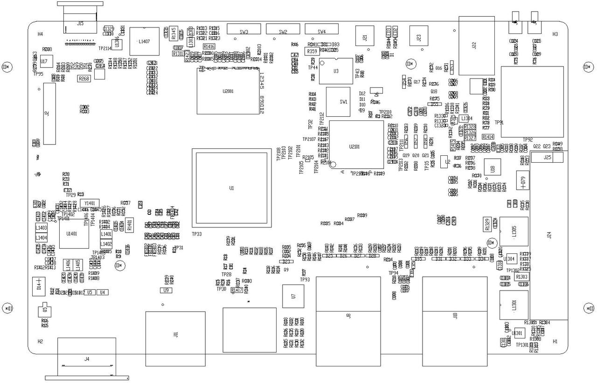
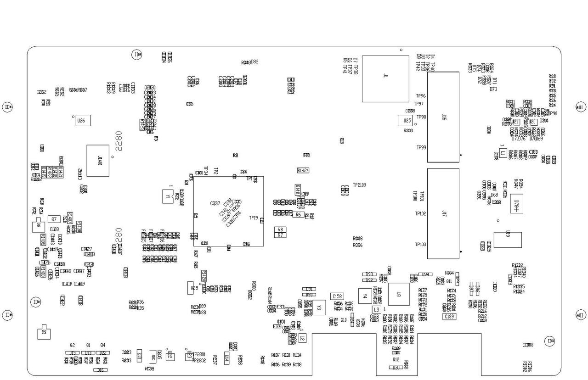

sidebar_position: 3

# K1 MUSE Pi 硬件设计资源

请点击相关硬件设计资源下载：
- [MUSEPi_schematic(PDF)-V1.1-20250619](https://cdn-resource.spacemit.com/file/product/K1/MUSEPi_schematic-V1.1-20250619.pdf)
- [MUSECard_BOM (8+32)(XLS)](https://cdn-resource.spacemit.com/file/product/K1/MUSEPi_BOM%20%288%2B32%29%20%20.xls)

- **K1 MUSE Pi reference description** 

  - **TOP view**

  - **BOTTOM view**

