# K3 CoM260 开发套件用户使用指南

## PDF 版本下载

点击下载 **[K3 CoM260 开发套件用户使用指南 (PDF)](https://cdn-resource.spacemit.com/file/product/K3/k3_com260_ug_zh.pdf)**

## 版本

修订记录用于说明本文档历次更新的内容。

| 修订版本 | 修订日期   | 修订说明 |
|----------|------------|----------|
| V2.0     | 2026.03.19 | 1. 互换UART0 RX与TX的位置   2. CAM0 调整为MIPI CSI1 2Lane|
| V1.0     | 2025.11.24 | 首版     |

## 1. 产品简介

### 1.1 概述

本文档主要介绍 **K3 CoM260** 搭配 **K3 CoM260 开发套件** 的基本功能、硬件特性、多功能硬件配置及软件调试操作使用方法，旨在帮助调试人员更快、更准确地使用 K3 CoM260，熟悉 K3 CoM260 模组开发应用方案。

### 1.2 产品版本

本产品对应的产品版本如下：

| 产品名称 | 产品版本 |
| --- | --- |
| K3 CoM260 | K3-CoM260_P1_LP5315B_32X2_v03_20260312 |

## 2. 产品规格

| 模块 | 描述 |
| --- | --- |
| 处理器 | SpacemiT K3，8 核 X100™ 64 位 RISC-V AI 处理器 + 8 核 A100™ AI 核，融合 60 TOPS AI 算力 |
| 显示 | DP Type-A 接口，最高支持 4K@60fps；2 × 4-lane MIPI DSI 接口，最高支持 4K@60Hz |
| 内存 | 2 × LPDDR5，6400 MT/s，可选 8 GB / 16 GB / 32 GB 容量 |
| 本地存储 | UFS 2.2，可选 128 GB / 256 GB 容量 |
| 扩展存储 | M.2 2280 M-Key 连接器；M.2 2230 M-Key 连接器；TF-Card 接口 |
| 无线通信 | M.2 2230 E-Key 连接器，支持 Wi-Fi 6 和 BT 5.0 |
| 有线网络 | 支持 1 路以太网，RJ45 接口，速率为 1000M |
| USB 接口 | 4 路 USB 3.0 / USB 2.0 Type-A 接口；1 路 USB 3.0 Type-C OTG 接口，不支持供电 |
| 调试接口 | 40 Pin 标准 GPIO 接口；12 Pin 调试接口，用于 DEBUG、开机模式选择、硬件复位、开关机和烧录升级 |
| MIPI 接口 | 1 路 2-lane MIPI DSI FPC 接口；2 路 4-lane MIPI CSI FPC 接口，支持“4+4”“4+2+2”或“2+2+2+2”组合链路 |
| 其他接口 | 1 路 CAN FD 接口；1 路 FAN 接口 |
| RTC | 支持 1.85 V 至 5.5 V 输入 |
| 外观形态 | 模组与底板组合使用，支持安装散热器；模组尺寸为 69.6 × 45 mm；底板尺寸为 100 × 70 mm |
| 操作系统 | 支持 Bianbu、Ubuntu 操作系统 |
| 电源输入 | 支持 19V/2.37A 和 12V/5A DCIN 供电|
| 可靠性 | 外设接口支持 ESD 防护接触 xxxx；可选消费级 xxxx 或工业级 xxxx |

## 3. 系统概述

### 3.1 K3 芯片概述

K3 是进迭时空推出的新一代高性能 RISC-V AI CPU 芯片，具有以下特点：

- 8 个高性能计算大核 X100，最大主频 2.4 GHz，130K DMIPS 算力，单核 Specint2006 > 9.0/GHz  
- 60 TOPS AI 算力  
- 集成多套高速扩展接口：8 lanes PCIe、4 套 USB 3.0、4 套 GMAC 等

### 3.2 K3 芯片框图

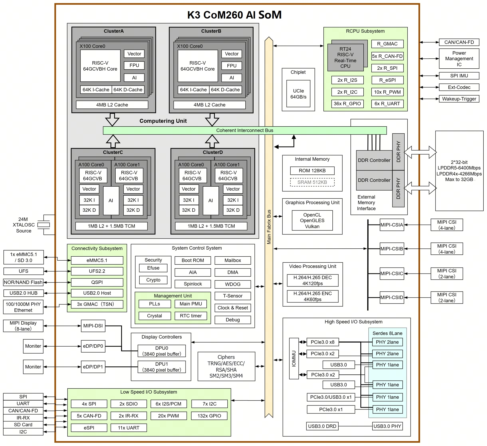

### 3.3 K3 CoM260 参考方案框图

#### 3.3.1 参考方案框图

K3 CoM260 系统方案具备以下特性：

- 基于 K3 芯片构建；
- 采用 P1 PMIC + 外挂 DC-DC 的供电方案；
- DRAM 采用 2 × LPDDR5 与 UFS2.2；
- 外设接口包括：
  - 7 lanes PCIe 3.0  
  - 3 套 USB 3.0  
  - 1 套 GMAC
  - TF Card 等接口  
  
整体方案稳定可靠，具备量产应用能力。

参考方案框图如下：
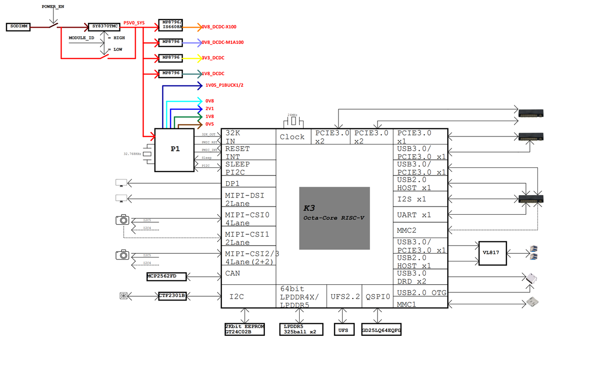

#### 3.3.2 功能概述

K3 CoM260 开发套件提供以下功能：

- **Type-C**：1 路 USB 3.0 Type-C UFP 接口，系统固件升级通道  
- **DP**：1 路 DP 1.2 Type-A 接口，最大支持 3840 × 2160 @ 60fps 输出  
- **MIPI DSI**：1 个 30 Pin FPC 连接器，1 路 2 Lane MIPI DSI 信号支持 LCD 屏，1 路 I2C 信号支持 CTP 屏  
- **MIPI CSI**：2 个 22 Pin FPC 连接器，2 路 MIPI CSI 信号可支持 2 个摄像头  
- **40 Pin 双排插针**：兼容树莓派标准 40 Pin 双排插针，支持 I2C、UART、SPI、I2S 和 GPIO 调试  
- **SD-Card**：支持高速 TF 卡  
- **PCIe Wi-Fi**：1 个 M.2 E-Key 连接器，模组型号为 RTL8852BE，外置 SMA 天线，支持无线上网功能  
- **Ethernet**：1 路 RJ45 连接器，自适应 10/100/1000M 以太网  
- **PCIe 3.0**：2 个 M.2 M-Key 连接器，可接入 2280、2230 SSD  
- **USB 3.0 Type-A**：2 个 USB 3.0 Type-A Dual 连接器，用于扩展 USB 设备  
- **12 Pin 按钮排针**：用于连接 LED、UART Debug、ACOK、开关机、复位按钮  
- **FAN**：1 个 4 Pin 风扇连接器，可连接 4 线可调速风扇  
- **CAN**：1 个 4 Pin 排针，集成 CAN 收发器，可连接 CAN 设备  
- **RTC**：1 个 2 Pin 线对板连接器，支持 1.85 V ~ 5 V 电压输入

#### 3.3.3 功能接口

| 功能                     | 可用（是/否）     |
|--------------------------|--------------|
| 2×LPDDR5 (4GB/8GB/16GB) | 是           |
| UFS (128GB)              | 是           |
| SPI FLASH                | 是           |
| DC Jack                  | 是           |
| DP 1.2 OUT               | 是           |
| MIPI DSI                 | 是           |
| MIPI CSI                 | 是           |
| SD-Card                  | 是           |
| Wi-Fi & BT               | 是           |
| Gbe                      | 是           |
| 2 × M.2 M-KEY            | 是           |
| 2 × USB 3.0 Type-A Dual  | 是           |
| 40 Pin                   | 是           |
| 12 Pin                   | 是           |
| FAN                      | 是           |
| CAN                      | 否   |
| RTC                      | 否   |

## 4. 硬件介绍

### 4.1 实物图

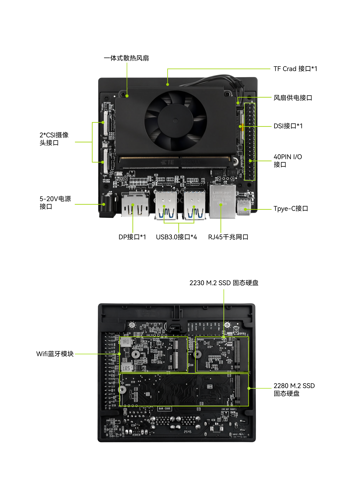

### 4.2 电源框图

  
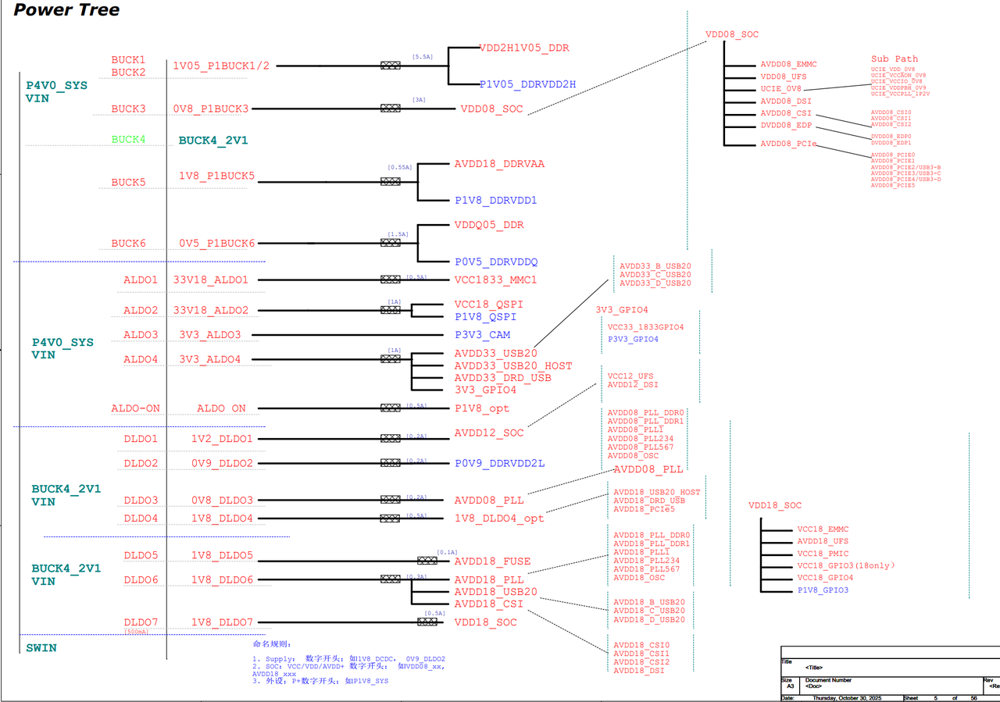

### 4.3 Boot Download Sel & JTAG Sel

Boot Download Sel 与 JTAG Sel 示意图如下。

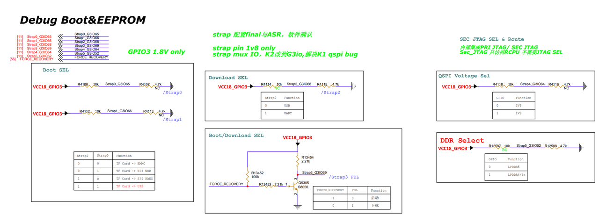

### 4.4 I2C 地址

K3 CoM260 预留了丰富的外围接口。在调试 I2C 外设时，可能涉及 I2C 通道复用。下图列出了 K3 CoM260 开发套件对应的 I2C 地址及上拉电源配置，以避免地址冲突和电平不匹配。

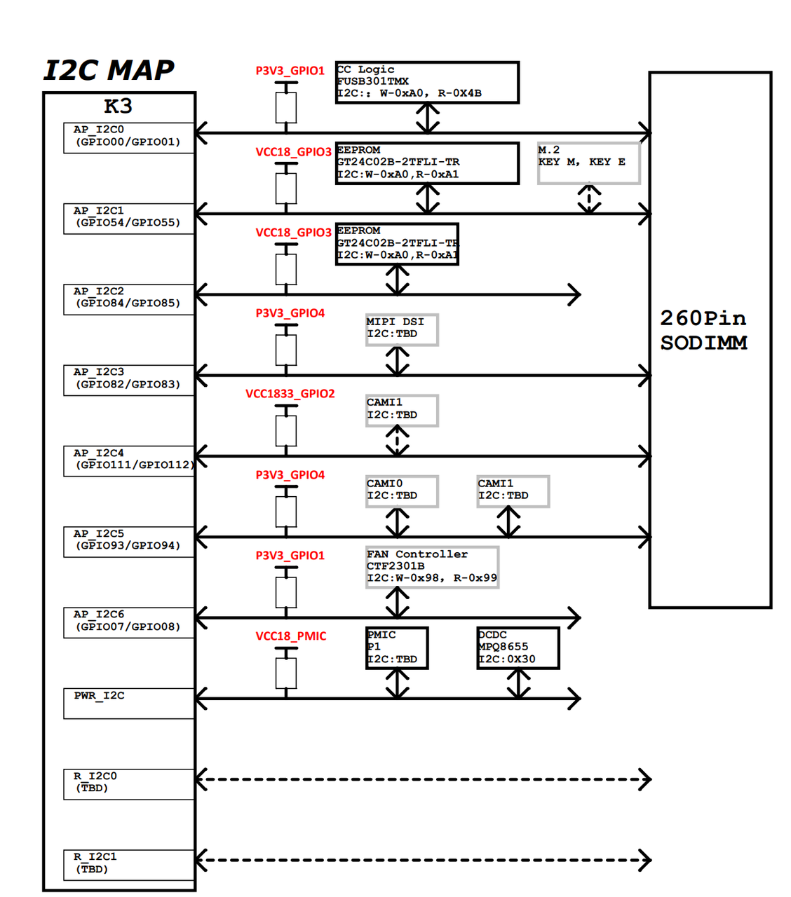

## 5. 模块简述

### 5.1 电源输入

K3 CoM260 开发套件仅提供一种电源输入方式，即 DCIN 输入。请使用支持 12 V-6 A 的电源适配器。

### 5.2 存储器

K3 CoM260 模组集成了以下 4 类存储器：

1. **UFS2.2**：模组板载 UFS 存储，默认容量为 128 GB。  
2. **SPI Flash**：板载 SPI Flash。  
3. **DDR**：采用 2 颗 LPDDR5 芯片，单颗容量可选 4 GB / 8 GB / 16 GB。  
4. **EEPROM**：用于存储板卡信息。

### 5.3 按键输入

K3 CoM260 开发套件提供多功能按键接口，包括电源按键、复位按键和下载按键。

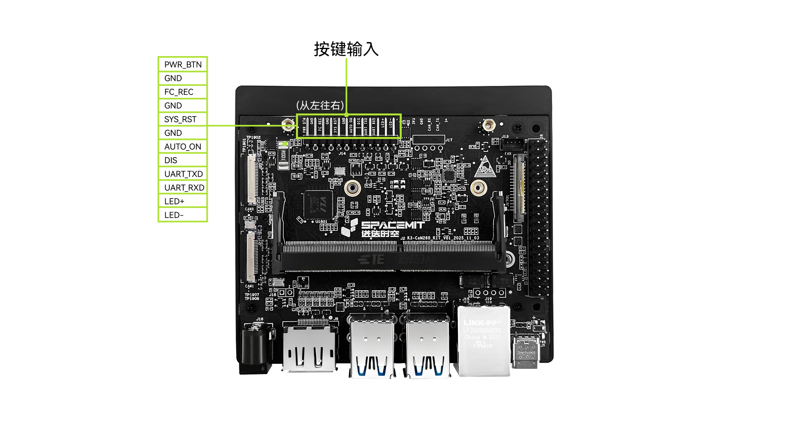

| Pin | 信号名称         | Function             |
|-----|------------------|----------------------|
| 1   | PC_LED-          | LED 负极             |
| 2   | PC_LED+          | LED 正极             |
| 3   | UART0_RXD        | DEBUG UART RX        |
| 4   | UART0_TXD        | DEBUG UART TX        |
| 5   | BMCU_ACOK        | 设置为按键开机       |
| 6   | AUTO_ON_DIS      | 与 BMCU_ACOK 短接，设置为按键开机   |
| 7   | GND              | 电源地               |
| 8   | PMIC_RST_OUTn    | 复位                 |
| 9   | Gnd              | 电源地               |
| 10  | FORCE_RECOVERY   | Download             |
| 11  | Gnd              | 电源地               |
| 12  | SLEEP/WAKE       | 开机/关机            |

### 5.4 MIPI CSI 高速连接器

K3-CoM260 不限定支持特定型号的摄像头模组。其高速连接器提供两组 4 Lane MIPI CSI 信号，并可通过模组上的电阻配置灵活选择不同的链路组合模式。

默认配置下，

- CAM0 支持 2 lanes
- CAM1 支持 2+2 lanes 或 4 lanes

**22 Pin 高速连接器接口线序如下：**

**CAM0**

| Pin | 信号名称          |
|-----|-------------------|
| 1   | VDD_3V3_SYS       |
| 2   | I2C4_SDA           |
| 3   | I2C4_SCL           |
| 4   | GND               |
| 5   | CLK_CAMCK         |
| 6   | CAM_PWDN          |
| 7   | GND               |
| 8   | MIPI_CSI0_DP1     |
| 9   | MIPI_CSI0_DN1     |
| 10  | GND               |
| 11  | MIPI_CSI0_DP0     |
| 12  | MIPI_CSI0_DN0     |
| 13  | GND               |
| 14  | MIPI_CSI1_CLKP    |
| 15  | MIPI_CSI1_CLKN    |
| 16  | GND               |
| 17  | MIPI_CSI1_DP1     |
| 18  | MIPI_CSI1_DN1     |
| 19  | GND               |
| 20  | MIPI_CSI1_DP0     |
| 21  | MIPI_CSI1_DN0     |
| 22  | GND               |

**CAM1**

| Pin | 信号名称         |
|-----|------------------|
| 1   | VDD_3V3_SYS      |
| 2   | I2C4_SDA         |
| 3   | I2C4_SCL         |
| 4   | GND              |
| 5   | CLK_CAMCK        |
| 6   | CAM_PWDN         |
| 7   | GND              |
| 8   | MIPI_CSI3_DP1    |
| 9   | MIPI_CSI3_DN1    |
| 10  | GND              |
| 11  | MIPI_CSI3_DP0    |
| 12  | MIPI_CSI3_DN0    |
| 13  | GND              |
| 14  | MIPI_CSI2_CLKP   |
| 15  | MIPI_CSI2_CLKN   |
| 16  | GND              |
| 17  | MIPI_CSI2_DP1    |
| 18  | MIPI_CSI2_DN1    |
| 19  | GND              |
| 20  | MIPI_CSI2_DP0    |
| 21  | MIPI_CSI2_DN0    |
| 22  | GND              |

### 5.5 MIPI DSI 屏连接器

K3 CoM260 支持树莓派 4.3 英寸电容触摸显示屏。

**屏接口线序如下：**

| Pin | 信号名称             | 信号名称             | Pin |
|-----|----------------------|----------------------|-----|
| 1   | GND                  | GND                  | 2   |
| 3   | MIPI_DSI1_LANE1_DN   | MIPI_DSI1_LANE1_DN   | 4   |
| 5   | MIPI_DSI1_LANE1_DP   | MIPI_DSI1_LANE1_DP   | 6   |
| 7   | GND                  | GND                  | 8   |
| 9   | MIPI_DSI1_CLK_N      | MIPI_DSI1_CLK_N      | 10  |
| 11  | MIPI_DSI1_CLK_P      | MIPI_DSI1_CLK_P      | 12  |
| 13  | GND                  | GND                  | 14  |
| 15  | MIPI_DSI1_LANE0_DN   | MIPI_DSI1_LANE0_DN   | 16  |
| 17  | MIPI_DSI1_LANE0_DP   | MIPI_DSI1_LANE0_DP   | 18  |
| 19  | GND                  | GND                  | 20  |
| 21  | I2C3_SCL             | I2C3_SCL             | 22  |
| 23  | I2C3_SDA             | I2C3_SDA             | 24  |
| 25  | GND                  | GND                  | 26  |
| 27  | LCD_VCC33            | LCD_VCC33            | 28  |
| 29  | LCD_VCC33            | LCD_VCC33            | 30  |

### 5.6 Type-C 连接器

K3 CoM260 开发套件的 Type-C 连接器仅支持 OTG 模式，不支持对内供电。

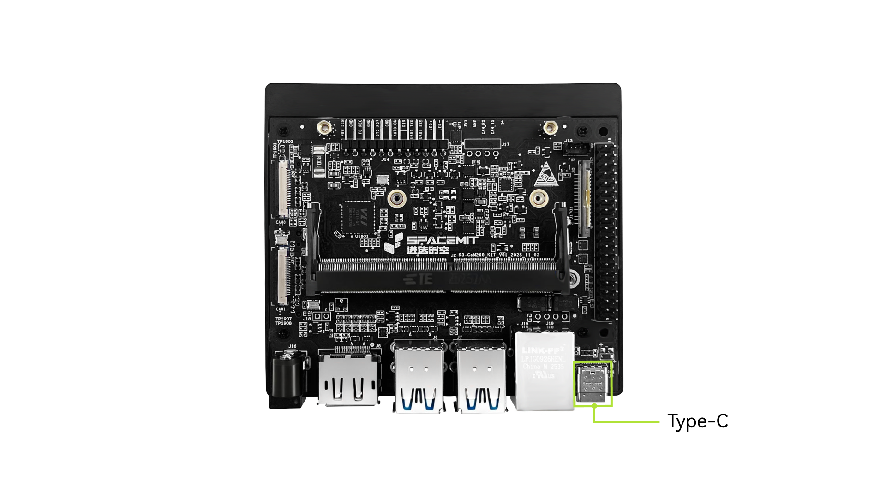

### 5.7 DP 输出接口

K3 CoM260 开发套件支持 1 路 DP Type-A 输出接口，最高支持 DP 1.2，最大支持 3840 × 2160 @ 60fps 视频输出。

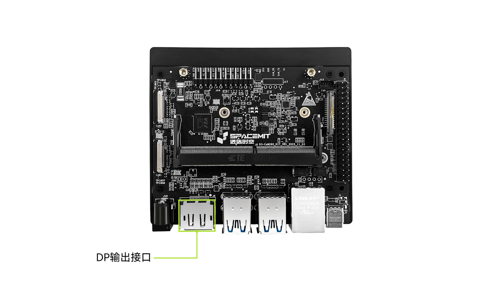

### 5.8 USB 接口

K3 CoM260 开发套件提供 4 路 USB 3.0 Type-A 接口，便于连接各类 USB 外设。

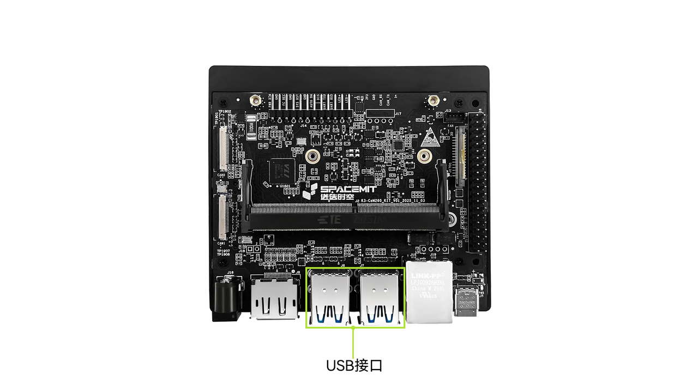

### 5.9 RJ45 接口

K3 CoM260 开发套件支持 1 个 RJ45 千兆网接口。

### 5.10 Wi-Fi/BT 模组

K3 CoM260 开发套件支持接入 M.2 2230 E-Key 模组，可实现无线网络和蓝牙功能。

### 5.11 40 Pin 接口

K3 CoM260 开发套件提供 40 Pin 双排插针接口，线序如下：

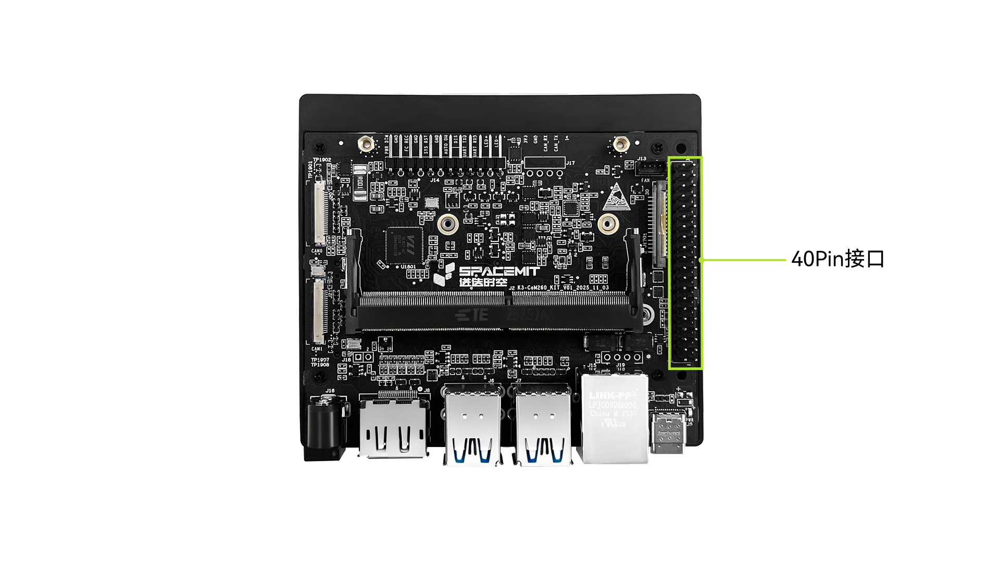  

> 注：IO Function 可根据需求自行配置。

| Pin | 信号名称          | 信号名称          | Pin |
|-----|-------------------|-------------------|-----|
| 1   | VDD_3V3_SYS       | VDD_5V_GPIO       | 2   |
| 3   | I2C3_SDA          | VDD_5V_GPIO       | 4   |
| 5   | I2C3_SCL          | GND               | 6   |
| 7   | GPIO09            | UART1_TXD_LS      | 8   |
| 9   | GND               | UART1_RXD_LS      | 10  |
| 11  | UART1_RTS_LS      | I2S0_SCLK_LS      | 12  |
| 13  | R-SPI0_SCK_LS     | GND               | 14  |
| 15  | GPIO12_LS         | R-SPI0_CS1_LS     | 16  |
| 17  | VDD_3V3_SYS       | R-SPI0_CS_LS      | 18  |
| 19  | SPI0_MOSI_LS      | GND               | 20  |
| 21  | SPI0_MISO_LS      | R-SPI0_MISO_LS    | 22  |
| 23  | SPI0_SCK_LS       | SPI0_CS0_LS       | 24  |
| 25  | GND               | SPI0_CS1_LS       | 26  |
| 27  | I2C0_SDA          | I2C0_SCL          | 28  |
| 29  | GPIO01_LS         | GND               | 30  |
| 31  | GPIO11_LS         | GPIO07_LS         | 32  |
| 33  | GPIO13_LS         | GND               | 34  |
| 35  | I2S0_LRCK_LS      | UART1_CTS_LS      | 36  |
| 37  | R-SPI0_MOSI_LS    | I2S0_SDIN_LS      | 38  |
| 39  | GND               | I2S0_SDOUT_LS     | 40  |

### 5.12 TF-Card 接口

K3 CoM260 支持 TF 卡接入，便于扩展存储设备。同时支持 Debug 扩展卡，用于 JTAG 调试。

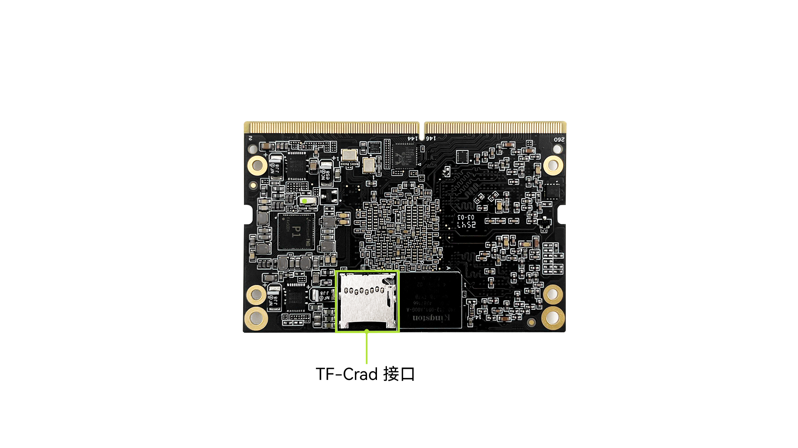

### 5.13 M.2 M-Key 接口

K3 CoM260 开发套件提供 2 × M.2 M-Key 接口，分别支持 2280（图中较长 SSD）和 2230（图中较短 SSD）规格的 NVMe SSD，便于接入 SSD 及其他 M.2 M-Key 设备。

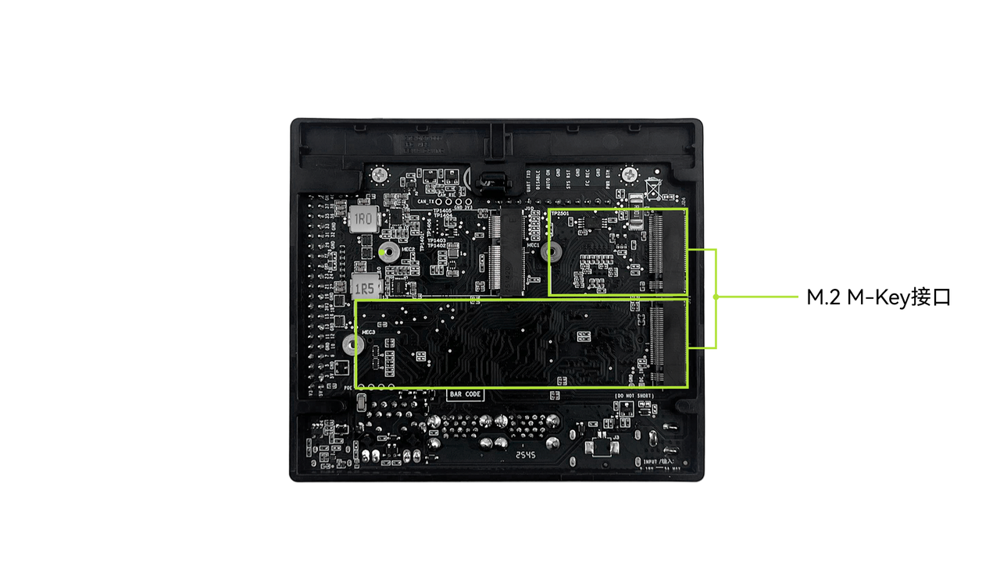

### 5.14 CAN FD 接口

K3 CoM260 开发套件板载 CAN 收发器，可直接连接 CAN 设备。

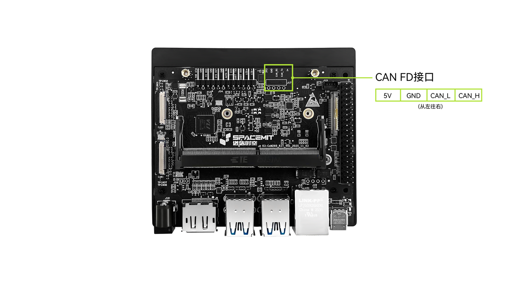

## 6. 初次设置

### 6.1 使用前准备

#### 6.1.1 电源适配器

K3 CoM260 采用 DCIN 供电。建议使用符合相关质量认证、输出规格正确的 DC JACK 电源适配器，规格为19V/2.37A或12V/5A。

#### 6.1.2 键盘和鼠标

您可以使用 K3 CoM260 开发套件上的任一 USB-A 端口连接有线键盘、鼠标或 USB 接收器，也可以通过蓝牙方式连接键盘和鼠标。

#### 6.1.3 显示器

K3 CoM260 需配合外接显示器输出画面。产品支持 DP 和 MIPI DSI 视频接口，因此可连接一种或同时连接两种对应接口的显示器。  

> **注意**：若需通过 MIPI DSI 接口输出画面，请务必在开机前完成显示器与 K3 CoM260 之间的视频线连接。K3 CoM260 的 MIPI DSI 接口 **不支持热插拔**。

#### 6.1.4 网络连接

K3 CoM260 支持有线 RJ45 网络连接，您可以直接接入网线。  
同时，K3 CoM260 也支持 Wi-Fi 和蓝牙无线连接；如需增强信号，可安装外接天线。

### 6.2 开始启动

请按以下步骤完成设备上电前的连接：

- 使用视频线将设备连接至显示器，并接入键盘和鼠标。
- 最后连接电源线并上电开机。
  - 首次通电：设备自动开机。
  - 软件关机后：需短按电源按钮以重新开机。

设备启动后：

- K3 CoM260 开发套件上的红色电源指示灯将点亮；
- K3 CoM260 模组的散热风扇开始运转。

### 6.3 首次启动时配置您的 K3-CoM260

K3 CoM260 出厂时预装进迭时空 Bianbu 操作系统。设备首次启动时将自动运行配置向导，您需要通过显示器、键盘和鼠标完成相关配置。

详细配置说明请参考 [LXQt 首次启动与会话](https://spacemit.com/community/document/info?lang=zh&nodepath=software/SDK/bianbu/user_guide/LXQt/initial_setup_and_sessions.md)。

## 7. 刷机

### 7.1 进入刷机模式

进入刷机模式前，请准备两个按键，分别用于短接 FC_REC 与 GND、SYS_RST 与 GND。

1. **设备处于断电状态时**
   1. 按住 FC_REC 按键不松开。
   2. 接入电源适配器，为设备上电。
   3. 松开 FC_REC 按键。
   4. 使用 Type-C 数据线连接开发板 Type-C 接口与上位机电脑。
   5. 使用进迭时空刷机工具 Titan 或执行 `fastboot` 命令进行烧录。
2. **设备已上电并处于开机状态时**
   1. 按住 FC_REC 按键不松开。
   2. 短按 RST 按键。
   3. 松开 FC_REC 按键。
   4. 使用 Type-C 数据线连接开发板 Type-C 接口与上位机电脑。
   5. 使用进迭时空刷机工具 Titan 或执行 `fastboot` 命令进行烧录。

刷机流程请参考 [刷机工具使用手册](https://www.spacemit.com/community/document/info?lang=zh&nodepath=tools/user_guide/flasher_user_guide.md)。

### 7.2 固件下载和安装

**Bianbu** 是进迭时空面向 RISC-V 架构处理器深度优化的操作系统。

点击 [K3 Bianbu](https://spacemit.com/community/resources-download/Images%20Collects/K3/Bianbu) 获取安装包。

## 8. 串口调试

### 8.1 接口连接

请将上位机通过 USB 转 TTL 设备与 K3-CoM260 载板 12 Pin 接口的 TX、RX、GND 正确连接。接口信号如下图所示：

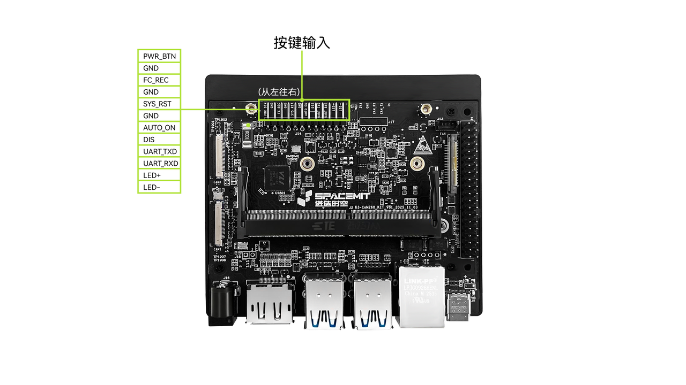

### 8.2 Windows 调试

以下以 MobaXterm 为例说明操作步骤：

请先正确连接硬件串口，并在 Windows 设备管理器的“端口”中确认系统已识别对应的 COM 口（如图所示）。
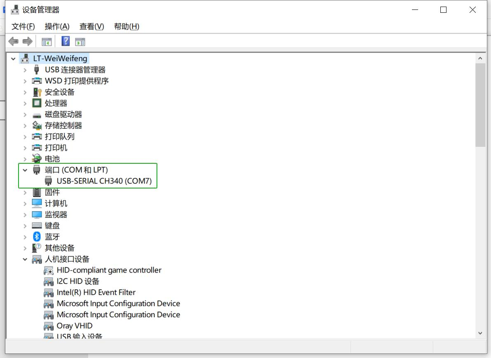

1. 打开 MobaXterm 软件，依次选择 **Sessions → New Session**。  

   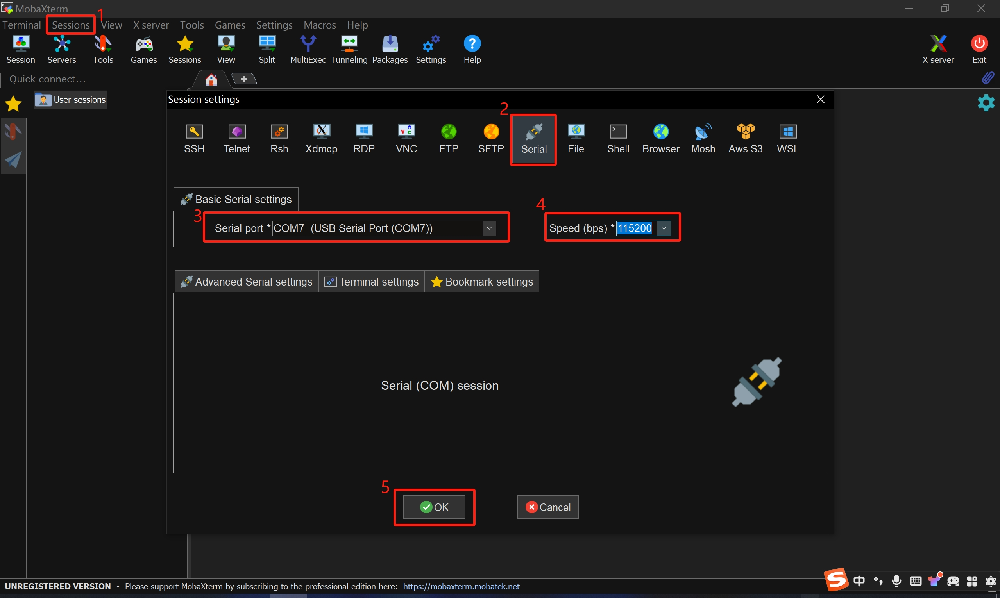
  
2. 在弹出的对话框中，选择 **Serial**。  

3. 在 **Serial port** 下拉菜单中，选择已识别的 COM 口。  

4. 将 **Speed** 设置为 **115200**。  

5. 点击 **OK**，进入串口日志输出页面。

## 9. 注意事项

K3 CoM260 适用于实验室或工程环境。开始操作前，请仔细阅读以下注意事项：

1. 任何情况下不可对屏幕接口、CSI 接口及扩展板进行热插拔操作。  
2. 拆封包装和安装前，为避免静电释放（ESD）对开发板硬件造成损伤，请采取必要的防静电措施。  
3. 拿取开发板时，请握持板边，避免触碰板上的外露金属部分，以免静电损坏板上元器件。  
4. 请将开发板放置于干燥、平整的表面，并确保其远离热源、电磁干扰源、辐射源以及电磁辐射敏感设备（如医疗设备）等。
