# K3 Pico-ITX 用户使用指南

## PDF 版本下载

点击下载 [K3 Pico-ITX 用户使用指南 (PDF)](https://cdn-resource.spacemit.com/file/product/K3/k3_pico_ug_zh.pdf)

## 版本

修订记录用于说明本文档历次更新的内容。

| 修订版本 | 修订日期   | 修订说明 |
|----------|------------|----------|
| V1.1     | 2026.06.10  | 更新供电注意事项 |
| V1.0     | 2026.04.30 | 首版     |

## 1. 快速开始

欢迎使用进迭时空 K3 Pico-ITX 单板计算机。
K3 Pico-ITX 提供两款不同的套餐配置：

- **单板套装**
   

- **机箱套装**
   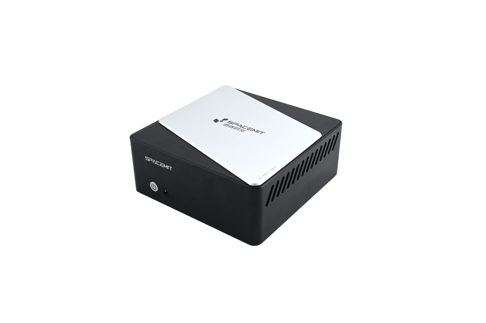

使用前，请连接以下必要外设。接通电源后即可开机使用：

- 一个 Type-C 电源适配器或 ATX-2 Pin 直流电源（推荐使用 20 V/5 A 电源适配器）
  > 注意：
  > - Type-C 电源适配器额定输出应满足 <20V@3.25A> 及以上;
  > - ATX-2 Pin 直流电源应满足 12V@5A 及以上。
- 一台显示器
- 一个键盘
- 一个鼠标

可通过以下两种方式为 K3 Pico-ITX 单板计算机供电并连接显示设备：

**方式一**：选用具备 65 W 或更大功率 Type-C 反向充电能力的显示器，通过一根全功能 Type-C 线缆连接显示器与单板计算机；

- **方式一（单板套装）**
   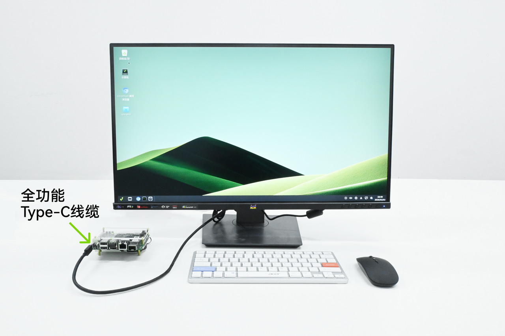

- **方式一（机箱套装）**
   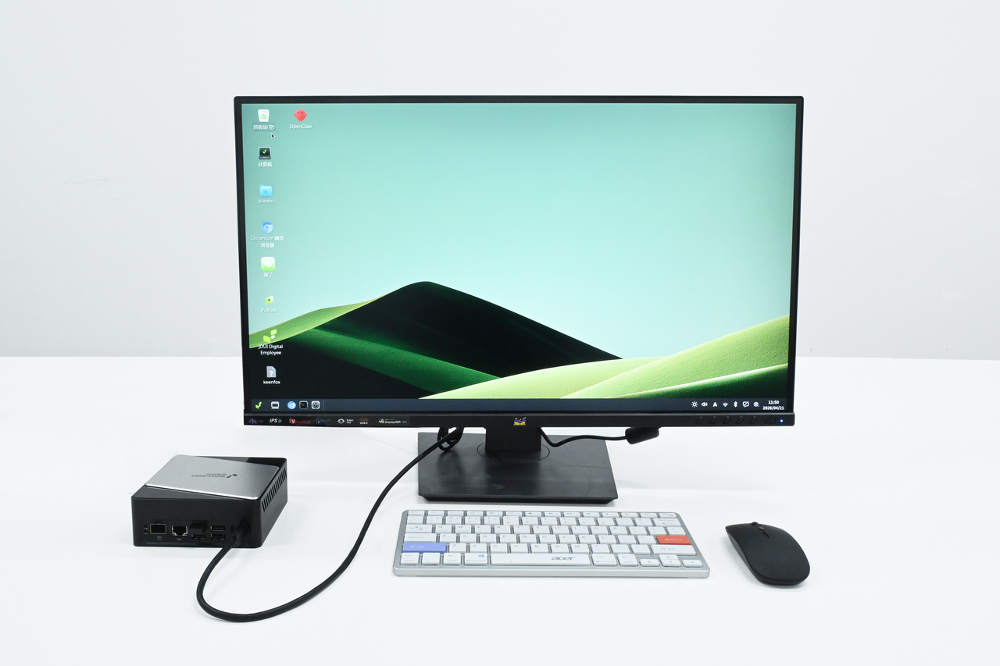

**方式二**：选用支持 HDMI 投屏、USB 和 PD 充电的多功能扩展坞，并将扩展坞接入单板计算机的全功能 Type-C 接口，通过该接口完成电源与显示转接。

- **方式二（单板套装）**
   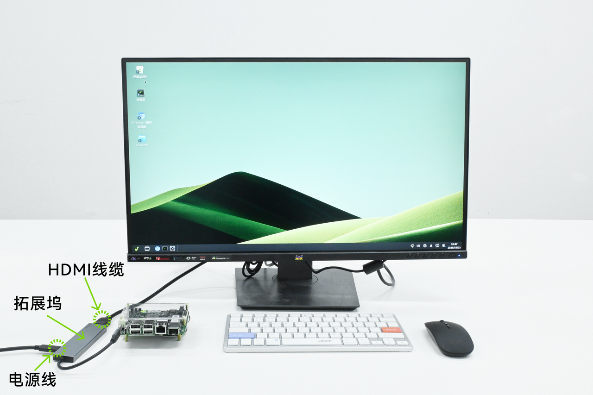

- **方式二（机箱套装）**
   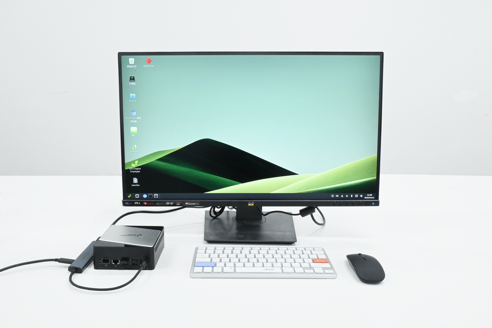

> **注意**：为确保单板计算机稳定运行，上电前请确认设备处于通风良好的环境中，并配合原装配套的散热器使用。

### 1.1 U-Boot 版本

K3 Pico-ITX 预装了 Bianbu LXQt 桌面版。按上述配置上电后，可直接进入 Bianbu OS 进行初始配置。

首次启动与会话配置可参考文档：[首次启动与会话](https://www.spacemit.com/community/document/info?nodepath=software/SDK/bianbu/user_guide/LXQt/initial_setup_and_sessions.md&lang=zh)。

### 1.2 UEFI 体验版本

K3 Pico-ITX 支持 UEFI 启动和配置，可以选择 NVMe SSD、USB、UFS 作为启动介质。

当前 Pico-ITX 已提供 UEFI 体验版，可下载 [UEFI 体验版镜像](https://archive.spacemit.com/image/k3/version/bianbu/v4.0/Bianbu-LXQt-UEFI-K3-v4.0-20260430171239.tar.gz)。操作系统安装步骤可参考本文档第 3 部分 [安装操作系统](#3-安装操作系统)。

#### 1.2.1 UEFI 配置指引

在 K3 Pico-ITX 上电开机后 3 s 内，按下 “F2” 键，即可进入 UEFI 设置界面。

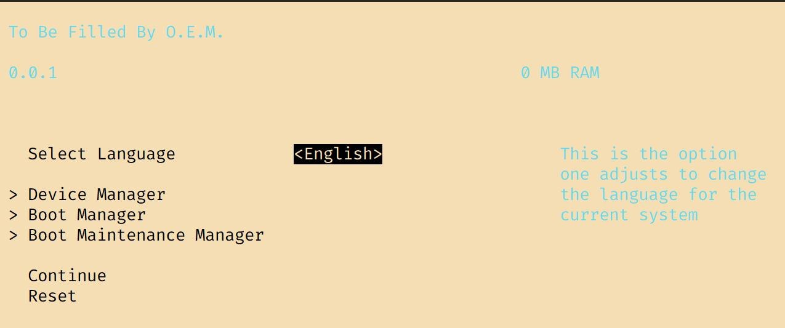

#### 1.2.2 启动管理 Boot Manager

在 Boot Manager Menu 中，通过 <↑> 和 <↓> 键选择 NVMe SSD、USB 硬盘或 UFS 启动，也可选择进入 UEFI Shell 命令行界面。

#### 1.2.3 启动维护 Boot Maintenance Manager

在 Boot Maintenance Manager 菜单中，进入 Boot Options，选择 Change Boot Order 可设置启动介质优先级。按 <+> 和 <-> 调整启动顺序，按 <Enter> 后选择 Commit Change and Exit 提交设置并退出；返回主菜单后，按 <F10> 保存设置。

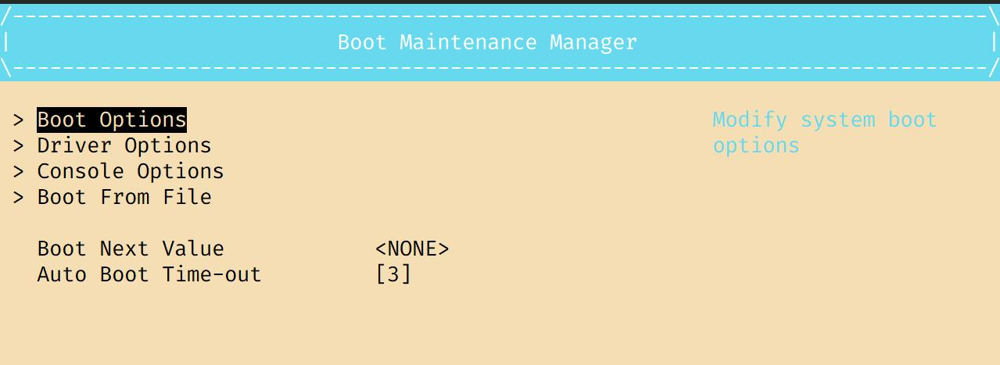

#### 1.2.4 交互命令行 UEFI Interactive Shell

支持 UEFI Interactive Shell V2.2 版本。首次进入 UEFI Interactive Shell 时，界面会打印当前检测到的所有存储设备。按下除 <Esc> 以外的任意键，或等待 5 秒后，即可进入命令行界面。输入 `help` 可查看支持的命令及相关帮助信息。

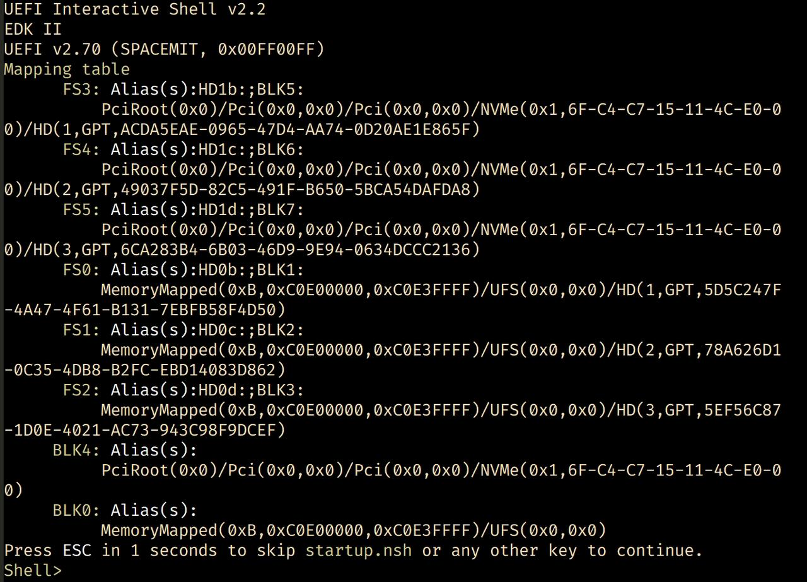

#### 1.2.5 GRUB 引导

支持 GRUB 引导，可安装多个操作系统，并在启动时由用户自行选择。

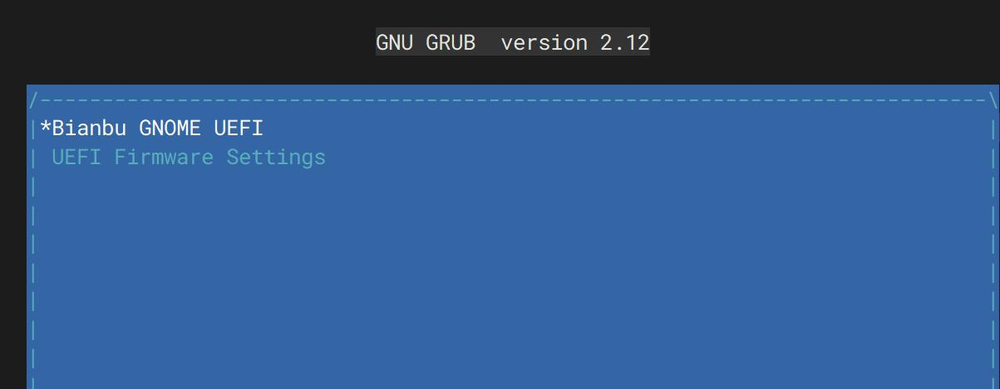

## 2. 硬件描述

### 2.1 资源概览

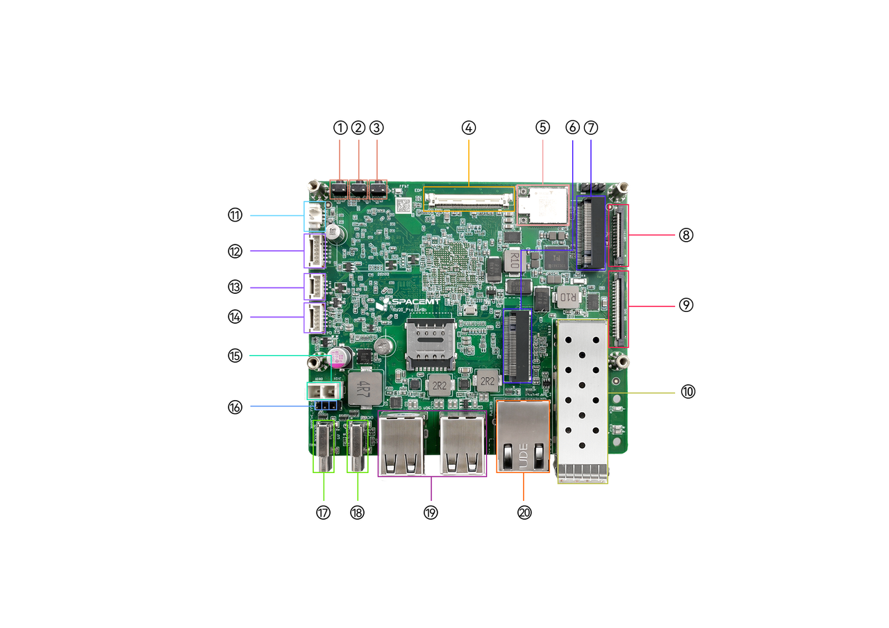

> **备注**：主板外观可能因硬件版本不同而有细微差别。

| No. | 接口说明             |
|-----|-----------------------------------|
| 1   | 电源按键 PWR                      |
| 2   | 烧录按键 FDL                      |
| 3   | 复位按键 RST                      |
| 4   | eDP 接口                          |
| 5   | Wi-Fi 与 BT 模块                  |
| 6   | M.2 Key B 接口                    |
| 7   | M.2 Key M 接口                    |
| 8   | 26 Pin FPC 连接器                 |
| 9   | 36 Pin FPC 连接器                 |
| 10  | 10G Ethernet 光纤接口             |
| 11  | 纽扣电池连接口                    |
| 12  | 前面板耳机接口                    |
| 13  | 前面板开关                        |
| 14  | EC 扩展资源                       |
| 15  | ATX 供电口                        |
| 16  | 串口插针                          |
| 17  | 全功能 Type-C 接口                |
| 18  | DRD Type-C 接口（不可向内供电）            |
| 19  | Dual USB 2.0 Type-A 接口          |
| 20  | 1G Ethernet 电口                  |

### 2.2 指示灯和按键

| 指示灯 | 状态说明 |
|:-----|:------|
| 状态指示灯 STAT | 绿色常亮：单板计算机处于开机工作状态  绿色闪烁：单板计算机提示即将强制下电  熄灭：单板计算机处于关机状态 |

| 按键 | 使用说明 |
|:-----|:------|
| 电源按键 PWR | - 关机（Shutdown）状态短按：开机启动 - 待机（Standby）状态短按：唤醒系统 - 开机（Normal）状态按下 3s，LED 开始从常亮变为闪烁状态，提示用户即将下电；在闪烁状态下持续按住不松开按键，将强制下电关机 - 开机（Normal）状态短按：发送按键事件，事件行为由 OS 设置定义 |
| 固件烧录 FDL | - 按住：插入电源或电源复位，进入烧录模式 |
| 复位按键 RST | - 短按：系统电源复位，强制重启 |

### 2.3 接口说明

#### 2.3.1 电源接口

- USB Type-C 支持 USB PD 3.0 协议供电，最大支持 20 V/5 A。
- ATX 接口供电，最大支持 12 V/7 A。接入 ATX 电源后，系统将优先使用 ATX 供电。
  > 注意：ATX 与 Type-C PD 供电不支持“1+1”热冗余。
  > - 当系统由 ATX 供电时，即使插入支持 PD 的 Type-C 线缆，仍会继续使用 ATX 电源。
  > - 如需切换至 Type-C PD 供电，请先关机断电，再移除 ATX 电源后重新上电。
  > - 当系统同时连接 ATX 电源和 Type-C PD 电源时，若在开机状态下移除 ATX 电源，系统会自动重启，并在重启后切换至 Type-C PD 供电。
  > - 当系统由 Type-C PD 供电时，若接入优先级更高的 ATX 电源，系统将自动重启，并在重启后切换至 ATX 供电。
- 进入烧录模式时，该接口可同时提供供电和 USB Device 功能。通过 USB Type-C 与上位机连接后，可被扫描和识别，支持烧录升级操作。

  

| No. | 接口说明             |
|-----|-----------------------------------|
| 15  | ATX 供电口                        |
| 17  | 全功能 Type-C 接口                |

#### 2.3.2 烧录接口

进入烧录模式时，该接口仅可作为 USB Device 用于数据传输，不能向板内供电。通过 USB Type-C 与上位机连接后，可被扫描和识别，支持烧录升级操作。

> **注意**：烧录 Type-C 口不可向板内供电，烧录时需通过其他供电口保持供电；烧录时，USB 线缆须为数据通讯线缆，仅支持充电的 USB 线缆无法烧录。

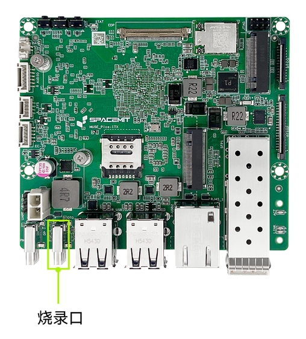  

| No. | 接口说明             |
|-----|---------------------|
| 18  | 烧录口（不可向内供电）            |

#### 2.3.3 全功能 Type-C 接口

- 类型：Type-C 连接器
- 最大支持 PD 3.0 调压，支持连接 DP 显示器和 USB 3.0 外设。
- DP 显示屏最高支持 4K@60 Hz 分辨率，支持热插拔。
- 显示接口仅连接 DP 屏幕时，DP 屏幕为主显示屏。

  

| No. | 接口说明             |
|-----|-----------------------------------|
| 17  | 全功能 Type-C 口                  |

#### 2.3.4 高速扩展接口 M.2 M-Key 与 M.2 B-Key

- 类型：4.2 mm 高度的 M.2 连接器
- **M.2 M-Key**
  - 支持 NVMe 协议，尺寸为 2280
  - PCIe 3.0 x2/x4 带宽
- **M.2 B-Key**
  - 支持 PCIe SSD，尺寸为 2242
  - PCIe 3.0 x2 带宽
  - 支持 USB 2.0 4G 模组

> **注意**：
>
> 1. 当 M.2 B-Key 插入 PCIe SSD 时，M.2 M-Key 带宽为 PCIe 3.0 x2；当 M.2 B-Key 未插入 SSD 时，M.2 M-Key 带宽为 PCIe 3.0 x4。
> 2. M.2 B-Key 作为存储扩展接口时仅支持 PCIe SSD，不支持 SATA SSD。
> 3. 不支持热插拔。安装或拆卸前请先断电。

  

| No. | 接口说明             |
|-----|-----------------------------------|
| 6   | M.2 Key B 接口                    |
| 7   | M.2 Key M 接口                    |

#### 2.3.5 显示接口 eDP

- 类型：eDP CONN
- 可外接 eDP 显示屏，分辨率最高支持 2.5K @ 90 Hz，不支持热插拔。
- 仅连接 eDP 屏幕时，eDP 屏幕默认为主显示屏。
- 当 DP 屏与 eDP 屏同时连接时，默认主屏幕为 eDP，DP 为副屏扩展；如需将 DP 设置为主屏，可在操作系统内修改。

  

| No. | 接口说明             |
|-----|-----------------------------------|
| 4   | eDP 接口                          |

#### 2.3.6 音频接口 AUDIO

- 类型：1.25 mm 带扣线对板接口

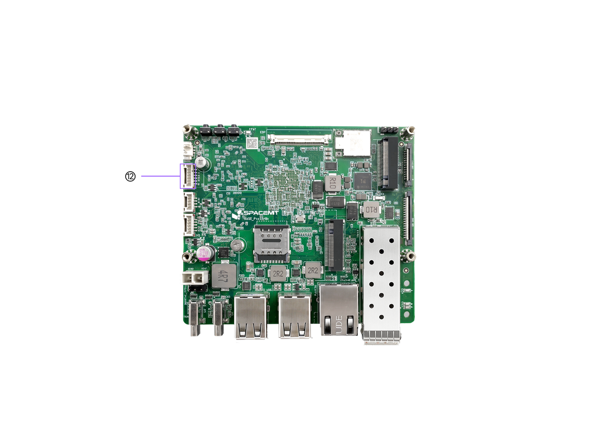  

| No. | 接口说明             |
|-----|-----------------------------------|
| 12  | 前面板耳机接口                    |

- 板上预留音频输出接口，可通过转接线连接至前面板并插入 3.5 mm 耳机。

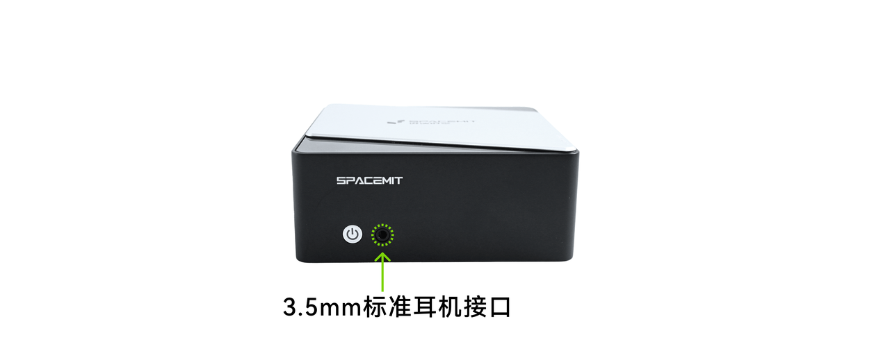

#### 2.3.7 有线以太网接口 1G ETH

- 类型：RJ45，带黄绿指示灯；
- 支持 100 M/1000 M 速率，自适应切换；

网口绿色 LED 为 LINK SPEED 指示灯，用于指示链路状态和链路速率：

1. LINK SPEED 绿色常亮，链路建立且为最高速率状态；
2. LINK SPEED 熄灭，链路建立但处于非最高速率状态；
3. 链路未建立时，LINK SPEED 不点亮，保持熄灭状态；

网口黄色 LED 为 ACTIVE 指示灯，用于指示链路活跃状态：

1. ACT 灯熄灭，链路无数据传输；
2. ACT 灯黄色闪烁，链路有数据传输，处于活跃状态，越活跃闪烁频次越快；
3. 链路未建立时，ACT 不点亮，保持熄灭状态；

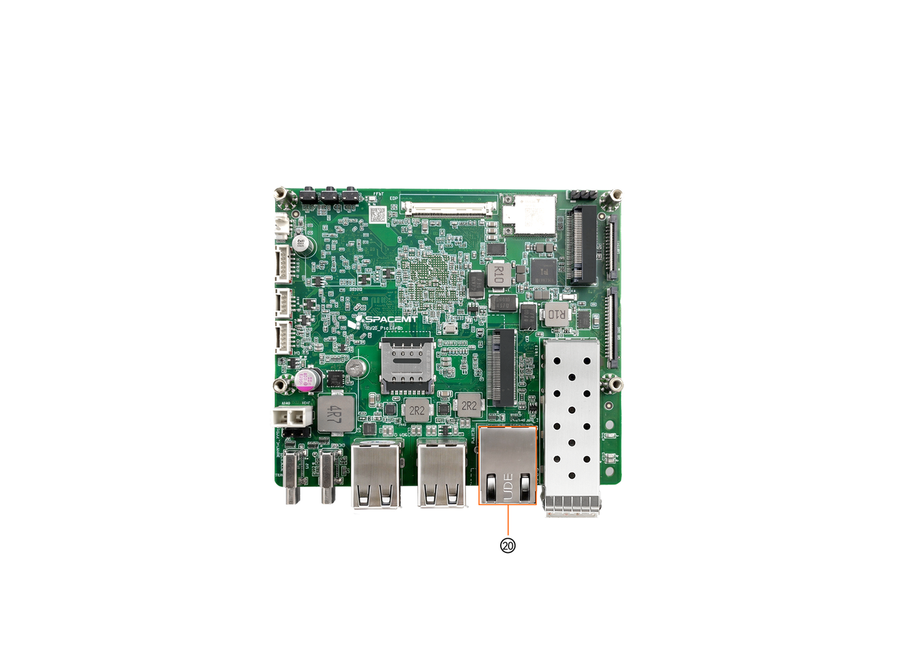  

| No. | 接口说明             |
|-----|-----------------------------------|
| 20 | 1G Ethernet 网口                   |

#### 2.3.8 有线光纤接口 10G ETH

- 类型：SFP+ 光口；
- 支持多模光模块、DAC 线缆和光转电模块，10G/1G 速率自协商；

LINK SPEED 用于指示链路状态和链路速率：

1. LINK SPEED 绿灯，链路建立且为最高速率状态；
2. 万兆网口 LINK SPEED 黄灯，链路建立但处于非最高速率状态；
3. 链路未建立时，LINK SPEED 不点亮，保持熄灭状态；
  
ACTIVE 用于指示链路活跃状态：

1. ACT 灯熄灭，链路无数据传输；
2. ACT 灯闪烁，链路有数据传输，处于活跃状态，越活跃闪烁频次越快；
3. 链路未建立时，ACT 不点亮，保持熄灭状态；

#### 2.3.9 通用串行总线接口 USB 2.0

- 类型：USB Type-A；
- 即插即用，支持 USB 2.0 Host；
- 支持同时接入键盘、鼠标等多个 USB 设备。

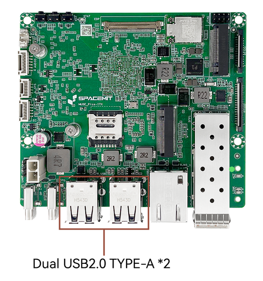  

| No. | 接口说明             |
|-----|-----------------------------------|
| 19  | Dual USB 2.0 Type-A 接口          |

#### 2.3.10 FPC 扩展接口

- 类型：0.5 mm 间距、26 Pin + 36 Pin FPC 线对板接口
- 包含资源：
  - CAN ×5
  - UART ×2
  - GMAC ×1
  - PWM ×2
  - I2C ×1
  - SPI ×1
- 可直接连接扩展板使用

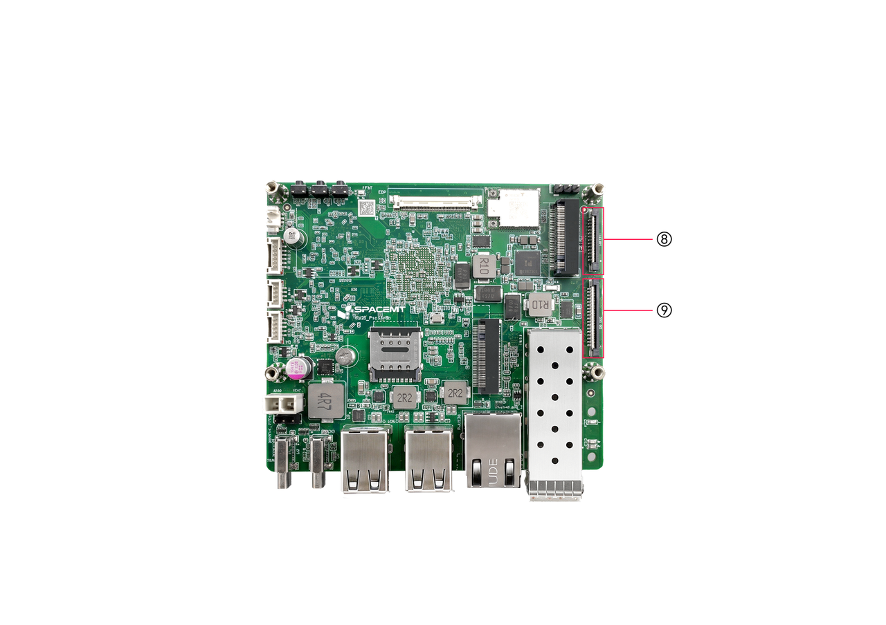  

| No. | 接口说明             |
|-----|-----------------------------------|
| 8   | 26 Pin FPC 连接器                 |
| 9   | 36 Pin FPC 连接器                 |

#### 2.3.11 Wi-Fi 天线接口

- 类型：板载 PCIe Wi-Fi 6 + BT 5.2 模组，符合 IEEE 802.11a/b/g/n/ac/ax 标准，双天线双频段（2.4 GHz/5.8 GHz）。
- 基础套餐随包装附赠 Wi-Fi 天线，可按下图推荐位置粘贴安装。
  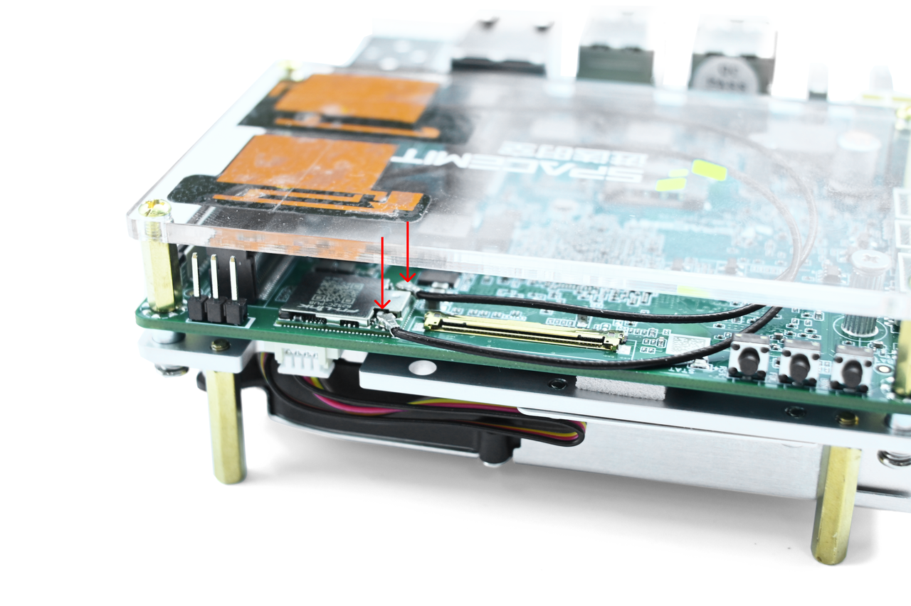  
- 机箱套装已完成 Wi-Fi 天线连接与适配，可直接使用 Wi-Fi 功能。

### 2.4 产品规格

| 项目 | 规格 |
|------|------|
| **处理器** | SpacemiT K3，8 核，2.4 GHz，60 TOPS 通用 AI 算力，符合 RVA23 标准，支持 IME 扩展和完整虚拟化 |
| **显示** | - DP Type-C 接口，最高支持 4K（3840 × 2160）分辨率，60 Hz 刷新率 - 40 Pin eDP 接口，最高支持 2.5K（2560 × 1600）分辨率，90 Hz 刷新率 |
| **内存** | 双通道 2 × 32 bit LPDDR5，6400 MT/s 速率，可选 16 GB/32 GB 容量 |
| **本地存储** | UFS 2.2，可选 128 GB/256 GB 容量 |
| **存储扩展** | M.2 M-Key 连接器，可装配 2280 尺寸 NVMe SSD，PCIe Gen3 x4 信号链路 |
| **高速扩展** | M.2 B-Key 连接器，可装配 2242/3042 尺寸扩展卡，提供 PCIe Gen3 x2 及 USB 信号 |
| **实时扩展** | FPC 连接器，支持 EtherCAT、5 路 CAN-FD、SPI、I2C 和 UART 等实时信号扩展 |
| **无线通讯** | 板载 PCIe Wi-Fi 6 + BT 5.2 模组，符合 802.11a/b/g/n/ac/ax 标准，双天线双频段 |
| **有线网络** | 支持一路以太网，RJ45 接口，100 M/1000 M 自适应速率 |
| **光纤网络** | 支持万兆以太网，提供 SFP+ 接口，支持 10G BASE-R 和 10G BASE-X，支持 QinQ、MSI-X、WOL 等网络特性 |
| **音频接口** | 板载 CODEC 电路，支持音频输入输出板内接口 |
| **USB 接口** | - 2 路 USB 3.2 Gen1 Type-C 接口（其中一路为全功能，一路为 OTG） - 4 路 USB 2.0 Type-A Host 接口 |
| **调试接口** | 支持 UART 和 JTAG 接口，附带 3 个侧边按键，用于开关机、复位和固件烧写升级 |
| **管理系统** | 板载 EC 管理系统，支持电源管理、智能散热策略和系统状态管理，板内支持 I2C/UART/GPIO 扩展接口 |
| **外观形态** | 100 mm × 86 mm，单板计算机 Pico-ITX Plus 尺寸，约为 2.5 英寸硬盘大小 |
| **操作系统** | 预装 Bianbu 3.0，支持 Ubuntu 26.04、OpenHarmony 6.0、OpenKylin、Deepin、Fedora 等操作系统 |
| **电源输入** | 支持双 Type-C USB PD 协议，额定输入功率 65 W；板上 ATX 2 Pin 电源输入端支持 12 V @ 7 A 供电 |
| **可靠性** | - 单板形态外设接口 ESD 防护：接触 ±4 kV，空气 ±8 kV - 整机形态 ESD 防护：接触 ±6 kV，空气 ±12 kV - 满足 CCC、CE、FCC 等电磁兼容认证标准 |
| **时钟** | 板载 RTC 时钟电源接口，支持安装电池，满足 G3 状态供电 |
| **结构** | - 可选配单板或带风冷风扇的散热器套装 - 可选配单板或自研全金属工业机箱 - 可选配实时扩展板、触摸屏或工业接线端子等多种配置 |

### 2.5 逻辑框图

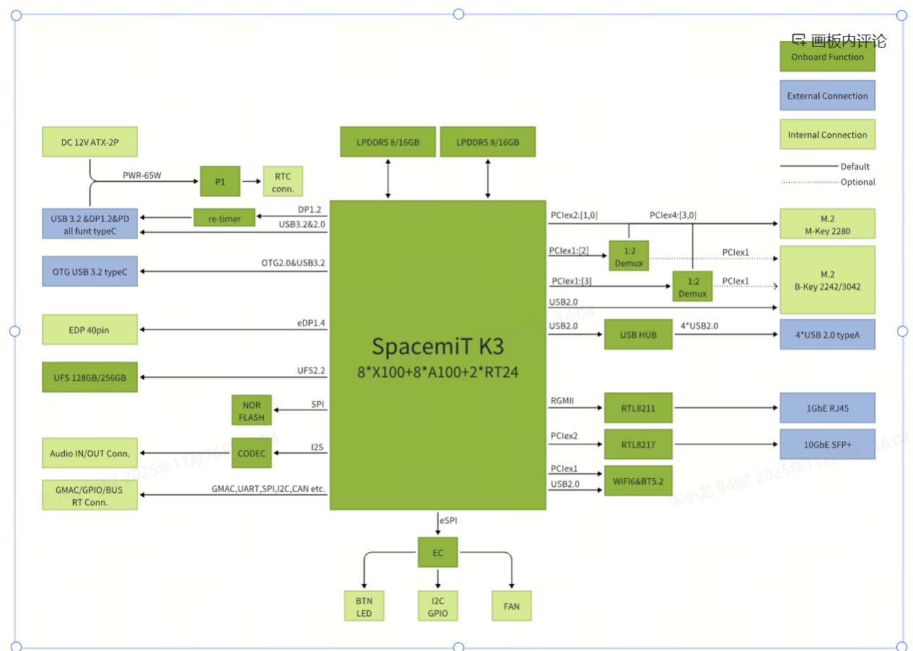

## 3. 安装操作系统

### 3.1 方式 1：Type-C 数据线烧录

#### 3.1.1 设备未上电，处于关机状态时

1. 按住 **烧录按键 FDL** 不松开。  
2. 连接全功能 Type-C 数据线或插上电源，给设备供电。  
3. 松开 **烧录按键 FDL**。  
4. 使用烧录用 Type-C 数据线，将 DRD 的 Type-C 接口接到上位机电脑。
5. 使用进迭时空官方刷机工具 **Titan** 或 `fastboot` 命令即可进行操作。

| No. | 接口说明             |
|-----|-----------------------------------|
| 2   | 烧录按键 FDL                      |
| 17  | 全功能 Type-C 接口                |
| 18  | DRD Type-C 接口（不可向内供电）    |

#### 3.1.2 设备已插上Type-C 全功能线或ATX电源供电，并处于开机状态时

1. 按住 **烧录按键 FDL** 不松开。  
2. 短按 **复位键 RST**。  
3. 松开 **烧录按键 FDL**。  
4. 使用烧录用 Type-C 数据线，将 DRD 的 Type-C 接口接到上位机电脑。
5. 使用进迭时空官方刷机工具 **Titan** 或 `fastboot` 命令即可进行操作。

> **备注**：刷机工具手册请参见 [刷机工具使用手册](https://www.spacemit.com/community/document/info?lang=zh&nodepath=tools/user_guide/flasher_user_guide.md)。

| No. | 接口说明             |
|-----|-----------------------------------|
| 2   | 烧录按键 FDL                      |
| 3   | 复位按键 RST                      |
| 15  | ATX 供电口                        |
| 17  | 全功能 Type-C 接口                |
| 18  | DRD Type-C 接口（不可向内供电）    |

### 3.2 串口调试

#### 3.2.1 接口连接

上位机通过 **USB 转 TTL** 设备正常连接 K3 Pico-ITX 主板接口的 **TX、RX、GND**。接口信号如下图所示。
其中，Tx、Rx 分别表示 K3 的发送与接收。

  

#### 3.2.2 Windows 系统调试（以 MobaXterm 为例）

以下以 MobaXterm 为例说明操作步骤。

请先正确连接硬件串口，并在 Windows 设备管理器的“端口”中确认系统已识别对应的 COM 口（如图所示）。

1. 打开 MobaXterm 软件，依次选择 **Sessions → New Session**。  

   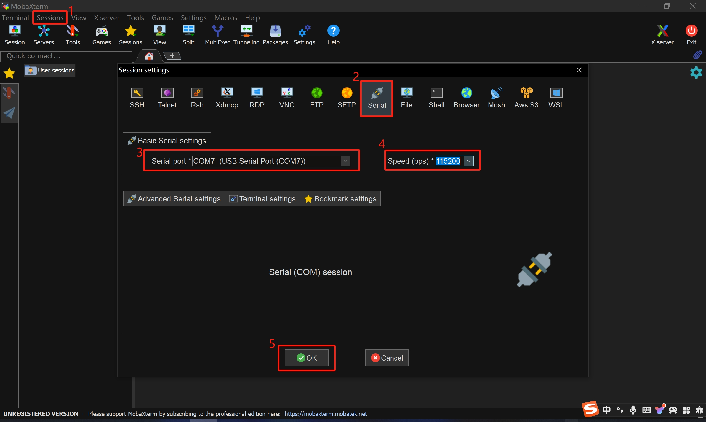
  
2. 在弹出的对话框中，选择 **Serial**。  

3. 在 **Serial port** 下拉菜单中，选择已识别的 COM 口。  

4. 将 **Speed** 设置为 **115200**。  

5. 点击 **OK**，进入串口日志输出页面。

## 4. 注意事项

K3 Pico-ITX 适用于家居、办公室或工业环境，开始操作前，请先阅读以下注意事项：

1. 任何情况下不可对屏幕接口、CSI 接口及扩展板进行热插拔操作。
2. 拆封单板计算机包装和安装前，为避免静电释放（ESD）对单板硬件造成损伤，请采取必要防静电措施。
3. 持单板计算机时请拿单板边沿，不要触碰单板上的外露金属部分，以免静电对单板元器件造成损坏。
4. 请将单板计算机放置于干燥的平面上，保证其远离热源、电磁干扰源与辐射源，以及电磁辐射敏感设备（如医疗设备）等。
5. 请将单板计算机置于通风良好的环境。如需连续 72 小时及以上长时间满载运行，请装配原厂散热器，或采取充分有效的散热措施。

## 5. 附录——接口线序

### 5.1 FPC 扩展接口

K3 Pico-ITX 配备 **26 Pin + 36 Pin FPC 扩展接口**。

  

**26 Pin 连接器接口线序**：CAN（from RT24）+ I2C（from RT24）+ UART + PWM + 3.3 V（主电源）

| 引脚编号 | 信号 | 说明 |
|:--------:|:----:|:----|
| 1        | 3.3V | IO 电压电源 |
| 2        | 3.3V | IO 电压电源 |
| 3        | R_I2C1_SCL | I2C 时钟 |
| 4        | R_I2C1_SDA | I2C 数据 |
| 5        | GND | 地 |
| 6        | R_UART0_TX | UART TX |
| 7        | R_UART0_RX | UART RX |
| 8        | GND | 地 |
| 9        | UART5_TX | UART TX |
| 10       | UART5_RX | UART RX |
| 11       | RX_PWM1 | PWM |
| 12       | RX_PWM2 | PWM |
| 13       | UART10_TX | UART TX |
| 14       | UART10_RX | UART RX |
| 15       | UART10_CTS | UART CTS |
| 16       | UART10_RTS | UART RTS |
| 17       | GND | 地 |
| 18       | R_CAN4_TX | CAN TX |
| 19       | R_CAN4_RX | CAN RX |
| 20       | GND | 地 |
| 21       | R_CAN3_TX | CAN TX |
| 22       | R_CAN3_RX | CAN RX |
| 23       | GND | 地 |
| 24       | R_CAN2_TX | CAN TX |
| 25       | R_CAN2_RX | CAN RX |
| 26       | GND | 地 |

**36 Pin 连接器接口线序**：GMAC-MII（from RT24）+ CAN + SPI + 1.8 V（主电源）

| 引脚编号 | 信号           | 说明                     |
|----------|----------------|--------------------------|
| 1        | 1.8V           | IO 电压电源              |
| 2        | 1.8V           | IO 电压电源              |
| 3        | CAN1_RX        | CAN RX                   |
| 4        | CAN1_TX        | CAN TX                   |
| 5        | GND            | 地                       |
| 6        | R_TX_CLK       | MAC 发送时钟             |
| 7        | GND            | 地                       |
| 8        | R_TX_D0        | MAC 发送数据0            |
| 9        | R_TX_D1        | MAC 发送数据1            |
| 10       | R_TX_D2        | MAC 发送数据2            |
| 11       | R_TX_D3        | MAC 发送数据3            |
| 12       | GND            | 地                       |
| 13       | R_RX_CLK       | MAC 接收时钟             |
| 14       | GND            | 地                       |
| 15       | R_RX_D0        | MAC 接收数据0            |
| 16       | R_RX_D1        | MAC 接收数据1            |
| 17       | R_RX_D2        | MAC 接收数据2            |
| 18       | R_RX_D3        | MAC 接收数据3            |
| 19       | GND            | 地                       |
| 20       | R_TX_EN        | 发送使能                 |
| 21       | R_CLK_25M      | 25M参考时钟              |
| 22       | R_RX_DV        | 接收数据有效             |
| 23       | R_PWDN/INTn    | 以太网 PHY 中断          |
| 24       | R_RESETn       | 以太网 PHY 的复位输入    |
| 25       | R_MDIO_MDC     | MDIO 时钟                |
| 26       | R_MDIO_MDIO    | MDIO 数据                |
| 27       | R_CRS          | 载波侦听                 |
| 28       | R_COL          | 碰撞检测                 |
| 29       | GND            | 地                       |
| 30       | SPI0_MOSI      | SPI TX                   |
| 31       | SPI0_MISO      | SPI RX                   |
| 32       | SPI0_SCLK      | SPI 时钟                 |
| 33       | SPI0_CS        | SPI 片选                 |
| 34       | GND            | 地                       |
| 35       | R_CAN0_TX      | CAN TX                   |
| 36       | R_CAN0_RX      | CAN RX                   |

### 5.2 UART 调试接口

上位机通过 **USB 转 TTL** 设备正常连接 K3 Pico-ITX 主板接口的 **TX、RX、GND**。接口信号如下图所示。
其中，Tx、Rx 分别表示 K3 的发送与接收。

  

> **备注**：主板外观可能因硬件版本不同而有细微差别。

### 5.3 EC 扩展接口

| 引脚编号 | 信号                    | 说明                     |
|----------|-------------------------|--------------------------|
| 1        | EC_I2C0_CLK_3V3         | EC I2C 总线时钟          |
| 2        | EC_I2C0_DAT_3V3         | EC I2C 总线数据          |
| 3        | GND                     | 地                       |
| 4        | EC_GPB2/TXD1/CTX0       | 串行发送或输入输出 B2    |
| 5        | EC_GPC0/RXD1/CRX0       | 串行接收或输入输出 C0    |

  

### 5.4 音频扩展接口

| 引脚编号 | 信号          | 说明                 |
|----------|---------------|----------------------|
| 1        | MICN_GMS1     | 麦克风N              |
| 2        | MICP_GMS0     | 麦克风P              |
| 3        | ROUT          | 右声道输出           |
| 4        | JACK_DET      | 耳机插座插入检测     |
| 5        | LOUT          | 左声道输出           |
| 6        | AUDIO_AGND    | 音频模拟地           |

  
