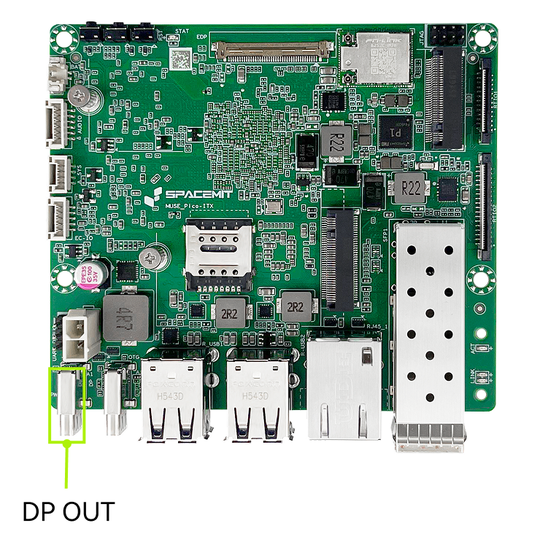
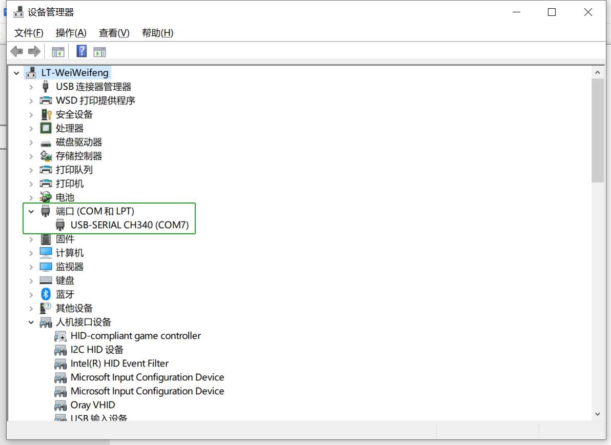
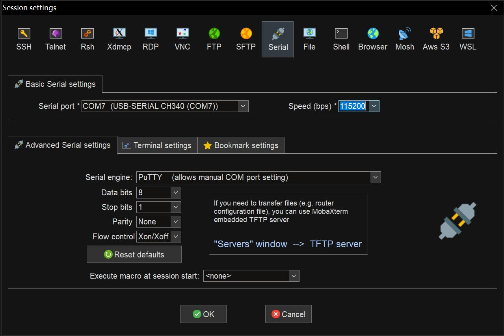
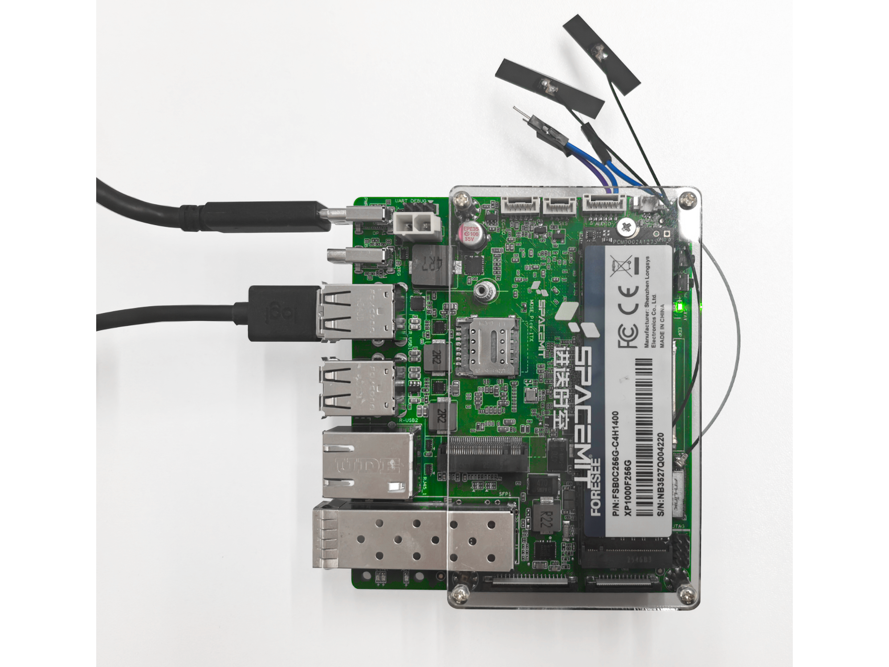
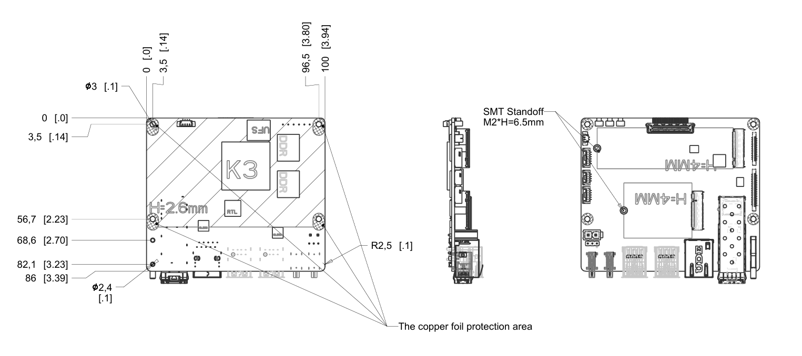

sidebar_position: 2

# K3 Pico-ITX 用户使用指南

## 1. 产品简介

K3 Pico-ITX 为 60TOPS 算力的单板计算机，采用 8 计算核和 8 智算核统一内存架构，板载 UFS 高速硬盘和万兆网络光通讯接口，充分释放算力性能，提高科学计算、人工智能等应用处理效率。

K3 Pico-ITX 为 2.5" Pico-ITX plus 尺寸，满足各行业紧凑型场景应用。单板支持双 M.2 扩展槽位，具备实时运动控制和系统管理接口。凭借其丰富的接口扩展性与工业架构式设计，可支持行业解决方案提供商开展快速评估与系统集成工作，推动产品商业化落地进程。

## 2. 硬件描述

### 2.1 资源概览

> **备注**：主板外观可能因为硬件版本不同而有细微的差别。

### 2.2 指示灯和按键

| 指示灯 | 状态说明 |
|-----|------|
| 状态指示灯STAT | 绿色常亮：单板计算机启动 |

| 按键 | 使用说明 |
|-----|------|
| 电源按键 PWR | - 关机（Shutdown）状态按下 1s 后松开：开机启动 - 待机（Standby）状态按下 1s 后松开：唤醒系统 - 开机（Normal）状态按下 3s：强制下电关机 |
| 复位按键 RST | - 短按：电源复位，系统强制重启 |
| 固件烧录 FDL | - 按住：插入电源或电源复位，进入烧录模式 |

### 2.3 接口说明

#### 2.3.1 电源接口

- 类型：USB Type-C、ATX-2Pin（默认优先 ATX 供电）
- 支持 USB-PD3.0 协议供电，最大支持 20V/5A
- 支持 ATX 接口直接供电，最大支持 12V/6A
- 进入烧录模式时，接口同时接受电源和 USB device，通过 USB Type-C 与上位机连接，可被扫描和识别到设备，支持烧录升级操作。

  

#### 2.3.2 烧录接口

进入烧录模式时，接口仅可作为 USB device 进行数据传输，不可向板内供电，通过 USB Type-C 与上位机连接，可被扫描和识别到设备，支持烧录升级操作。

> **注意**：烧录 Type-C 口不可向板内供电，烧录时需通过其他供电口保持供电；烧录时，USB线缆须为数据通讯线缆，仅支持充电USB线缆无法烧录。

  

#### 2.3.3 全功能 TYPE-C 接口

- 类型：TYPE-C 连接器
- 最大支持 PD3.0 调压
- 支持连接 DP 显示器
- 支持连接 USB3.0 外设

  

#### 2.3.4 高速扩展接口 M.2-M key & M.2-B key

- 类型：4.2mm 高度 M.2 连接器
- **M.2-M key**：支持NVMe协议，尺寸为2280，PCIe3.0 x2/x4带宽。
- **M.2-B key**：支持PCIe SSD，尺寸为2242，PCIe3.0 x2带宽；支持USB2.0 4G Model。

> **注意**：
>
> 1. 当M.2-B key插入PCIe SSD时，M.2-M key带宽为PCIe3.0 x2；当M.2-B key未插入SSD时，M.2-M key带宽为PCIe3.0 x4。
> 2. M.2-B key 作为存储扩展接口时仅支持 PCIe SSD，不支持 SATA SSD。
> 3. 不可热插拔，移除或安装请在下电状态下进行。

  

#### 2.3.5 显示接口 eDP

- 类型：eDP CONN
- 可外接 eDP 显示屏，分辨率最高支持 **2.5K@90Hz**，不支持热插拔。
- - 显示接口仅连接eDP屏幕时，eDP屏幕为主显示屏。

  

#### 2.3.6 显示接口 DP

- 类型：USB Type-C；
- 可外接DP显示屏，分辨率最高支持 4K@60Hz，支持热插拔。
- 显示接口仅连接DP屏幕时，DP屏幕为主显示屏；
- 当DP屏与eDP屏同时连接时，默认主屏幕为eDP，DP为副屏扩展；如需将DP设置为主屏，可在操作系统内修改；

  

#### 2.3.7 音频接口 AUDIO

- 类型：1.25mm 带扣线对板接口
- 板上预留音频输出接口，可通过转接线连接到前面板插入 3.5mm 耳机

  

#### 2.3.8 有线以太网接口 1G ETH

- 类型：RJ45，带黄绿指示灯；
- 支持1000M/100M速率，自适应切换；
- 网口绿色LED为LINK SPEED指示灯，指示链接情况和链接速率：
     1）LINK SPEED绿色常亮，链路建立且为最高速率状态；
     2）LINK SPEED熄灭，链路建立但处于非最高速率状态；
     3）链路未建立时，LINK SPEED不点亮，保持熄灭状态；
- 网口黄色LED为ACTIVE指示灯，指示链路活跃状态：
     1）ACT灯熄灭，链路无数据传输；
     2）ACT灯黄色闪烁，链路有数据传输，处于活跃状态，越活跃闪烁频次越快；
     3）链路未建立时，ACT不点亮，保持熄灭状态；

  

#### 2.3.9 有线光纤接口 10G ETH

- 类型：光口
- 支持 10G 速率

  

#### 2.3.10 通用串行总线接口 USB2.0

- 类型：USB Type-A；
- 即插即用，支持USB2.0 host；
- 满足多个 USB 设备，如同时接入键盘、鼠标等。

  

#### 2.3.11 FPC 扩展接口

- 类型：0.5mm 间距，26P + 36P FPC 线对板接口
- 包含资源：
  - CAN ×5
  - UART ×2
  - GMAC ×1
  - PWM ×2
  - I2C ×1
  - SPI ×1
- 可直接连接扩展板使用

  

### 2.4 产品规格

| 项目 | 规格 |
|------|------|
| **处理器** | SpacemiT K3，8核，2.4GHz，60TOPS通用AI算力，符合RVA23标准，支持IME扩展和完整虚拟化 |
| **显示** | - DP Type-C接口，最高支持4K 3840×2160分辨率，60Hz刷新率 - 40PIN EDP接口，最高支持2.5K 2560×1600分辨率，90Hz刷新率 |
| **内存** | 双通道2×32bit LPDDR5，6400MT/s速率，可选16GB/32GB容量 |
| **本地存储** | UFS2.2，可选128GB/256GB容量 |
| **存储扩展** | M.2 M-Key连接器，可装配2280尺寸NVMe SSD，PCIe GEN3 X4信号链路 |
| **高速扩展** | M.2 B-Key连接器，可装配2242/3042尺寸扩展卡，PCIe GEN3 X2及USB信号 |
| **实时扩展** | FPC连接器，支持EtherCAT、5路CAN-FD、SPI、I2C和UART等实时信号扩展 |
| **无线通讯** | 板载PCIe WiFi6+BT5.2模组，符合802.11a/b/g/n/ac/ax标准，双天线双频率 |
| **有线网络** | 支持一路以太网，RJ45接口，1000M/100M自适应速率 |
| **光纤网络** | 支持万兆以太网，SFP+接口，支持10G BASE-R和10G BASE-X，支持QinQ、MSI-X、WOL等网络特性 |
| **音频接口** | 板载CODEC电路，支持音频输入输出板内接口 |
| **USB接口** | - 2路USB3.2 Gen1 Type-C接口（其中一路为全功能，一路为OTG） - 4路USB2.0 Type-A Host接口 |
| **调试接口** | 支持UART和JTAG接口，附带3个侧边按键，用于开关机、复位和固件烧写升级 |
| **管理系统** | 板载EC管理系统，支持电源管理、智能散热策略和系统状态管理，板内支持I2C/UART/GPIO扩展接口 |
| **外观形态** | 100mm × 86mm，单板计算机Pico-ITX plus尺寸，约为2.5寸硬盘大小 |
| **操作系统** | 预装Bianbu 3.0，支持Ubuntu 26.04、OpenHarmony 6.0、OpenKylin、Deepin、Fedora等操作系统 |
| **电源输入** | 支持双Type-C USB-PD协议，额定输入65W功率；板上ATX 2PIN电源输入端支持12V@7A供电 |
| **可靠性** | - 单板形态外设接口ESD防护：接触±4kV，空气±8kV - 整机形态ESD防护：接触±6kV，空气±12kV - 满足CCC、CE、FCC等电磁兼容认证标准 - 可选消费级：-20°C ~ 70°C 或 工业级：-40°C ~ 85°C |
| **时钟** | 板载RTC时钟电源接口，支持安装电池，满足G3状态供电 |
| **结构** | - 可选配单板或带风冷风扇的散热器套装 - 可选配单板或自研全金属工业机箱 - 可选配实时扩展板、触摸屏或工业接线端子等多种配置 |

### 2.5 逻辑框图

## 3. 安装操作系统

### 3.1 方式1: Type-C 数据线烧录

#### 场景一：设备未上电（处于关机状态）

1. 按住 **固件烧录 FDL 按键** 不松开  
2. 插上 Type-C 数据线，与上位机电脑连接，并供电给设备开机  
3. 松开 **固件烧录 FDL 按键**  
4. 使用进迭时空官方刷机工具 **Titan** 或 `fastboot` 命令即可进行操作

#### 场景二：设备已开机（Type-C 供电中）

1. 按住 **固件烧录 FDL 按键** 不松开  
2. 短按 **复位按键 RST 按键**  
3. 松开 **固件烧录 FDL 按键**  
4. 使用进迭时空官方刷机工具 **Titan** 或 `fastboot` 命令即可进行操作

> **备注**：刷机工具手册请访问 [刷机工具使用手册]([链接](https://www.spacemit.com/community/document/info?lang=zh&nodepath=tools/user_guide/flasher_user_guide.md))

### 3.2 串口调试

#### 3.2.1 接口连接

上位机通过 **USB 转 TTL** 设备连接 K3 Pico-ITX 主板接口的 **Tx、Rx、GND**。Tx、Rx是指K3的发送和接收。接口信号如图：

  

#### 3.2.2 Windows 系统调试（以 MobaXterm 为例）

1. 正确连接硬件串口，确认设备管理器中出现 COM 口，如下图  
     
2. 打开 “MobaXterm” 软件, 选择 **Sessions → New Session**, 在弹出的对话框中，选择 **Serial**。在 **Basic Serial setting** 里，**Serial port** 选择上图中识别到的对应 COM 口，**Speed** 速率选择 **115200**。  
3. 点击 OK，进入串口打印界面
   

## 4.  快速上手

K3 Pico-ITX 是单板计算机形态产品，您需要连接必要的外设来使用它：

- 一个电源
- 一台显示器
- 一个键盘
- 一个鼠标

提前连接您所需要的外设，接通电源后即可开机使用。

> **注意：** 亦可选用具备供电能力的显示器，通过 DP 线缆实现单板计算机与显示器的直连。

## 5. 注意事项

K3 Pico-ITX 适用于家居、办公室或工业环境，开始操作前，请先阅读以下注意事项：

1）任何情况下不可对屏幕接口、CSI 接口及扩展板进行热插拔操作。
2）拆封单板计算机包装和安装前，为避免静电释放（ESD）对单板硬件造成损伤，请采取必要防静电措施。
3）持单板计算机时请拿单板边沿，不要触碰到单板上的外露金属部分，以免静电对单板元器件造成损坏。
4）请将单板计算机放置于干燥的平面上，以保证它们远离热源、电磁干扰源与辐射源、电磁辐射敏感设备（如：医疗设备）等。
5）请将单板计算机置于通风良好的环境，如需 72 小时及以上长时间满载运行，请装配原厂散热器，或采取充分有效的散热措施。

## 6. 开源资料

结构尺寸图

## 7. 附录——接口线序

### 7.1 FPC 扩展接口

K3 Pico-ITX 配备 **26P + 36P FPC 扩展接口**。

  

**26pin 连接器接口线序**：CAN (from RT24) + I2C (from RT24) + UART + PWM + 3.3V（主电源）

| 引脚编号 | 信号 | 说明 |
|:--------:|:----:|:----:|
| 1        | 3.3V | IO 电压电源 |
| 2        | 3.3V | IO 电压电源 |
| 3        | R_I2C1_SCL | I2C 时钟 |
| 4        | R_I2C1_SDA | I2C 数据 |
| 5        | GND | 地 |
| 6        | R_UART0_TX | UART TX |
| 7        | R_UART0_RX | UART RX |
| 8        | GND | 地 |
| 9        | UART5_TX | UART TX |
| 10       | UART5_RX | UART RX |
| 11       | RX_PWM1 | PWM |
| 12       | RX_PWM2 | PWM |
| 13       | UART10_TX | UART TX |
| 14       | UART10_RX | UART RX |
| 15       | UART10_CTS | UART CTS |
| 16       | UART10_RTS | UART RTS |
| 17       | GND | 地 |
| 18       | R_CAN4_TX | CAN TX |
| 19       | R_CAN4_RX | CAN RX |
| 20       | GND | 地 |
| 21       | R_CAN3_TX | CAN TX |
| 22       | R_CAN3_RX | CAN RX |
| 23       | GND | 地 |
| 24       | R_CAN2_TX | CAN TX |
| 25       | R_CAN2_RX | CAN RX |
| 26       | GND | 地 |

**36pin 连接器接口线序**：GMAC-MII (from RT24) + CAN + SPI + 1.8V（主电源）

### 7.2 UART 调试接口

- 支持 1×3P 单排插针调试
- 主控端线序（从下到上）：**GND, Rx, Tx**

  

> **备注**：主板外观可能因硬件版本不同而有细微差别。
