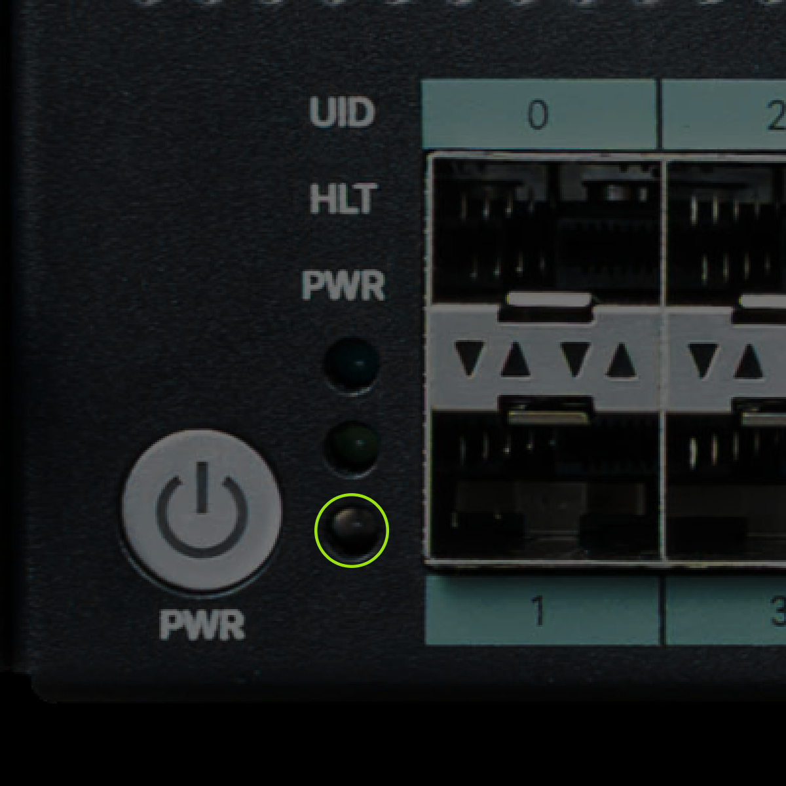
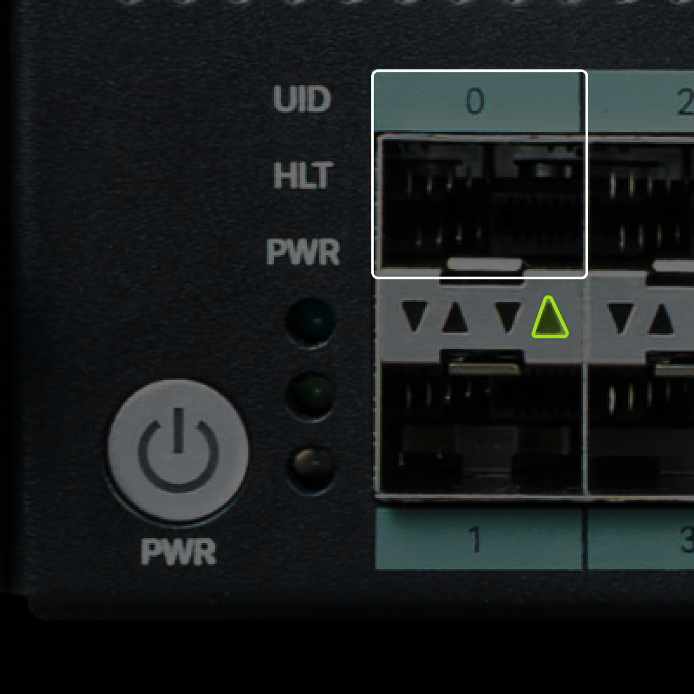
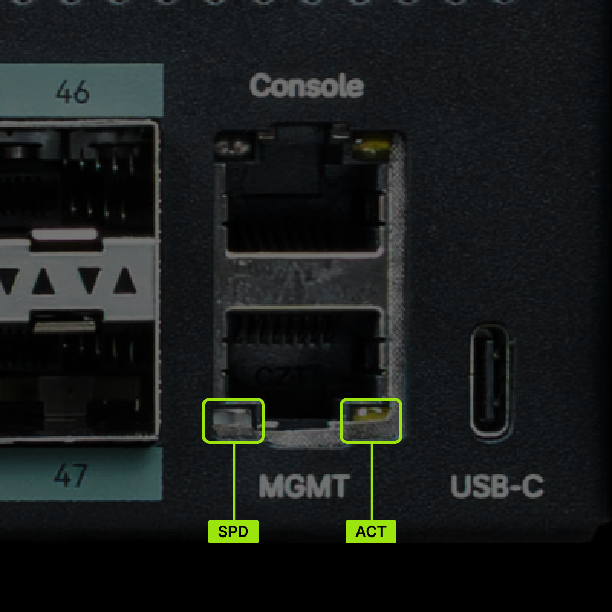
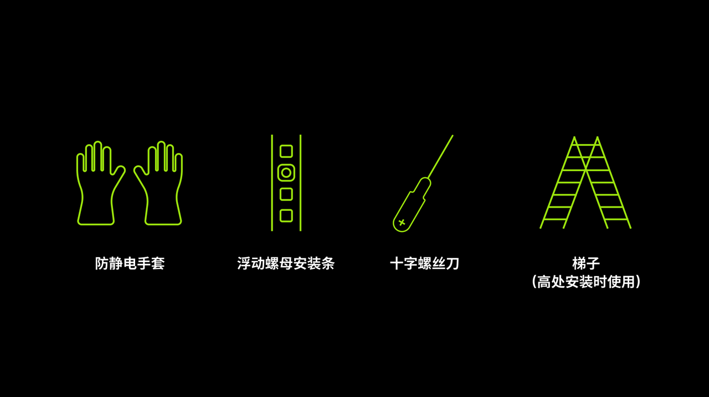

# Cluster Server RV2768 快速指南

## 修订记录

|文档版本|发布日期|修改说明|
|---|---|---|
|V1.0|2026.07.31|首次发布|

## 简介

Cluster Server RV2768 为基于 RISC-V 架构的集群服务器，2U 高度 19 英寸标准尺寸机架式，搭载 48 个进迭时空 K3 处理器，符合 RISC-V 国际基金会的指令集扩展集合规范 RVA23。详细信息请参考[《Cluster Server RV2768 技术白皮书》](./rv2768_white_paper.md)。

|项目|指标参数|
|---|---|
|**尺寸（高 x 宽 x 深）**|87.4mm x 447.6mm x 817mm|
|**温度**|工作温度：5℃～40℃（41℉～104℉）（符合 ASHRAE Class A1/A2/A3） 存储温度（3个月以内）：-30℃～+60℃（-22℉～+140℉） 存储温度（6个月以内）：-15℃～+45℃（5℉～113℉） 存储温度（1年以内）：-10℃～+35℃（14℉～95℉） 最大温度变化率：20℃（36℉）/小时、5℃（9℉）/15分钟|
|**相对湿度（RH，无冷凝）**|工作湿度：8%～90% 存储湿度（3个月以内）：8%～85% 存储湿度（6个月以内）：8%～80% 存储湿度（1年以内）：20%～75% 最大湿度变化率：20%/小时|
|**海拔高度**|≤3050m 配置满足 ASHRAE Class A1、A2 时，海拔高度超过 900m，工作温度按每升高 300m 降低 1℃ 计算。 配置满足 ASHRAE Class A3 时，海拔高度超过 900m，工作温度按每升高 175m 降低 1℃ 计算。 配置满足 ASHRAE Class A4 时，海拔高度超过 900m，工作温度按每升高 125m 降低 1℃ 计算。|

## 前后面板及指示灯

### 前面板

**外观**

**指示灯和按钮说明**

|标识|含义|说明|
|---|---|---|
||电源按钮|- AC电源插上后，在待机（standby）状态，短按按键，正常开机，节点管理操作系统、交换系统和各计算节点进入工作状态； - 上电后开机状态，长按6s可对节点管理操作系统、交换系统和各计算节点进行强制下电，进入待机状态；|
||电源指示灯|- 熄灭：设备未上电。 - 黄色闪烁：BMC 管理系统正在启动，此时电源按钮处于锁定状态，不能进行操作。BMC 管理系统大约 1 分钟完成启动，同时电源指示灯转变为黄色常亮。 - 黄色常亮：设备待机（Standby）状态。 - 绿色常亮：设备正常上电，开机状态。|
||健康状态指示灯|- 无异常：熄灭 - 异常：  - 红色闪烁（1Hz）：Major告警     - 红色闪烁（5Hz）：Critical告警|
||UID指示灯|- 熄灭：服务器未被定位。 - 蓝色闪烁（持续255秒）：服务器被重点定位。 - 蓝色常亮：服务器被定位。|
||高速网络端口状态指示灯 ACT|LINK SPEED 用于指示链接情况和链接速率： - 绿灯常亮时，链路建立且为最高速率状态； - 黄灯常亮时，链路建立但处于非最高速率状态； - 链路未建立时，LINK SPEED 不点亮，保持熄灭状态； ACTIVE 用于指示链路活跃状态： - 链路无数据传输，处于熄灭状态； - 链路有数据传输，处于绿色闪烁状态，越活跃闪烁频次越快；|
||高速网络端口状态指示灯 SPD|同上|
||BMC 管理网口状态指示灯|同上|

**接口位置**

|编号|接口|编号|接口|
|---|---|---|---|
|1|高速网络互联端口|2|调试串行接口|
|3|openBMC 本地管理接口|4|节点管理系统 USB 全功能接口|

**接口说明**

|名称|类型|数量|说明|
|---|---|---|---|
|高速网络互联端口|SFP+|50|- 0~47 分别为计算节点 0~计算节点 47 的高速网络端口 - 50 和 51 为设备集成交换机的上行端口|
|调试串行接口|RJ45|1|用于调试，默认为操作系统串口，可通过 openBMC 命令行设置为 openBMC 串口或交换机管理串口。 说明： 通讯标准为三线制串口，波特率默认为 115200bit/s。|
|节点管理 USB 全功能接口|Type-C|1|满足 USB3.0 Type-C 全功能，包含 DP 显示，USB3.2 主机端口 - 接外部 DP 显示器，可以用于启动界面、BIOS 和 OS 屏幕显示 - 接 USB 设备，可以用于 USB 硬盘、键鼠等各类 USB 设备接入到业务员管理节点|
|openBMC 本地管理接口|RJ45|1|openBMC 管理网口，用于管理服务器。 说明： - 管理网口为千兆网口，速率支持 100/1000Mbit/s 自适应。 - openBMC 管理网口不支持与 POE 供电设备（例如打开 POE 功能的 POE 交换机）对接，强行对接存在链路通信异常甚至损坏管理网口的风险|

### 后面板

**外观和接口**

|编号|模块|编号|模块|
|---|---|---|---|
|1|电源模块1|2|电源模块2|
|3|电源模块1接口|4|电源模块2接口|
|5|电源模块1指示灯|6|电源模块2指示灯|

**指示灯**

|编号|含义|状态说明|处理操作|
|---|---|---|---|
|5/6|电源模块指示灯|- 熄灭：无 AC 电源输入 - 绿色灯常亮：输入和输出正常 - 绿色闪烁（1Hz）：输入正常，电源进入 SV12 模式 - 绿色闪烁（2Hz）：电源固件升级中 - 橙色灯常亮：输入正常，无输出 - 橙色闪烁（1Hz）：电源模块存在预警类异常（温度过高、负载功率过高），但仍可正常工作|橙色常亮：需要更换电源模块 导致电源模块无输出的可能原因： - 电源过温保护 - 电源输出过流/短路 - 短路保护 - 输出过压 - 器件失效（不包括所有的器件失效）|

## 准备工具

## 安装

⚠️ **警告**

- 安装人员使用工具时，务必按照正确的操作方式进行，以免危及人身安全。
- 当设备的安装位置超过安装人员的肩部时，请使用梯子、抬高车等工具辅助安装，安装人员使用梯子时，必须有专人看护，禁止单独作业，避免设备滑落导致人员受伤或设备损坏。

⚠️ **注意**

- 在接触设备前，应佩戴防静电手套，去除身体上携带的易导电物体（如首饰、手表等），以免被电击或灼伤。
- 搬运机箱至少需两人，禁止单独一人搬运较重的机箱。在搬运机箱时，保持后背挺直，平稳移动，以免扭伤。
- 搬运服务器时严禁使用挂耳作为着力点，避免导致设备损毁或滑脱。

### 安装步骤

1. 安装服务器
   - 将 Cluster Server 放置在 L 形导轨上，推入机柜。
   - 将 Cluster Server 两侧挂耳紧贴机柜方孔条，用来料匹配的螺钉将机箱挂耳与机柜固定

2. 连接业务网口和管理网口

3. 连接电源线缆

## 上电

Cluster Server 未提供单独的接地端口，是通过电源线的接地线来接地。高压电源为设备的运行提供电力，直接接触或通过潮湿物体间接接触高压电源会带来致命危险。

以下任何一个操作均可上电 Cluster Server：

- 电源模块已经正确安装到位，但是未上电，将电源模块接通外部电源，Cluster Server 随电源模块一起上电。

- 电源模块已正确安装到位，且电源模块已上电，Cluster Server 处于待机（Standby）状态（电源指示灯为黄色常亮）。

  - 通过短按前面板的电源按钮将服务器开机

  - 通过 BMC WebUI 将服务器开机。左侧 Operations -> Server power operations -> 选择 Power on

## 后续任务

Cluster Server 安装到机柜并正常上电后，请参见《Cluster Server RV2768 服务器用户指南》完成配置服务器等后续任务。
