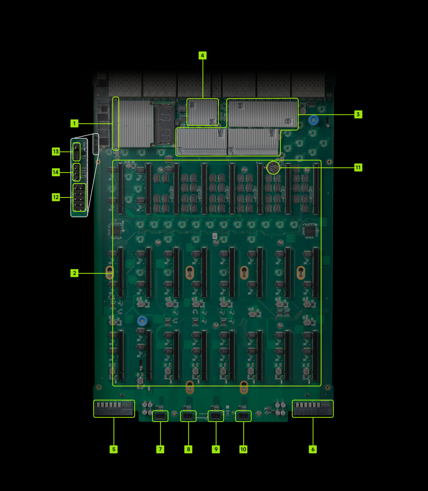
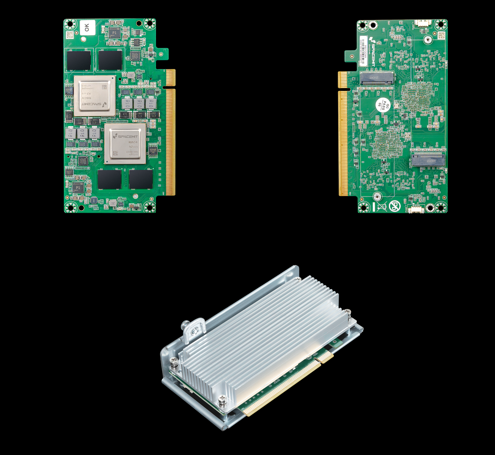
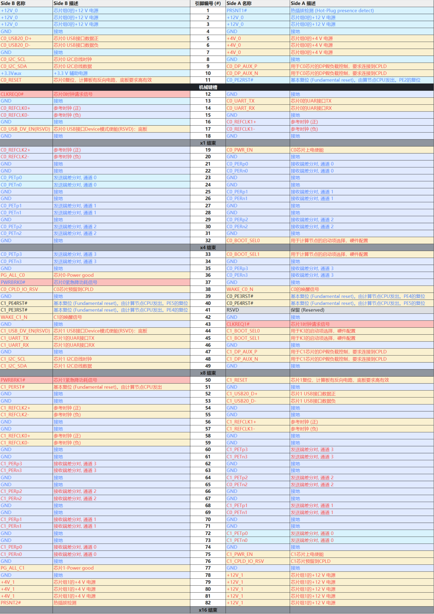
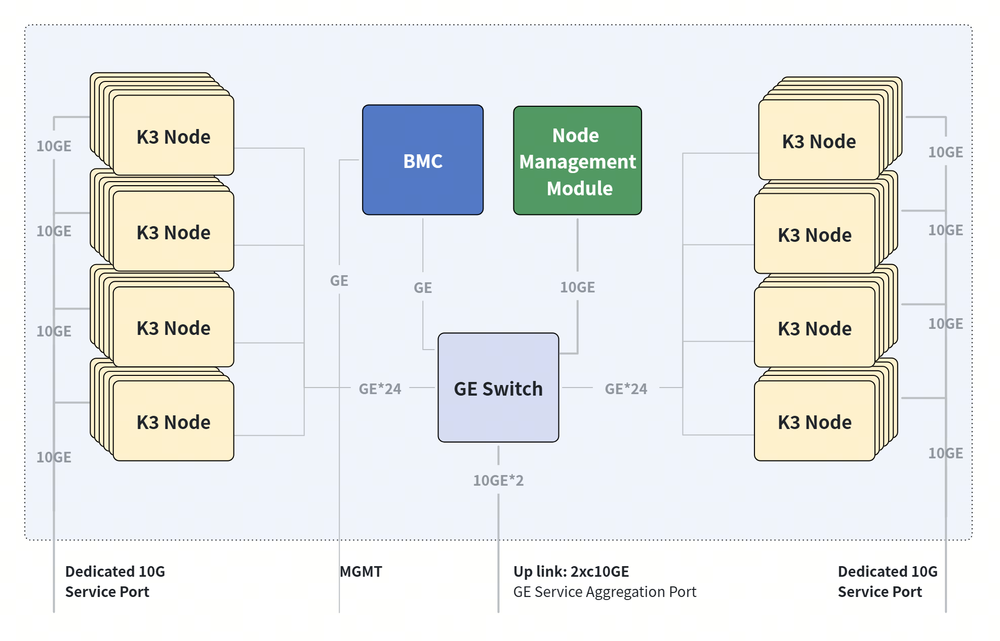
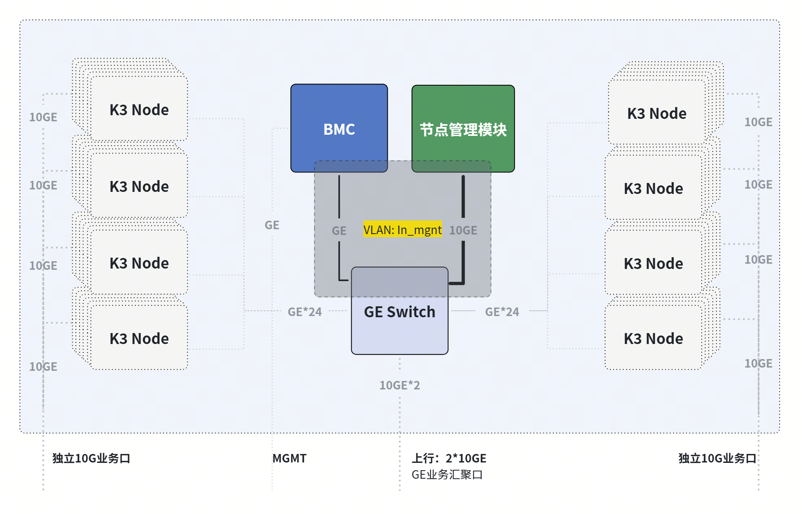
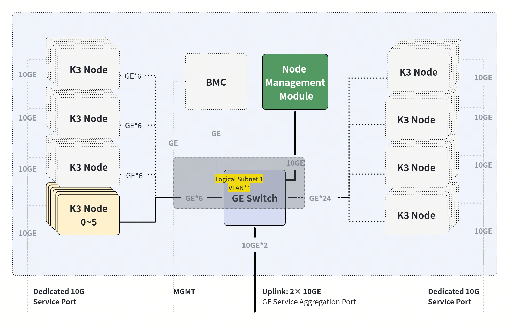
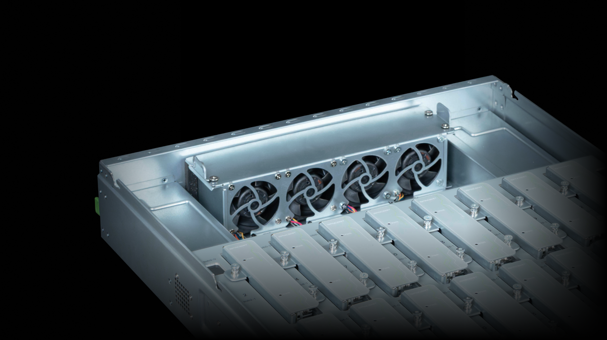

# Cluster Server RV2768 技术白皮书

## 修订记录

|文档版本|发布日期|修改说明|
|---|---|---|
|V1.0|2026.07.31|首次发布|

## 术语说明

| 术语 | 定义与说明 |
| :--- | :--- |
| Server（服务器） | 服务器是在网络环境中为客户（Client）提供各种服务的特殊计算机。 |
| Baseboard Management Controller（BMC，基板管理控制器） | 负责各路传感器的信号采集、处理、储存，以及各种器件运行状态的监控。BMC向机箱管理模块提供被管理对象的硬件状态及告警等信息，实现对被管理对象的设备管理功能。 |
| Compute Node（计算节点） | 计算节点是集群服务器中具备独立计算能力的最小单元，每个计算节点搭载一颗中央处理器，并配备独立的内存、存储资源及网络接口。支持独立电源管理、PXE 网络启动与远程调试维护，可通过内部交换网络实现节点间高速互联，是构成集群算力的基础单位。 |
| Compute Board（计算单板） | 计算单板是承载1个或多个计算节点的可插拔单元，计算单板支持独立插拔维护与统一管理，是集群服务器模块化架构设计的核心硬件组成部分。 |
| Nodes Management Board（节点管理单板） | 节点管理单板是集群服务器的管理控制核心，负责对所有的计算节点模组进行带内管理、任务分发和调度，并对外部客户端提供业务访问和交互服务。 |
| Switch System（交换系统） | 交换系统是集群服务器的网络互联核心，负责计算节点之间、计算节点与带内管理网络及外部网络之间的数据交换与通信。 |
| Gigabit Ethernet（GE，千兆以太网） | 千兆以太网是一种对传统的共享介质以太网标准的扩展和增强，兼容10M及100M以太网，符合IEEE 802.3z标准。 |
| 10 Gigabit Ethernet（10GE，万兆以太网） | 万兆以太网是以太网技术的高速扩展版本，向下兼容千兆、百兆、十兆以太网，遵循 IEEE 802.3ae 标准，仅支持全双工通信，传输速率可达 10Gbit/s。 |
| Server Standby（服务器待机） | 电源模块接通供电线缆后，BMC 系统完成启动，等待用户执行后续操作。 |
| Server Power On（服务器开机） | 统一执行供电操作，启动运行节点管理单板、交换系统和所有计算单板，操作完成后服务器所有部件系统进入正常工作状态。 |
| Server Power Off（服务器关机） | 关闭停止运行节点管理单板、交换系统和所有计算单板，操作完成后服务器进入待机状态，仅BMC系统运行。 |
| Node Power On（节点上电） | 对计算节点的物理供电操作。 |
| Node Power Off（节点下电） | 对计算节点的物理断电操作。 |
| Boot Node（节点开机） | 对计算节点内部操作系统的启动操作，必须在计算节点已完成上电的前提下才能正常执行。 |
| Shutdown Node（节点关机） | 对计算节点内部操作系统的关闭操作，执行后系统停止运行，计算节点仍保持上电状态。 |
| Reboot Node（节点重启） | 对计算节点内部操作系统进行重启和重新供电操作，过程中先关闭操作系统，再物理断电和重新供电，并开启操作系统。 |
| Recovery Mode（修复升级模式） | 一种系统故障恢复与固件升级专用模式，在系统无法正常启动时进入，用于执行固件修复、系统恢复或版本升级等维护操作。 |
| Hot Swap（热插拔） | 一项提高系统可靠性和可维护性的技术，能保证从正在运行的系统中，按照规定插入或拔出功能模块，不对系统正常工作造成影响。 |
| ASHRAE Environmental Class（ASHRAE 环境等级） | 由 ASHRAE TC 9.9《数据处理环境热指南》定义的 IT 设备环境分级规范，划分 A1/A2/A3/A4/B/C 多类环境包络，规定各类 IT 设备可稳定运行的温度、湿度、露点边界，用于数据中心与机房环境设计与设备选型。 |
| IEC（International Electrotechnical Commission，国际电工委员会） | 制定电气、电子相关领域国际标准的国际标准化机构，输出电工电子设备通用技术规范、安全标准，支撑设备研发、测试与合规认证。 |

## 产品概述

Cluster Server RV2768 为基于 RISC-V 架构的集群服务器，2U 高度 19 英寸标准尺寸机架式，搭载 48 个进迭时空 K3 处理器，符合 RISC-V 国际基金会的指令集扩展集合规范 RVA23。RVA23 针对通用计算领域的应用处理器所制定，要求支持向量（Vector）和虚拟化（Hypervisor）扩展，是面向 AI 和高性能工作负载的现代性能标准。Cluster Server 提供 768 核 RISC-V 原生算力，适合运行大量智能体和应用程序，处理海量数据的运算任务。多计算节点集群架构和完整硬件虚拟化特性，方便多个用户使用各自的计算系统，且彼此互不干扰，用户之间有物理安全隔离特性。在向量扩展基础上，Cluster Server 支持每秒两千八百亿次（2880 TOPS）通用 AI 运算和 1536 GB 容量内存，满足多路并发请求的 AI 推理任务。

## 产品特点

- **便捷可靠**
  - 支持任意单一计算节点独立维护、远程访问、调试和升级
  - 前出线（Front I/O）设计，方便快速维护，机柜后部无任何线缆，提升热通道利用率
  - 后置“N+1”风扇冗余设计
- **灵活智算**
  - 2U 机架，最多可安装 48 个计算节点，最多总计有 384 个 CPU 核心和 384 个通用 AI 核心
  - 支持外部交换机互联到集群服务器内的任意计算节点，且之间互为独立通道，互不影响
- **智能管理**
  - 计算节点支持预启动执行环境（PXE），可以不依赖本地存储，通过网络接口启动
  - 整机集成三层管理交换机，支持 VLAN 划分、动态路由、链路聚合等特性
  - 整机集成 BMC 管理模块，支持整机状态监控、智能散热调速策略、计算模组管理等特性
- **行业规范**
  - 支持 RVA23 Profile，满足未来五年及以上高端 Linux 发行版的指令集规范要求
  - 提供 CPU、内存、中断、I/O 的完整硬件虚拟化能力
  - 以 1024 bit 超宽并行处理的通用 AI 运算方式，实现与主流 AI 生态的快速对接

## 物理结构

| 序号 | 部件名称 | 序号 | 部件名称 |
| :--- | :--- | :--- | :--- |
| 1 | 机箱 | 2 | 主板 |
| 3 | 计算单板支架 | 4 | 计算单板 × 24 |
| 5 | 计算单板拉手条 | 6 | 计算单板 |
| 7 | 计算单板散热器 | 8 | 计算单板 NVMe SSD × 2 |
| 9 | 节点管理单板及散热器 | 10 | M.2 SATA 盘 |
| 11 | 电源模块 × 2 | 12 | 风扇模块 × 4 |

## 逻辑结构

## 硬件描述

### 前面板

**外观**

**指示灯和按钮说明**

|标识|含义|说明|
|---|---|---|
||电源按钮|- AC 电源插上后，在待机（standby）状态，短按按键，正常开机，节点管理操作系统、交换系统和各计算节点进入工作状态； - 上电后开机状态，长按 6s 可对节点管理操作系统、交换系统和各计算节点进行强制下电，进入待机状态；|
||电源指示灯|- 熄灭：设备未上电。 - 黄色闪烁：BMC 管理系统正在启动，此时电源按钮处于锁定状态，不能进行操作。BMC 管理系统大约 1 分钟完成启动，同时电源指示灯转变为黄色常亮。 - 黄色常亮：设备待机（Standby）状态。 - 绿色常亮：设备正常上电，开机状态。|
||健康状态指示灯|- 无异常：熄灭 - 异常：  - 红色闪烁（1Hz）：Major 告警     - 红色闪烁（5Hz）：Critical 告警|
||UID指示灯|- 熄灭：服务器未被定位。 - 蓝色闪烁（持续 255 秒）：服务器被重点定位。 - 蓝色常亮：服务器被定位。|
||高速网络端口状态指示灯 ACT|LINK SPEED 用于指示链接情况和链接速率： - 绿灯常亮时，链路建立且为最高速率状态； - 黄灯常亮时，链路建立但处于非最高速率状态； - 链路未建立时，LINK SPEED 不点亮，保持熄灭状态； ACTIVE 用于指示链路活跃状态： - 链路无数据传输，处于熄灭状态； - 链路有数据传输，处于绿色闪烁状态，越活跃闪烁频次越快；|
||高速网络端口状态指示灯 SPD|同上|
||BMC 管理网口状态指示灯|同上|

**接口位置**

|编号|接口|编号|接口|
|---|---|---|---|
|1|高速网络互联端口|2|调试串行接口|
|3|openBMC 本地管理接口|4|节点管理系统 USB 全功能接口|

**接口说明**

|名称|类型|数量|说明|
|---|---|---|---|
|高速网络互联端口|SFP+|50|- 0~47 分别为计算节点 0~计算节点 47 的高速网络端口 - 50 和 51 为设备集成交换机的上行端口|
|调试串行接口|RJ45|1|用于调试，默认为操作系统串口，可通过 openBMC 命令行设置为 openBMC 串口或交换机管理串口。 说明： 通讯标准为三线制串口，波特率默认为 115200 bit/s。|
|节点管理 USB 全功能接口|Type-C|1|满足 USB 3.0 Type-C 全功能，包含 DP 显示，USB 3.2 主机端口 - 接外部 DP 显示器，可以用于启动界面、BIOS 和 OS 屏幕显示 - 接 USB 设备，可以用于 USB 硬盘、键鼠等各类 USB 设备接入到业务员管理节点|
|openBMC 本地管理接口|RJ45|1|openBMC 管理网口，用于管理服务器。 说明： - 管理网口为千兆网口，速率支持 100/1000 Mbit/s 自适应。 - openBMC 管理网口不支持与 POE 供电设备（例如打开 POE 功能的 POE 交换机）对接，强行对接存在链路通信异常甚至损坏管理网口的风险|

### 后面板

**外观和接口**

|编号|模块|编号|模块|
|---|---|---|---|
|1|电源模块1|2|电源模块2|
|3|电源模块1接口|4|电源模块2接口|
|5|电源模块1指示灯|6|电源模块2指示灯|

**指示灯**

|编号|含义|状态说明|处理操作|
|---|---|---|---|
|5/6|电源模块指示灯|- 熄灭：无 AC 电源输入 - 绿色灯常亮：输入和输出正常 - 绿色闪烁（1Hz）：输入正常，电源进入 SV12 模式 - 绿色闪烁（2Hz）：电源固件升级中 - 橙色灯常亮：输入正常，无输出 - 橙色闪烁（1Hz）：电源模块存在预警类异常（温度过高、负载功率过高），但仍可正常工作|橙色常亮：需要更换电源模块 导致电源模块无输出的可能原因： - 电源过温保护 - 电源输出过流/短路 - 短路保护 - 输出过压 - 器件失效（不包括所有的器件失效）|

### 单板

**主板**

| 序号 | 部件名称 | 序号 | 部件名称 |
| :--- | :--- | :--- | :--- |
| 1 | 节点管理板连接器 | 2 | 计算板连接器 |
| 3 | 交换系统芯片组 | 4 | BMC 管理芯片组 |
| 5 | PSU0 连接器 | 6 | PSU1 连接器 |
| 7 | 风扇模块 0 连接器 | 8 | 风扇模块 1 连接器 |
| 9 | 风扇模块 2 连接器 | 10 | 风扇模块 3 连接器 |
| 11 | 纽扣电池 | 12 | CPLD 调试 JTAG 连接器 |
| 13 | CMOS 插针 | 14 | BMC 调试串口（3.3 V TTL） |

**业务管理板**

| 序号 | 部件名称 | 序号 | 部件名称 |
| :--- | :--- | :--- | :--- |
| 1 | 插槽 | 2 | 节点管理板 |

- 支持 1 个业务管理板。
- 对应单板插槽为 MXM 3.1 接口，可选配不同规格的节点管理单板，详见部件兼容性列表。

**计算板**

- 支持 24 个计算板插入，上电状态不可热插拔计算板，注意须在服务器断电状态下操作。
- 主板插槽为 PCIe x16 slot，接口在标准 PCIe x16 基础上进行引脚定义修改，以下表格红色字体部分为修改部分，蓝色为 PCIe slot 原标准定义。模组接口支持两个独立的单路计算节点的设计。
- 支持不同CPU代次的计算板混插，不同CPU的计算板通过板载电子标签信息区分。

**计算板编号对应关系**

RV2768 内置计算板共 24 个，编号为 sub0~sub23，每个计算板 `sub*` 有 2 个计算节点，为 `sub*-0` 和 `sub*-1`，整机共 48 个计算节点，每个计算节点除内部网络外，有独立外部 10GE 以太网接口，计算节点和网口的归属关系如下，整机非满配计算板时，考虑散热风道效率，推荐以下安装位置。

| 计算板编号 | 计算节点编号 | 对外网络端口编号 | 8卡配置推荐安装位置 | 16卡配置推荐安装位置 |
| :---: | :---: | :---: | :---: | :---: |
| sub0 | sub0-0 | 0 | ✅ | ✅ |
| | sub0-1 | 1 | ✅ | ✅ |
| sub1 | sub1-0 | 2 | | ✅ |
| | sub1-1 | 3 | | ✅ |
| sub2 | sub2-0 | 4 | | |
| | sub2-1 | 5 | | |
| sub3 | sub3-0 | 6 | ✅ | ✅ |
| | sub3-1 | 7 | ✅ | ✅ |
| sub4 | sub4-0 | 8 | | ✅ |
| | sub4-1 | 9 | | ✅ |
| sub5 | sub5-0 | 10 | | |
| | sub5-1 | 11 | | |
| sub6 | sub6-0 | 12 | ✅ | ✅ |
| | sub6-1 | 13 | ✅ | ✅ |
| sub7 | sub7-0 | 14 | | ✅ |
| | sub7-1 | 15 | | ✅ |
| sub8 | sub8-0 | 16 | | |
| | sub8-1 | 17 | | |
| sub9 | sub9-0 | 18 | ✅ | ✅ |
| | sub9-1 | 19 | ✅ | ✅ |
| sub10 | sub10-0 | 20 | | ✅ |
| | sub10-1 | 21 | | ✅ |
| sub11 | sub11-0 | 22 | | |
| | sub11-1 | 23 | | |
| sub12 | sub12-0 | 24 | ✅ | ✅ |
| | sub12-1 | 25 | ✅ | ✅ |
| sub13 | sub13-0 | 26 | | ✅ |
| | sub13-1 | 27 | | ✅ |
| sub14 | sub14-0 | 28 | | |
| | sub14-1 | 29 | | |
| sub15 | sub15-0 | 30 | ✅ | ✅ |
| | sub15-1 | 31 | ✅ | ✅ |
| sub16 | sub16-0 | 32 | | ✅ |
| | sub16-1 | 33 | | ✅ |
| sub17 | sub17-0 | 34 | | |
| | sub17-1 | 35 | | |
| sub18 | sub18-0 | 36 | ✅ | ✅ |
| | sub18-1 | 37 | ✅ | ✅ |
| sub19 | sub19-0 | 38 | | ✅ |
| | sub19-1 | 39 | | ✅ |
| sub20 | sub20-0 | 40 | | |
| | sub20-1 | 41 | | |
| sub21 | sub21-0 | 42 | ✅ | ✅ |
| | sub21-1 | 43 | ✅ | ✅ |
| sub22 | sub22-0 | 44 | | ✅ |
| | sub22-1 | 45 | | ✅ |
| sub23 | sub23-0 | 46 | | |
| | sub23-1 | 47 | | |

### 内部交换系统

Cluster 内置三层管理交换机，216 Gbps 交换容量；支持 48 个千兆直连至各个计算节点，2 对 10GBase-R 互连到 BMC 和节点管理板，2 对上行端口 10GBase-R 对外端口位于前面板。

**交换机支持特性简述如下**

**二层交换与 VLAN (L2 & VLAN Features)**
- 交换能力与表项：
  - MAC 地址表：32K（2×16K 4-way hash）。
  - 组播表：4K；支持 16 Mbit 包缓冲区 (Packet Buffer) 及最大 12 KB Jumbo Frame。
- 丰富的 VLAN 特性：
  - 支持 802.1Q / QinQ（4K VLANs，支持 IVL/SVL/混合模式，灵活的内外层 Tag 转发）。
  - 支持 Protocol VLAN (8 个全局配置)、MAC-based VLAN、IP-Subnet-based VLAN。
  - VLAN 转换：2K Ingress / 1K Egress 转换；支持基于 MAC 表的 N:1 VLAN 转换。
  - 16 个 VLAN Profile（定义学习与未知单播/组播洪泛域）及端口级 VLAN 过滤。

**三层路由与高级功能 (L3 & IP Forwarding)**
- IP 路由能力：支持 IPv4/IPv6 单播与组播路由，最大支持 12K 网络路由表及 12K 主机路由表，基于最长前缀匹配 (LPM) 转发。

Cluster Server 内部交换系统连接如下图所示

**管理子网网络拓扑**
BMC 连接到内部交换机的 GE 端口只保留节点管理模块对应的 10GE 端口访问权限，通过 VLAN 隔离。如下图所示。

> 注：BMC不可直接访问业务网络，即不可直接访问 K3 的业务网络

业务子网网络拓扑（默认状态，支持配置）
1. 默认状态下，节点管理模块、所有计算节点（K3 Node）、交换机的2个10G上行端口可自由互通。
   

2. 用户配置状态下
   支持指定几个K3 Node配置独立vlan，生成逻辑子网，其他K3 Node不可访问该逻辑子网。如下图所示：
   K3 Node 0~5划分到逻辑子网卡，K3 Node 0~5和业务管理模块之间可互通，但K3 Node 0~5和其他K3 Node之间不可互通
   

### 电源模块

Cluster Server 采用 CRPS（Common Redundant Power Supply）标准冗余电源规格，配置 2 个电源模块，支持 1+1 主备冗余。整机最大输出功率 2000 W，确保单电源故障时系统仍可正常运行，有效提高系统可用性。

| 参数 | 规格 |
| :--- | :--- |
| 电源规格 | CRPS（Common Redundant Power Supply） |
| 电源模块数量 | 2 个（1+1 主备冗余） |
| 输入电压 | 100–240 V AC |
| 输出功率 | 2000 W |
| 输出电压 | 12 V |
| 冗余模式 | 支持 1+1 主备冗余 |

### 风扇模块

风扇规格（25℃环温）

| 参数 | 规格 |
| :--- | :--- |
| 额定电压 | 12 V |
| 额定电流 | 10.3 A |
| 额定功率 | 123.6 W |
| 转速 | 进风侧： - 虚拟转速：34000±10% R.P.M - 实际转速：26400±10% R.P.M 出风侧： - 虚拟转速：34000±10% R.P.M - 实际转速：20700±10% R.P.M |

支持 4 个 6056 风扇模块
- 支持 N+1 冗余，即服务器可在单风扇或单转子失效时正常工作。
- 支持风扇速度智能调节。
- 配置在同一服务器的风扇模块，P/N编码必须相同。
- 风扇模块的位置

## 产品规格

| 模块 | 项目 | 描述 |
| :--- | :--- | :--- |
| **物理架构** | 物理架构 | 2U 机架式服务器 |
| | 尺寸 | 87.4 mm × 447.6 mm × 816.8 mm |
| | 计算模组 | 最多可装载 24 个模组，每一个模组拥有 2 个 K3 计算节点，并可独立维护 |
| | 计算节点 | 整机最多总计 48 个节点，各节点之间物理安全隔离，可独立管理维护 |
| **计算节点** | CPU 计算核 | 每个进迭时空 K3 处理器配备 8 个 X100 核，单核 SPECint2006 > 9.0/GHz，最大主频 2.4 GHz |
| | 通用 AI 核 | 每个进迭时空 K3 处理器计算节点搭配 8 个 A100 核，提供 60 TOPS @INT4 通用 AI 算力 |
| | RAM | LPDDR5，8 GB / 16 GB / 32 GB 容量可选，最高 6400 MT/s |
| | ROM | NVMe SSD，PCIe 3.0 x4，64 GB / 128 GB / 256 GB 容量可选，也可选配 UFS |
| | 网络 | 1GE 网口接入内部管理网络，10GE 网口支持外部互联 |
| | 特性 | 支持 PXE 启动，支持远程访问、调试和升级 |
| **交换系统** | 外部端口 | 对外支持 2 × 10GE SFP+ 光口和 48 × 10GE SFP+ 光口 |
| | 网络拓扑 | 各计算节点网络接口、边带管理端口和外部端口之间网络互通 |
| **整机系统** | 电源 | 2000 W / 3000 W 白金 / 钛金电源模块，支持热插拔，支持 1+1 冗余 |
| | 风扇 | 4 个风扇 |
| | 安装 | 支持 L 型滑道 |
| **管理系统** | 基板管理 | 支持多节点计算模组单一管理、支持集成交换机管理，前出专用管理 GE 网口，提供全面的故障检测和运维特性 |
| | 节点管理 | 支持对节点进行硬件电源管理、系统复位、固件配置、串口调试和远程桌面操控 |
| **软件应用** | 操作系统 | 出厂可选配预装主流 Linux 操作系统 |
| | 软件平台 | 集群管理、分布式计算、智能体集群 |
| **工作条件** | 工作温度 | 5°C～40°C（41°F～104°F），符合 ASHRAE Class A1/A2/A3 |
| | 工作湿度 | 8%～90% |

## 系统管理平台

| 平台名 | 平台前端图示 | 核心功能模块 |
| :--- | :--- | :--- |
| Cluster Server 集群管理系统 |   | - 48*模组管理 - 单个计算节点上下电、重启等操作 - 模组ssh、串口、KVM、文件操作 - 批量固件升级 - 计算节点监控和告警 - 大模型批量部署 - 交换机管理模组网络配置 - 批量运行脚本 - 服务器散热管理 - 日志审计 - API调用支持 |
| Cluster Flow 分布式计算平台 |   | - DAG 编排引擎 - 智能调度器最大节点利用率 - 插件系统，计算业务插件化 - 进程隔离和沙箱管理，多计算单元数据文件隔离 - 自研DataFrame 协议，节点通信带宽最大化利用 - 节点自动发现 - 支持VLM、Yolo等多种模型插件 - 提供插件开发SDK，只需专注计算逻辑开发 - 自带SOP行为分析Demo |
| Cluster Agent 智能体集群平台 |   | - 3步申请一个或多个智能体 - 预置Hermes、ClaudeCode等智能体开箱即用 - 预置大模型接口，不需要额外配置 - 基于K3S虚拟化容器实现动态资源调度 - 可动态调整申请智能体的CPU核数，内存大小 - 多Cluster服务器Agent集群后台管理软件 |

